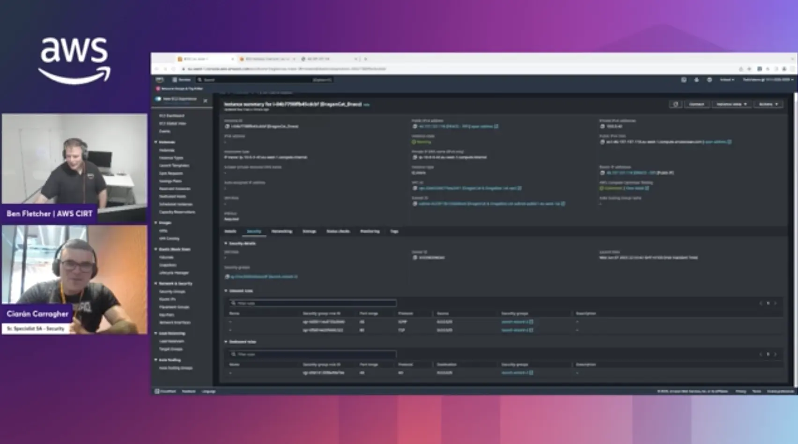

### Check out the recording here:

https://www.twitch.tv/videos/2036379255

### Links from the episode:

- [Amazon EC2 security groups for Linux instances](https://docs.aws.amazon.com/AWSEC2/latest/UserGuide/ec2-security-groups.html)
- [Control traffic to subnets using network ACLs](https://docs.aws.amazon.com/vpc/latest/userguide/vpc-network-acls.html)

### Reach out to the team:

If you have any questions, comments, or ideas, **reach out** to us. Feel free to send us an email at: [awstwitch-saferoom@amazon.com](mailto:awstwitch-saferoom@amazon.com)

