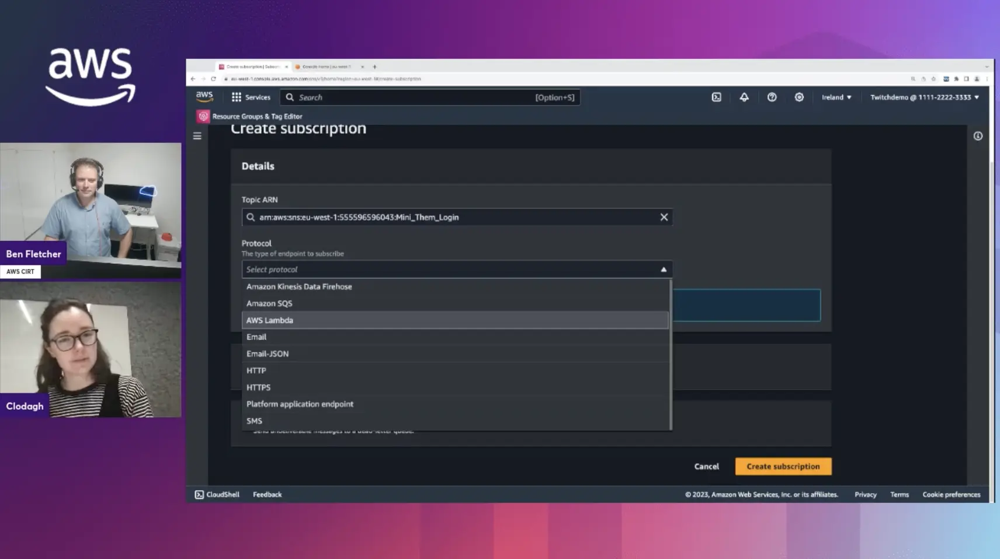

### Check out the recording here:

https://www.twitch.tv/videos/2036379567

### Links from the episode:

- [What Is Amazon EventBridge?](https://docs.aws.amazon.com/eventbridge/latest/userguide/eb-what-is.html)
- [What is Amazon SNS?](https://docs.aws.amazon.com/sns/latest/dg/welcome.html)

### Reach out to the team:

If you have any questions, comments, or ideas, **reach out** to us. Feel free to send us an email at: [awstwitch-saferoom@amazon.com](mailto:awstwitch-saferoom@amazon.com)

