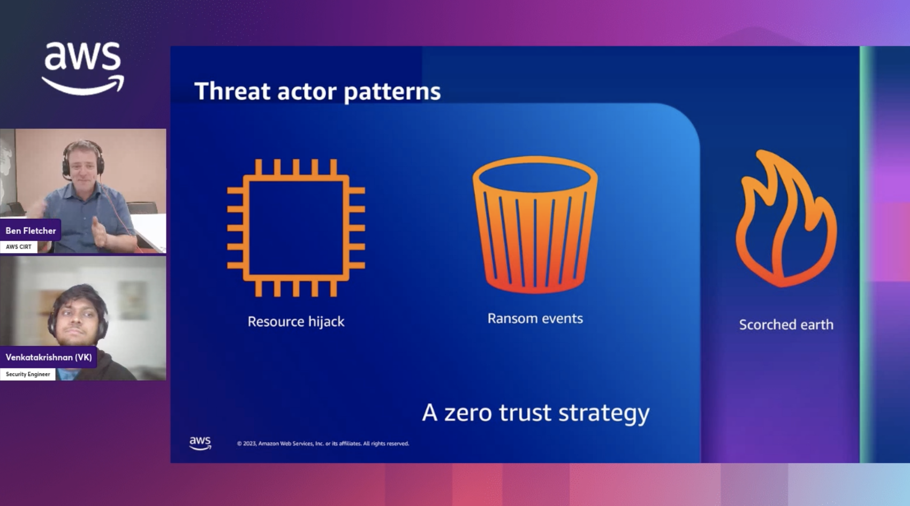

### Check out the recording here:

https://www.twitch.tv/videos/2036388102

### Links from the episode:

- [AWS CIRT announces the release of five publicly available workshops](https://aws.amazon.com/blogs/security/aws-cirt-announces-the-release-of-five-publicly-available-workshops/)
- [AWS Skill Builder](https://skillbuilder.aws/)

### Reach out to the team:

If you have any questions, comments, or ideas, **reach out** to us. Feel free to send us an email at: [awstwitch-saferoom@amazon.com](mailto:awstwitch-saferoom@amazon.com)

