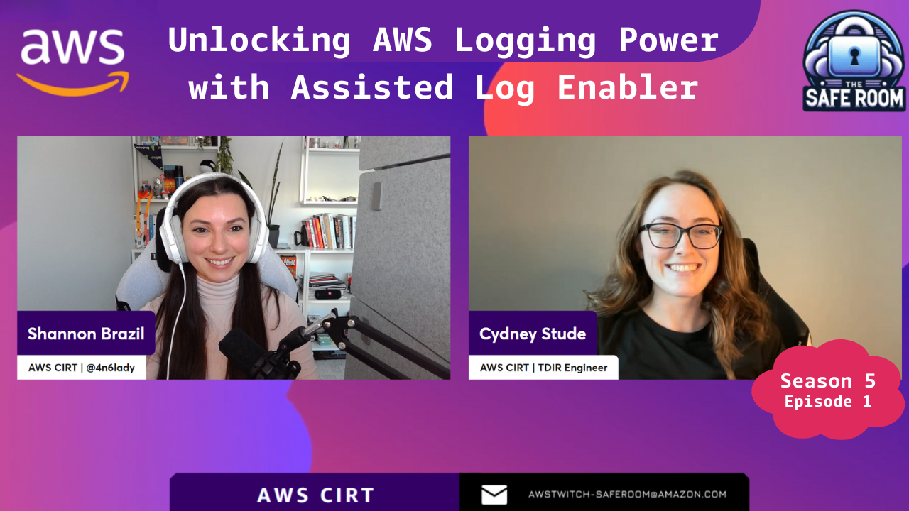
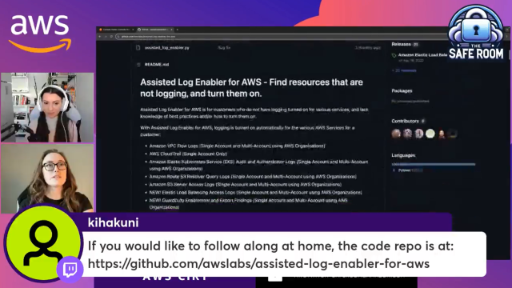

## Episode Synopsis
In the Season 5 premiere of "The Safe Room," we take an in-depth look at the Assisted Log Enabler for AWS, a cutting-edge tool developed by the AWS Customer Incident Response Team. Host Shannon Brazil and guest Cydney Stude (also co-author of the tool) guides viewers through a comprehensive exploration of this tool, focusing on its critical role in AWS logging and security.

- **The Importance of Logging:** We start by discussing why logging is essential in AWS, particularly for troubleshooting, performance analysis, and security. Real-world scenarios are used to illustrate the consequences of inadequate logging.

- **Introduction to the Assisted Log Enabler:** SCydney provides an overview of the Assisted Log Enabler for AWS, explaining how it simplifies the logging process. This includes a walkthrough of its core functionality, such as automatic creation of Amazon S3 buckets and activation of logging across various AWS services.

- **Step-by-Step Guide:** The episode features a step-by-step demonstration of setting up the Assisted Log Enabler, making it accessible even for those with limited technical expertise in AWS.

- **Highlighting New Features:** The spotlight is on the latest additions to the tool, including Elastic Load Balancing Access Logs, GuardDuty Enablement, and WAFv2 Logging. We discuss the significance of these features and how they enhance AWS security and logging capabilities.

- **Interactive Q&A Session:** Throughout the episode, Shannon and Cydney engages with the audience in a live Q&A session, addressing questions and providing expert insights on AWS logging and security.

This episode is an essential watch for AWS users of all levels, offering valuable insights into effective logging practices and the latest advancements in AWS security tools.

Check out the recordings here:

Full Episode: https://www.twitch.tv/videos/2023830976   
Tool Demo only: https://www.twitch.tv/videos/2023837692

## Links from today's episode

- [Introducing Assisted Log Enabler for AWS](https://aws.amazon.com/blogs/opensource/introducing-assisted-log-enabler-for-aws/)
- [GitHub Repository for Assisted Log Enabler for AWS](https://github.com/awslabs/assisted-log-enabler-for-aws)

**🐦 Reach out to the hosts and guests:**

- Shannon Brazil: 
 [LinkedIn](https://www.linkedin.com/in/shannonbrazil/) [Twitter](https://twitter.com/4n6lady)
- Cydney Stude: [LinkedIn](https://www.linkedin.com/in/cydneystude/) [Twitter](https://twitter.com/CydneyStude)

