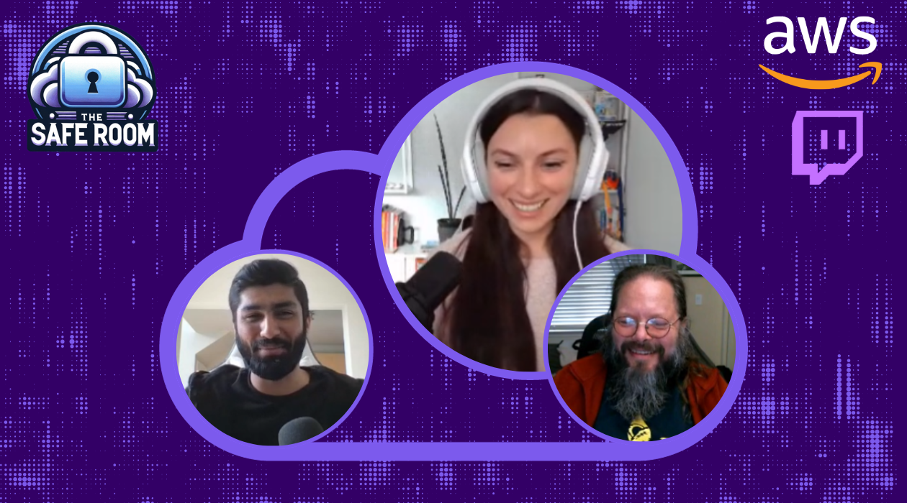

"The Safe Room" is an engaging Twitch series focused on cloud security and incident response in AWS environments. Hosted by Shannon Brazil, Paul Keser, and Hammad Jawaid, the show covers a wide range of topics from AWS tool utilization to real-world case studies. Viewers can expect to gain in-depth knowledge, practical skills, and insights directly from AWS professionals. Whether you're a seasoned security expert or new to cloud computing, "The Safe Room" offers valuable learnings for all.

## Hosts of The Safe Room

- **Shannon Brazil** 
- **Paul Keser** 
- **Hammad Jawaid**

If you have any questions, comments, or ideas, **reach out** to us. Feel free to send us an email at: [awstwitch-saferoom@amazon.com](mailto:awstwitch-saferoom@amazon.com)

## Schedule

Join us live for an interactive learning experience! We stream every 1st and 3rd Friday of the month at 2PM EST.

## SEASON 05

Welcome to a new season of The Safe Room! 

### Upcoming Episodes

| Episode | Name | Date | Host| Guest | Link to Video
|--|--|--|--|--|--|
| S05E02 | Understanding and Preventing Data Exfiltration | 2023-12-15 | Shannon Brazil | To Be Announced |[Streaming Soon](https://twitch.tv/aws) |

### Completed Episodes

| Episode | Name | Date | Host| Guest | Link to Video
|--|--|--|--|--|--|
| S05E02 | Unlocking AWS Logging with Assisted Log Enabler | 2024-01-05 | Shannon Brazil | Cydney Stude|[Link to show notes](/livestreams/the-safe-room/2024-01-05/index.md) |

## SEASON 04

Check out Season 04 where our team explored the AWS CIRT Workshops, AWS Security Best Practices, Open Source Tools, AWS Misconfigurations, Incident Response, and Cybersecurity Mentorship!

### Completed Season

| Episode | Name | Date | Host| Guest | Link to Video
|--|--|--|--|--|--|
| S04E01 | Workshop: AWS CIRT Unauthorized IAM Credential Use - Part 1 | 2023-01-06  | Ruchira Pokhriyal| Paul Keser|Coming Soon|
| S04E02 | Workshop: AWS CIRT Unauthorized IAM Credential Use - Part 2   | 2023-01-20  | Ruchira Pokhriyal | Paul Keser |Coming Soon |
| S04E03 | Cybersecurity Mentorship 1  | 2023-02-03  | Shannon Brazil | Casey Reniker |Coming Soon|
| S04E04 | Incident Response Whitepaper  | 2023-02-17  | Hammad Jawaid | Anna McAbee & Freddy Kasprzykowski|Coming Soon|
| S04E05 | Workshop: AWS CIRT Cryptomining - Security Event Simulation and Detection   | 2023-03-03  | Shannon Brazil | Hammad Jawaid |Coming Soon|
| S04E06 | AWS Access Key Compromise: The Dos and Don'ts  | 2023-03-17  | Shannon Brazil | Hammad Jawaid|Coming Soon |
| S04E07 | AWS & Prowler | 2023-03-31  | Shannon Brazil | Toni Lafontaine |Coming Soon |
| S04E08 | AWS Most Common Misconfigurations | 2023-4-21 | Shannon Brazil | N/A|Coming Soon|

