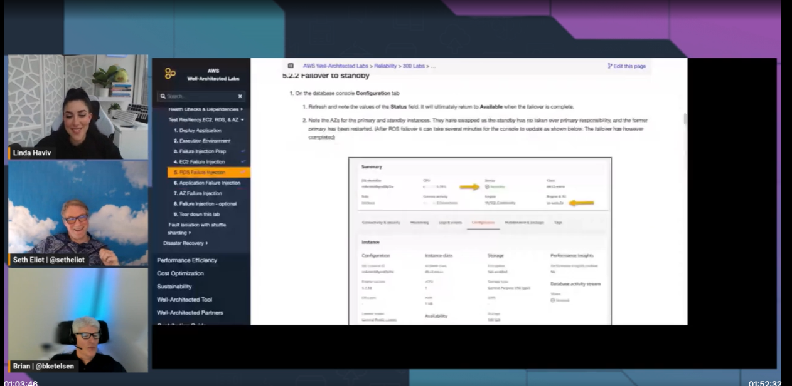

Chaos engineering is not about creating chaos, but is about making the chaos that is already out there visible to you. Any complex system, like for instance distributed software systems, will experience chaos in the form of faults, unexpected user actions, and load spikes. Chaos engineering build confidence that your application is resilient to these - that is to say it will resist these events, or quickly recover from them. Chaos is also what happens when we throw Linda into a chaos engineering lab, and then bark orders at her while she is trying to run it. But it was all good fun in the end, and we got to see chaos engineering in action.

Check out the recording here:

https://www.twitch.tv/videos/1828171717

## Links from today's episode

* [The lab: Testing resilience using chaos engineering](https://bit.ly/wa-chaos)
* [Principles of Chaos Engineering](https://principlesofchaos.org/) 

**🐦 Reach out to the hosts and guests:**

- Seth: [https://twitter.com/setheliot](https://twitter.com/setheliot)
- Linda: [https://twitter.com/lindavivah](https://twitter.com/lindavivah)
- Brian: [https://twitter.com/bketelsen](https://twitter.com/bketelsen)
