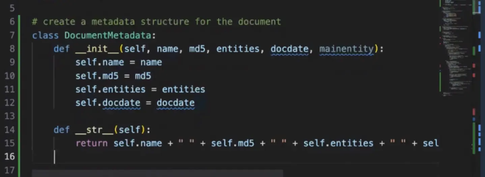

Today, Brian and Darko continue their adventure in document sorting. Yes, document sorting. Imagine this, you have hundreds - NO Thousands of documents littered around in various storage systems and devices. What can you make of them? Do you know where is that specific note you got from school? Do you have that invoice that is badly needed? Well, what if there was a way to *extract* that, and *comprehend* what is in each of those docs? And maybe, just maybe store in a central place for you to access, and all that (and more) with the power of Machine Learning. **THIS** is what we worked on in this stream. We extracted text from PDFs using [Textract](https://go.aws/47CTjuE), passed it on to [Amazon Comprehend](https://go.aws/3QHfY2U) and worked out how to do all that in Python. (Thank you [CodeWhisperer](https://go.aws/45yjmBq) ❤️ ).

If you are interested in learning all this with us, check out the recording below 👇

https://www.twitch.tv/videos/1900520149

## Links from today's episode

- [Amazon CodeWhisperer](https://go.aws/45yjmBq)
- [Detect Entities API documentation](https://bit.ly/3qHShNk)
- [Amazon Textract](https://go.aws/47CTjuE)
- [Amazon Comprehend](https://go.aws/3QHfY2U)
- [Just - a better MAKE](https://github.com/casey/just)

**🐦 Reach out to the hosts and guests:**

- Darko: [https://twitter.com/darkosubotica](https://twitter.com/darkosubotica)
- Brian: [https://twitter.com/bketelsen](https://twitter.com/bketelsen)
