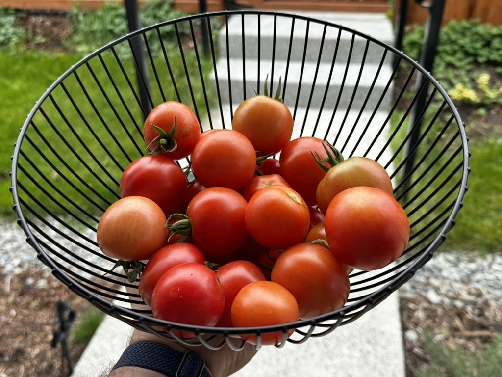

| ToC |
|-----|

I remember when I started building on AWS. The joy of infinite possibilities. The cloud at my fingertips to build anything I wanted. I hadn't decided what my first project was going to be yet, but I was eager to start! But wait... start where?

I had been building traditional applications on prem. That was easy - or at least something I was used to doing. I found myself navigating through many AWS services and features and those infinite possibilities started to feel a little too infinite!

I am sure that, if you are new to AWS, you may have felt the same way at some point of your AWS journey. So I wanted to share with you a few tricks that I have learned over the few years that I wish I had when I was new to AWS.

## Tip #1. Learn the Fundamentals

AWS provides a broad set of services that are powerful enablers for anything you want to build, for any type of application. There is a lot to learn. Getting familiar with some of the basic concepts for permission management, networking on the cloud, and different compute options (EC2, Containers, Lambda) will help tremendously before you adventure into the AWS world.

Planning structured learning and mapping the technologies that you are familiar with today to the services and features offered by AWS can help you feel more comfortable when deciding where and how to run applications.

> **A couple examples:** Do I need traditional VMs? Well, that maps to Amazon EC2. Am I building containerized applications? Amazon ECS. Am I going to use Kubernetes? Then Amazon EKS is the answer.

If you are building in a team, it helps to create a table that maps the different technologies to what others are familiar with. Then it will help new people that join your project to select the right technology and AWS service.

How can AWS help with this? Reach out, check our [getting started](https://aws.amazon.com/getting-started/?sc_channel=el&sc_campaign=post&sc_content=5-tips-i-wish-i-had-when-new-to-aws&sc_geo=mult&sc_country=mult&sc_outcome=acq) site, ask in our forums, send an email, come meet us at one of the conferences, and we will be more than happy to help!

📣 If you are just starting your journey and want to learn more, come meet me at [re:Invent in Las Vegas this November](https://reinvent.awsevents.com/?sc_channel=el&sc_campaign=post&sc_content=5-tips-i-wish-i-had-when-new-to-aws&sc_geo=mult&sc_country=mult&sc_outcome=acq)! I will be presenting [COP308](https://hub.reinvent.awsevents.com/attendee-portal/catalog/?search=COP308) and [ARC324](https://hub.reinvent.awsevents.com/attendee-portal/catalog/?search=ARC324), and I have a few colleagues presenting what they have learned about building new environments - you can find this sessions in the catalog [New to AWS track](https://hub.reinvent.awsevents.com/attendee-portal/catalog/?filters=84E8C1BB-9D54-4827-8E60-E50800C6C02B).

## Tip #2. Choose a Project!

When starting to build on AWS, there are always new things that need to be done, new things that you want to explore, and new things to learn. Sometimes it is good to stop, take a deep breath and just choose a fun project you want to focus on.

First: Decide if you are going to either bring an existing application to AWS (a.k.a. a migration) or develop a brand new workload and deploy it into AWS. Once you've picked the application, ensure it will be fun, something that can be done relatively quickly, and then build a business case around it! Define success, key takeaways, decide on your technology, and have fun! This takes us to our next tip...

## Tip #3. Plan Ahead

When we are excited about a new project or a new application, sometimes we overlook some important details along the way, and yes, they tend to be the boring ones...

- What logs do I need and where do I store them?
- What metrics do I need to define and monitor?
- Do I need to set up budget alerts?
- How do I secure my applications and plan for high availability?

When building a new environment the list of things you need to do to run your applications can go on and on...

Think about a house: hallways that connect different rooms, electric wiring that brings power across the building, water pipes, walls, doors and locks to control access to the interior of the house. All the utilities when you think about a house can map to your cloud foundation.

So as you build your application, consider planning your [cloud foundation](https://aws.amazon.com/architecture/cloud-foundations/?sc_channel=el&sc_campaign=post&sc_content=5-tips-i-wish-i-had-when-new-to-aws&sc_geo=mult&sc_country=mult&sc_outcome=acq) along with your application. You can set up a few things into your AWS accounts will help you run things smoothly in your environment over time. Such as Identity, Network connectivity, or how to isolate workloads from one another.

If I had to start over, I would create a project plan to build my environment along with the workload I was building. This will provide you with the tools you need in your environment to scale your applications according to your needs.

## Tip #4. Start Small

Sometimes we set goals for ourselves that are very large or far away. A couple of years ago I set a goal for myself to build an IoT farm for my garden beds. I knew everything I wanted to do, but I just focused on the big picture.

It took me 2 years to start... 🤦🏼‍♂️

So I pivoted. I set small victories for myself, such as buying the sensors, buying the new soil, configuring it all in my raspberry pi, sending the data to the cloud for processing, and building a small application. You should see my tomato plant this year. I have been getting 15 tomatoes a week on average! 🍅🍅🍅

Celebrate small wins with your peers, your teammates, and your leadership. It will definitely keep the morale up and it will also help you to pivot quickly if anything in your project needs to be adjusted!

## Tip #5. Understand the Cost Cloud Model

Unlimited resources is amazing. If you don't use the resources, you don't have to pay for them. AWS provides you with the tools to ensure you keep your cost to a minimum. But without the right planning, optimization for resources can get expensive.

I like to think about the cloud as a profit center rather than a cost center. Wait... don't you pay for the resources? How is it generating profit for my business? Think about all the infrastructure (or services) that you don't need to maintain. Operational hours can be shifted to build new features for your customers quicker, improving their experience.

## Summing It All Up!

Getting started on the cloud can come with a little bit of uncertainty. What skills do I need? Do I need to learn a completely new set of skill sets? Will I have to redo something I have already worked on-prem? Do I need to rebuild my data center on AWS?

I hear these questions often when working with new organizations moving to AWS. The answer is sometimes yes and sometimes no when finding the right balance between what stays on prem and what comes to the cloud.

Here's a bonus tip. Do not try to build everything from scratch yourself. AWS and AWS Partners build solutions that are ready to use and ready to deploy directly into your environment. Solutions can help you with operating your environment easier or even deploying your applications to AWS. Check some of this solutions in the [AWS Solutions Library](https://aws.amazon.com/solutions/?sc_channel=el&sc_campaign=post&sc_content=5-tips-i-wish-i-had-when-new-to-aws&sc_geo=mult&sc_country=mult&sc_outcome=acq)! There is a lot of good stuff in there!

But, remember, find (or become) a champion in your organization that advocates for and helps people understand the benefits AWS brings to your business and then:

1. Focus on understanding the basics
2. Pick a fun project to get started
3. Implement a foundation, build a project plan for your workloads
4. Start small, celebrate the little wins!
5. Understand the cost model

If you have any questions, or would like to connect, please, feel free to reach out to me on [LinkedIn](https://www.linkedin.com/in/agltorres/), shoot me a message, or come chat with me during reinvent!

Have fun, build with joy!
