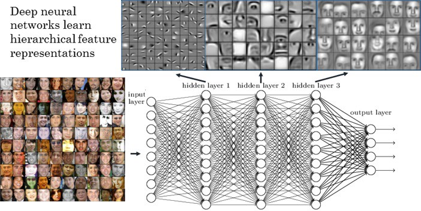
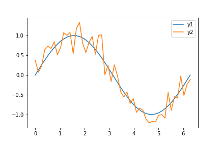
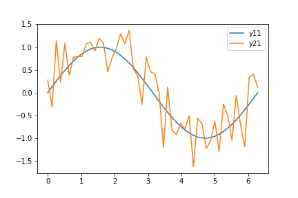

In this series of blogs we learn about what AI Explainability is, we look a deeper look into local post-hoc explainability using fundamental perturbation methods such as SHAP and LIME. In the future posts, we explore other methods such as back-propagation methods, including gradient-based methods and those based in DeepLift. 
The current publication has 5 parts, which as follows:
- [Part 1: Introduction](01-ai-explainability-intro), which explores what explainability is and why we should be interested.
- [Part 2: Local Interpretable Model-agnostic Explanation or LIME](02-lime), which goes deep into LIME methods. 
- [Part3 : LIME tutorial](03-lime-tutorial), which runs an example on three images using Inception-V3 and resnet-152 and then uses LIME for explainability. Code notebook is located [here](04-lime-example)
- [Part 4: Shapley values](05-shapley-values), provides a quick overview of Shapley values in game theory, which is the foundation of SHAP method. If you are already familiar with the theory, you can skip to [Part 5](06-shap). If you are not familiar with the concepts, I would encourge you to spend a few minutes studying this post.
- [Part 5, SHAP method](06-shap), which explains how Shapley values are applied to find a unique solution to LIME's optimization problem and make the solution independent of its hyperparameters.
- [Part 6, SHAP tutorial](07-shap-tutorial) walks the reader throug a practical example of how to use Kernel SHAP for understanding object detection using VGG16. The full code can be found [here](08-shap-example).

## Context
This blog series focuses on model explainability for supervised learning both for blackbox models such as deep learning models as well as interpretable models such as decision trees. This blog explains motivations for explainability as well as laying out basic definitions. The subsequent set of publications, dubbed *intermediate*, will describe basic explainability methods such as SHAPLY and associated software libraries. The final segment of the present publication will focus on implementation of model explainability in blackbox domain specific fields such as transformer based architecture for NLP.

## What is explainability
In its core, model explainability is either  to make decision process of a model understandable for humans or to provide an explanation for a single decision on a single data instance. In the case of black-box explanations, a simpler model can explain decisions made by a more complex model, we therefore can enjoy accuracy of more complex but opaque model, while explain its behaviour consistently with a simpler and less accurate model. There are practical examples for explainability, a trading system should be able to expledata and a diagnostics. Face recognition systems should explain why an image was matched to an identity. Thrshould happen in a way humans can understand the reasoning. In a face recognition system, for instance we can use latent vector representations in the higher layers as "super pixels" where the intermediary images do make sense for human observer. in Figure 1, we can observe the convolutional layers gradually produce representations that are closer to what we can understand.

## Reasons for explainability
[Burkart, Hurber] identify trust, causality, transferability, informativeness, fairness, accountability, making adjustments, and proxy functionality as the most common reasons for the need for AIX. Let us explore some of these reasons in more details. 
### Trust
One of the major challenges for automation, specially the kind of automation that is achieved through probabilistic models, is gaining trust of humans. For instance, we trust a human driver is context aware and makes the right decision when needed most of the time, while many people do have doubts about ability of self-driving cars to make the correct decision at the correct time all the time. Explaining how a model makes its decisions helps building both emotional and legal trust in automated decision making systems. There are two types of trust that someone who is affected by an inference needs to have on an AI-based system: trust in a specific prediction, which culminates in local explainability and trusting that the model as a whole will make sounds decisions systematically. This sort of trust is achieved through global explainability. Both these concepts are explained later in this blog.
### Causality
Most ML inference work out probabilistic correlation amongst events and have no insight into causal structure of events, saving causal inference [[more information at CleaR conference]] (https://www.cclear.cc/AcceptedPapers). For instance, the causal relation between emergence of birds of spring, such as swift, and arrival of the season has been clear for as long as human have lived in those regions where migrating birds arrive just before spring. People do acknowledge that there is a correlation between arrival of the migrant birds and changing of the season, but I do doubt anyone would consider migrant birds are causing spring to arrive. A probabilist model only considers correlation. Using explainability we can observe whether causal structure has any role in decision making.  
### Fairness
There has been numerous studies that human bias has resulted in rejection of job applications whose applicant names indicating certain ethnicity or religious background. Same issues have been reported with social class bias on the basis of postal codes of the job applicants. Such human biases have resulted in the right to know legislations in Europe. As machine learning is automating such decisions, the human bias can pollute the data and therefore, the automated decisions. It is crucial that the automated algorithm can explain on what basis it makes one decision or another. Not only is explinability crucial for legislative purposes, but it is an invaluable took fir building fairness into the algorithms by first understanding the basis, the features, and the causal structure of decisions an algorithm makes. For instance, if an algorithm shows that name, age, or postal code have played any role in decision making, we can understand there human bias in historical decision-making has polluted the dataset and thus we can remedy the issues that are ingrained in the datasets.      

### accountability
There are legal frameworks in place that require humans to justify their decisions. In the EU for instance, an employer is obliged to provide a rejected candidate with reasons for rejection should the candidate requests an explanation. Energy companies are required to provide justification for trading decisions if they own both production and distribution of energy in the supply chain. Car accidents require investigation so that intent and  blame can be assigned to those involved. Inability to explain such decisions does have dire consequences. The trading decision for the emergy companies for instance can incur fines up to 10 percent of the turn over of the company that can measure in billions of Euros in fines. There has been precedence that an energy company has been forced to sell its entire distribution network as a result of inability ti justify and explain trading decisions.There are countless other examples that humans are required to justify their decisions to the authorities. As algorithms are increasingly becoming autonomous decision makers, their decisions also need to be explainable and justifiable in accordance with existing and emerging legislative frameworks.

Additionally, as algorithms become consistently better than humans at making certain decisions, which is the goal of automation through AI, studying the decision process can help humans learn from the algorithms and improve their decision process; thus creating a mutually reinforcing decision improvement feedback loop between man and machine. 

## Supervised learning: definitions
### Model 
model $h(x)=y$ is a supervised learning model where $x\in \mathcal{X} \subseteq \mathbb{R}^{d \times l}$ and $y \in \mathcal{Y} \subseteq \mathbb{R}^k$. In the case of SML a set of labeled data $\mathcal {D_{\tau}} = \{(x_1, y_1)\ , \dots ,(x_n, y_n)\}$ is used to train the model in order for the model to to be able to map $h$ over unseen data $\mathcal{X^\pi}=\{x^1, \dots, x^k\}$ to prediction $\mathcal{Y}=\{y^1, \dots, y^n\}$. In the simple case of single class classification and regression $l=k=1$.
### Blackbox model
A blackbox model in our context $b: \mathcal{X} \rightarrow \mathcal{Y}$, $b\in \mathcal{B}$, where $\mathcal{B}$ is the hypothesis space for a deep learning model.
### Error
To evaluate a model we use an error measure that uses some topological distance mechanism on the output manifold to measure distance of a prediction to an observed value or $\mathcal{E} = \lVert p-o \rVert$, where $p$ is a predicted value and $o$ is an observed value. For instance RMSE (Root Mean Square Error) is a type of distance in a multi-dimensional space. 

$RMSE = \sqrt{{\frac{1}{n}} \sum_{i=1}^n(y_i-x_i)^2 }$.  
### Learning
Given dataset $\mathcal{D}$, SML learning amounts to solving optimization problem: 
$$
\large{ h^*=\text{arg} \min\limits_{h \in \mathcal{H}}\mathcal{E}(h(x)) }
$$. 

In the case of parameteric models such as a deep learning model where the model parameters are represented as $\theta$ and optimized parameters as $\theta^*$, the optimization problem can be formulated as: 

$$
\large{ \theta^*=\text{arg} \min\limits_{\theta}\mathcal{E}(h(x; \theta)) }
$$.

For most models solution to the optimization problem is often not unique. The matter is exasperated for complex models, specially in deep learning domain where we are faced with non-convex optimization and $\theta^*$ is only an approximation to an empirically acceptable local minima. 

## Explainability Approaches
In the context of this blog, we are interested in local explainability. Local explainability, aka instance explainability, deals with explaining how a single decision is made for a single input data $x \in \mathcal{D}$.  Global, or model, explanation approach, generate explanations for how a model in general arrives at a decision on a dataset $\mathcal{D}$. 

**Example**: An face detection system has recognized a person to be a person of interest. Local explainability clarifies as why that person was matched against a known face. Global explainability, should be able to lay out how the face detection works. 

*The task of model explanation aims to generate a human understandable interpretation, **an explanator**, for the learning process by extending or modifying the learning process described in the previous section*

Please bear in mind that explanators differ from predictors as the former always rely on the latter to perform the explanation task.

Table 1 provided a comprehensive classification of explainability approaches.

| ExplainabilityApproach | Description                                                                  |
|:---                     |:---                                                                            |
| ante-hoc               | Explainability is built into the model.                                      |
| pos-hoc                | Explainability is created after model creation.                                                            |
| instance/local         | Explainability is is only applicable to a single instance of data and its close vicinity.                  |
| agnostic               | Explainability is independnt of the model itself and is applicable to many or all models.                  |
| data independent       | Explainability mechanism works without additional data and is applicable to many or all relevant datasets. |
| data dependent         | Explainability requires data.                                                                              |

## Model Explanators
 model explanator takes a model $\mathcal{x}[input] \implies \mathcal{Y}[predictions]$ and a specific labeled dataset as an input and creates and explanation belonging to the set $\mathcal{E}[explanations]$. More formally:
 $$
 \large{ e: \rightarrow (\mathcal{X} \rightarrow \mathcal{Y}) \times (\mathcal{X}\times \mathcal{Y}) \rightarrow \mathcal{E} }
 $$
 As mentioned in the previous sections, there are two approached to explanation: global and local. In the case of global explanations, explanator $e$ take a model $b$ and a dataset $\mathcal{D'}$ or $e(b, \mathcal{D'})$. Local implementation, takes a model $b$ and an instance from the dataset $(x,y) \in \mathcal{D'}$ as input. This is consistent with the intuitive definition that global explanators explain a model's inferences over a specific dataset and local explantors provide interpretation for a specific instance of data belonging to a dataset. 

## Characteristics of Model Explanators
**Interpretability**: Interpretability in essence is quantification of understanding of how input values affect predictions. For instance how income and the number of dependent children can affect approval score for a loan. It is essential to factor in human limitations as the goal of interpretability to make decisions of a model understandable to humans. An explanation with hundreds of dimensions is basically useless as an interpretation for humans. reducing dimensionality to top 5 or 10 important factors that most significantly affect decisions made by the model is the valid approach and so is groupings input features together as "superpixels". 

**Local Fidelity:** A surrogate model is an approximation to the original model. The surrogate models tend to be less accurate and indeed not factoring in all the parameters used by the inference model. The explanator still needs to be locally faithful at the instance that is being explained and at its immediate neighborhood. Importance of local fidelity is that local decisions might be influenced by a different set of parameters that differ from a decision to another. Focusing only on global parameters, we might not be able to explain individual decisions, at least based on small enough set of parameters that are human interpretable.

**Model Agnostic:**
    An explainer should be able to be trained to explain any model given a dataset and a black-box model. This is the same criteria that is required for models themselves to be good at generalization. 
    
**Global Prespective:** Apart from trusting a specific local decision, it is also important to trust the model itself to be making the right decisions most of the time. This is similar to trusting decision making of a human, even though on occasions the human might make sub-optimal decisions. Inversely, making good decisions occasionally, does not make a human a good decision maker. So for an explainer to be trusted it has to make good local decisions most of the time; thus incorporating local fidelity and global perspective as quality factors for an explainers.

## Post-hoc model explanation for black-box modeles via surrogate models
As the name suggests, a black box model is a model, whose innerworkings are opaque to human understanding, such as deep neural networks. This is not a new sort of recognized problems. Even in the early days of neural networks criticism was levied at opaqueness of logic of neural networks through information constituency argument. One way to explain black-box models' inference is to develop a surrogate model that is a white box model capable of explaining decisions that the black-box models makes. This way we can benefit from internal complexity of a black-box model such as a ANN, while use a simple model that consistently explains the inferences the more complex model has created. Do bear in mind that justification for effectiveness of neural network is based on *universal approximation theorem*, which in turn proposes to solve complex non-linear problems using approximation to a function that behaves similarly to the problem that we want to solve. 

Figure 2 shows a simplified version of a simple approximation (blue graph) that can interpret the more complicated inference graph (orange one). This is foundation of machine learning in general. If the distance between predictions and observed is within a certain range we can justify the models' predictions at posthoc.

More formally, finding a surrogate model results in solving the problem that is formulated below. In simpler terms, explainability though surrogate models is the process of fitting an explainable model $w$ to make predictions where the average distance between the the outcome of the surrogate model and predictions of the black-box model is bounded:
$$
\large{ w^* = \text{arg} \min\limits_{x \in \mathcal{\chi}} \frac{1}{|\mathcal{X}|} \sum_{x \in \mathcal{X}}S(w(x), b(x)) }
$$
$S$ is called the ***fidelity score*** and is a measure of how well the white-box surrogate model $w$ approximates the black-box model $b$. The smaller the value for $S$ is, the better the approximate is.

We can see that the in figure 2, the fidelity score is twice as high as the one in Figure 1, and hence the approximation is less accurate. 

In the case *global* explainability, the surrogate model $w$ approximates the black-box model $b$ over a dataset $\mathcal{X} = \{x_1, x_2, \dots, x_n\} \subseteq \mathcal{D}$. Distribution in $\mathcal{X}$ should closely resemble that of $\mathcal{D}$ for the explanation to be plausible. 

In local explanation, the surrogate model $w$ is an approximation to a single instance of data with a neighborhood, rather than the whole of the dataset. or $\mathcal{X} = \{x^{\prime}|x \in \mathcal{N}(x) \}$ and $\mathcal{N(x)}= \{x \in \mathcal{X} | d(x,x^{\prime}) < \epsilon\}\text{; where } d \text{ is distant measure in a topology.}$ In simple case of Euclidean space: $\mathcal{N(x)}= \{x \in \mathcal{X}:\  |x - x^{\prime}| < \epsilon\}$.

LIME and SHAP are two of the most commonly used local explanability models using surrogates into which we take an in-depth look as they are crucial for explaining some deep learning based model, specially for transformer-based NLP models.

# What is next?
Next we focus on two of the most famous feature importance methods for post-hoc local explainability, LIME and SHAP. The entries will have accompanying code for object detection using pre-trained imagenet models. We then change our attention from perturbation based methods to to back propagation methods and describe DeepLIFT.

[Next: Lime](02-lime)

# References
Below are a set of references I have looked up and used for this post. There are very good regerenes to learn more about AI Exlainability. If you are interested to learn more, I strongly suggest taking a look at these resources.
1. LIME's original paper: https://arxiv.org/pdf/1602.04938v1.pdf
2. Survey paper for explainability methods: https://arxiv.org/pdf/2011.07876.pdf
3. Oreily blog for intuitive understanding of LIME: https://www.oreilly.com/content/introduction-to-local-interpretable-model-agnostic-explanations-lime/
4. LIME Open Source Library [docs]: https://github.com/marcotcr/lime/tree/master/doc/notebooks
5. Kernel SHAP paper: https://arxiv.org/pdf/1705.07874.pdf
6. Cooporative games in Game theory: https://vknight.org/Year_3_game_theory_course/Content/Chapter_16_Cooperative_games/
7. Original Shapley paper: https://www.rand.org/content/dam/rand/pubs/papers/2021/P295.pdf
8. Cooporative Game Theory: https://www.wifa.uni-leipzig.de/fileadmin/Fakultät_Wifa/Institut_für_Theoretische_Volkswirtschaftslehre/Professur_Mikroökonomik/Cooperative_game_theory/B1_gl.pdf
9. UBC course on Shapley Values: https://www.youtube.com/watch?v=9OFMRiAVH-w
10 https://arxiv.org/pdf/1705.07874.pdf

