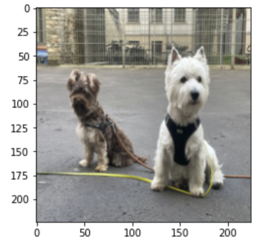
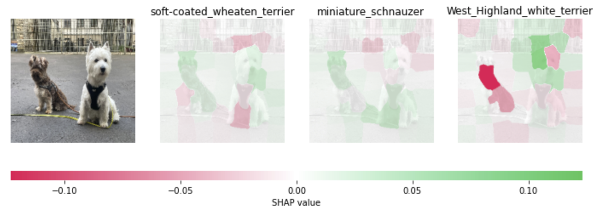

---
title:
description:
tags:
  - AI Explainability
  - AI Fairness
  - Machine Learning
  - Artificial Intelligence
  - Game theory
  - Shapley Values
  - SHAP
authorGithubAlias: cyrusmvahid
authorName: Cyrus Vahid
date: 2022-07-08
---
in the [theoretical post](05-shape) about SHAP, we explored the SHAP paper. We now take a look at a tutorial of SHAP. Here we focus on a practical tutorial in which we use VGG16 to predict objects in an image before attempting to explain it using Kernel SHAP. THe full code can be found [here](061-shap-example.md). for the notebook refer to: https://github.com/cyrusmvahid/AIX-BuildOn/blob/main/08-shap-example.ipynb

### Loading an Image

```python
from PIL import Image
from torchvision import transforms
pil_img = Image.open("images/boyz2.jpeg")
pil_img.convert("RGB")

resize_transform  = transforms.Resize((224,224))
tensor_transform = transforms.ToTensor()


pil_img = resize_transform(pil_img)
plt.imshow(pil_img)
pil_img = tensor_transform(pil_img)#.numpy()
#normalize = transforms.Normalize(mean=[0.485, 0.456, 0.406],
#                                std=[0.229, 0.224, 0.225])  
#pil_img = normalize(pil_img)
pil_img = np.transpose(pil_img, (1,2,0))
pil_img = pil_img * 255
```




### Segmenting the image to 50 segments so we do not end up explaining every pixel.
```python
from skimage.segmentation import slic

segments_slic_pil = slic(pil_img, n_segments=50, compactness=30, sigma=3)
```

### define a function that depends on a binary mask representing if an image region is hidden

```python
def mask_image(zs, segmentation, image, background=None):
    if background is None:
        background = image.mean((0,1))
    out = np.zeros((zs.shape[0], image.shape[0], image.shape[1], image.shape[2]))
    for i in range(zs.shape[0]):
        out[i,:,:,:] = image
        for j in range(zs.shape[1]):
            if zs[i,j] == 0:
                out[i][segmentation == j,:] = background
    return out
```

### Creating a predictor that works on super-pixels as opposed to the original image.

```python
from keras.applications.vgg16 import VGG16
model = VGG15()
def f(z):
    print("inside f")
    return model.predict(preprocess_input(mask_image(z, segments_slic, pil_img, 255)))
```

### Creating an explainer using shap library
```python
import shap
explainer = shap.KernelExplainer(f, np.zeros((1,50)))
```

### Computing Shaply values using our explainer. 
We run VGG 100 times on the perturbed dataset.
```python
shap_values = explainer.shap_values(np.ones((1,50)), nsamples=1000) 
```

### Visualization of the explanation
In explaining how the white dog has been identified as a west highland terrier, we can see the face (colour green) and the positive contribution of 0.1 has the highest impact. Notably we can also observe that the red zones have the most negative imact.




## References
Below are a set of references I have looked up and used for this post. There are very good regerenes to learn more about AI Exlainability. If you are interested to learn more, I strongly suggest taking a look at these resources.
1. LIME's original paper: https://arxiv.org/pdf/1602.04938v1.pdf
2. Survey paper for explainability methods: https://arxiv.org/pdf/2011.07876.pdf
3. Oreily blog for intuitive understanding of LIME: https://www.oreilly.com/content/introduction-to-local-interpretable-model-agnostic-explanations-lime/
4. LIME Open Source Library [docs]: https://github.com/marcotcr/lime/tree/master/doc/notebooks
5. Kernel SHAP paper: https://arxiv.org/pdf/1705.07874.pdf
6. Cooporative games in Game theory: https://vknight.org/Year_3_game_theory_course/Content/Chapter_16_Cooperative_games/
7. Original Shapley paper: https://www.rand.org/content/dam/rand/pubs/papers/2021/P295.pdf
8. Cooporative Game Theory: https://www.wifa.uni-leipzig.de/fileadmin/Fakultät_Wifa/Institut_für_Theoretische_Volkswirtschaftslehre/Professur_Mikroökonomik/Cooperative_game_theory/B1_gl.pdf
9. UBC course on Shapley Values: https://www.youtube.com/watch?v=9OFMRiAVH-w
10 https://arxiv.org/pdf/1705.07874.pdf


```python

```
