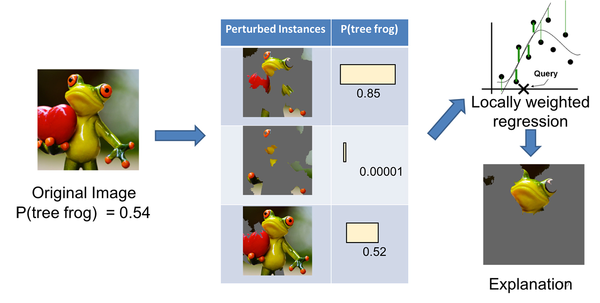

# A Gentle Introduction to AI Explainability - part 2: LIME

## Context
In [part 1](./AIX_Intro-B1.ipynb) of this series we took a look at the fundamental reasons and the theoretical foundations of AIX. In this post, we dive deep into one of methods in the core of local explainability that uses perturbation methods to discover feature importance.  

# LIME (Local Interpretable Model-agnostic Explanation)
LIME is a post-hoc, model agnostic local explanation method using feature perturbation to train a surrogate model.

## Intuition
The idea behind Lime is to perturb the input and see how it affects predictions. If we perturb the input data  at some granularity that makes sense to humans, we can see how the prediction changes in relation to those perturbations. For instance, changing whole words and parts of the input image like a whole eye that makes sense to humans can be changed and we can observe how it changes the prediction. It is worth noticing that the model might be, and is very likely to be using, a much more complex mechanism based on much more granular data and application of purturbation results in approximation to a much simpler model. This simpler model is the explainer model. 
Additionally LIME provides local explainability, meaning that using the simpler model--e.g. linear model--to explain a decision in relation to a specific data point in its immediate neighborhood. Locality is achieved though application of a kernel with local sampling using a weighing mechanism that punishes distance from the center of the neighborhood where the point that is being explain resides. It is obvious that it is much simpler to explain a model inference locally rather than in relation to the entire model and complete dataset. 
Now the question is that what constitutes a human understandable concept and how a neighborhood should look like. Going back to early days of ANN, one of the issues philosophers of mind took with ANN's information representation was lack of information constituency, meaning that intermediary computational components of a neural network (weights and connections) did not have a quality Paul Smolensky labeled "constituent structure of mental state." in his critique of "connectionism". In essence, he meant that the mental state represented in a neural network did not make any sense to the human observers. We can now see those days in the late 1980's in our back mirror with a sense of nostalgia and a slight irritation, but the concept of constituency of latent representation is a good basis for good human-understandable explanations. The authors of LIME paper use terms such as super-pixels where a collection of adjacent data points represent a mental state that has constituent structure. An example of such representation is face detection. A human face needs to have certain criteria of having an approximation to a certain facial organs in a certain spatial order. Super pixels here represent those facial organs and their spatial relationships as is visualized in Figure 1 of part 1 on this blog. Another such example is detecting presence of a frog in an image. Authors of LIME paper have published a blog in which they use the example of a frog.

<figure>
    
    <figcaption>Figure 1: Transforming an image into interpretable components. Sources: Marco Tulio Ribeiro, <a href="https://pixabay.com/en/love-valentine-s-day-pose-heart-903178/">Pixabay</a>.</figcaption>
</figure>

Now, how do we get from an image with data that has structural constituent structure to an explanation? The idea is simple and common in almost all of the local explainability models on the basis of input perturbation. We  perturb the input data by turning off some of the interpretable super-pixels and get a probability score from the original model (a tree frog being in the picture). After repeating this process for a number of perturbations, we learn a linear model on the perturbed dataset. Weighting helps with local explainability as it underscores mistakes in the perturbed instances rather than global performance of the model.  Figure 2 demonstrates this process:
<figure>
    
    <figcaption>Figure 2: Explaining a prediction with LIME: 1- The original data is transformed to a new dataset with purturbations. 2- some of the regions of super pixels are turned off. 3- Using the original model on perturbed dataset, output models form a new label set. 4- A regression model is trained on the perturbed dataset and new labels. 4- Highest impact regions are presented as explanations. Sources: Marco Tulio Ribeiro, Pixabay.. Sources: Marco Tulio Ribeiro, <a href="https://pixabay.com/en/love-valentine-s-day-pose-heart-903178/">Pixabay</a>.</figcaption>
</figure>

## Fidelity-Interpretability Trade-off

An explanation is a model $ g \in G$, where $G$ is a class of potentially interpretable models. Note that $g$ acts on a binary (absence/presence) of perturbations, thus domain of $g$ is $\{0,1\}^{d^\prime}$.
not every $g \in G$ is human interpretable; this leads to introducing a measure of complexity $\Omega(g)$. The complexity could for instance be depth of a tree in a random forest or non-zero weights in a deep learning model. The goal of LIME is to find an optimal fidelity score while the value of complexity is at the lowest. The LIME paper introduces $\Pi_x(z)$ as proximity weight between instance $z$ and data $x$ (creating locality), where building an explanator for model $f: \mathbb{R}^d \rightarrow \mathbb{R}$ for classification models (could be reduced to a binary classification). 
As we saw earlier in part 1, we would need to solve an optimization problem by minimizing average distance between explanation and prediction. Lime has added the complexity to the same optimization problem to create a fidelity-interpretability trade-off. More formally the paper has defined loss function $\mathcal{L}(f,g,\Pi_x)$ as opposite of faithfulness of explanator $g$ to model $f$. LIME then is obtained by solving the following optimization problem:
$$
\large{\xi(x) = \text{arg} \min\limits_{g \in G} \mathcal{L}(f,g,\Pi_x) + \Omega(g)}
$$
Minimizing $\Omega$ alone reduces the complexity and thus makes the explanation more human-friendly, whilst minimizing $\mathcal{L}$ maximizes local fidelity; therefore minimizing $\xi$ balances between intrpretability and local fidelity.

## Model Agnostic 
We saw in part 1 that a desired explanation should be model agnostic. We have so far, successfully translated explanation to an optimization problem on a loss function $\mathcal{L}$ for model $g$. The problem at hand is now training a model whose job is to provide a generalized solution to explainability. Like training any model, we need data and the training should result in high degree of generalization for $g$.

training data is sampled uniformly at random around $x^\prime$ The data is sampled from amongst non-zero elements and is weighted by $\Pi_x$. loss function $\mathcal{L}$ is then approximated on the sampled data. As you remember $\Pi_x(z)$ enforces proximity between instance $z$ and data $x$. Using $\Pi$ as weight we create centers of locality in order to achieve high fidelity score using a generalized and model agnostic process.  

<figure>
    
    <figcaption>Figure 3: In this simple model we can see that the model $f$ that is being explained  is too complex to explain globally. Using LIME we can create a linear local explanation for $x^\prime$. It can be achieved through a linear model within a neighborhood of $x^\prime$ (bold red cross). You can see that points (crosses) are sampled from much wider area of the dataset but the weighting mechanism enforces locality (size of the crosses). The dashed line is the linear model that is used for local explainability, even though the whole of the model could not be explained using a linear model.</figcaption>
</figure>

## Sparse linear Explanations
As we see in the toy example in the image above, if the neighborhood is small enough, local explanations can be achieved through a linear model. The paper then introduces local explanations based on linear models, meaning that $G$ is taken to be a class of linear models, such that $g(z^\prime) = w_g . z^\prime$. We also saw in the toy example that data sampling is a weighted distance from the local point $x^\prime$ that is being explained. In keeping with that the LIME paper opts for weighted square loss as loss function $\mathcal{L}$ or 
$$
\large{ \mathcal{L}(f,g,\Pi_x) = \sum_{z,z^\prime in \mathcal{Z}}\Pi_x(z)(f(z)-g(z^\prime))^2 }
$$
The equation above takes average distance of the points in vicinity of the points that is being explained and applies distance from that point as weight. The farther the point, the smaller its contribution in the calculation. As the weight itself is a measure of distance, we need to include a distance measure in the weight function. The weight function itself is an exponential kernel where $D$ is a distance measure. $D$ can be chosen in a way that suits the sort of model that needs to be explained. For instance it can be $cosine$ similarity in the case of text classification or L2 distance for images. To achieve a decreasing exponential function that punishes distances, both $D$ and $\sigma$ are squared, so the negative sign always results in a downward curve.
$$
\large{ \Pi_x(z) = e^{ \frac{-D^2(x,z)}{\sigma^2} } }
$$
The use of kernel is basically stemmed from the fact that we are trying to find a linear approximation for a non-linear problem. 
The choice of an exponential kernel is due to the fact that exponential kernels, like other radial basis function kernels, perform well in multidimensional regression problems. In their core, such kernels look at distance between points in the dataset to a fixed point (the point that is being explained in our case) and use variance as a sensitive distance hyperparameter. 
In the imge below that represents  we can see that the value of $\Pi$ is inversely exponentially relative to value of $z$ and thus diminishing the weight as value of $D$ (distance measure) increases. tuning $\sigma$ (variance) is most crucial in a good kernel setup here. As you can see in figure 4, $\sigma$ effects behaviour of the kernel dramatically for the same data. 

<figure>
    
    <figcaption>Figure 4. Exponential kernel. This is an exponential kernel on a 100 data points sampled as a normal distribution. We can see the effect of $\sigma$ on the shape of the graph. It is essential that we get the value of hyperparameter  $\sigma$ right to have the best possible explanation. punishing the farther points too severely and the superpixels become too small, and too low, they superpixels spill into one another, muddying the explanation. It is also worth noting that as the value increases the curvature of the kernel diminishes and it increasingly behaves as a linear kernel.</figcaption>
</figure>

For more information on kernels please check: https://www.cs.toronto.edu/~duvenaud/cookbook/.

## Data Sampling
instances are being sampled around $x^\prime$, the point that is being explained with the following characteristics.
- They are weighted by $\Pi_x$
- They are non-zero, so that they positively participate in prediction.
- They are sampled uniformly at random.

Given a perturbed sample $ x^{\prime} \in \{0,1\}^{d^\prime}$, predictions of the original model $\{f(z):\  z \in \mathbb{R}^d\}$ are used as label for the explanation model.

Then a dataset $\mathcal{Z}$ is being built from the sampled perturbed data and their labels, which is used to optimize the LIME equation and obtain:
$$
\large{ \xi(x) = \text{arg} \min\limits_{g \in G} \mathcal{L}(f,g,\Pi_x) + \Omega(g) }
$$

# What is next?
in [part 3](./AIX_Intro-B3.md) we walk through an example of lime, using InceptionV3, resnet152, and LIME library.

# References
1. https://arxiv.org/pdf/1602.04938v1.pdf
2. https://arxiv.org/pdf/2011.07876.pdf
3. https://www.oreilly.com/content/introduction-to-local-interpretable-model-agnostic-explanations-lime/
4. https://github.com/marcotcr/lime/tree/master/doc/notebooks
5. https://arxiv.org/pdf/1705.07874.pdf
6. https://vknight.org/Year_3_game_theory_course/Content/Chapter_16_Cooperative_games/
7. https://www.rand.org/content/dam/rand/pubs/papers/2021/P295.pdf
8. https://www.wifa.uni-leipzig.de/fileadmin/Fakultät_Wifa/Institut_für_Theoretische_Volkswirtschaftslehre/Professur_Mikroökonomik/Cooperative_game_theory/B1_gl.pdf
9. https://www.youtube.com/watch?v=9OFMRiAVH-w
10 https://arxiv.org/pdf/1705.07874.pdf

