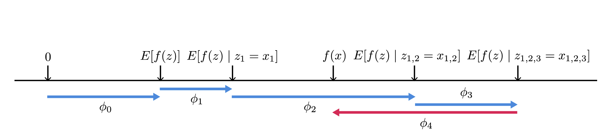

# A Gentle Introduction to AI Explainability - part 4: Shapley Values

## Context
In [part 2](./AIX_Intro-B2.md) we went through the theoretical explanation of the LIME paper and in [part 3](./AIX_Intro-B3.md) we saw LIME in action. In this blog we learn about Shapley values and the next two blogs contain SHAP method for explainability and a coding example using `shap` library.

## Cooperative n-person games
Fundamentally,  How The problem is to measure what contribution each player makes in a game where multiple players cooperate to converge into a common goal, represented as a reward or payout. Let's think in terms of a football (soccer) team. The aim of the game is to score, perhaps as many as you can or at least one more than your team concedes, if you are a proper team. Often players are rewarded a contractual bonusbased on the position in the league after the end of a season and may other success criteria. Many club employees such as kit-man, coaching, and medical staff also receive performance bonuses based on team performance. Obviously no one thinks that only goal scorers should be rewarded. The problem is to compute what impact each player or employee has had in success of the team.
Another example is a sales organization within an IT vendor company. There are account managers, solutions architects, inside sales, technical account managers, and many others in the account team as well as specialist support teams that contribute to a sale. How should the commission be distributed? What is the exact contribution of a solution architect to the success of a transaction? What is the direct contribution of marketing to the total revenue? 
These are all n-player games in competitive situations. There is a total amount of available commission that needs to be divided fairly amongst the account team. The account team member, although in a tight alliance, compete over having a bigger chunk of the available rewards. Marketing, PR, and other support teams compete over the amount of available budget based on their contribution, even though in the grand scheme of things are tightly allied for the benefit of the company. 
Lloyd shapley proposed a solution to this problem. In the next section, I will introduce Shapley values. They are relevant to model explanation as we can use Shapley values to measure how much each feature contributes to the final decision of a model.

### Definitions
#### Coalition Function
Imagine a sales team. if the team has $N$ members and their coalition has a payout. Now if we create permutations of team members by changing the order or removing one or more members from the team, we still would have a payout that is either the same or lower, or perhaps, unlikely as it might be,higher. 
Let's imaging we have three players $A, B,$ and $C$. The coalition set in this case is $\{\{\} = \phi, \{A\}, \{B\}, \{C\}, \{A,B\}, \{A,C\}, \{B,C\}, \{A,B,C\}=\Omega \}$. We can see that for a coalition of $3$ we have $2^3$ permutations with each permutation resulting in some payout. For N players, the total number of coalitions is $2^N$ and each coalition has a payout. A grand coalition is a coalition that includes all the player. In this example $\{A,B,C\}$ is the grand coalition. We define characteristic or coalition function as a function that projects each of the coalitions to a payout. More formally:

Let $N=\{p_1, p_2, \dots, p_n\}$ be all the players in a game $G$ with $|N|=[N]$. Each non empty $S \subseteq N$ is called a coalition. A grand coalition is a coalition of all players in the game and is denoted by $\Omega$.

***Definition:*** *A characteristic function game $G$* is given by $(N,v)$ where $v:2^{[N]} \rightarrow \mathbb{R}$ is a coalition function that maps every $S_i \in S$ (all coalitions + empty subset to a payout. 

Let us consider the sales example where A is the account manager, B the solutions architect, and C the technical account manager. The below table is the coalition function with the hypothetical payout values:

| Coalition | Payout |
|-----------|--------|
| $\phi$    | 0      |
| A         | 100K   |
| B         | 80K    |
| C         | 65K    |
| A,B       | 160K   |
| A,C       | 140K   |
| B,C       | 100K   |
| A,B,C     | 250K   |

Let us contemplate as what the payout function is telling us. 
<figure>
    
    <figcaption>
    </figcaption>
</figure>
- A has the highest impact on this specific sale, followed by B, and then C. 
- A and B together can make a sale with a total value of 180. C adds 70 to the total. 
- B individually makes a total revenue of 80 and C adds only a contribution of 20 when paired with B, a far cry form individual contribution of 65. This does not seem to be a good coalition. It even makes causal sense as the two technical resources have many areas of overlap in terms of skillset.
- C makes a total contribution of 40 when paired with A. It is a much better contribution, but the maximum effectiveness comes where all members of the coalition are working together.

We can conclude C is most successful when A is in the coalition.

#### Superadditive
We all have heard of teams whose total is more that total sum of its members. This is basically intuition for the superadditive characteristic function game. More accurately we have for each combination of distinct coalitions, if the total payout of the combined coalition is more than or equal the total sum of of the contribution of its coalition members. The distinctness does make sense. Let us consider the case of $\{C_A=\{A\}, C_{AB=}\{A,B\}\}$. There is a hidden double counting of contribution of $A$ so we should account for it. In the case of our example $v(C_A)=100,v(C_B)=80,\ v(C_{AB})=160;\ 160=v(C_{AB}) < v(C_A) + v(C_B) = 180$ does not contradict super additiveness. How about $v(C_{AB})$ and $v(C_C)$ where the two coalitions are distinct? $v(C_{AB}) = 160,\ v(C_C) = 65, and  v_{ABC}=250;\ 225 = v(C_{AB}) + v(C_B) \leq v(C_{ABC}) = 250$ does not contradict superadditiveness.

***Definition*** A characteristic function game $G=(N,v)$ is called *super additive* when:
$$
\large{\forall\ C_i\subseteq S,\ where\ \cap_{i=1}^{[N]}C_i =\phi :\   v(\cup_{i=1}^{[N]}C_i) \geq \sum_{i=1}^{[N]}v(c_i)}
$$
 
***Question:*** *Is the sale example a super additive characteristic game function?*

***Answer:*** We need to try an example that breaks superadditiveness. The case of $\{A, C\}$ results in $165 = v(C_A) + v(C_C) > v(C_{AC}) = 140$, therefore the sales example is not a superadditive game. Altering payouts to $v(C_{AC} \geq 165$ will make the game to be an example of a superadditive game. 

A solution to a coalition function game is a payout vector that divides payouts amongst players in the grand coalition. More formally $\lambda \in \mathbb{R}_{\geq 0}^{[N]}$ that satisfies:
$$
\large{ \sum_{i=1}^{[N]} \lambda_i = v(\Omega) }
$$

One obvious solution to the problem is of course equal payout, but this is unfair to the high performing players. A better solution to our example is to choose $\lambda = [\frac{100}{250}, \frac{80}{250}, \frac{65}{250}]$. This means we consider impact only on the basis of individual performance. This is perhaps unfair to $C$ as he seems to excel in team settings where $A$ is present.

The goal of Shapley values is to find the fair distribution relative to impact. This requires us to define Shapley axioms, which define a system in which Shapley values can be calculated.

### Symmetry
Symmetry axiom represents interchangeability of two members, meaning that either of the members would always have the same marginal contribution no matter what coalition they are added to. For instance if we have two additional players in the sale example,--e.g. inside sales and marketing-- with individual contribution of $v(C_D)=15$ and $v(C_E)=20$. $C_D$ and $C_E$ are symmetrical in respect the payout function if $v(C_{ABD}) = v(C_{ABE}) = 150$. Please note these new members are only symmetrical in the context of $C_{ABD}$ and  $v(C_{ABE}$. A symmetrical game requires this to hold for for all coalitions that contain these members.

More formally:
$$
\forall K \subset S;\ where\ C_i \notin K\ and\ C_j \notin K\ and\ \forall v \in G:\\
\large{
v(K \cup C_i) = v(K \cup C_j)
}
$$

***Symmetry Axiom:*** Interchangeable members should receive the same share or:. $\large{\lambda_{C_i}(N,v) = \lambda_{C_j}(N,v)}$ for interchangeable players $C_i$ and  $C_j$.

### Null player
We all have had coworkers where we though their presence had no impact on the outcome of the work. If the data supports your suspicion, then we have a null player. Basically a null player is a player that if added to a coalition, the payout value does not change. 

More formally,
A player $C_k$ is a null player in if:
$$
\forall v\in G\ and\ \forall K \subset S:\\
\large{
v(K) = v(K \cup C_k)
}
$$

***Null player axiom:*** Null(dummy) players should receive nothing or:. $\large {\lambda_{C_k}(N,v) = 0}$ for null player $C_k$.

### Additivity
Consider two independent games $G_!$ and $G_2$. For instance the same sales team from the previous example would be working on more than one sales initiative or sometimes more than one customer account at a given time. Let's say in January they maker a sales of a total value of 250K as given in the example and in the month of February, they close another sale at the different customer for 300K. These two games are independent of one another. There are two ways of looking at this. Either we are looking at a single game of total sales in a quarter, or we can break that game to individual games based on each sales. The quarterly games of selling services for this sales team can be split into independent games. It is often done very regularly by splitting annual sales to quarterly sales and rewarding sales them on the basis of their quarterly performance. Games that can be split into independent parts are additive. More precisely, *if a game can be separated into parts, we should be able to decompose the payments.*

***Additivity axiom:*** let $v_i$ and $v_j$ be two arbitrary payout functions and $C \subseteq S $ be an arbitrary non-empty coalition. The solution function $\lambda$ follows the additivity axiom if: 
$$\large{\lambda_C (v_i + v_j) = \lambda_C(v_i) = \lambda_C(v_j)}$$.

### Shapely theorm
Given a coalitional game $(N,v)$, there is a unique payout division $x(v) = \lambda(N, v)$ that divides the full payout of the grand coalition and satisfies Symmetry, Null player, and additivity axiom. 

### Shapely Value
the Shapley value is calculation of the unique payout division based on removing members and measuring what difference removal of a member has made. Then doing it for all members and in all possible ways and averaging over the possible ways we can constructed the society.

More formally:
$$
\large{
\lambda_i(N,v) = \frac{1}{N!}\sum_{S\subseteq N \setminus \{i\}}|S!|(|N|-|S|-1)! \left[ v(S \cup \{i\})-v(S)    \right]
}
$$
Let us dissect this a little bit: $\left[ v(S \cup \{i\})-v(S) \right ]$ is player $i$'s marginal contribution that is acquired through removing the player and looking at how it affects the payout. We then weight the marginal contribution by $|S!|$, the number of ways set $S$ could be created before adding player $i$ and (|N|-|S|-1)!, the number of ways the rest of the players could have been added. Then all these possible ways of contributions by members is added up using $\sum_{S\subseteq N \setminus \{i\}}|S!|(|N|-|S|-1)! \left[ v(S \cup \{i\})-v(S)    \right]$. As we have summed up all the possible contributions, we average the total over the total of orderings we could have had by dividing the sum by $|N!|$.  

#### Example 
Let us restrict our example only to an account manager and a solutions architect. We know that we have a following payout table (I have changed $v(B)$ to 40 to have a superadditive game:

| Coalition | Payout |
|-----------|--------|
| A         | 100K   |
| B         | 40K    |
| A,B       | 160K   |

Let us calculate Shapley Value.
Let us focus on player $A$. We can add $A$ first. in this case $\lambda_A = v(C_A) = 100$. A could be added second in a sequence of B first and A second, thus resulting in the $B \rightarrow A$ sequence. Marginal contribution is now calculated as $v(C_{AB}) - v({C_B}) = 120$. The total sums up to 220 and as we are averaging over two possibilities $|N|! = 2$, so each variation is divided by 2 and payout for A comes to: $50+60 = 110$. We can then repeat the process focusing on B. $v(C_B) = 40$ and $v(C_{AB}) - v(C_A)=60$. By the same token, both values are divided by 2 and thus contribution of $B=20+30=50$. We can see that the total for the grand coalition is 110+50 = 160, which is equal to $v(C_{AB})$. 

$$\large{ \lambda (N=\{A,B\}, v) = \{110, 50}\}$$  

# What is next?
In [part 5](./AIX_Intro-B4.ipynb) we shall use Shapley values to solve LIME's equation and get a unique feature attribution solution.

# Additive feature attribution methods
Additive feature attribution methods have a an explanation model that is a linear function of binary variables.
$$
\large{
g(z^{\prime}) = \phi_0 + \sum_{i=1}^M\phi_iz^\prime_i
}
$$
where $z^\prime \in \{0,1\}^M$, and $M$ is the number of simplified input features, and $\phi_i \in \mathbb{R}$.

Family of explanation models that matching definition of additive feature attribution models assign an attribution $\phi_i$ to each feature and then sum up the effects of all features to approximate the original model $f$ over a specific input. 
In the following sections we explain such three of such models as well as their practical application. Each model is accompanied by relevant code notebook running through an example.

Additive feature attribution methods have *desirable* properties that uniquely determine additive feature attribution.

### Local accuracy
Local accuracy requires the explanation model $g$ to at least match the output of original model $f$ for the simplified input $x^\prime$.

### Missingness
features that are missing from the simplified input, which describe in binary terms where or or not a feature is present, must have no impact, or $x_i^\prime = 0 \Rightarrow \phi_i=0$.

### Consistency
If a model changes in a way that impact of a feature increases, the attribution should never decrease.

# SHAP and Explainability
Feature attribution is one of the main areas of focus in explainability research and implementation. Feature attribution is essence calculates how much each input feature contributes to a decision made by the model. Self evidently, feature attribution models can be applied post-hoc and as a black-box explainer. Prominent amongst feature attribution methods are those based on Shapley values, proposed in 1952 by Nobel Prize laureate (2012) Lloyd Shapley in game theory in the context of cooperative n-person games. To understand application of Shapley values in model explanation, let us first take a brief look at n-person cooperative games and Shapley method.

## SHAP for Explainability
So far we have seen that Shapley values provide a ***unique*** and ***fair*** way to distribute the payout amongst the players in a collaborative and competitive game. We have also seen references to feature attribution methods. Additionally we know from the context that SHAP is an additive feature attribution methods and thus has a linear local explanation based on simplified input.    

The authors of the SHAP paper[10] have provided an equation that is akin to Shapley values equation and prove that there is unique solution to that equation, which is composed of a conditional expectation function of the original model that is being explained. In this case the explanation model should satisfy the three properties of the additive feature attribution, which again are akin to three axioms of for Shapley theorm. The equation that needs to be answered is defined as:
$$
\large{
\phi_i(f,x) = \sum_{z^\prime \subseteq x^\prime} \frac{|z^\prime|!(M-|z^\prime|-1)!}{M!} \left[ f_x(z^\prime)-f_x(z^\prime \setminus i) \right]
}
$$
where $|z|$ is the number of non-zero entries in z, and $z \subseteq x$ represents all $z$ vectors where the non-zero entries are a subset of the non-zero entries in $x$. $f_x(z\prime) = E \left[ f(z) | z_S\right]$ where $S$ is a set of non-zero indexes in $z^\prime$

Comparing this equation to shapley values, we observe that $\phi = \{\phi_i:\ 0\ \leq i\ \leq M\}$. $f$, the original model is the payout function and $x$ denotes the grand coalition. finally $z$ is permutations of possible coalitions, which we saw in the simple example s we created those permutations. 

<figure>
    
    <figcaption>
        Figure 13: $[E(f(z)]$, corresponding to $\phi_0$ is the expectation of the model over input features. Then as we build all the possible alliances $x_1 = \rightarrow x_{1,2} \rightarrow x_{1,2,3}$ we get the conditional expectation  of $f(x)$ for the newly added feature. We should keep in mind that the solution is dependent on the order the population is generated in the cases where the features are dependent on one another or the model $f$ is non-linear.
    </figcaption>
</figure>

## Approximating SHAP values
Instead of heavy and complicated computation of SHAP values, we can approximate them with some accuracy. Authors of [10] has proposed two model agnostic methods of which we only focus on Kernel SHAP, which is a combination of LIME and Shapley values. Later in this document, we describe DeepLift and DeepSHAP, which combined DeepLift an Shapley values and is model specific.

### Kernel SHAP
We remember creating a LIME explanator resulted in solving the optimization 

$$
\large{\xi(x) = \text{arg} \min\limits_{g \in G} \mathcal{L}(f,g,\Pi_x) + \Omega(g)}
$$.

We should also note that choosing loss function and $\Omega$, and weighting kernel, $\Pi$ to solve the LIME optimization equation are empirical and based on heuristic methods, thus the explanations can vary depending on how we choose those hyperparameters. The question is whether we could do better and have a consistent and locally accurate solution. The answer is yes. Since LIME is a Additive feature attribution method, Shapley values are the unique solution to the problem of finding an explanator where the desired properties, local accuracy, missingness, and consistency are satisfied; therefore the question of consistency and local accuracy for LIME comes down to find the Shapley values to to find the hyperparameters $\Omega$, $\mathcal{L}$, and $\Pi$ and avoid heuristic methods.
The authors propose and prove the following values for the huperparameters to be the unique solution that satisfies the desired properties:
$$
\large{
\Omega(g)=0
}
$$
As seen earlier $\Omega$ represented complexity such as depth of a tree or the number of non-zero weights. This is heuristic and arbitrary. By setting it to $0$, we become independent of such arbitrary choice of complexity.

$$
\large{
\Pi_{x^\prime}(z^\prime)=\frac{M-1}{\left(M choose |z^\prime| \right )|z^\prime|\left( |M|-|z^\prime|\right )}
}
$$
The apparent similarity to weighting of Shapley values is obvious.

$$
\large{
\mathcal{L}(f,g,\Pi_{x^\prime}) = \sum_{z^\prime \in z} \left[ f(h_x^{-1}(z^\prime))-g(z^\prime)\right ]^2\Pi_{x^\prime(z^\prime)}
}
$$
$\mathcal{L}$ corresponds to the weighted average of the conditional expectations in the SHAP method.

## What's next?
I think the reader agrees with me that we need to stop with the theory and get into some coding examples. in the [next part](AIX_Intro-B5.md) we shall explore how Shapley values are used in AI explainability.

# References
1. https://arxiv.org/pdf/1602.04938v1.pdf
2. https://arxiv.org/pdf/2011.07876.pdf
3. https://www.oreilly.com/content/introduction-to-local-interpretable-model-agnostic-explanations-lime/
4. https://github.com/marcotcr/lime/tree/master/doc/notebooks
5. https://arxiv.org/pdf/1705.07874.pdf
6. https://vknight.org/Year_3_game_theory_course/Content/Chapter_16_Cooperative_games/
7. https://www.rand.org/content/dam/rand/pubs/papers/2021/P295.pdf
8. https://www.wifa.uni-leipzig.de/fileadmin/Fakultät_Wifa/Institut_für_Theoretische_Volkswirtschaftslehre/Professur_Mikroökonomik/Cooperative_game_theory/B1_gl.pdf
9. https://www.youtube.com/watch?v=9OFMRiAVH-w
10 https://arxiv.org/pdf/1705.07874.pdf

