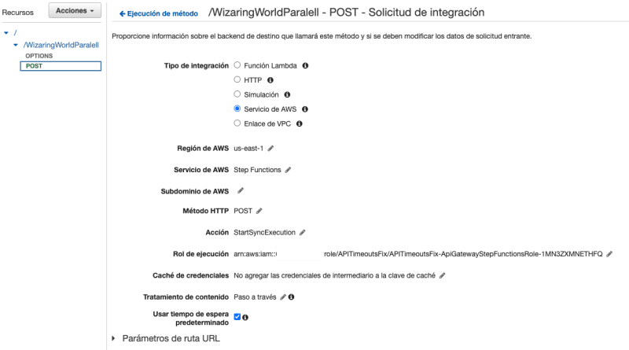

A few months ago I was struggling with an API. No matter what I do, it always replies with timeout errors. 

In this article, I want to tell you how I solved my problem and turned this headache into a fully functional API using only 3 AWS services and a lot of coffee.

I think many of us have experienced creating something that doesn't work quite well. At the beginning, when I embarked on the challenge of creating a serverless application, it was difficult for me to identify the functions we needed to create and the services that best suited what I was building. But finally, I landed on an idea that I want to share with you today, and it uses the following services:

- [Amazon API Gateway](https://aws.amazon.com/api-gateway/) which acts as a guardian that facilitates and controls access to different services or systems, ensuring that communication is easier and more secure. In my case, my API.

- [AWS Lambda](https://aws.amazon.com/lambda/) is a serverless computing service that runs code in response to events, without needing to manage the underlying infrastructure.

- [AWS Step Functions](https://aws.amazon.com/step-functions/) is a service that allows visual and scalable coordination and orchestration of different steps and actions in a workflow, making it easier to create and manage complex applications and processes.

In my case, the application I was working on already used a serverless architecture, but the scope of the solution was focused solely on an API Gateway with integrations to Lambda functions. This approach generally works well as long as you keep your lambdas limited to specific functionality. But here comes the "complex" part that many of us struggle with: How much code should our functions have?

I encountered several lambda functions with too much code. In other words, to achieve the desired result, many small tasks were performed, with several of them fetching information from third-party services sequentially (one task after another), causing the processing time to skyrocket and consequently leading to various timeout errors.

**Original Implementation**


I added the diagram "Original Implementation" to illustrate how the code of one of the error-generating lambdas was divided.

- I found that this function executed 5 tasks sequentially.

- The times for each of these tasks varied intermittently.

- Tasks 2 and 4 made synchronous calls to external services, meaning they waited for the result to complete before continuing with the rest of the code execution.

- The total processing time exceeded the 30-second limit configured in the API Gateway.

Upon investigating further, I learned that when discussing timeouts, it's important to consider the limits of our services and their dependencies.

For example, Lambda has a 15-minute time limit, meaning a Lambda function will automatically stop after running for that period of time.

The default API Gateway timeout is 30 seconds, but you can adjust it to your needs (and make a note of this alongside your computer password post-it note 😀). However, nobody wants to wait more than 30 seconds to get a response; that would be like computers left on read.

## Solution

Let's bring our third service to the table, the one that became my savior ☀️, AWS Step Functions. As mentioned earlier, this is an orchestrator service that allows us to design and execute processes according to our needs. Let's analyze the idea:

**New Implementation**


In the "New Implementation" diagram, I took the same tasks from the original Lambda and divided it. I separated each segment of the original Lambda into multiple Lambdas and evaluated which could be executed in parallel and which depended on previous results. No change in logic, just decoupling the code.

This change resulted in a reduction of the response time to less than half. In the real case, it reduced even more because I also refactored the code and applied best practices to the development of lambdas, such as obtaining values from parameter stores and DynamoDB information outside the handler, small changes that made a big difference. In the real case, it reduced the original time by 64%. 🙂

Now, to replicate this solution, you need:

- An AWS account: Create a new account.

- A development environment in [AWS Cloud9](https://aws.amazon.com/es/cloud9/); for this example, you can choose to use a new t2.micro EC2 instance (this is included in AWS's free tier 😉).

## Let's Get Started!

**Step 1:** Inside the AWS Cloud9 environment, clone the repository with the following command:

```bash
$ git clone https://github.com/hsaenzG/APITimeoutsFix.git
```

After this, I have the necessary code in my environment:


**Step 2:** In this exercise, I created an AWS SAM template to deploy all the necessary infrastructure. This doesn't mean you can't create everything manually from the console, but for the sake of the exercise, I'll deploy my infrastructure with the following commands:

```bash
cd APITimeoutsFix
$ sam build
```

### The result looks like this:


Now I will deploy the infrastructure using the following command:

```bash
$ sam deploy
```


This command will deploy the following in my AWS account:

1. API Gateway with a Lambda integration. This is an example of how I found the original code, and if you execute this endpoint, you'll see that it returns a timeout error.


2. API Gateway with an integration to a Step Function. This endpoint is responsible for executing the step machine, which runs multiple Lambdas in parallel to achieve the same result as the first API, but without performance errors.


3. A state machine with the necessary flow configuration to obtain all the required information from the Harry Potter saga.


4. Five Lambda Functions with the following characteristics:

   - `LambdaIntegration/app.mjs` → This function contains the original logic.

   - `stepFunctionIntegration/hechizos.mjs` → This function contains the logic to call the endpoint that returns only the list of spells from the Harry Potter saga.

   - `stepFunctionIntegration/libros.mjs` → This function contains the logic to call the endpoint that returns only the list of books from the Harry Potter saga.

   - `stepFunctionIntegration/personajes.mjs` → This function contains the logic to call the endpoint that returns only the list of characters from the Harry Potter saga.

   - `stepFunctionIntegration/info.mjs` → This function contains the logic to call the endpoint that returns the complete list of spells, books, characters, and general information from the Harry Potter saga.

**Important considerations you can observe in these examples**

1. The integration of API Gateway with Step Functions is executed synchronously. This means that the API waits for the state machine to finish its execution before returning a response. If I didn't configure it this way, the endpoint response won't contain the desired result because the step machine will run independently of the API Gateway endpoint.
   

2. For this use case, I used the Express workflow type for my state machine because it's ideal for mobile application backends. In my case, it's used as part of a web application backend, so it worked perfectly. However, you can also apply it to other use cases such as:
   - High-volume event processing workloads like IoT data.
   - Streaming, transforming, and processing data.

3. It's important to note that this type of state machine has a maximum execution time of 5 minutes.

4. The Step Functions service is included in the AWS free tier for the Standard workflow type. However, the execution billing for an Express workflow is not and the cost of it is based on the number of executions, execution duration, and memory consumed during execution. For more information on Step Functions costs, you can visit: [Step Functions Pricing](https://aws.amazon.com/step-functions/pricing/)

### Testing

   Now I'll test both endpoints to compare the results of each of them:

**Step 1:** I'll test the original endpoint using Postman (Postman is an application used to test, document, and send requests to APIs), but you can use the terminal or any application that helps you test your APIs, like Insomnia or Paw.

Execute the endpoint of the API: APITimeoutsFix. You can get the API URL from: API Gateway → APITimeOutsFix → Stages → Prod.

```bash
Request URL: https://<your API URL>/Prod/LambdaIntegration/
Request Method: POST
Body: {}
```

The result will be an intermittent error like this:


This is due to internal timeout issues in the execution and is exactly the result I expected.

**Step 2:** Now I'll execute the solution. I'll use Postman, but you can use the terminal or any application that helps you test your APIs.

I'll execute the endpoint of the API: `WizaringStepFunctionsApi`. You can get the API URL from: API Gateway → WizaringStepFunctionsApi → Stages → v2.

```bash
Request URL: https://<your API URL>/v2/WizaringWorldParalell
Request Method: POST
Body: {}
```

In this case, the response changes like this:


In this endpoint, you consistently get the expected results. 🙂

**Step 3:** As an interesting tip, if you want to see the step-by-step execution of the state machine, you can enable logging. Go to Step Functions → State Machines → IAM Role (click on the role) → IAM → Add permissions → Attach permissions → add the CloudWatchFullAccess policy. Then go back to the state machine and modify it, enabling the log level to ALL for comprehensive tracking.


Now, when I re-run my endpoint, I get a detailed execution view in the state machine:


Clicking into the detail, I can see the detailed log of the entire execution:


This is a feature I personally appreciate a lot. It's really helpful during development and testing of the state machine as it allows us to see the details of our inputs and outputs.

Well, now I'll clean up the AWS account to avoid incurring charges. I'll go back to Cloud9 and execute the following command:

```bash
$ sam delete
```

This way, I've removed all the infrastructure I used in this article.

## Conclusion

This is just one of many ways to solve timeout problems in your serverless applications. It's not the only solution, but in my case, it worked wonderfully because even though I didn't eliminate all the calls to external APIs or reduce the code, I managed to separate the workflow efficiently. I identified which tasks were independent and could be executed in parallel. Moreover, I created atomic functions that now have a single purpose and can be reused in any other workflow where they might be needed, helping my application grow in a clean way and reusing code.

Thank you for reaching the end of the article. Please comment below on what you thought and if you encountered any issues replicating the demo. If you want to learn more about Step Functions and API Gateway, visit the following links:

- [Step Functions API Gateway Tutorial](https://docs.aws.amazon.com/step-functions/latest/dg/tutorial-api-gateway.html)
- [Step Functions Workshops](https://catalog.workshops.aws/stepfunctions/en-US)
