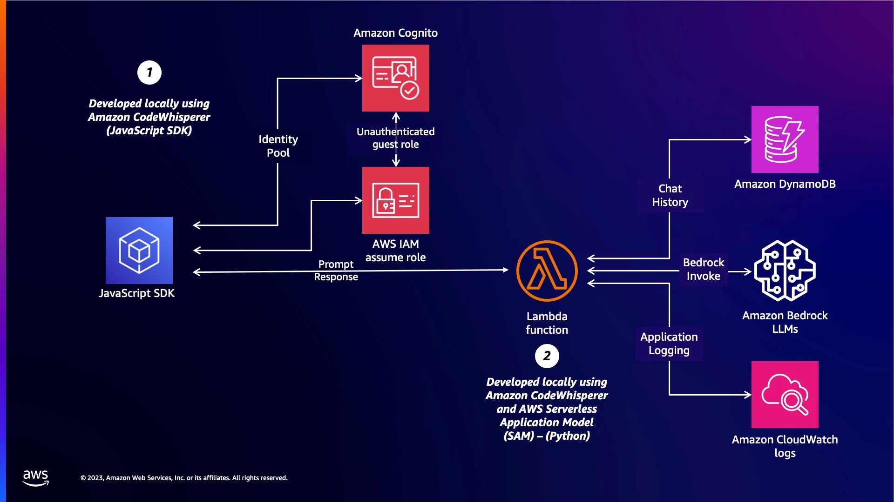
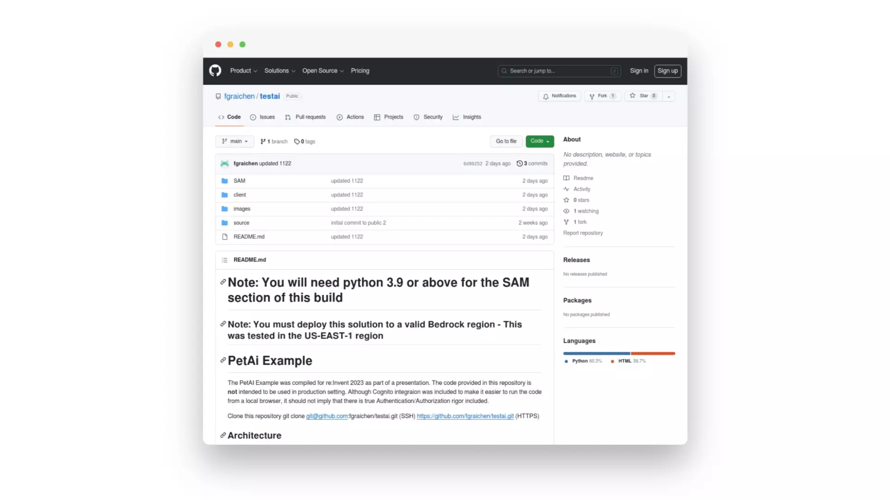
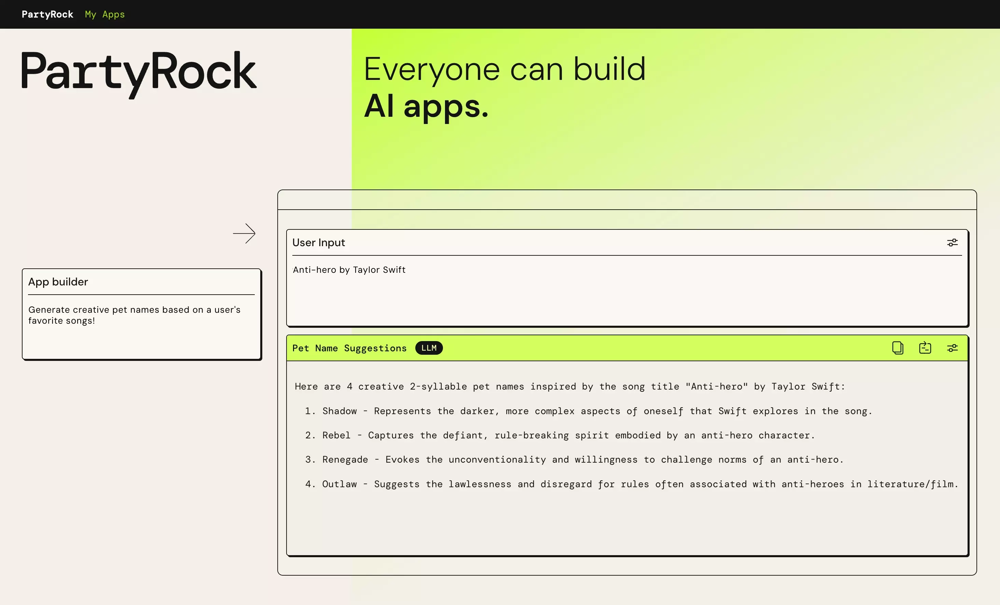

|ToC|
|---|

It is 2023. Companies are in a frenzy. They've flooded developers with an unusual request: a way to use generative AI to name pets after their favorite songs. Sounds absurd, right? Now, while developers aren’t losing sleep over pet names, they ARE desperate to harness the power of AI for their unique challenges.  

They want a solution, something adaptable, transformative. Together, [Brooke](https://www.linkedin.com/in/brookejamieson/), [Ben](https://www.linkedin.com/in/ben-cashman/), and [Fred](https://www.linkedin.com/in/fgraichen/) (the authors of this post, and co-speakers for the [re:Invent session with the same name](https://hub.reinvent.awsevents.com/attendee-portal/catalog/?search=BOA208)!) have already trained over 7,000 builders in machine learning on our hit [twitch show](https://pages.awscloud.com/GLOBAL-other-LS-Quickstart-on-AWS-Machine-Learning-2023-reg.html).

In this post, we’ll show you how the underlying tech that could name your pet after your favorite Taylor Swift anthem can be tweaked to solve real-world business challenges. The magic? It's all in the prompt.  Let’s dive into the world of generative AI!

## Foundations

To follow along with this tutorial on naming your pet with generative AI, it's helpful to have a basic understanding of some key concepts in this field. Brooke has covered the foundations in depth in a previous blog post, "[The ABCs of Generative AI](https://bit.ly/ABCsGenAI)", so we'll briefly summarize the key topics here.

First, we'll be using [Foundation Models (FMs)](/posts/the-abcs-of-generative-ai#f-is-for-foundation-models) which are pre-trained on massive datasets to generate content ([B is for Bedrock](/posts/the-abcs-of-generative-ai#b-is-for-bedrock)). Amazon Bedrock gives access to leading FMs through an easy to use API. We'll also leverage Large Language Models (LLMs), a type of FM specialized in language [(L is for LLMs](/posts/the-abcs-of-generative-ai#l-is-for-large-language-models)). LLMs can generate remarkably human-like text by predicting words after digesting huge volumes of text data during training. A core technique we'll use is prompt engineering ([P is for Prompt Engineering](/posts/the-abcs-of-generative-ai#p-is-for-prompt-engineering)) - carefully crafting the text prompts fed into the LLM to shape the desired outputs. Prompt engineering allows controlling the style and content without extensive model retraining.

Check out "[The ABCs of Generative AI](https://bit.ly/ABCsGenAI)" for intuitive explanations of these foundational concepts. Understanding them will make it much easier to follow our step-by-step generative AI tutorial to name your pet in the later sections.

## What we’re going to build

We’re going to build an application to help you name your pet after your song using Generative AI! This is the Architecture Diagram:



This simplified two-tier architecture is commonly used in demo applications to demonstrate core AWS capabilities effectively. Here’s a step-by-step breakdown of what’s going on:

### Front-End Tier

This front-end is a straightforward HTML interface with embedded [JavaScript](https://aws.amazon.com/sdk-for-javascript/?sc_channel=el&sc_campaign=genaiwave&sc_content=use-generative-ai-to-name-your-pet-after-your-favorite-song&sc_geo=mult&sc_country=mult&sc_outcome=acq). The JavaScript, developed with the help of [Amazon CodeWhisperer,](https://aws.amazon.com/codewhisperer/?trk=83c710fd-0a7a-416b-9bb8-baa535b64ee0&sc_channel=el) is responsible for collecting the artist and song title from the user and then invoking an [AWS Lambda](https://aws.amazon.com/lambda/?sc_channel=el&sc_campaign=genaiwave&sc_content=use-generative-ai-to-name-your-pet-after-your-favorite-song&sc_geo=mult&sc_country=mult&sc_outcome=acq) function with these parameters.

### Back-End Tier

Upon invocation, the [AWS Lambda](https://aws.amazon.com/lambda/?sc_channel=el&sc_campaign=genaiwave&sc_content=use-generative-ai-to-name-your-pet-after-your-favorite-song&sc_geo=mult&sc_country=mult&sc_outcome=acq) function interacts with [Amazon Bedrock](https://aws.amazon.com/bedrock/?sc_channel=el&sc_campaign=genaiwave&sc_content=use-generative-ai-to-name-your-pet-after-your-favorite-song&sc_geo=mult&sc_country=mult&sc_outcome=acq), triggering the Foundation Model (FM) within, which in this case is a Large Language Model (LLM) from Anthropic called Claude 2. The LLM processes the input and generates a list of creative pet names inspired by the provided song information. This tier also ensures that every interaction, including the generated pet names, is recorded in [Amazon DynamoDB](https://aws.amazon.com/dynamodb/?sc_channel=el&sc_campaign=genaiwave&sc_content=use-generative-ai-to-name-your-pet-after-your-favorite-song&sc_geo=mult&sc_country=mult&sc_outcome=acq) for persistence, while the operational logs of the application are directed to [Amazon CloudWatch](https://aws.amazon.com/cloudwatch/) for monitoring. 

### IAM and Authentication

Aligning with the essential AWS mantra that every API call is authenticated and goes through [AWS Identity and Access Management (IAM)](https://aws.amazon.com/iam/?sc_channel=el&sc_campaign=genaiwave&sc_content=use-generative-ai-to-name-your-pet-after-your-favorite-song&sc_geo=mult&sc_country=mult&sc_outcome=acq), the architecture uses [Amazon Cognito](https://aws.amazon.com/cognito/?sc_channel=el&sc_campaign=genaiwave&sc_content=use-generative-ai-to-name-your-pet-after-your-favorite-song&sc_geo=mult&sc_country=mult&sc_outcome=acq). Instead of embedding access keys within the JavaScript (a significant security risk), Cognito’s unauthenticated identities feature provides temporary AWS credentials. These credentials allow the front-end application to assume a predefined IAM role, strictly scoped to invoke the specific Lambda function necessary for the application’s operation. 

This architecture, while not suitable for production due to its simplicity and potential scalability and security limitations, is excellent for quickly standing up a Proof of Concept (POC). It’s really about creating a rapid demonstration of how AWS services can work together to create a functional and interactive application, like ours!

## How we’re going to build it

### Amazon Bedrock and Anthropic Claude 2: Building Blocks

To generate creative pet names based on a user's favorite song, we will leverage Amazon Bedrock and an advanced Large Language Model (LLM) within called Anthropic Claude 2.

As explained in the Foundations section, Bedrock provides easy access to leading Foundation Models like Claude through a managed API. This allows us to incorporate Claude's cutting-edge capabilities in generating human-like text without managing infrastructure. Specifically, Claude's industry-leading 100,000 token context window is ideal for processing the song name and artist input to craft relevant pet name suggestions. Its advanced techniques in summarization, dialogue and content generation will enable high-quality outputs optimized for our pet naming application.

Bedrock's security features like encryption and integrations with Amazon VPC will help keep our users' data private as well. And its serverless experience means we can focus on building our frontend and prompt engineering without ops overhead. Together, Claude's powerful generative capabilities on the easy-to-use Bedrock platform provide the ideal foundation for our pet name generator app. In later sections we'll cover how we fine-tuned Claude and crafted prompts to shape these capabilities for our unique use case.

### Prompt Engineering

Prompt engineering with Claude requires tailoring your prompts to fit its specific capabilities compared to other models. Effective prompts for Claude contain 4 key sections - role, rules, example, and user input:

Role: Provides context on Claude's position in the interaction.
Rules: Outlines constraints and preferences for the response.
Example: Gives a sample response to guide Claude.
User Input: Variables where Claude will insert generated text.

For our pet naming app, the prompt structure looks like:

```text
You are a pet naming expert whose sole purpose is to create a pet name based on the name and artist of the song provided.

Rules.
1. The name must be creative
2. You must provide at least four options
3. Length of name should not exceed two syllables
4. Your choice should take into account the lyrics and the title
5. Explain your choices

Here is an example:
<Example>
Human: Dear prudence by the Beatles
Assistant:
Prudy
Sunshine
Dearie
Sunny
<\Example>

Here is the song name (user input)
<Songname>
{user input}
<\Songname>

Based on the song title and artist provided, give me at least 4 pet names.
```

In this example, the Role section is:

```text
You are a pet naming expert whose sole purpose is to create a pet name based on the name and artist of the song provided.
```

The Rules section is:

```text
Rules.
1. The name must be creative
2. You must provide at least four options
3. Length of name should not exceed two syllables
4. Your choice should take into account the lyrics and the title
5. Explain your choices
```

The example is:

```
Here is an example:
<Example>
Human: Dear prudence by the Beatles
Assistant:
Prudy
Sunshine
Dearie
Sunny
<\Example>
```

And the User Input is:

```
Here is the song name (user input)
<Songname>
{user input}
<\Songname>
```

This prompt format sets up Claude for success in our context while allowing flexibility via the abstracted user input.

## Build it

To build and run the application, start by cloning the GitHub repository (Link Coming Soon!).



Follow the README instructions to utilize SAM for deploying the CloudFormation stack that creates the Lambda function and DynamoDB table. Configure a Cognito user pool and identity pool to handle unauthenticated access for your front-end, granting the identity pool role permissions to invoke Lambda. Update the HTML page with your Cognito identity pool ID and Lambda function name. Give the Lambda execution role access to Bedrock for generating names using Claude. With all the pieces wired up, you can run the HTML page locally to invoke Lambda, which will call Bedrock to get creative pet names based on your song input, secured through temporary credentials from your identity pool!

Check the README for more details on deployment steps and example prompts for functionality like persisting generated names to DynamoDB.

## Next Steps

If you want to continue developing your skills in prompt engineering and quickly build shareable generative AI apps, check out [PartyRock](https://partyrock.aws/?sc_channel=el&sc_campaign=genaiwave&sc_content=use-generative-ai-to-name-your-pet-after-your-favorite-song&sc_geo=mult&sc_country=mult&sc_outcome=acq) from AWS. PartyRock is a fun sandbox powered by Amazon Bedrock where you can easily create and remix AI apps through an intuitive web UI.

I've already created a PartyRock app that generates pet names based on your favorite song, just like we built in this tutorial. You can try it out [here](https://partyrock.aws/u/brooke/9pXt2oPI1/Name-your-pet-after-your-favorite-song).
You can also view a [snapshot of my PartyRock app in action](https://partyrock.aws/u/brooke/9pXt2oPI1/Name-your-pet-after-your-favorite-song/snapshot/qEqcSLEjC), with the input "Anti-hero by Taylor Swift". It generated these creative 2-syllable pet names inspired by the song:

Shadow - Represents the darker, more complex aspects of oneself that Swift explores in the song.
Rebel - Captures the defiant, rule-breaking spirit embodied by an anti-hero character.
Renegade - Evokes the unconventionality and willingness to challenge norms of an anti-hero.
Outlaw - Suggests the lawlessness and disregard for rules often associated with anti-heroes in literature/film.

See the snapshot [here](https://partyrock.aws/u/brooke/9pXt2oPI1/Name-your-pet-after-your-favorite-song/snapshot/qEqcSLEjC):



With PartyRock, you can build and share your own AI apps to unlock the possibilities of generative AI in a fun, accessible way. The intuitive interface and pre-built environment allow you to focus on honing your prompt engineering skills. PartyRock is a great next step for anyone inspired to continue creating with generative AI after finishing this tutorial.
