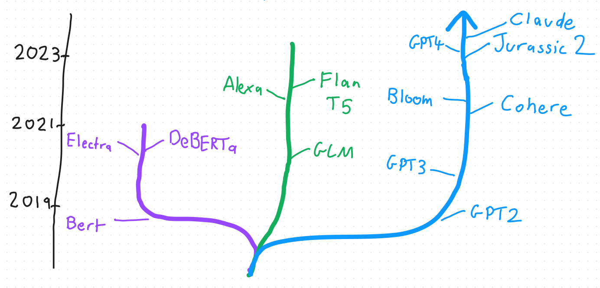
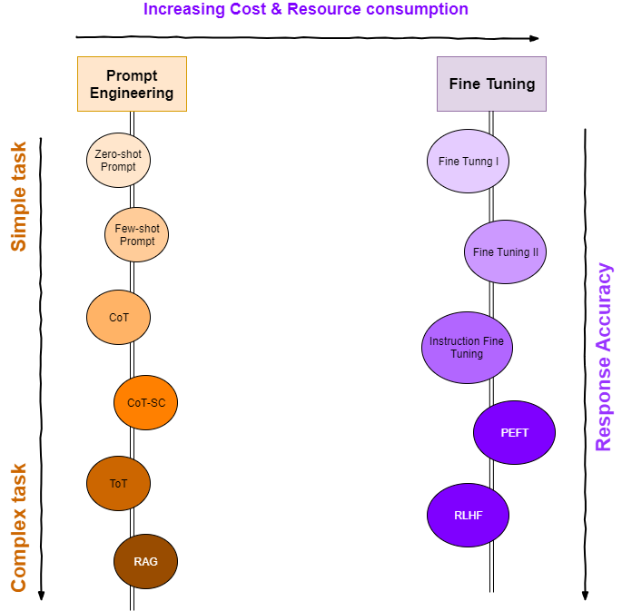
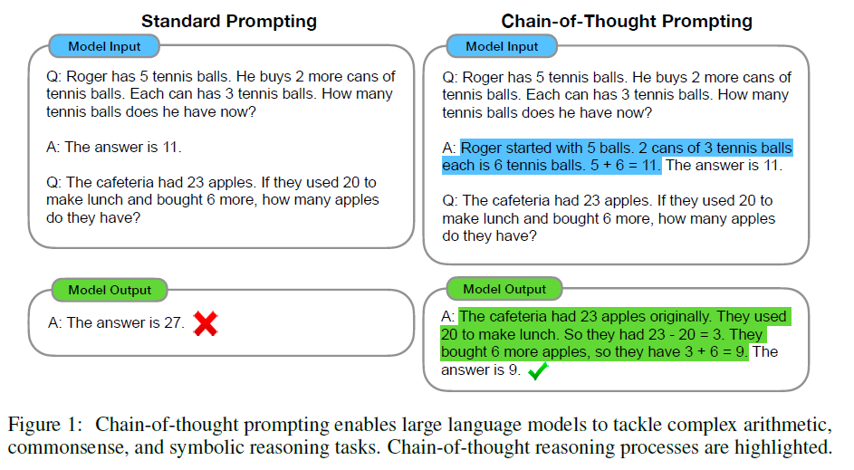
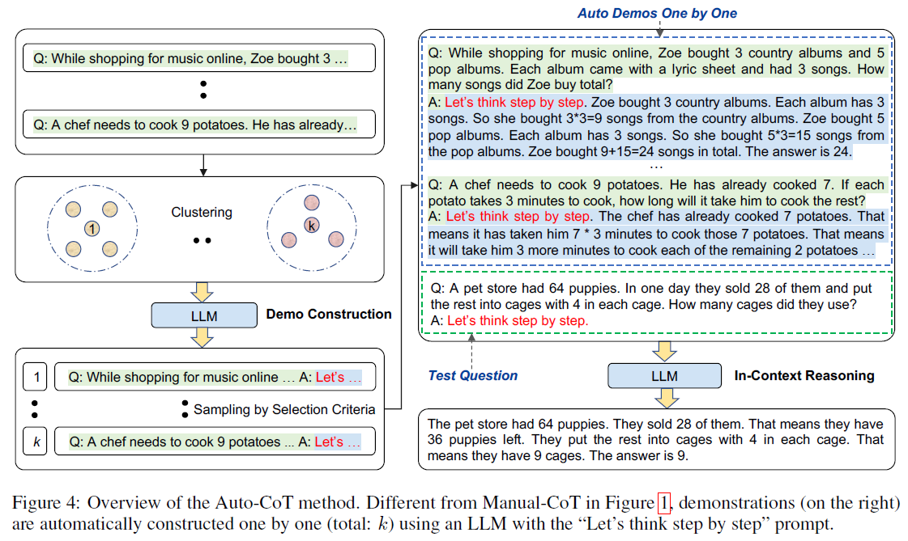
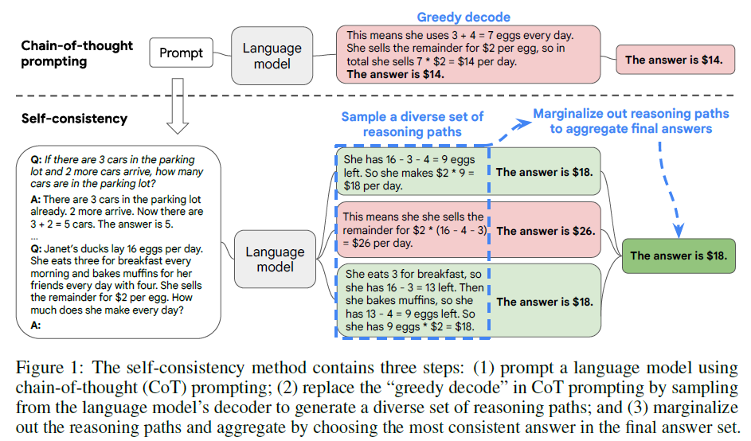
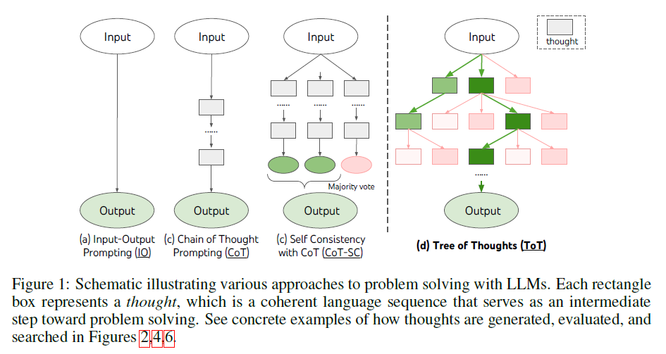
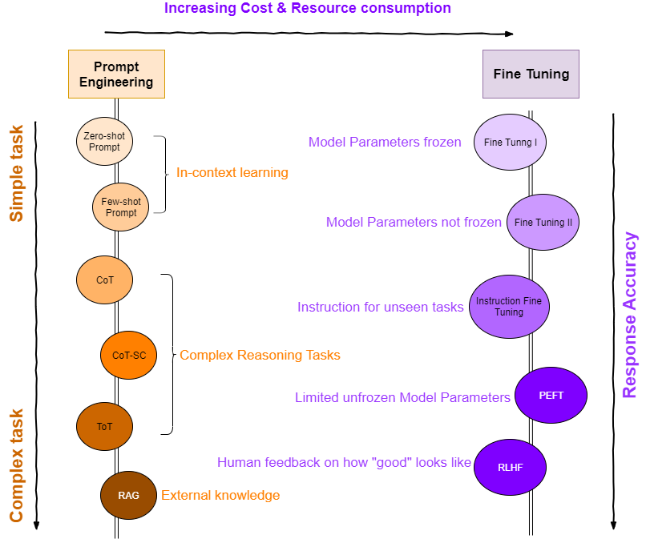

Interest in the use of Generative AI has skyrocketed in the past few months.  Many of AWS customers are wanting to learn how they can experiment with the models on the Amazon SageMaker service, particularly in the area of natural language processing.  But what is the secret sauce behind large language models and how do they work?

Let’s introduce you to the transformer architecture. The transformer architecture is a type of neural network architecture that was first proposed in a paper [Attention is All You Need](https://arxiv.org/abs/1706.03762).  It is used for a range of common use cases including:

* **Language Translation** - translating from one language to another.  A use case here would be helping a non-english speaker interact with a critical government service over the internet.
* **Text Generation** - generating stories, scripts and any text-based content that could be utilized in a social media campaign.
* **Sentiment Analysis** - determining the sentiment or emotion of a piece of text or speech, to help understand why a customer may not be using a business service or product.
* **Question Answering** - generating the most relevant answer, based on input, to help re-enforce the learnings within a large orgnisation as part of a cultural change and/or organisational change initiative.
* **Text Summarisation** - providing a concise summary of a long document, to help explain a government policy document on a public-facing website to it’s citizens.
* **Speech Recognitiion** - processing of acoustic features of the audio data to translate speech into text, to help hearing-impaired employees in government organisations.
* **Music Production** - creating new music, based on original input content, to produce new music that can be weaved into a new film, tv or YouTube video by a professional musician or social media content creator.

If you’re looking to solve a business problem using one or a combination of the above use cases, then it’s likely that the transformer model is a great place to start.  Let’s uncover the basics of how transformers work, which will lead to a better understanding of how we could use them in a practical context.

There are quite a few transformers to choose from.  We found a great GitHub article that represents transformers in a tree-like structure.  https://github.com/Mooler0410/LLMsPracticalGuide  

The tree is an extremely effective method of understanding the history of something.  You can think of family trees, or trees that show the development of a disease, such as COVID19, that show the variants and subvarients.

We’ve redrawn this diagram to represent 3 main branches:

The Bert, Flan T5, Alexa, Cohere, Bloom are all available via Amazon SageMaker here:
https://docs.aws.amazon.com/sagemaker/latest/dg/jumpstart-foundation-models-choose.html

The Claude and Jurassic 2 are available via Amazon Bedrock here:
https://aws.amazon.com/bedrock/

Transformer models are neural networks. A neural network is a mathematical model inspired by the structure and function of the human brain, consisting of layers of neurons.  Each neuron is able to receive input data, performs a mathematical compution on the data and passes and output.  Below is an example of a simple feed-forward neural network, which is 1 component of the GPT model:

The high-level architecture of a transformer is to use an encoder and decoder.  The encoder takes the input data and is able to extract meaning and context from the data and pass onto the decoder.  It does this by converting the input sequence into numbers called embeddings.  These embeddings are processed using a technique known as self-attention, sent through a feed forward neural network, through a normalisation layer and into the decoder.  The decoder consists of a similar architecture to the encoder and is used to produce the generative output.

The concept of self-attention is important. If we are inputing a sentence, self-attention captures the importance of each word and the relationships between the words.  Humans do this by understanding what verbs are, what nouns are, how adjectives related to nons and how words relate to every other word in the input sentence.  The model is following a similar process, but encoded in a mathematics.

Another way of explaining the transformer architecture is to use an analogy.  Let’s image you’re planning a surprise party for your wife’s 40th birthday party.  You need to co-orindate with multiple people to make it a success.  Each person has a field of expertise and each is able to contribute a variety of skills to accomplish some of the tasks.

The transformer architecture is like a communication system that allows everyone to collaborate effectively:

1. **Input Sequence:** This consists of conveying the party requirements such as theme, venue, activites, etc.
2. **Encoder:** Each person represents a single encoder, and specilises in an aspect of the party planning: decorations, food, music, games, etc.  All the people, and therefore the stack of encoders, represent a party committee.
3. **Self-Attention:** Each person pays attention to everyone else’s ideas.  They consider the relevance, importance of each party idea and how the ideas all relate to each other.  This happens as part of a brainstorming and collaboration session.
4. **Decoder:** The party committee then take all of the information and ideas, weigh the importance of each idea and determine how to assemble into a party plan.
5. **Output:** The output sequence generated by the transformer is the final party plan.

The reason it’s important to understand the architecture, is that it gives a developer a better appreciation of how to tune the model.  We typically do this using hyperparameters.  You can think of a hyperparameter as a tunable parameter that affects the output of our model.  If we think of a synthesizer keyboard containing an array of dials.  The input signal is the original sound and as we change the dials, so too the sound changes.  The dials are a great analogy of our hyperparamters that we can change during the training process.  This alters the output.  In the analogy this is the sound we are creating.

A few hyperparameters that relate to our architecture include:

* The number of decoder or encoder layers or in the analogy, the number of people with a skill that can assist with planning the party.
* The number of parallel self-attention mechanisms we could use which would better capture diverse patterns in the data, but would require more computational power.
* The size of the feed-forward neural network.

If you want to get started with transformer models, please have a look at this blog post  [Getting Started with Generative AI on AWS](https://aws.amazon.com/blogs/machine-learning/get-started-with-generative-ai-on-aws-using-amazon-sagemaker-jumpstart/)

## How to choose the right level of customization

Now you know how transformer architecture works and how it is related to LLMs on high-level.

You may want to work with the LLMs so to build up your specific Generative AI applications. But there are challenges:
1. LLM models are powerful but also general-purposed. They may not fit good enough to your specific use case.
2. You may or may not have direct access to the LLM model.
3. Your organization may have massive amount of domain/industrial data, and you are not sure how to better use this knowledge with GenAI capabilities.

...

The list can go on and on, but almost all these challenges are around two focusing areas: **Customization** and **Optimization**.

### Customization options

Customization is about how to interact with the pre-trained LLM models so to fit your specific need.

There is much ongoing research, and I'm here to share with you some popular techniques. Hopefully, this can provide some guidance and tips as you start your journey.

**Prompt Engineering** helps you improve the response accuracy without touching or updating the underneath LLM. Instead, the model is doing **in-context learning**. Meaning the learning and responses are based on what and how the prompts tell the model.

On the other hand, **Fine Tuning** is where the pre-trained LLM model is further tuned/updated with extra knowledge, extra parameters, so that a new fine-tuned model is generated.

### Prompt Engineering

A **prompt** is basically the information you send to the LLM model when interacting with it.

A prompt can contain information such as: instruction, input/question, context, examples of output.

I got inspiration from a friend that, doing prompt engineering is like moving from using **System 1** to **System 2** (as referred to the book "***Thinking, Fast and Slow***" by Daniel Kahneman, [Ref [1]](https://www.amazon.com/Thinking-Fast-Slow-Daniel-Kahneman/dp/0374533555)). With simple prompt engineering techniques (e.g. ***Zero-shot Prompt***), the response may not be so accurate and even contains **hallucination** (non-factual elements). However, when deploying more advanced prompt engineering techniques, the model is directed to take a methodical approach - akin to ***"Let's think step by step"*** - which often results in a more accurate response.  In addition, the advanced prompt engineering techniques also perform better on solving more complex problems, such as ***complex reasoning***, or ***knowledge-intensive tasks***. Be aware that advanced prompt engineering are also more complex to begin with, so start from the technique that fits your needs.

Let's look at some popular prompt engineering techniques in a high level.

#### 1. Zero-shot Prompting

**Zero-shot prompting** is that you don't provide any examples to the LLM model.
It's like you asking a question to a chatbot, and get an answer.
It's simple and easy to start, but it may not perform well with accurate/relevant/factual response.
If zero-shot prompting doesn't work well, consider using **few-shot prompting**.

#### 2. Few-shot Prompting

**Few-shot prompting** enables **in-context learning**, where you provide context and examples to the model. And the model will ***"learn"*** where to focus and which output format to tweak towards.

Here are some tips for few-shot prompting from the paper [In-Context Learning](https://arxiv.org/abs/2202.12837).

* Using **demonstrations** (examples) as **labels** (ground-truth).
* Specify the overall format is crucial, e.g. when label space is unknown, using random English words as labels, is significantly better than using no labels.

Few-shot prompting works well for many tasks but it still has limitations, such as handling **complex arithmetic reasoning tasks**.

For this kind of task, we need to ***"teach"*** the model with a ***"problem-solving mind"*** by breaking the problem into steps, and demonstrate to the model with examples on how to solve the problem in a ***step-by-step*** manner. Here is where **Chain-of-Thought Prompting (CoT)** can help.

#### 3. Chain-of-Thought Prompting (CoT)

**Chain-of-Thought Prompting** introduces a series of intermediate reasoning steps, which significantly improves the ability of language models to perform complex reasoning. Refer to [CoT](https://arxiv.org/pdf/2201.11903.pdf).

Figure below shows that CoT are combined with Zero-shot or Few-shot prompting.

  ***image source*** - [CoT](https://arxiv.org/pdf/2201.11903.pdf)

As you can see that applying chain-of-thought prompting requires manual effort, such as construct examples of what to do step-by-step. To be more efficient, an **Automatic CoT** approach is introduced by the researching team [Auto-CoT](https://arxiv.org/abs/2210.03493), using ***"Let's think step by step"*** prompt in each demonstration example as shown in figure below.

  ***image source*** - [Auto-CoT](https://arxiv.org/abs/2210.03493)

CoT is doing a great job, but to further improve response accuracy, **diversity of sampling** questions matters. This leads us to the **self consistency with CoT (CoT-SC)** approach. 

#### 4. Self Consistency with CoT (CoT-SC)

Like a human handling complex issues, there normally isn't an one-fit-all solution, we need to taking different context into consideration, and try different options.

This is also what **self consistency with CoT** approach tries to ***"teach"*** the model. It aims to "replace the naive greedy decoding used in chain-of-thought prompting". Refer to [CoT-SC](https://arxiv.org/pdf/2203.11171.pdf).

   ***image source*** - [CoT-SC](https://arxiv.org/pdf/2203.11171.pdf)

#### 5. Tree of Thoughts - (ToT)

When task's complexity increasing even higher, a new approach - **Tree of Thoughts (ToT)** - is proposed by researching team [ToT](https://arxiv.org/pdf/2305.10601.pdf).

This approach "generalizes over the popular "Chain of Thought" approach to prompting language models, and enables exploration over coherent units of text ("thoughts") that serve as intermediate steps toward problem solving".

  ***image source*** - [ToT](https://arxiv.org/pdf/2305.10601.pdf)

This approach allows the LLM exploring (searching) diverse options, and self-evaluate each reasoning step based on its current status while actively looking ahead or backtracks. The goal is to make a more global comprehensive decision.

#### 6. Retrieval Augmented Generation (RAG)

Some of the general-purpose LLMs are pre-trained to support common tasks such as user query searching, and sentiment analysis.

However, for some complex and knowledge-intensive tasks, the knowledge that already ***"learned"*** by the LLM (in parameters) may not be enough to handle those tasks properly. Hallucination problems may pop-up. In this case, external, domain specific, or more up-to-date information can help to further enrich the model's knowledge.

Retrieval Augmented Generation (RAG) is one of the options. It can bring value by combining your organization data with the LLM model capability.

Here are some reference use cases of RAG that we suggest you to have a look:

[Question answering using Retrieval Augmented Generation with foundation models in Amazon SageMaker JumpStart](https://aws.amazon.com/blogs/machine-learning/question-answering-using-retrieval-augmented-generation-with-foundation-models-in-amazon-sagemaker-jumpstart/)

[Quickly build high-accuracy Generative AI applications on enterprise data using Amazon Kendra, LangChain, and large language models](https://aws.amazon.com/blogs/machine-learning/quickly-build-high-accuracy-generative-ai-applications-on-enterprise-data-using-amazon-kendra-langchain-and-large-language-models/)

#### Summary - Prompt Engineering
The list of Prompt Engineering techniques are getting longer in a yearly or even monthly pace. How to know which approach fits you best is also an experimenting journey. Here are some tips.

1. Define your objective, ideathon and understand your specific use cases, define what good output would look like.
2. Then Working backwards from your specific use case.
3. If you considering using prompt engineering (over fine tuning approach, which will be covered in the next section), start from simple approach.

   If few-shot prompting will achieve your goal, don't bother goes to RAG.

4. Be specific on prompt - as clear as possible on
    -  input questions 
    -  context (additional information)
    -  examples (output format)
    -  instructions (e.g. step-by-step instruction)

If you want to update the pre-trained LLM to have your own customized model targeting for specific needs, **Fine Tuning** is where to go.

### Fine Tuning

We all know that training a LLM is costly and time-consuming. With the exponentially increasing on size of LLMs (in terms number of parameters), training a new LLM from scratch by each individual organization is challenging and maybe not necessary. Instead, fine-tuning on top of the LLM as the foundation model is way more promising and cost-efficient.

If you have direct access to LLMs, you have the option to deploy the LLM on your own environment or host them on 3rd party platform (e.g. Amazon SageMaker JumpStart, Amazon Bedrock (preview)) to further fine-tune with your own target data and generate your own model.

Similar with prompt engineering, there are many techniques for fine-tuning. And each individual fine tuning technique can easily fill-in multiple blog posts.
Therefore, here we just list some of the popular ones to give you an idea on where to get start.

**The goal of Fine Tuning is:**
- Improving performance of common tasks from pre-trained model.
- Improving performance of specific tasks from pre-trained model.

#### 1. Fine Tuning I, II
Fine Tuning I is to frozen the parameters of LLM, except the last two layers (output). Therefore, the parameters of the LLM model remain unchanged.
Fine Tuning II is updating parameters of all layers. Obviously, comparing with Fine Tuning I, Fine Tuning II can result in better performance, but it is also more expensive.

This is a good reference to understand [Fine Tuning I and II](https://github.com/rasbt/LLM-finetuning-scripts/blob/main/conventional/distilbert-movie-review/2_finetune-last-layers.ipynb).

An example solution: [Domain-adaptation Fine-tuning (II) with Amazon SageMaker JumpStart](https://aws.amazon.com/blogs/machine-learning/domain-adaptation-fine-tuning-of-foundation-models-in-amazon-sagemaker-jumpstart-on-financial-data/)

#### 2. Instruction Fine Tuning

**Instruction Fine Tuning** is to fine tuning the model with instructions (***a collection of tasks descriptions***).
This approach can improve zero-shot performance of LLM on unseen tasks.

An example solution: [Instruction fine-tuning for FLAN T5 XL with Amazon SageMaker JumpStart](https://aws.amazon.com/blogs/machine-learning/instruction-fine-tuning-for-flan-t5-xl-with-amazon-sagemaker-jumpstart/#:~:text=Instruction%20fine%2Dtuning%20uses%20a,the%20weights%20of%20the%20model)

#### 3. Parameter-Efficient Fine Tuning (PEFT)

As models get larger and larger, fine-tuning on all parameters becomes challenging on consumer hardware. 
Besides, storing and inferencing with large fine-tuned models (of similar size to the pre-trained LLMs) can also be expensive..
**Parameter-Efficient Finetuning (PEFT)** can help to address these challenges.

PEFT is running on pre-trained LLM with all/majority of their parameters frozen, while fine tuning a smaller number of extra/unfrozen (***e.g. 1%***) parameters.
In this way, it significantly reduces the resource consumption during training. And also results in a much **smaller fine-tuned model** of comparable performance with fully fine-tuned model. The training and inference with PEFT may allow the model to fit in a single GPU.

[LoRA](https://arxiv.org/pdf/2106.09685.pdf) (low-rank adaptation) is one of the PEFT techniques. 
This approach freezes the pre-trained model parameters, and limits trainable parameters of each individual layer of the model (***Transformer architecture***). In doing so, it greatly reduces the number of trainable parameters, hence, decreasing the training time.

So benefit of PEFT:
- Less resource comsumption: less compute resource for training, less storage for hosting model
- Faster training
- Better performance (not overfitting)

#### 4. Reinforcement Learning with Human Feedback (RLHF)

LLM model is powerful with lots of great capabilities. But like two sides of a coin, what is "good" text is subjective and hard to define.
There are existing evaluation tools such as [ROUGE](https://en.wikipedia.org/wiki/ROUGE_(metric)), that measures model performance, but that's still not good enough.
**Reinforcement Learning with Human Feedback (RLHF)** approach can help here.

  ***image source*** - [RLHF](https://arxiv.org/pdf/2203.02155.pdf)

As shown in the figure above, RLHF contains three parts:
   1. Supervised fine tuning (SFT).
   2. Reward Model training, based on human feedback. Basically define what "good" looks like.
   3. Reinforcement Learning on this Reward Model. This part is to further fine-tuning the model.

Human feedback would be subjective, but what RLHF doing well is to aggregate human preferences at scale.

One example use case of RLHF with LLM is de-toxicity of outputs. 

### Summary - it is all about Customization and Optimization

