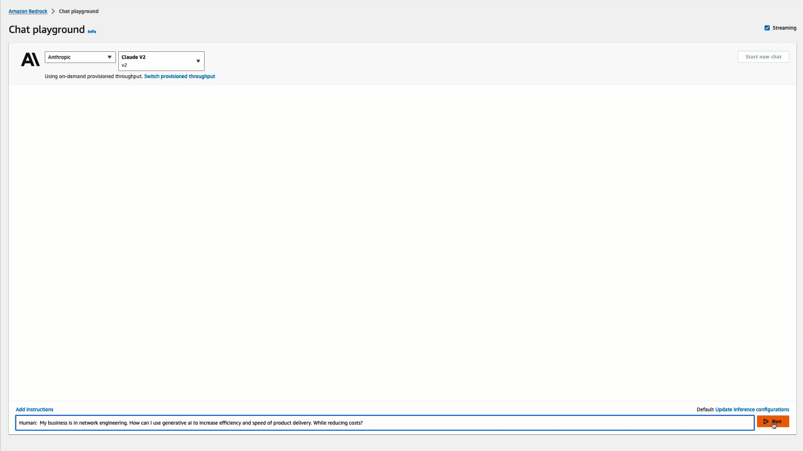
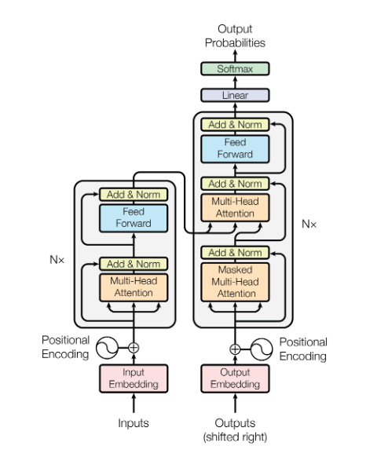
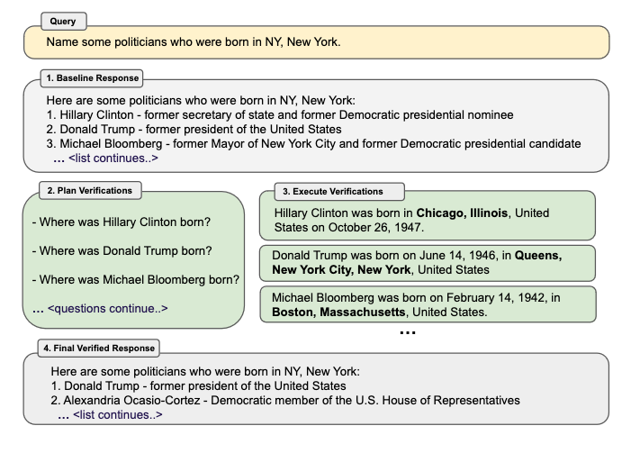

|ToC|
|---|

2023 has been the year of AI, more specifically generative AI. The releases of platforms like [ChatGPT](https://chat.openai.com/), [Google's Bard](https://bard.google.com/), and [Amazon Bedrock](https://aws.amazon.com/bedrock/?sc_channel=el&sc_campaign=genaiwave&sc_content=a-network-engineers-guide-to-generative-ai&sc_geo=mult&sc_country=mult&sc_outcome=acq) have caused every industry to rethink how they operate. Businesses are scaling down teams while increasing efficiency and speed of product delivery, specifically in areas that are text-driven like data processing, content creation, and software development. Organizations are now able to ask a chatbot how can we do more with less? And immediately they get an answer.



This is just one example of how generative AI can be leveraged. As you can see, we asked the chatbot a question without providing any context other than stating our business is in network engineering. The AI was able to return a list of use cases along with their descriptions. From there, we could have asked the AI assistant for more information, had it provide additional examples, or even requested a blueprint of how to achieve these use cases. But how does this all work?

## What is Generative AI?

Generative AI is a subset of artificial intelligence that uses large language machine learning models (LLMs) to generate new content and ideas. This includes conversations, stories, images, videos, and audio. Generative AI is capable of this creative output because of the massive datasets used to train the models. Essentially, LLMs contain nearly everything on the internet. Some of the most popular large language models are GPT, BARD, PaLM, Claude, and Amazon's upcoming Titan. Each has unique capabilities and varying parameters - the troves of data used for training. Here's a list of some of the most well-known LLMs:

| Creator | Model | Parameters | Description | Access |
|:---------|:--------| :---------- | :----------|:---------|
| Amazon | Amazon Titan | Does not publish the parameter size | Generate natural language text for a broad range of tasks such as summarization, content creation, and question answering. ([docs](https://aws.amazon.com/bedrock/titan?sc_channel=el&sc_campaign=genaiwave&sc_content=a-network-engineers-guide-to-generative-ai&sc_geo=mult&sc_country=mult&sc_outcome=acq)) | Limited |
| Anthropic | Anthropic Claude v1.(x) | Does not state the parameter size | A model trained using reinforcement learning from human feedback ([docs](https://www.anthropic.com/index/introducing-claude)). | limited |
| Google | PaLM 2 | 540(B) | Trained to handle tasks like coding, math, classifying, answering questions, translating languages, and creating sentences. ([docs](https://ai.google/discover/palm2/))| Closed(Preview) |
| Meta | Llama 2 | (70B) | Open source and fine-tuned for chat use cases ([docs](https://ai.meta.com/llama/)) | Open|
| OpenAI | GPT (3,4) | Does not state the parameter size | Large multimodal model capable of processing image and text inputs and producing text outputs. ([docs](https://arxiv.org/pdf/2303.08774.pdf)) | limited |

For a more detailed list and a great resource for understanding all of the available LLMs, I recommend bookmarking this link to [HELM (Holistic Evaluation of Language Models)](https://crfm.stanford.edu/helm/latest/?).

### Attention is all you need

Continuing the discussion on large language models, we need to understand how they differ from traditional machine learning models. Here are a few key differences:

1. They are trained on massive datasets.
2. The data is encoded into numerical representations called embeddings.
3. They utilize transformer models which focus on key parts (attention) of the data during encoding and generate new output through decoding.

For example, translating a sentence from English to Spanish. Or using a generative AI coding assistant to automatically generate a Python function adds routes to a routing table based on a single comment describing what the function should do. Traditional machine learning lacked this generative capacity. This is a high-level explanation - for more technical details, I recommend reading Google's 2017 paper [Attention is All You Need](https://arxiv.org/abs/1706.03762)



I think of foundational large language models (LLMs) as starter building blocks. For the user, you can build or generate anything constructible from the data (blocks) and prompts (instructions) contained in the model. LLMs can meet many general purpose needs out of the box. But what if they fall short? For instance, asking about a specific network architecture or an unseen router error. The LLM will respond based on its existing data, which won't actually answer those novel questions. Some call this hallucination or think that LLMs just aren't reliable. Often the reason for the incorrect response is due to the model not having enough information, context, or examples. This is where fine-tuning, in-context learning, and adjusting the model's parameters help to generate more accurate and deterministic responses.

## Leveraging Generative AI: Techniques and Methods

When you use a generative AI chatbot like ChatGPT, realize that this is an application layer that communicates with an LLM on your behalf. Underneath the hood is the LLM. And that LLM often has an API layer that network developers can communicate with via code through HTTP requests. Because of this, you have parameters that you are able to modify to control things like the consistency or predictability of the responses you receive from the model. This is important to understand and something we will cover in a moment. But first, let's define and discuss the differences between fine-tuning and in-context learning.

Fine-tuning is straightforward. You start with a foundational LLM like Anthropic's Claude model. Then you feed it internal documentation or other data not known to the model. The LLM trains on this new data, becoming fine-tuned to your needs. Once trained, it will generate higher quality responses for your domain-specific requests.

In-context learning utilizes prompt engineering to enable quick adaptation and learning of new concepts with minimal examples. As you query the LLM, you provide context, examples, and descriptions within the prompt. The model then encodes this prompt and generates a response based on the foundational data plus your provided prompt. With this method, prompts should be clear, concise, and contain specific instructions to guide the model. Depending on the use case you may need to provide additional detailed context and examples in prompts.

Think of it like this:

- Training a large language model from scratch is time-consuming and costly, often taking days, weeks or even months.
- Fine-tuning starts with a pre-trained foundational LLM and can be accomplished in just a few hours, depending on the amount of data.
- Prompting provides instructions to guide an LLM to generate desired responses. It's a technique that takes just seconds or minutes.

### Prompting techniques

As mentioned above, prompt engineering utilizes various techniques for querying generative AI models. Inconsistency or incorrect responses often stem from how questions are phrased and prompts constructed. The key is crafting clear, concise, specific prompts to obtain desired results. Below are some prompt engineering techniques with network engineering examples:

**Zero shot**

This technique provides only instructions without examples. The LLM must predict the answer solely based on the task description.

```markdown
Calculate the subnet mask for 10.0.0.1
```

**Once-shot**

With one-shot prompting, you give a single specific example or context in the prompt. You frame the request as if providing one instance of the desired output for the model.

```markdown
Given the IP address 192.168.1.10 and subnet mask 255.255.255.0, calculate the network address.
```

**Few-shot**

Few-shot prompting supplies a few examples, context, and instructions. The examples and context essentially train the model to make accurate predictions based on its foundation and the new data. As with all prompting techniques, be clear, concise and specific. More information can help the model generate the correct response.

```markdown
You have two VPCs, VPC A and VPC B, in the same AWS region. Your task is to configure VPC peering between them to allow resources in VPC A to communicate with resources in VPC B. 

VPC A's CIDR block is 10.0.0.0/16 and VPC B's CIDR block is 10.1.0.0/16.

Here is your task:

1. Create a VPC peering connection between VPC A and VPC B using the boto3 library in Python. Name the connection "VPC-peering".

2. Update VPC A's route table to add a route that points traffic destined for VPC B's CIDR block to the VPC peering connection. 

3. Update VPC B's route table similarly to route traffic destined for VPC A's CIDR block to the VPC peering connection.

4. Configure both VPCs to allow DNS resolution between instances in the peered VPCs.
```

Prompting takes practice and sometimes requires you to iterate over a prompt until you are achieving your desired responses. Feel free to use these prompts as a guide as you learn the different prompting techniques.

### Adjusting LLM Settings

Previously I mentioned how you have the ability to leverage the API of an LLM. This provides the network developer additional control over how the model responds and how your applications provide a response. For example, when using a model like ChatGPT, you will notice the responses are unpredictable and it has a sort of personality in how it responds to your requests. One reason for this is because of the `temperature` LLM API parameter. By adjusting this setting normally from 0 to 1, you can control the unpredictability of the responses. With 0 being the most predictable and 1 being the least predictable. The default temperature for the [OpenAI GPT model](https://platform.openai.com/docs/api-reference/chat/create) is 1. This is the same for the [Anthropic's Claude model](https://docs.anthropic.com/claude/reference/complete_post).

>NOTE: Recently I noticed that the GPT model now allows for the temperature to be adjusted up to 2 rather than 1. Always check the documentation first.

Let's use python to create a request and send it to Amazon Bedrock's Anthropic `anthropic.claude-v2`model using the default temperature of 1:

```python
import boto3
import json

def send_prompt_to_claude(prompt: str, temperature: float=1) -> str:
    """
    Makes API request to generate response for prompt
    Returns:
        str: String response from Claude
    """
    bedrock = boto3.client(service_name="bedrock-runtime", region_name="us-east-1")
    payload = {
                "body": json.dumps(
                    {
                        "prompt": f"\n\nHuman: {prompt}\nAssistant:",
                        "max_tokens_to_sample": 256,
                        "temperature": 1
                    }
                    ),
                "modelId":  "anthropic.claude-v2",
                "accept": '*/*',
                "contentType": 'application/json'
                }
                
    response = bedrock.invoke_model(**payload)
    response_body = json.loads(response.get('body').read())
    return response_body['completion']

# Prompt to send model
prompt = "Provide only the next word in this sentence: A subnet contains "

# Calling model with arguments prompt and temperature
response = send_prompt_to_claude(prompt, temperature=1)

# Printing response
print(response)
```

Here's the response:

```markdown
multiple
```

Here's the response using a temperature of 0:

```markdown
hosts
```

As network engineers, we know that the next word in the sentence "*A subnet contains...*" should be "*hosts*". In the example with the default temperature of 1, we can clearly see an example of receiving an unpredictable random response from an LLM. So as you leverage the API, I would always start with the documentation. Here are some other common parameters found in LLM APIs: 

- `model`: This identifies the model that will complete your prompt.
- `prompt` or `messages`: This is the prompt you want the model to complete.
- `temperature`: Controls the randomness of the model's response.
- `max_tokens_to_sample`: The number of tokens (number of characters) that a model will generate per request. (*NOTE: we will discuss tokens in a moment.*)
- `top_p`: Similar to temperature. Its recommended to modify the temperature and not top_p

This is just a short list to provide you clarity into using LLM APIs. Depending on the model, there may be others, and they could also be named differently.

### Tokens

One difference between chatbots and API access is the length of conversations. With chatbots, dialogs can continue indefinitely. APIs have token limits that constrain inputs and outputs. Tokens represent the data sent in prompts and received in responses. Each large language model (LLM) has a maximum token limit that cannot be exceeded. Code must handle tokens to account for these limits, either manually or using tools like [LangChain](https://js.langchain.com/docs/modules/data_connection/document_transformers/) that chunk data.

For example, let's say you are using an the Anthropic large language model (LLM) `anthropic.claude-v2` that has a token limit of 100k tokens (~70k words). Using the `send_prompt_to_claude()` function that we created above. Your task is to update a Transit Gateway routing table with 200 new IP routes. Notice that the prompt is written clearly, concisely, and provides detailed instructions to send to the model.

```python
# Prompt to send to claude
prompt = """
You are tasked with updating a Transit Gateway routing table by adding 200 unique IP routes with distinct CIDR notations. These routes should cover a range of subnet masks to support a complex network setup efficiently and securely.

Here is the list of 200 IP routes (CIDR notations) that need to be integrated into the Transit Gateway routing table:

1. 10.0.0.0/24
2. 192.168.1.0/25
3. 172.16.0.0/23
4. 10.1.0.0/22
5. 192.168.2.0/26
6. 172.17.0.0/24
7. 10.2.0.0/21
8. 192.168.3.0/28
9. 172.18.0.0/22
10. 10.3.0.0/20
... (and 190 more routes)

Ensure the provided routes are valid and compatible with the existing network architecture. Add these routes to the Transit Gateway routing table while following best practices and security guidelines. Document the newly added routes, including their CIDR notations and associated attributes.

To accomplish this task, use Python and the AWS boto3 library for interaction with the Transit Gateway routing table. Create unit tests to validate your code and its functionality.

Provide comprehensive step-by-step instructions on executing your Python code effectively to add these routes to the routing table. Additionally, include a README file that outlines the project structure and how to utilize your code.

Note: The list comprises 200 IP routes with varying subnet masks (ranging from /20 to /32). Avoid any overlapping CIDR notations, and prioritize network efficiency and security in your implementation. Summarize the outcomes of your work and briefly explain your approach. If you have any recommendations for improvements, include them in your explanation.
"""

# Call the function with the prompt argument
response = send_prompt_to_claude(prompt)

# Print the response
print(response)
```

### Token Limitations

The Anthropic Claude model has one of the more generous token limits and can meet the needs for many text based tasks that do not involve extensive amounts of data. However, for generative AI applications involving extensive data - like log analysis, blog summarization, etc. - you'll need strategies to work within different models' token constraints. So how can you solve this?

1. **Chunking your data:** This splits the prompt into chunks until you get the total response. Tools like [Langchain](https://python.langchain.com/docs/get_started/introduction) help with this.
2. **Vector databases:**  Rather than sending full text, you create embeddings as inputs to generate responses.

By understanding and leveraging these methods, you can navigate token constraints and develop some really diverse applications.

### What are Embeddings?

Embeddings are mathematical representation of complex data types (e.g., words, sentences, and objects) in a lower-dimensional vector space. Embeddings are regarded as the 'numeric mask' of the data that is more palatable for machine learning algorithms. This allows the LLM to assign weight values to the words in the database. Based on a request, the model can identify which words to focus on through attention mechanisms. (Remember the Attention reference above) and reference the database to provide you a response. This [blog post](https://aws.amazon.com/blogs/aws/amazon-bedrock-is-now-generally-available-build-and-scale-generative-ai-applications-with-foundation-models/?sc_channel=el&sc_campaign=genaiwave&sc_content=a-network-engineers-guide-to-generative-ai&sc_geo=mult&sc_country=mult&sc_outcome=acq) has great examples of embeddings examples using Amazon Titan.

## The Impact of Generative AI on Network Engineering

Now, let's turn to a key question likely on your mind - how does generative AI affect network engineers? To answer this question, let's reflect on the network automation trends of recent years. There are a few key realizations drove that movement:

- Network infrastructure had to evolve to meet growing business demands.
- Manual processes involving humans were inefficient and prone to errors.
- There was a need to boost accuracy, efficiency, and speed of network operations.
- Scaling network deployments and management required repeatable, reliable processes.

The networking industry has gradually shifted toward automation, a transition accelerated by the pandemic. For large enterprises, automation is the only scalable way to deliver networking services. However, challenges remain that generative AI could help address, bringing the automation vision full circle. Let me elaborate further.

In the past, humans have been relied upon for many networking tasks:

- Communicating with customers
- Creating documentation
- Troubleshooting links
- Determining VLAN needs
- Bouncing/unlocking ports
- Updating prefix lists and route maps
- Adding, removing ACLs and NATs
- Filtering through hundreds of syslog lines
- Managing tickets
- Sending email updates

The above list illustrates the myriad of manual tasks that historically comprised a network engineer's daily work. Some engineers have managed to automate portions of this workload. Many more would do so given sufficient time. In my previous network engineering role, I automated several tasks by working an extra 10-12 hours per week on my own time. However, not every engineer can or should have to do this. Additionally, some organizations do not fully trust automation and prohibit its use, a topic we will revisit later when discussing risks.

My point is that generative AI can be combined with automation to complete these networking tasks and more. Imagine training a foundational large language model (LLM) on all your organization's private documentation - no data leaks onto the internet. This centralized model could know your network and business logic better than any engineer. Now wait - this doesn't mean eliminating jobs. Rather, it provides a resource for engineers to ask questions, create runbooks, generate reports, analyze tcpdumps and syslog files. All while enabling predictive analytics on flapping WAN links and devices.

This may sound like a pipe dream. However, I believe this is the direction we are headed.

## Are there potential risks?

With generative AI and more specifically foundation models, there is a need for [responsible AI](https://www.amazon.science/blog/responsible-ai-in-the-generative-era?sc_channel=el&sc_campaign=genaiwave&sc_content=a-network-engineers-guide-to-generative-ai&sc_geo=mult&sc_country=mult&sc_outcome=acq). These models are trained on vast amounts of data, which raises issues and concerns around biases in responses, accuracy, fairness, intellectual property considerations, misuse of tools, security, and privacy. Often it is challenging to mitigate all these concerns at once, since not all the ways the models can be used and respond have been discovered yet. Thankfully, there are policies and new research being conducted to address these issues. However, as a network engineer leveraging these models, you must consider these concerns. Understand your organization's policies and the policies and limitations of the models. Never enter any data into the model that you do not want made public. And as always, test, test, and test to ensure the system is working as intended.

Another point I have to mention is the topic of hallucinations. This is where the model makes up inaccurate responses that are not consistent with the training data. Yes, sometimes models invent facts when they respond. The reason for this has not yet been determined. Sometimes this can be mitigated by following the prompting techniques that I mentioned about. There is a more technical approach by using a concept called [chain of verification](https://arxiv.org/pdf/2309.11495.pdf). This is where you basically create a system of checks and balances by generating a list of verification questions that are triggered when a model replies to a response. This allows for higher accuracy.



## What is the future of network engineers?

I'll answer this directly yet compassionately without producing any FOMO. The truth is network engineering now demands more than just networking expertise. To stand out, stay relevant, or even enter the field in 2023, one needs skills beyond pure networking - especially without years of experience. The key is to understand your business needs and own career goals. Then develop abilities not just in networking but also automation, cloud, and potentially generative AI.

For those who love networking, real opportunities exist to leverage emerging tools while advancing business goals. As networks become abstracted and borderless, managing them requires engineers able to apply tools strategically. You'll need to grasp the pros, cons, risks, costs, and trade-offs of new technologies, whether on-premises, cloud-based, automation-focused, or AI-driven. Ultimately, successful network engineers can think critically - asking the right questions and recognizing correct answers amid the noise.

https://www.youtube.com/watch?v=IMCtOUaFq10

## How can you prepare?

First and foremost continue to develop your knowledge and skills in network engineering. The future will need networking experts more than ever. And as you have the time, my recommendation is to get started with writing prompts in a chatbot like Amazon Bedrock's Chat Playground or ChatGPT. Once you get comfortable writing prompts in the GUI, download a generative AI coding assistant like [Amazon Code Whisperer](https://aws.amazon.com/codewhisperer/?sc_channel=el&sc_campaign=genaiwave&sc_content=a-network-engineers-guide-to-generative-ai&sc_geo=mult&sc_country=mult&sc_outcome=acq) to assist you in writing code faster.  Then advance your skills to writing custom API calls using [Amazon Bedrock](https://aws.amazon.com/bedrock/?sc_channel=el&sc_campaign=genaiwave&sc_content=a-network-engineers-guide-to-generative-ai&sc_geo=mult&sc_country=mult&sc_outcome=acq) to create your own custom tools. To aid your learning journey, here is a list of free courses and workshops:

### Courses

| Course | Description |
| :--- | :----- |
| [Generative AI with Large Language Models](https://www.coursera.org/learn/generative-ai-with-llms) | Gain insight into a topic and learn the fundamentals. |
| [DeepLearning.AI](https://www.deeplearning.ai/) | An extensive list of machine learning courses. These courses are on-demand instructor lead and contain labs that they guide you through. |
| [Generative AI Foundations on AWS Technical Deep Dive Series](https://www.youtube.com/playlist?list=PLhr1KZpdzukf-xb0lmiU3G89GJXaDbAIF) | An entire YouTube playlist that Generative AI Foundations on AWS is a technical deep dive course that gives you the conceptual fundamentals, practical advice, and hands-on guidance to pre-train, fine-tune, and deploy state-of-the-art foundation models on AWS and beyond.

### Workshops

| Workshop | Description |
| :--- | :----- |
| [Amazon Bedrock Workshop](https://catalog.us-east-1.prod.workshops.aws/workshops/a4bdb007-5600-4368-81c5-ff5b4154f518/en-US) |The goal of this workshop is to give you hands-on experience leveraging foundation models (FMs) through Amazon Bedrock.
| [Implementing Generative AI on AWS](https://catalog.us-east-1.prod.workshops.aws/workshops/80ae1ed2-f415-4d3d-9eb0-e9118c147bd4/en-US) | This workshop provides guidance on how to get started with Generative AI on AWS.
| [Amazon CodeWhisperer Workshop](https://catalog.us-east-1.prod.workshops.aws/workshops/6838a1a5-4516-4153-90ce-ac49ca8e1357/en-US)| In this workshop, you will use Amazon CodeWhisperer to learn the basics of prompt engineering.
| [Building Generative AI Applications with Amazon Bedrock](https://github.com/aws-banjo/intro_bedrock_workshop) | Teaches you how to build conversational applications such as a chatbot.

## Closing

We have covered a lot of ground in this post and we only scratched the surface. Your brain may feel overloaded at this point, and that's understandable. Remember, like with everything else. Generative AI is a journey. My goal was to provide a solid starting point that you can return to as needed. There is still much more to explore. As I continue learning, I look forward to sharing new insights with you. If you have questions or want to connect, feel free to reach out via  [LinkedIn](https://www.linkedin.com/in/duanlightfoot/) or [Twitter](https://twitter.com/labeveryday). I welcome your feedback and would love to hear what you've learned on this topic as well. I challenge you go through the courses and workshops that I listed and once you are comfortable go and build something awesome!
