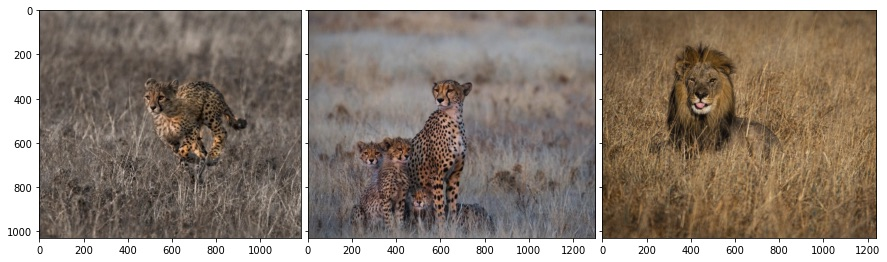
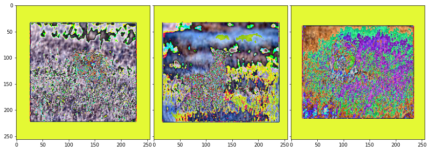
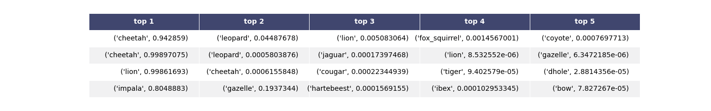
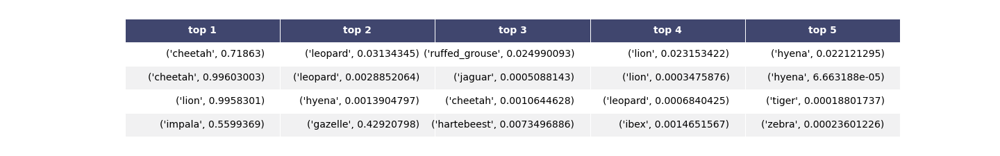
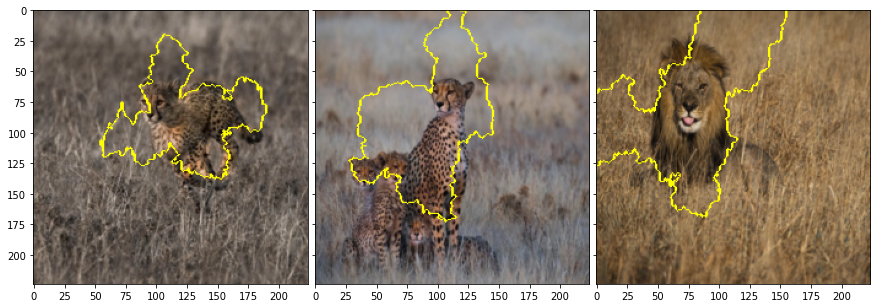
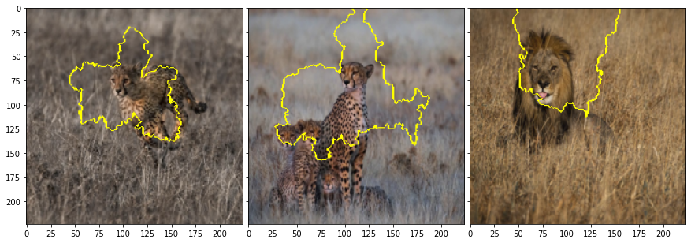

|ToC|
|---|

|SeriesToC|
|---------|


## Context

In [part 2](/posts/ai-explainability/02-lime) we went through the theoretical explanation of the LIME paper. In this part we implement an object detection example. You can find the full code [here](/posts/ai-explainability/03-lime-tutorial) or try the notebook directly in [github](https://github.com/cyrusmvahid/AIX-BuildOn/blob/main/04-lime-example.ipynb).

 Example: Object detection explanation
In this example we try using LIME's image explainer on 3 pictures, one of lions and two of cheetahs using two different deep learning models, inceptionV3 and resnet152. We then look at the regions that are picked for detecting the what animal appears in the picture and see if the explanation makes sense to humans. We start with the following high resolution images. We then transforms the images and run them through our models to attain a probabilistic prediction.

## Original Images



Next we:

1. transform the images,
2. make predictions using two different algorithms,
3. produce explanations, and
4. analyze the explanations.

## Images after transformation

```python
# We center crop the image with a large enough space for the main subject to be included in the picture.
# I tried 1500 pixels and it worked for all three pictures. Then using transform, we resuze the picture to 
# the size that is compatible with ImageNet based algorithms. 
def get_input_transform():
    normalize = transforms.Normalize(mean=[0.485, 0.456, 0.406],
                                    std=[0.229, 0.224, 0.225])       
    transf = transforms.Compose([
        transforms.CenterCrop(1500),
        transforms.Resize((256, 256)),        
        transforms.ToTensor(),
        normalize
    ])    

    return transf

def get_input_tensors(img):
    transf = get_input_transform()
    return transf(img).unsqueeze(0)
```

## Applying the transformation

```python
transformed_images = []
nimgT = transforms.ToPILImage()
for image in img:
    get_input_tensors(image)[1:].shape
    transformed_images.append(nimgT(get_input_tensors(image).squeeze()))
```

## transformed images



"Figure 2: As it can be observed, the processed images are already not useful to the humans. Next we 1) make predictions using two different algorithms, 2) produce explanations, and 3) analyze the explanations."


## Choosing models we want to explain

```python
model1 = models.inception_v3(pretrained=True)
model2 = models.resnet152(pretrained=True)
```

## Model Predictions

After loading the models we run a prediction on both models. The results are summarized in table 1:





The table on the top includes the top5 predictions from inception v3. The other table includes the results from resnet-152. We can see that inception is quite certain about its top choice. Still we do not know why and how the model has made such decision or how did animals like gazelle made it to the top5, however low the priority maybe. the same story applies to resnet, except that for the first image the prediction gives a 70% probability for cheetah.

## Preparing explanations

We now Prepare to create an explainer. Let us remember what the process for creating location Lime a perturbation algorithm on the original images. It then uses the perturbed data to train an explainer model. This means we need to provide the original image and the original classification function to `LimeImageExplainer` so that LIME can produce probabilities for the perturbed dataset. In the next step we prepare or provide the following to LIME to train a generic explainer using: `lime.lime_image.LimeImageExplainer()`.

1. Classifier $f$ that we aim to explained. In our case inception-v3 and resnet-152.
2. pre-processed original images $x$.

### Data Transformers

```python 
def get_pil_transform(): 
    transf = transforms.Compose([
        transforms.Resize((256, 256)),
        transforms.CenterCrop(224)
    ])    

    return transf

def get_preprocess_transform():
    normalize = transforms.Normalize(mean=[0.485, 0.456, 0.406],
                                    std=[0.229, 0.224, 0.225])     
    transf = transforms.Compose([
        transforms.ToTensor(),
        normalize
    ])    

    return transf    

pill_transf = get_pil_transform()
preprocess_transform = get_preprocess_transform()
```

* `pill_transf` is a transformer based on `get_pil_transform` that takes an image and performs standard resizing and center cropping for imagenet-based models. Obviously you can change the transformer based on whatever model use are using as high-resolution models have gained popularity in recent years.
* `pill_transf` is used by the original model $f$ to make predictions on the original image.*
`preprocess_transform` is another transformer that basically normalizes the image based on a pre-defined mean and variance per dimension.
* `preprocess_transform` is used to generate an instance explainer where the perturbation process is applied and the explainer model is trained.*

Given an image `pill_transf` returns tensors of the shape (3, 224, 224), which is in channel first layout or BCHW (Batch, Channel, Height, Width and as we are processing only a single image $x$, B=0 and is omitted). If you are using frameworks that require channel last or BHWC, then you need to transpose the tensor.

### Predictor

As we have seen we are using inception-v3 and resnet-152, respectively denoted by model1 and model2 in this example.

The following function `batch_predictor`, simply uses the model to make a prediction. The predictor function is later passed to `lime.lime_image.LimeImageExplainer()` in order to make predictions on the perturbed data.

```python
def batch_predict1(images):
    model1.eval()
    batch = torch.stack(tuple(preprocess_transform(i) for i in images), dim=0)

    device = torch.device("cuda" if torch.cuda.is_available() else "cpu")
    model1.to(device)
    batch = batch.to(device)
    
    logits = model1(batch)
    probs = F.softmax(logits, dim=1)
    return probs.detach().cpu().numpy()
```

This function simply take a list of images and perform prediction using the original model. This specific function uses our `model`, which we defined earlier as `model1 = models.inception_v3(pretrained=True)`
.

### Generating the local explainer

`explainer` is defined as a `LimeImageExplainer`. As seen in the LIME paper, for categorical features, `LimeImageExplainer` perturbs the data by sampling according to the training distribution, and making a binary
feature that is 1 when the value is the same as the instance being explained. Kernel width can be passed to this function as a parameter.  

As we are performing a local explanation, we call `explain_instance` method of our `explainer` and pass the original image `pill_transf` version of the original image along with other parameters, amongst them most notably is `num_samples`, which as the name indicates, defines how many times the model would be run and how many perturbations there are. 

`explain_instance` returns a `lime.lime_image.ImageExplanation` object that contains data about explanations. Most notably it includes segmentation information `ImageExplanation.segment` and make information `ImageExplanation.get_image_and_mask()`

```python
from lime import lime_image
explainer = lime_image.LimeImageExplainer()
explanations1 = []
explanations2 = []
for image in img:
    explanations1.append(explainer.explain_instance(np.array(pill_transf(image)), 
                                         batch_predict1, 
                                         top_labels=5, 
                                         hide_color=0, 
                                         num_samples=1000) )
    explanations2.append(explainer.explain_instance(np.array(pill_transf(image)), 
                                         batch_predict2, # classification function
                                         top_labels=5, 
                                         hide_color=0, 
                                         num_samples=1000) )
```

At the next step we use `ImageExplanation.segment` to visualize segmentation information as a way of explaining which regions of image were used by the predictor model to determine the classification probabilities.

### Visualization

Finally we use skimage to visualize the segmentation we have acquired through `ImageExplanation.get_image_and_mask().`

```python
from skimage.segmentation import mark_boundaries
ib = []
for explanation in explanations1:
    temp, mask = explanation.get_image_and_mask(explanation.top_labels[0], positive_only=True, num_features=5, hide_rest=False)
    ib.append(mark_boundaries(temp/255.0, mask))
fig = plt.figure(figsize=(15., 15.))
grid = ImageGrid(fig, 111,  # similar to subplot(111)
                 nrows_ncols=(1, 3),  # creates 2x2 grid of axes
                 axes_pad=0.1,  # pad between axes in inch.
                 )

for ax, im in zip(grid, ib):
    ax.imshow(im)
```

This is only the code sample for model1-e.g. inception-v3. You will find in the accompanying code notebook that we have performed the computation for both models. Next we can see the result of visualization for all three images and both models. It is notable that the segmentation includes the environment and not just the object itself. This can explain why completely different looking savanna animals were included in the top5 selection. This, however is a hypothesis as trying the model with other animals such as gazelle could clarify the role of background, environment, and climate.





## What is next?

in [part 4](/posts/ai-explainability/04-shapley-values), we explore they Shapley values in the context of game theory. If you are familiar with the concepts, you can skip to [part 5](/posts/ai-explainability/05-shap) and look at application of Shapley values in implementing Kernel SHAP method.

## References

Below are a set of references I have looked up and used for this post. There are very good references to learn more about AI Exlainability. If you are interested to learn more, I strongly suggest taking a look at these resources.

1. [LIME's original paper](https://arxiv.org/pdf/1602.04938v1.pdf)
2. [Survey paper for explainability methods](https://arxiv.org/pdf/2011.07876.pdf)
3. [Oreily blog for intuitive understanding of LIME](https://www.oreilly.com/content/introduction-to-local-interpretable-model-agnostic-explanations-lime/)
4. [LIME Open Source Library [docs]](https://github.com/marcotcr/lime/tree/master/doc/notebooks)
5. [Kernel SHAP paper](https://arxiv.org/pdf/1705.07874.pdf)
6. [Cooporative games in Game theory](https://vknight.org/Year_3_game_theory_course/Content/Chapter_16_Cooperative_games/)
7. [Original Shapley paper](https://www.rand.org/content/dam/rand/pubs/papers/2021/P295.pdf)
8. [Cooporative Game Theory](https://www.wifa.uni-leipzig.de/fileadmin/Fakultät_Wifa/Institut_für_Theoretische_Volkswirtschaftslehre/Professur_Mikroökonomik/Cooperative_game_theory/B1_gl.pdf)
9. [UBC course on Shapley Values](https://www.youtube.com/watch?v=9OFMRiAVH-w)
10. [A Unified Approach to Interpreting Model Predictions](https://arxiv.org/pdf/1705.07874.pdf)
