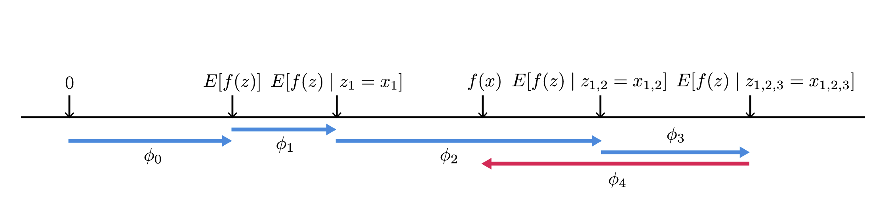

|ToC|
|---|

|SeriesToC|
|---------|

Previously we learned [LIME](../ai-explainability/02-lime.md) as a feature attribution local explainability model and observed how finding a solution to its optimization equation can result in local linear explanations. We then looked at [Shapely values](../05-shapley-values.md) and understood given a certain conditions we can find a unique solution to individual contributions to pay-off function of a coalition. Here we combine the two and use Shapley values to find a unique solution for feature attribution for explainability.

## Additive feature attribution methods

Additive feature attribution methods have a an explanation model that is a linear function of binary variables.

$$
\large{
g(z^{\prime}) = \phi_0 + \sum_{i=1}^M\phi_iz^\prime_i
}
$$

where $z^\prime \in \{0,1\}^M$, and $M$ is the number of simplified input features, and $\phi_i \in \mathbb{R}$.

Family of explanation models that matching definition of additive feature attribution models assign an attribution $\phi_i$ to each feature and then sum up the effects of all features to approximate the original model $f$ over a specific input. In the following sections we explain such three of such models as well as their practical application. Each model is accompanied by relevant code notebook running through an example.

Additive feature attribution methods have *desirable* properties that uniquely determine additive feature attribution.

### Local accuracy

Local accuracy requires the explanation model $g$ to at least match the output of original model $f$ for the simplified input $x^\prime$.

### Missingness

Features that are missing from the simplified input, which describe in binary terms where or or not a feature is present, must have no impact, or $x_i^\prime = 0 \Rightarrow \phi_i=0$.

### Consistency

If a model changes in a way that impact of a feature increases, the attribution should never decrease.

## SHAP and Explainability

In the [previous segment](/posts/ai-explainability/02-lime) of this publication, we explored LIME as a post-hox, blackbox, local explainability model. LIME has two major hyperparameters. We have seen Shapley values can be a unique solution to an attribution equation, thus we are going to explore how Shapely values can be adopted to model explanation to find a unique solution to LIME's kernel and remove dependence to hyperparameters.
Feature attribution is one of the main areas of focus in explainability research and implementation. Feature attribution is essence calculates how much each input feature contributes to a decision made by the model. Self evidently, feature attribution models can be applied post-hoc and as a black-box explainer. Prominent amongst feature attribution methods are those based on Shapley values, proposed in 1952 by Nobel Prize laureate (2012) Lloyd Shapley in game theory in the context of cooperative n-person games. To understand application of Shapley values in model explanation, let us first take a brief look at n-person cooperative games and Shapley method.

### SHAP for Explainability

So far we have seen that Shapley values provide a ***unique*** and ***fair*** way to distribute the payout amongst the players in a collaborative and competitive game. We have also seen references to feature attribution methods. Additionally we know from the context that SHAP is an additive feature attribution methods and thus has a linear local explanation based on simplified input.

The authors of the SHAP paper[10] have provided an equation that is akin to Shapley values equation and prove that there is unique solution to that equation, which is composed of a conditional expectation function of the original model that is being explained. In this case the explanation model should satisfy the three properties of the additive feature attribution, which again are akin to three axioms of for Shapley theorem. The equation that needs to be answered is defined as:

$$
\large{
\phi_i(f,x) = \sum_{z^\prime \subseteq x^\prime} \frac{|z^\prime|!(M-|z^\prime|-1)!}{M!} \left[ f_x(z^\prime)-f_x(z^\prime \setminus i) \right]
}
$$

where $|z|$ is the number of non-zero entries in z, and $z \subseteq x$ represents all $z$ vectors where the non-zero entries are a subset of the non-zero entries in $x$. $f_x(z\prime) = E \left[ f(z) | z_S\right]$ where $S$ is a set of non-zero indexes in $z^\prime$

Comparing this equation to Shapley values, we observe that $\phi = \{\phi_i:\ 0\ \leq i\ \leq M\}$. $f$, the original model is the payout function and $x$ denotes the grand coalition. finally $z$ is permutations of possible coalitions, which we saw in the simple example s we created those permutations.

Figure 1: $[E(f(z)]$, corresponding to $\phi_0$ is the expectation of the model over input features. Then as we build all the possible alliances $x_1 = \rightarrow x_{1,2} \rightarrow x_{1,2,3}$ we get the conditional expectation  of $f(x)$ for the newly added feature. We should keep in mind that the solution is dependent on the order the population is generated in the cases where the features are dependent on one another or the model $f$ is non-linear.

### Approximating SHAP values

Instead of heavy and complicated computation of SHAP values, we can approximate them with some accuracy. Authors of [10] has proposed two model agnostic methods of which we only focus on Kernel SHAP, which is a combination of LIME and Shapley values. Later in this document, we describe DeepLift and DeepSHAP, which combined DeepLift an Shapley values and is model specific.

#### Kernel SHAP

We remember creating a LIME explanator resulted in solving the optimization 

$$
\large{\xi(x) = \text{arg} \min\limits_{g \in G} \mathcal{L}(f,g,\Pi_x) + \Omega(g)}
$$.

We should also note that choosing loss function and $\Omega$, and weighting kernel, $\Pi$ to solve the LIME optimization equation are empirical and based on heuristic methods, thus the explanations can vary depending on how we choose those hyperparameters. The question is whether we could do better and have a consistent and locally accurate solution. The answer is yes. Since LIME is a Additive feature attribution method, Shapley values are the unique solution to the problem of finding an explanator where the desired properties, local accuracy, missingness, and consistency are satisfied; therefore the question of consistency and local accuracy for LIME comes down to find the Shapley values to to find the hyperparameters $\Omega$, $\mathcal{L}$, and $\Pi$ and avoid heuristic methods.
The authors propose and prove the following values for the hyperparameters to be the unique solution that satisfies the desired properties:

$$
\large{
\Omega(g)=0
}
$$

As seen earlier $\Omega$ represented complexity such as depth of a tree or the number of non-zero weights. This is heuristic and arbitrary. By setting it to $0$, we become independent of such arbitrary choice of complexity.

$$
\large{
\Pi_{x^\prime}(z^\prime)=\frac{M-1}{\left(M choose |z^\prime| \right )|z^\prime|\left( |M|-|z^\prime|\right )}
}
$$

The apparent similarity to weighting of Shapley values is obvious.

$$
\large{
\mathcal{L}(f,g,\Pi_{x^\prime}) = \sum_{z^\prime \in z} \left[ f(h_x^{-1}(z^\prime))-g(z^\prime)\right ]^2\Pi_{x^\prime(z^\prime)}
}
$$

$\mathcal{L}$ corresponds to the weighted average of the conditional expectations in the SHAP method.

## What's next?

I think the reader agrees with me that we need to stop with the theory and get into some coding examples. in the [next part](../ai-explainability/06-shap-tutorial) we shall explore how Shapley values are used in AI explainability.

## References

Below are a set of references I have looked up and used for this post. There are very good references to learn more about AI Exlainability. If you are interested to learn more, I strongly suggest taking a look at these resources.

1. [LIME's original paper](https://arxiv.org/pdf/1602.04938v1.pdf)
2. [Survey paper for explainability methods](https://arxiv.org/pdf/2011.07876.pdf)
3. [Oreily blog for intuitive understanding of LIME](https://www.oreilly.com/content/introduction-to-local-interpretable-model-agnostic-explanations-lime/)
4. [LIME Open Source Library [docs]](https://github.com/marcotcr/lime/tree/master/doc/notebooks)
5. [Kernel SHAP paper](https://arxiv.org/pdf/1705.07874.pdf)
6. [Cooporative games in Game theory](https://vknight.org/Year_3_game_theory_course/Content/Chapter_16_Cooperative_games/)
7. [Original Shapley paper](https://www.rand.org/content/dam/rand/pubs/papers/2021/P295.pdf)
8. [Cooporative Game Theory](https://www.wifa.uni-leipzig.de/fileadmin/Fakultät_Wifa/Institut_für_Theoretische_Volkswirtschaftslehre/Professur_Mikroökonomik/Cooperative_game_theory/B1_gl.pdf)
9. [UBC course on Shapley Values](https://www.youtube.com/watch?v=9OFMRiAVH-w)
10. [A Unified Approach to Interpreting Model Predictions](https://arxiv.org/pdf/1705.07874.pdf)
