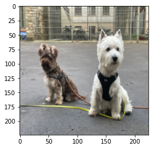
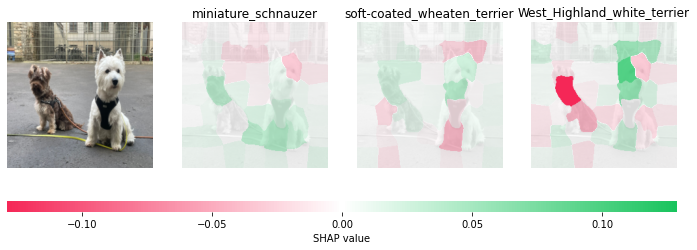

---
title:
description:
tags:
  - ai-explainability
  - ai-fairness
  - ai-ml
  - game-theory
  - shapley-values
  - shap
authorGithubAlias: cyrusmvahid
authorName: Cyrus Vahid & Shamika Ariyawansa
date:
---

```python
import keras
from keras.applications.vgg16 import VGG16, preprocess_input, decode_predictions
from keras.preprocessing import image
from skimage.segmentation import slic
import matplotlib.pylab as plt
import numpy as np
import shap
import os, json
import requests

```


```python
from PIL import Image
from torchvision import transforms
pil_img = Image.open("images/boyz2.jpeg")
pil_img.convert("RGB")

r = requests.get('https://s3.amazonaws.com/deep-learning-models/image-models/imagenet_class_index.json')
feature_names = r.json()

resize_transform  = transforms.Resize((224,224))
tensor_transform = transforms.ToTensor()


pil_img = resize_transform(pil_img)
plt.imshow(pil_img)
segments_slic = slic(pil_img, n_segments=50, compactness=30, sigma=3)
img_orig = tensor_transform(pil_img)#.numpy()
#normalize = transforms.Normalize(mean=[0.485, 0.456, 0.406],
#                                std=[0.229, 0.224, 0.225])  
#pil_img = normalize(pil_img)
img_orig = np.transpose(img_orig, (1,2,0))
img_orig = img_orig * 255
```


    

    


```python
# define a function that depends on a binary mask representing if an image region is hidden
def mask_image(zs, segmentation, image, background=None):
    if background is None:
        background = image.mean((0,1))
    out = np.zeros((zs.shape[0], image.shape[0], image.shape[1], image.shape[2]))
    for i in range(zs.shape[0]):
        out[i,:,:,:] = image
        for j in range(zs.shape[1]):
            if zs[i,j] == 0:
                out[i][segmentation == j,:] = background
    return out

```


```python
model = VGG16()
```

    2022-07-11 13:43:28.505164: I tensorflow/core/platform/cpu_feature_guard.cc:193] This TensorFlow binary is optimized with oneAPI Deep Neural Network Library (oneDNN) to use the following CPU instructions in performance-critical operations:  AVX2 FMA
    To enable them in other operations, rebuild TensorFlow with the appropriate compiler flags.


```python
def f(z):
    print("inside f")
    return model.predict(preprocess_input(mask_image(z, segments_slic, img_orig, 255)))
```


```python
# use Kernel SHAP to explain the network's predictions
explainer = shap.KernelExplainer(f, np.zeros((1,50)))
```

    inside f
    1/1 [==============================] - 0s 308ms/step


```python
shap_values = explainer.shap_values(np.ones((1,50)), nsamples=1000) # runs VGG16 1000 times
```


      0%|          | 0/1 [00:00<?, ?it/s]


    inside f
    1/1 [==============================] - 0s 132ms/step
    inside f
    32/32 [==============================] - 115s 4s/step


```python
# get the top predictions from the model
preds = model.predict(preprocess_input(np.expand_dims(img_orig, axis=0)))
top_preds = np.argsort(-preds)
```

    1/1 [==============================] - 0s 221ms/step


```python
# make a color map
from matplotlib.colors import LinearSegmentedColormap
colors = []
for l in np.linspace(1,0,100):
    colors.append((245/255,39/255,87/255,l))
for l in np.linspace(0,1,100):
    colors.append((24/255,196/255,93/255,l))
cm = LinearSegmentedColormap.from_list("shap", colors)
```


```python
def fill_segmentation(values, segmentation):
    out = np.zeros(segmentation.shape)
    for i in range(len(values)):
        out[segmentation == i] = values[i]
    return out

# plot our explanations
fig, axes = plt.subplots(nrows=1, ncols=4, figsize=(12,4))
inds = top_preds[0]
axes[0].imshow(pil_img)
axes[0].axis('off')
max_val = np.max([np.max(np.abs(shap_values[i][:,:-1])) for i in range(len(shap_values))])
for i in range(3):
    m = fill_segmentation(shap_values[inds[i]][0], segments_slic)
    axes[i+1].set_title(feature_names[str(inds[i])][1])
    axes[i+1].imshow(pil_img.convert('LA'), alpha=0.15)
    im = axes[i+1].imshow(m, cmap=cm, vmin=-max_val, vmax=max_val)
    axes[i+1].axis('off')
cb = fig.colorbar(im, ax=axes.ravel().tolist(), label="SHAP value", orientation="horizontal", aspect=60)
cb.outline.set_visible(False)
plt.show()

```

    

    

