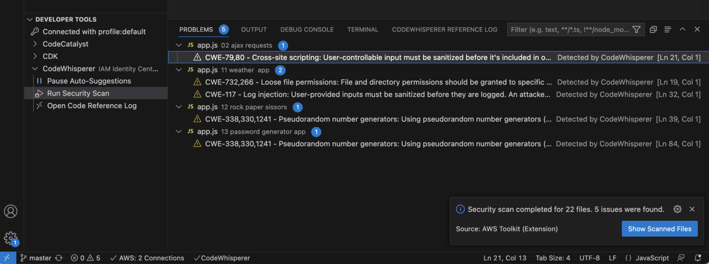
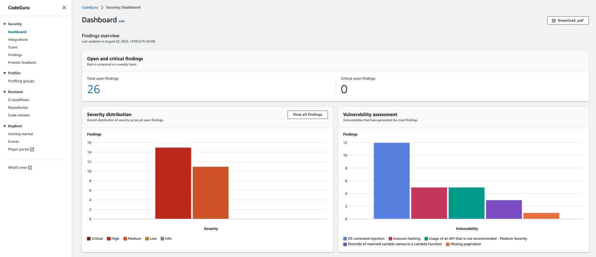
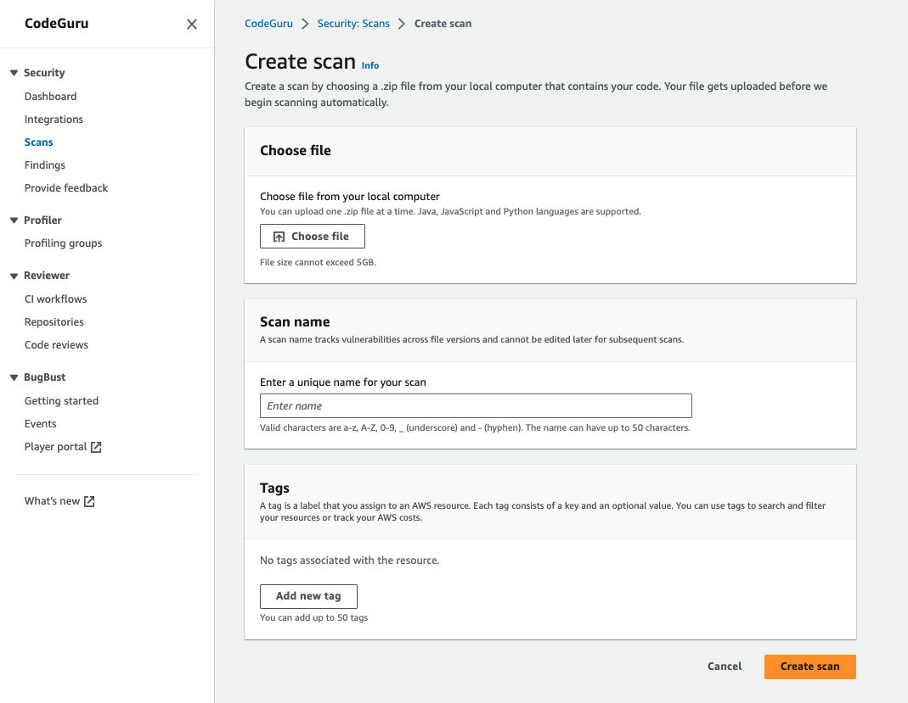
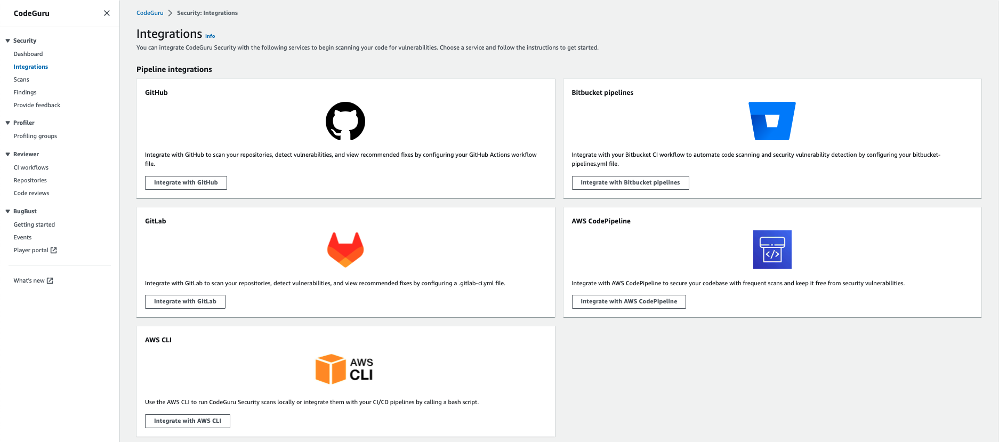
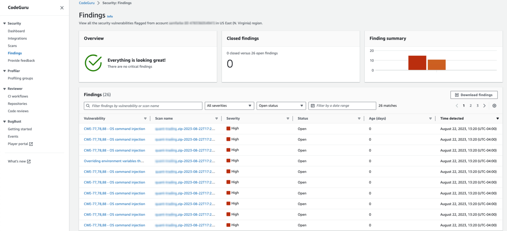

|ToC|
|---|

Nowadays, users expect the applications that they use to have 100% uptime and be available 24/7. However, it can be a complex endeavor for developers building these applications to understand and apply all the best practices for designing highly available systems. Fortunately, advances in AI now enable developers to use AI-powered tools to analyze source code, detect anomalies, suggest fixes, and monitor system health to boost reliability. Here I will share with you how this combination of AI and software development is enabling a new generation of highly available applications established around proven and optimal methodologies in security and resilience.

In this post, I will share how you can use developer tools such as Amazon CodeWhisperer and Amazon CodeGuru Security to assist you in creating resilient applications. These tools help developers with real-time code suggestions that adhere to foundations from the [Security](https://docs.aws.amazon.com/wellarchitected/latest/security-pillar/welcome.html?sc_channel=el&sc_campaign=genaiwave&sc_content=ai-powered-development-secure-resilient-apps-codewhisperer-codeguru&sc_geo=mult&sc_country=mult&sc_outcome=acq) and [Reliability](https://docs.aws.amazon.com/wellarchitected/latest/reliability-pillar/welcome.html?sc_channel=el&sc_campaign=genaiwave&sc_content=ai-powered-development-secure-resilient-apps-codewhisperer-codeguru&sc_geo=mult&sc_country=mult&sc_outcome=acq) Well-Architected Framework, have high precision vulnerability detectors, security specific scans, as well as versatile dashboards to give an overall view of security findings. There are also many more security benefits attached to these tools that I'll go through below, in addition to how to utilize them effectively.

## Amazon CodeWhisperer

[CodeWhisperer](https://aws.amazon.com/codewhisperer/?sc_channel=el&sc_campaign=genaiwave&sc_content=ai-powered-development-secure-resilient-apps-codewhisperer-codeguru&sc_geo=mult&sc_country=mult&sc_outcome=acq) is an AI coding companion that generates whole line and full function code suggestions in your IDE to help boost productivity as well as to provide code suggestions that adhere to best practices. Among these best practices include secure application code designs. Trained on billions of lines of Amazon and publicly available code, CodeWhisperer can generate code suggestions ranging from snippets to full functions in real time based on your comments and existing code directly in your integrated developer environment (IDE). With CodeWhisperer, you can select from many different programming languages including Python, Java, and JavaScript, and your favorite IDEs, including VS Code, IntelliJ IDEA, AWS Cloud9, AWS Lambda console, JupyterLab, and Amazon SageMaker Studio.

In order to help developers build more secure applications, CodeWhisperer is able to assist in enhancing the security of code that’s being written. You can scan your code to detect hard-to-find vulnerabilities, and get code suggestions to remediate them immediately. The suggestions that are given are based on pillars of the AWS Well-Architected Framework like [Security](https://docs.aws.amazon.com/wellarchitected/latest/security-pillar/welcome.html?sc_channel=el&sc_campaign=genaiwave&sc_content=ai-powered-development-secure-resilient-apps-codewhisperer-codeguru&sc_geo=mult&sc_country=mult&sc_outcome=acq) and [Reliability](https://docs.aws.amazon.com/wellarchitected/latest/reliability-pillar/welcome.html?sc_channel=el&sc_campaign=genaiwave&sc_content=ai-powered-development-secure-resilient-apps-codewhisperer-codeguru&sc_geo=mult&sc_country=mult&sc_outcome=acq), in addition to those outlined in the Open Worldwide Application Security Project (OWASP). These suggestions can help boost developer productivity and boost the codebase's security and resilience at the same time.

### User actions

As mentioned, CodeWhisperer supports a number of different IDEs and how you interact with each varies slightly. However, the underlying API call remains generally the same. In each IDE, you can manually trigger CodeWhisperer, accept or reject a recommendation, as well as go to the next/previous recommendation. With VS Code and JetBrains, you have the ability to change the keybindings. More information on the different key bindings for each IDE as well as the various API calls that are made with CodeWhisperer can be found in the [User actions section of the CodeWhisperer docs](https://docs.aws.amazon.com/codewhisperer/latest/userguide/actions-and-shortcuts.html?sc_channel=el&sc_campaign=genaiwave&sc_content=ai-powered-development-secure-resilient-apps-codewhisperer-codeguru&sc_geo=mult&sc_country=mult&sc_outcome=acq).

### Security scans

A very useful feature of CodeWhisperer is the ability to run Security Scans on the files in your project. This can help keep your application more resilient by highlighting security issues such as cross-site scripting vulnerabilities, log injections, loose file permissions, hardcoded credentials and more. CodeWhisperer's security scan is integrated with [CodeGuru](https://docs.aws.amazon.com/codeguru/detector-library/?sc_channel=el&sc_campaign=genaiwave&sc_content=ai-powered-development-secure-resilient-apps-codewhisperer-codeguru&sc_geo=mult&sc_country=mult&sc_outcome=acq). CodeGuru does multiple layers of filtering before scanning code to ensure that you can focus on the most critical issues. As part of that, CodeGuru filters unsupported languages, and also tests code, including open source code, before scanning for security issues.

These findings aid in keeping your code secure as well as increasing the application’s resistance to attacks. And rather than going through line by line, you, as a developer, can expedite the generation of these findings so you’re able to focus more on your application code. Resilience isn’t always top of mind for developers, with tools like CodeWhisperer and CodeGuru, you can have more assurance that you’re coding with security best practices at the ready. Do keep in mind that these scans will show you the security vulnerabilities and the specific lines of code where they occur, but won’t automatically fix them for you. In order to take any action, you’ll have to update the code based on the suggestion from CodeWhisperer.

To begin a security scan in VS Code or JetBrains, you can follow the steps outlined in the [Security scans section of the CodeWhisperer docs](https://docs.aws.amazon.com/codewhisperer/latest/userguide/security-scans.html#security-scans-activation?sc_channel=el&sc_campaign=genaiwave&sc_content=ai-powered-development-secure-resilient-apps-codewhisperer-codeguru&sc_geo=mult&sc_country=mult&sc_outcome=acq).

## Amazon CodeGuru

We’ve already seen CodeGuru Security in action with CodeWhisperer, but this service also has many more features that developers can leverage in order to make their code more resilient and secure. CodeGuru Security is a static application security testing (SAST) tool that uses machine learning to detect security policy violations and vulnerabilities at any point in the development cycle. The service will also provide recommendations on how to fix the identified vulnerabilities and track the status of the vulnerabilities until closure. Examples of security vulnerabilities it detects include resource leaks, hardcoded credentials, and cross-site scripting. Currently, you can run CodeGuru Security scans on Python, Java, and JavaScript code files. You can also scan text files for hardcoded secrets. Below, you’ll find ways to keep your code more secure and resilient with some of the highly used features of CodeGuru Security.

### High precision vulnerability detection

A big pain point when assessing security vulnerabilities is false positives. By performing deep semantic analysis, and leveraging techniques from the Security Pillar of the AWS  Well-Architected Framework, as well as training on millions of code vulnerability assessments within Amazon, CodeGuru Security detects vulnerabilities with a high precision. This allows CodeGuru to significantly reduce the number of false positives and frees up engineering teams to focus on building applications.

There are several types of detectors CodeGuru Security uses to analyze your code. These detectors look for code vulnerabilities like injection flaws, leaking data, weak cryptography, or missing encryption. All of these vulnerabilities, if left as is, could lead to outages, data loss, or breaches. These detectors are crucial to maintaining your application’s resilience, so long as you, the developer, are implementing the recommended fixes. As we update our security policies and add new detectors, code scans automatically incorporate the new policies. Detected vulnerabilities are returned as findings, which include details about the security risk and how to address it.

### Inline code fixes

For certain vulnerabilities, CodeGuru Security uses machine learning to create plug-and-play code blocks that can directly replace your vulnerable lines of code. You can remove the vulnerable code and then paste suggested code updates into your file, or download a code patch from the console to apply to your file.

### Vulnerability tracking

CodeGuru Security utilizes a machine learning based vulnerability tracking feature which tracks a vulnerability even if it moves to a different location within a file or to another file. After a vulnerability is initially detected, the vulnerability tracking feature can detect if it is still present across subsequent scans, or if it has been addressed. When vulnerability tracking detects that a vulnerability has been addressed, it automatically changes the status of the finding to Closed. This status update is passed to any integrated notification system. No user action is required.

### Metrics dashboard

CodeGuru Security detects security vulnerabilities across all your code scans and generates findings metrics that are presented in a high-level dashboard. The dashboard displays data about your security findings like the average time to close findings, what types of vulnerabilities are present in your scans, and the severity distribution of your findings. With the vulnerability tracking feature, the Metrics dashboard is able to maintain an up-to-date representation of the security posture of your resources.

You can use this data to track the progress of your application security, identify vulnerabilities during software development, and track the lifecycle of vulnerabilities. You can also communicate the status of application security, and collaborate with other teams to address security issues.

For information about how these metrics are calculated and where to find them, see [Understanding dashboard metrics](https://docs.aws.amazon.com/codeguru/latest/security-ug/understanding-dashboard-metrics.html?sc_channel=el&sc_campaign=genaiwave&sc_content=ai-powered-development-secure-resilient-apps-codewhisperer-codeguru&sc_geo=mult&sc_country=mult&sc_outcome=acq).

### Security posture over time and prioritization of vulnerabilities

Results from code vulnerability analysis in the dashboard let you monitor progress toward remediation of code vulnerabilities and view trends over time to see if SLAs for remediation are being met.

You can also continually scan your environment for vulnerabilities. This is done by enabling automatic code scanning in your workflow to scan files as you develop your applications and catch security vulnerabilities early in the development process.

Code vulnerability analysis will categorize security vulnerabilities that it detects by severity, which lets you focus on the code vulnerabilities that you want addressed first or where you want to concentrate your remediation efforts.

### How to create and view scans

To start scanning your code for security vulnerabilities, you can integrate your CI/CD pipeline with CodeGuru Security, or you can manually upload code to initiate the scanning. To manually upload the code, you’ll need to have a zip file that is under 5 GB.

For pipeline integrations, you can incorporate AWS CodePipeline GitHub, GitLab, AWS CLI and Bitbucket pipelines. You can also integrate with IDEs and notebooks, as well as with Amazon Inspector.

### Findings

Finally, you can view your findings of these scans in the AWS console. Findings will be grouped by severity by default. There’s also the ability for you to customize what findings are listed on the Findings page using the dropdown menus next to the search bar.

There are four main views on the Findings page. First, is the **Overview** panel which indicates whether you have open critical findings, and warns if you have some or many open critical findings across all scans. The **Closed findings** panel lists how many findings you have remediated across all scans. The **Findings summary** panel indicates how many findings of each severity level are open across all scans. Finally, The **Findings table** lists the type of vulnerability, the name of the scan that generated the finding, the severity of the finding, the age of the finding, the time the finding was detected, and the status of the finding.

 If you’re interested in using the AWS CLI or the AWS SDK to view a list of findings, you can call the GetFindings or BatchGetFindings. For more information, see the [Amazon CodeGuru Security API Reference](https://docs.aws.amazon.com/codeguru/latest/security-api/Welcome.html?sc_channel=el&sc_campaign=genaiwave&sc_content=ai-powered-development-secure-resilient-apps-codewhisperer-codeguru&sc_geo=mult&sc_country=mult&sc_outcome=acq).

## Conclusion

Simplifying the job of a developer is critical to allowing for more innovation and producing sound code. That’s why integrating AI tools into a developer’s repertoire is crucial. This is not only to save the engineer a great deal of time, but it also, as shown in this blog post, can significantly increase the resiliency, security, and high availability of the application. Using these AI-powered services like CodeWhisperer and CodeGuru Security in tandem allows developers to accelerate the delivery of robust, production-ready applications. Consequently, the user experience brought about by the higher uptime of the application will greatly improve from the recommendations generated by these AI tools. They also can be seamlessly integrated with developers’ existing IDEs, and the automation enabled by these services reduces the complexity around creating highly available systems significantly. These AI services can be crucial to your company’s business especially if you are looking for more quick ways to stay secure and highly available. Test it out and start integrating these tools today to get that productivity boost, and also, maybe more importantly, that reassurance boost of your applications’ fortitude.
