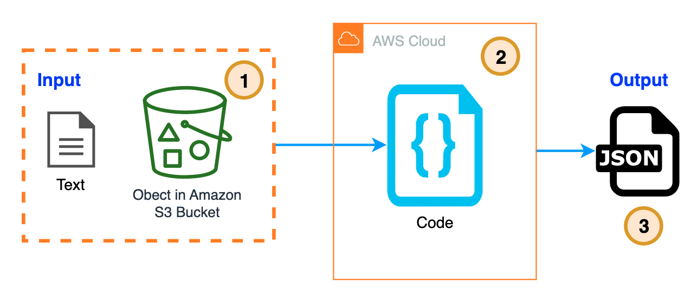
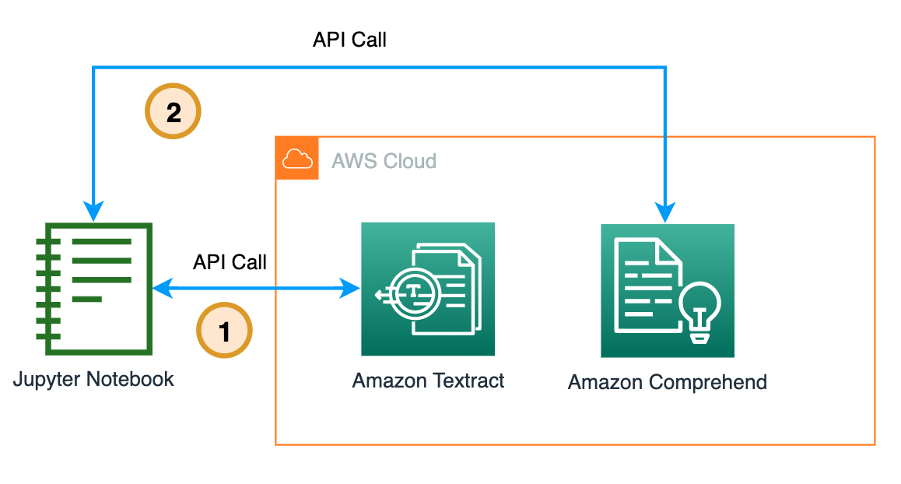
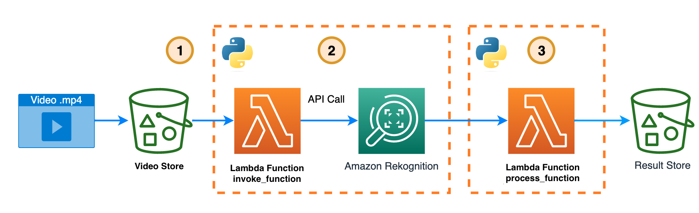

"Developers -- those who provide solutions to computer problems, establish base procedures, program, and maintain solutions --  are indeed programmers. However, this doesn't automatically make them experts in everything related to code. Take, for example, the creation of an ML-dependent function: it necessitates familiarity with models and algorithm training, knowledge that isn't common among all programmers."

There are some ready-to-use APIs that call existing models previously trained to fulfill ML-functions without need for ML knowledge, and additionally keep information shared with it secure. Next, I'm going to tell you about some specific ML API services and four use cases to get you familiar with them and let your imagination run wild.

## How does ready-to-use ML-functions APIs work? Just follow 3 simple steps:

1. Define the input, the location of the object in an Amazon S3 bucket or text.
2. Invoke the API using input.
3. Output in json format.

## Let's take a look at the APIs

In AWS there are several [ML and AI services](https://aws.amazon.com/machine-learning/) that allow you to accelerate their adoption in applications, from those that provide you with infrastructure to train your own models to those are ready to use as pre-trained API calls, let's see some of the seconds:

| API Type | How you can do | Service Name | 
-- | -- | --
 🔎 Analysis of images (.png, .jpg) /videos (.mp4) | <ul> <li> Label detection (predefined or custom) </li>  <li> Image propereties and moderation. </li>  <li> Facial detection, comparasion and analysis. </li>  <li> Face search </li>  <li> People paths. </li>  <li> Personal Protective Equipment </li>  <li> Celebrities recognition.  </li>  <li>Text in image </li>  <li> Inappropriate or offensive content </li></ul> | [Amazon Rekognition](https://docs.aws.amazon.com/rekognition/latest/dg/what-is.html)	| 
🔎 Detection and analysis of text in documents (PNG, JPG, PDF or TIFF)	| 	<ul> <li> Processes individual or bundled documents. </li>  <li> Detect typed and handwritten text </li>  <li> Recognize documents, like financial reports, medical records, ID document (drivers licenses and passports)  and tax forms. </li>  <li> Extract text, forms, and tables from documents with structured data. </li></ul> | [Amazon Textract](https://docs.aws.amazon.com/textract/latest/dg/what-is.html) | 
🔎 Natural Language Processing (NLP) and text analysis	| 	Processes documents and extracts information such as: <ul> <li> Entities </li> <li> Events</li>  <li> Key phrases</li>  <li> Dominant language </li> <li> Sntiment</li>  <li> Targeted sentiment </li>  <li>Syntax analysis.</li> <li> Custom classification and entity recognition.</li>  <li> Managing custom models. </li></ul> | [Amazon comprehend](https://docs.aws.amazon.com/es_es/comprehend/latest/dg/what-is.html) | 
🔎 Text to speech | <ul> <li> Supports [multiple languages and includes a variety of lifelike voices](https://docs.aws.amazon.com/polly/latest/dg/voicelist.html).</li> <li>Includes a number of [Neural Text-to-Speech (NTTS) voices](https://docs.aws.amazon.com/polly/latest/dg/NTTS-main.html), delivering ground-breaking improvements in speech quality through a new machine learning approach, thereby offering to customers the most natural and human-like text-to-speech voices posible.</li> <li>[Neural TTS technology also supports a Newscaster speaking style](https://docs.aws.amazon.com/polly/latest/dg/ntts-speakingstyles.html) that is tailored to news narration use cases. </li></ul> | [Amazon Polly](https://docs.aws.amazon.com/polly/latest/dg/what-is.html)  | 
🔎 Speech to Text | <ul> <li> Convert audio ([Supported formats](https://docs.aws.amazon.com/transcribe/latest/dg/how-input.html#how-input-audio)) to text. </li> <li> Transcribe media in real time (streaming) or you can transcribe media files located in an Amazon S3 bucket (batch).</li> <li> Improve accuracy for your specific use case with [language customization](https://docs.aws.amazon.com/transcribe/latest/dg/supported-languages.html), filter content to ensure customer privacy or audience-appropriate language, analyze content in multi-channel audio, partition the speech of individual speakers </li></ul> |  [Amazon Transcribe](https://docs.aws.amazon.com/transcribe/latest/dg/what-is.html) | 
🔎  Translate | Translate unstructured text (UTF-8) documents or to build applications that work in [multiple languages](https://docs.aws.amazon.com/translate/latest/dg/what-is-languages.html) | [Amazon Translate](https://docs.aws.amazon.com/translate/latest/dg/what-is.html)| 

## 🚀  Use Cases 

Best way to learn programming is by solving problems through code development,  same thing happens when you want to learn how to use a service, you need to use it to learn. These four use cases are real (and made-up) problems that I solved while learning.

- [Create subtitles and translate them into the language you want ⏯️ 🍿.](https://github.com/build-on-aws/aiml-like-api-in-your-app/blob/main/create-subtitles-and-translate-them-into-the-language-you-want/README.md)

If you are passionate about providing video with tools for others to learn, you want to reach as many people as possible, and language is a barrier that you can remove with this app.

1. Upload the .mp4 video to an [Amazon s3 bucket](https://docs.aws.amazon.com/es_es/AmazonS3/latest/userguide/UsingBucket.html).
2. A Lambda Function makes the call to Transcribe API.
3. Subtitles file in the original language are downloaded to S3 Bucket. 
4. A Lambda Function makes the call to Translate API.
5. Subtitles file in the new language is downloaded to S3 Bucket. 

Code to create [this solution](https://github.com/build-on-aws/aiml-like-api-in-your-app/blob/main/create-subtitles-and-translate-them-into-the-language-you-want/README.md). 

- [Detecting entities and sentiment from a document 🔎 📄.](https://github.com/build-on-aws/aiml-like-api-in-your-app/tree/main/detecting-entities-and-sentiment-from-a-document%20)

There are people who have mountains of papers in their homes, letters from past lovers, medical exams, memories of their children’s school, banks, etc. What do you think of saving it neatly in the cloud? Try and learn about Textract and Comprehend with this app.

1. Upload the document (PNG, JPG, PDF or TIFF) to an S3 Bucket.
2. A Lambda Function makes the call to Textract API.
3. With the response from Textract, Lambda Function makes the call to Comprehend API. 
4. A Lambda Function makes the call to the Translate API.
5. The response is saved in an S3 bucket. 

Code to create [this solution]((https://github.com/build-on-aws/aiml-like-api-in-your-app/tree/main/detecting-entities-and-sentiment-from-a-document%20))

- [Make Polly Talk 🦜](https://github.com/build-on-aws/aiml-like-api-in-your-app/tree/main/make-polly-talk)

I was curious how an Italian speaking Chinese sounded, and since Polly has native voices for each language I created this notebook to play 😂.

1. From a Jupyter Notebook make the call to Polly API.
2. Polly stores the result in a S3 bucket.
3. Retrieves the audio.

Code to create [this solution ](https://github.com/build-on-aws/aiml-like-api-in-your-app/tree/main/make-polly-talk)

- [Video content moderation ⏯️ 🔫 🚬](https://github.com/build-on-aws/aiml-like-api-in-your-app/tree/main/video-content-moderation)

I´m fan of action movies and wanted to try Rekognition with the trailer of Die Hard 1, so I created this application and wow! each dataframe is pure violence 🫣... I invite you to try it with a trailer of your favorite movie.

1. Upload the .mp4 video to an [s3 bucket](https://docs.aws.amazon.com/es_es/AmazonS3/latest/userguide/UsingBucket.html).
2. A Lambda Function makes the call to Rekognition API.
3. Once the video review is finished, a new Lambda Function retrieves the result and stores it in an s3 bucket.

Code to create [this solution ](https://github.com/build-on-aws/aiml-like-api-in-your-app/tree/main/video-content-moderation)

## Conclusion

Now you learned that you can use AIML as an API call to analyze images and videos, detection and analysis of text in scanned documents, analyze text using NLP to extract sentiment from dominant language and much more. In addition to being able to convert text to speech, and vice versa, and a language translator within reach of an API call.

This is just a small part of what you can create by powering AIML applications within the reach of an API call.

Surely you have a real or invented problem that you would like to solve using one of these services and if not I leave these links for you to continue experimenting and learning:

- Amazon Translate [Code Samples](https://github.com/aws-samples/document-translation).. [more code samples](https://docs.aws.amazon.com/translate/latest/dg/examples.html)
- Amazon Transcribe and Amazon Comprehend [Code Samples](https://github.com/aws-samples/amazon-transcribe-comprehend-podcast)
- Amazon Polly [Code Samples](https://docs.aws.amazon.com/polly/latest/dg/sample-code-overall.html)
- Amazon Rekognition [Code Samples](https://github.com/aws-samples/amazon-rekognition-code-samples)