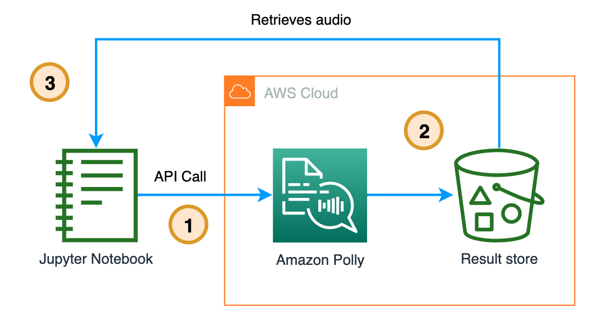

Developers - those who provide solutions to computer problems, establish base procedures, program, and maintain solutions - are indeed programmers, but that doesn't automatically make them experts in everything related to code. Take, for example, the creation of an ML-dependent function: it necessitates familiarity with models and algorithm training, knowledge that isn't common among all programmers.

Fortunately, there are ready-to-use APIs that leverage existing, previously trained models to execute ML functions, and they can be used without the need for ML knowledge. Additionally, they ensure the security of the information shared with them. Up next, I'll introduce you to some specific ML API services and four use cases to get you familiar with them and let your imagination run wild.

## How Do Ready-to-Use ML-Function APIs Work? Just Follow These 3 Simple Steps:

1. Define the input, the location of the object in an Amazon S3 bucket or text.
2. Invoke the API using this input.
3. Output will be in JSON format.

## Let's Take a Look at the APIs

AWS offers a variety of [ML and AI services](https://aws.amazon.com/machine-learning/sc_channel=el&sc_campaign=datamlwave&sc_geo=mult&sc_country=mult&sc_outcome=acq&sc_content=the-things-that-comprehend-rekognition-textract-polly-transcribe-and-others-do) designed to expedite their implementation in your applications. These services range from those that equip you with the necessary infrastructure to train your own models to those that come as ready-to-use, pre-trained API calls. Let's now focus specifically on some examples of the latter:

| API Type | How you can do | Service Name | 
-- | -- | --
 🔎 Analysis of images (.png, .jpg) /videos (.mp4) | <ul> <li> Label detection (predefined or custom) </li>  <li> Image propereties and moderation. </li>  <li> Facial detection, comparasion and analysis. </li>  <li> Face search </li>  <li> People paths. </li>  <li> Personal Protective Equipment </li>  <li> Celebrities recognition.  </li>  <li>Text in image </li>  <li> Inappropriate or offensive content </li></ul> | [Amazon Rekognition](https://docs.aws.amazon.com/rekognition/latest/dg/what-is.html)	| 
🔎 Detection and analysis of text in documents (PNG, JPG, PDF or TIFF)	| 	<ul> <li> Processes individual or bundled documents. </li>  <li> Detect typed and handwritten text </li>  <li> Recognize documents, like financial reports, medical records, ID document (drivers licenses and passports)  and tax forms. </li>  <li> Extract text, forms, and tables from documents with structured data. </li></ul> | [Amazon Textract](https://docs.aws.amazon.com/textract/latest/dg/what-is.html) | 
🔎 Natural Language Processing (NLP) and text analysis	| 	Processes documents and extracts information such as: <ul> <li> Entities </li> <li> Events</li>  <li> Key phrases</li>  <li> Dominant language </li> <li> Sentiment</li>  <li> Targeted sentiment </li>  <li>Syntax analysis.</li> <li> Custom classification and entity recognition.</li>  <li> Managing custom models. </li></ul> | [Amazon comprehend](https://docs.aws.amazon.com/es_es/comprehend/latest/dg/what-is.html) | 
🔎 Text to speech | <ul> <li> Supports [multiple languages and includes a variety of lifelike voices](https://docs.aws.amazon.com/polly/latest/dg/voicelist.html).</li> <li>Includes a number of [Neural Text-to-Speech (NTTS) voices](https://docs.aws.amazon.com/polly/latest/dg/NTTS-main.html), delivering ground-breaking improvements in speech quality through a new machine learning approach, thereby offering to customers the most natural and human-like text-to-speech voices posible.</li> <li>[Neural TTS technology also supports a Newscaster speaking style](https://docs.aws.amazon.com/polly/latest/dg/ntts-speakingstyles.html) that is tailored to news narration use cases. </li></ul> | [Amazon Polly](https://docs.aws.amazon.com/polly/latest/dg/what-is.html)  | 
🔎 Speech to Text | <ul> <li> Convert audio ([Supported formats](https://docs.aws.amazon.com/transcribe/latest/dg/how-input.html#how-input-audio)) to text. </li> <li> Transcribe media in real time (streaming) or you can transcribe media files located in an Amazon S3 bucket (batch).</li> <li> Improve accuracy for your specific use case with [language customization](https://docs.aws.amazon.com/transcribe/latest/dg/supported-languages.html), filter content to ensure customer privacy or audience-appropriate language, analyze content in multi-channel audio, partition the speech of individual speakers </li></ul> |  [Amazon Transcribe](https://docs.aws.amazon.com/transcribe/latest/dg/what-is.html) | 
🔎  Translate | Translate unstructured text (UTF-8) documents or to build applications that work in [multiple languages](https://docs.aws.amazon.com/translate/latest/dg/what-is-languages.html) | [Amazon Translate](https://docs.aws.amazon.com/translate/latest/dg/what-is.html)| 

## 🚀 Use Cases 

The most effective way to learn programming is by solving problems through code development. The same principle applies when learning how to use a service: you need to actively use it to understand it. The following four use cases are examples of both real and hypothetical problems that I tackled during my learning process.

- Use case 1: [Create subtitles and translate them into the language you want ⏯️ 🍿.](https://github.com/build-on-aws/aiml-like-api-in-your-app/blob/main/create-subtitles-and-translate-them-into-the-language-you-want/README.md)

If you're passionate about utilizing video as a tool for education, it would be ideal to reach as many people as possible. One common barrier to this is language. This application enables you to create subtitles and translate them into any desired language to remove this barrier.

1. Upload the .mp4 video to an [Amazon s3 bucket](https://docs.aws.amazon.com/es_es/AmazonS3/latest/userguide/UsingBucket.html).
2. A Lambda Function makes the call to Transcribe API.
3. Subtitles file in the original language are downloaded to S3 Bucket. 
4. A Lambda Function makes the call to Translate API.
5. Subtitles file in the new language is downloaded to S3 Bucket. 

Here's the code to [create this solution](https://github.com/build-on-aws/aiml-like-api-in-your-app/blob/main/create-subtitles-and-translate-them-into-the-language-you-want/README.md). 

- Use case 2: [Detect entities and sentiment from a document 🔎 📄.](https://github.com/build-on-aws/aiml-like-api-in-your-app/tree/main/detecting-entities-and-sentiment-from-a-document%20)

Many people possess piles of documents at home, ranging from letters from past lovers to medical records, children's school memorabilia, and bank statements, etc. Wouldn't it be convenient to neatly store these in the cloud? Explore and learn about the functionalities of Textract and Comprehend with this app.

1. Upload the document (PNG, JPG, PDF or TIFF) to an S3 Bucket.
2. A Lambda Function makes the call to Textract API.
3. With the response from Textract, Lambda Function makes the call to Comprehend API. 
4. A Lambda Function makes the call to the Translate API.
5. The response is saved in an S3 bucket. 

Here's the code to [create this solution]((https://github.com/build-on-aws/aiml-like-api-in-your-app/tree/main/detecting-entities-and-sentiment-from-a-document%20))

- Use case 3: [Make Polly Talk 🦜](https://github.com/build-on-aws/aiml-like-api-in-your-app/tree/main/make-polly-talk)

I was curious how an Italian speaking Chinese sounded, and since Polly has native voices for each language I created this notebook to play 😂.

1. From a Jupyter Notebook make the call to Polly API.
2. Polly stores the result in a S3 bucket.
3. Retrieves the audio.

Here's the code to [create this solution ](https://github.com/build-on-aws/aiml-like-api-in-your-app/tree/main/make-polly-talk)

- Use case 4: [Video content moderation ⏯️ 🔫 🚬](https://github.com/build-on-aws/aiml-like-api-in-your-app/tree/main/video-content-moderation)

I´m fan of action movies and wanted to try Rekognition with the trailer of Die Hard, so I created this application and wow! Each dataframe is pure violence 🫣... I invite you to try it with a trailer of your favorite movie.

1. Upload the .mp4 video to an [s3 bucket](https://docs.aws.amazon.com/es_es/AmazonS3/latest/userguide/UsingBucket.html).
2. A Lambda Function makes the call to Rekognition API.
3. Once the video review is finished, a new Lambda Function retrieves the result and stores it in an s3 bucket.

Here's the code to [create this solution](https://github.com/build-on-aws/aiml-like-api-in-your-app/tree/main/video-content-moderation)

## Conclusion

You've now learned that AIML can be used via an API call to perform a variety of tasks such as analyzing images and videos, detecting and analyzing text in scanned documents, and leveraging Natural Language Processing (NLP) to extract sentiment from dominant languages, among many other things. In addition, you have the capability to convert text to speech and vice versa, and to utilize a language translator, all within the reach of a single API call.

This just scratches the surface of what can be achieved by leveraging AIML applications via API calls.

No doubt, there's a real or hypothetical problem you'd like to address using one of these services. Even if you don't have one in mind, I've provided these links for you to continue experimenting and learning:

- Amazon Translate [Code Samples](https://github.com/aws-samples/document-translation).. [more code samples](https://docs.aws.amazon.com/translate/latest/dg/examples.html)
- Amazon Transcribe and Amazon Comprehend [Code Samples](https://github.com/aws-samples/amazon-transcribe-comprehend-podcast)
- Amazon Polly [Code Samples](https://docs.aws.amazon.com/polly/latest/dg/sample-code-overall.html)
- Amazon Rekognition [Code Samples](https://github.com/aws-samples/amazon-rekognition-code-samples)
