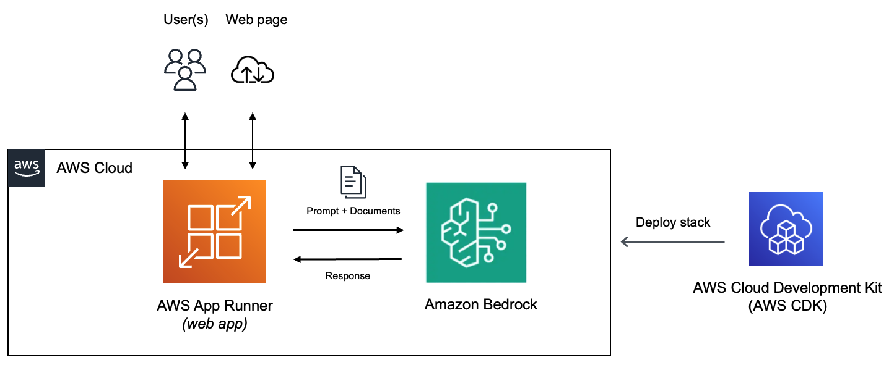
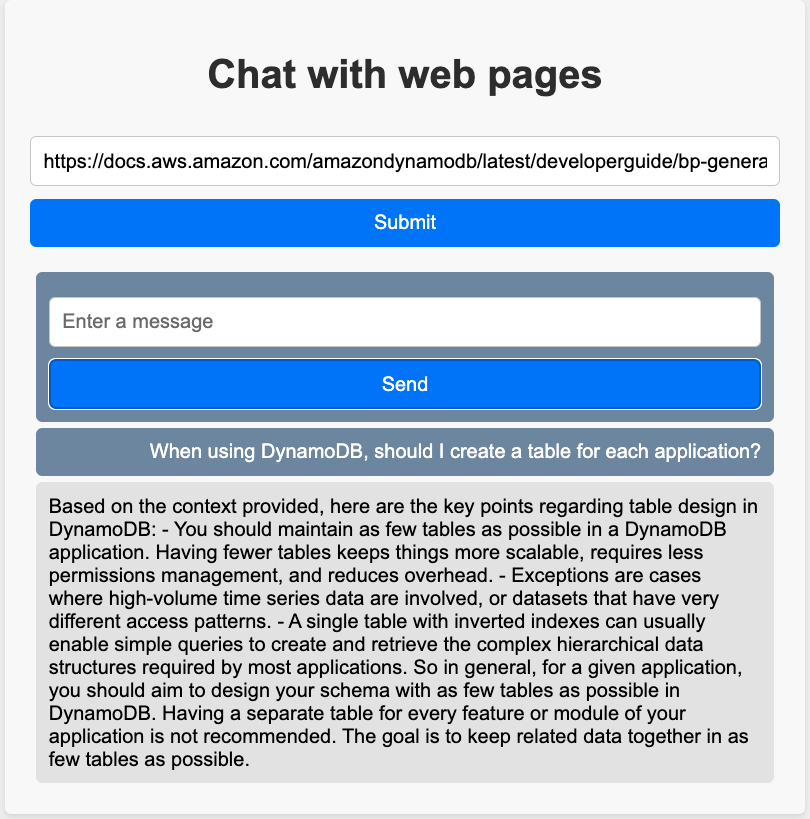

|ToC|
|---|

Conversational interaction with large language model (LLM) based solutions (for example, a chatbot) is quite common. Although production grade LLMs are trained using a huge corpus of data, their knowledge base is inherently limited to the information present in the training data, and they may not possess real-time or the most up-to-date knowledge.

Here is an example:


This is perfectly acceptable 👍 But, the real problem is "hallucination" wherein LLMs may generate inaccurate information, while sounding confident 😯 Rather than having an open-ended conversation, it's good to narrow down the scope by providing additional context/information that's required to solve the problem or answer our questions. For example, instead of asking about Amazon Bedrock, one can provide a link to the documentation page (for instance [General guidelines for Amazon Bedrock LLM users](https://docs.aws.amazon.com/bedrock/latest/userguide/general-guidelines-for-bedrock-users.html?sc_channel=el&sc_campaign=genaiwave&sc_content=amazon-bedrock-apprunner-chatterdox-webapp&sc_geo=mult&sc_country=mult&sc_outcome=acq)) and ask specific queries. The same can be done by Q&A over data in text or PDF documents.

This can be achieved in many ways. The easiest one is to pass on the information to the LLM directly. But there are other popular techniques such as **RAG** (Retrieval Augmented Generation) that involve accessing data from external systems, Typically, this is done by combining Semantic search (with Vector databases). In this blog, we will explore the simple way (and leave the *RAG* technique for a future post). A framework like [LangChain](https://www.langchain.com/) can simplify this for us since it provides abstractions to use the appropriate *prompt* (which can be customized), *load data* from sources (documents, web links) and *inject* it (as context) with the question/prompt. 

[One of the previous blogs](/posts/amazon-bedrock-langchaingo-llm) provided an introduction to using [langchaingo](https://github.com/tmc/langchaingo) with [Amazon Bedrock](https://docs.aws.amazon.com/bedrock/latest/userguide/what-is-bedrock.html?sc_channel=el&sc_campaign=genaiwave&sc_content=amazon-bedrock-apprunner-chatterdox-webapp&sc_geo=mult&sc_country=mult&sc_outcome=acq), which is a fully managed service that makes base models from Amazon and third-party model providers (such as Anthropic, Cohere, and more) accessible through an API. It also walked you through [how to extend langchaingo](/posts/amazon-bedrock-langchaingo-llm#langchaingo-implementation-for-amazon-bedrock) to work with the Anthropic Claude (v2) model in Amazon Bedrock. We will continue to build on that foundation and [reuse the implementation](https://github.com/build-on-aws/langchaingo-amazon-bedrock-llm). By the end, you will have a web application deployed to [AWS App Runner](https://docs.aws.amazon.com/apprunner/latest/dg/what-is-apprunner.html?sc_channel=el&sc_campaign=genaiwave&sc_content=amazon-bedrock-apprunner-chatterdox-webapp&sc_geo=mult&sc_country=mult&sc_outcome=acq) that provides a fast, simple, and cost-effective way to deploy from source code or a container image directly to a scalable and secure web application. You can then use it to ask questions based on the content of a link/URL of your choice!

> The code is [available on GitHub](https://github.com/build-on-aws/amazon-bedrock-apprunner-chatterdox-webapp)

## Application overview

The application is written in Go, but the concepts apply to any other language you might choose. As mentioned before, it uses `langchaingo` as the framework to interact with the [Anthropic Claude (v2) model on Amazon Bedrock](https://docs.aws.amazon.com/bedrock/latest/userguide/what-is-bedrock.html#models-supported?sc_channel=el&sc_campaign=genaiwave&sc_content=amazon-bedrock-apprunner-chatterdox-webapp&sc_geo=mult&sc_country=mult&sc_outcome=acq). The web app uses the [Go embed package](https://pkg.go.dev/embed) to serve the static file for the frontend part (HTML, JavaScript and CSS) from directly within the binary.



To make sure that the contents of the link are included as context for the LLM, the applications uses the [LoadStuffQA](https://pkg.go.dev/github.com/tmc/langchaingo/chains#LoadStuffQA) chain along with a prompt.

> You can refer to the [application code here](https://github.com/build-on-aws/amazon-bedrock-apprunner-chatterdox-webapp/blob/main/web-app/main.go)

The chain is initialized in the `init` function:

```go
func init() {
	var err error

	region := os.Getenv("AWS_REGION")
	if region == "" {
		region = defaultRegion
	}

	llm, err = claude.New(region)

	chain = chains.LoadStuffQA(llm)
}
```

*Note that the line `llm, err = claude.New(region)` comes from the [langchaingo-amazon-bedrock-llm](https://github.com/build-on-aws/langchaingo-amazon-bedrock-llm) project that provides Amazon Bedrock extension for LangChain Go.*

The user can provide a link that serves as the source of information that they can ask questions. The content from the link will be represented as a [Document](https://pkg.go.dev/github.com/tmc/langchaingo/schema#Document). LangChain makes it easy to fetch data from various sources. In this case we fetch HTML content from a web URL (we will use AWS documentation as an example), but the same can be done for a text file or a PDF doc.

The HTTP handler `loadData` invokes `getDocsFromLink` function that loads HTML data from the web link. The bulk of the work is done by this line - `docs, err := documentloaders.NewHTML(resp.Body).Load(context.Background())` that combines [NewHTML](https://pkg.go.dev/github.com/tmc/langchaingo/documentloaders#HTML.Load) and [Load](https://pkg.go.dev/github.com/tmc/langchaingo/documentloaders#NewHTML) functions to get the job done. 

```go
func loadData(w http.ResponseWriter, r *http.Request) {
	//... details omitted
}

//...

func getDocsFromLink(link string) ([]schema.Document, error) {

	resp, err := http.Get(link)
	defer resp.Body.Close()

	docs, err := documentloaders.NewHTML(resp.Body).Load(context.Background())

	return docs, nil
}
```

Once contents of the user provided link are loaded, they can start asking questions. This is handled by the `chat` HTTP handler shown below (error handling and other parts omitted for brevity):

```go
func chat(w http.ResponseWriter, req *http.Request) {

	body, err := io.ReadAll(req.Body)

	chatMessage := string(body)

	answer, err := chains.Call(context.Background(), chain, map[string]any{
		"input_documents": docs,
		"question":        chatMessage,
	}, chains.WithMaxTokens(2048))

	w.Write([]byte(answer["text"].(string)))
}
```

The user message (question) is fed as an input to the [chains.Call](https://pkg.go.dev/github.com/tmc/langchaingo/chains#Call) function along with the content from the web URL/link. The LLM response is returned from the handler which is then rendered by the frontend to the user.

## Deploy the application and start chatting...

As a prerequisite, make sure you have [Go](https://go.dev/dl/), [AWS CDK](https://docs.aws.amazon.com/cdk/v2/guide/getting_started.html#getting_started_install?sc_channel=el&sc_campaign=genaiwave&sc_content=amazon-bedrock-apprunner-chatterdox-webapp&sc_geo=mult&sc_country=mult&sc_outcome=acq) and [Docker](https://docs.docker.com/get-docker/) installed. 

You can easily deploy the entire solution with CDK.

> You can refer to the [CDK code on GitHub](https://github.com/build-on-aws/amazon-bedrock-apprunner-chatterdox-webapp/blob/main/cdk/main.go)

Clone this GitHub repository, change to the right directory and start the deployment with `cdk deploy`.

```bash
git clone https://github.com/build-on-aws/amazon-bedrock-apprunner-chatterdox-webapp/

cd amazon-bedrock-apprunner-chatterdox-webapp/cdk

export DOCKER_DEFAULT_PLATFORM=linux/amd64
cdk deploy
```

This will start creating the AWS resources required for the application. You can keep track of the progress in the terminal or navigate to AWS console: `CloudFormation > Stacks > ChatterdoxStack`

Once all the resources are created, you can try out the application. You should have:

- App Runner service - this is the web application
- App Runner Instance (IAM) role - this allows access to Amazon Bedrock

Once complete, you should get a confirmation along with the values for the App Runner service endpoint.


To access the application, enter the App Runner service endpoint URL in your web browser to navigate to the website. Start by entering a link to a page. For example, the **NoSQL design for DynamoDB** documentation page - https://docs.aws.amazon.com/amazondynamodb/latest/developerguide/bp-general-nosql-design.html

Once a valid link is provided (click *Submit*), the chat area will be enabled. 

You can now start asking questions about the page contents (enter a message in the text box and click *Send*).



You can continue the chat conversation by asking additional questions.

## Conclusion

Although this was a relatively simple application, it's evident how LangChain abstracted the complexity by providing an easy way to combine the following:

1. Fetching data from the source (web link), 
2. Adding it as a context along with the prompt, and,
3. Invoking the LLM

Once the core functionality was ready, we were able to expose it as a user-facing web app on App Runner. This approach works quite well for single page content or small documents. If you try to pass in a lot of content with the prompt, you will likely run into token limit constraints. To mitigate this, you can use other chains such as [MapReduceDocuments](https://pkg.go.dev/github.com/tmc/langchaingo/chains#MapReduceDocuments), [MapRerankDocuments](https://pkg.go.dev/github.com/tmc/langchaingo/chains#MapRerankDocuments) etc. Other approach includes using RAG, which might be covered in a different blog.

Until then, Happy Building!
