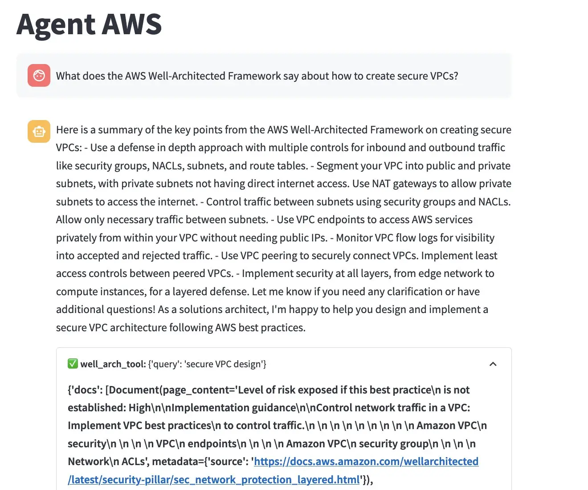
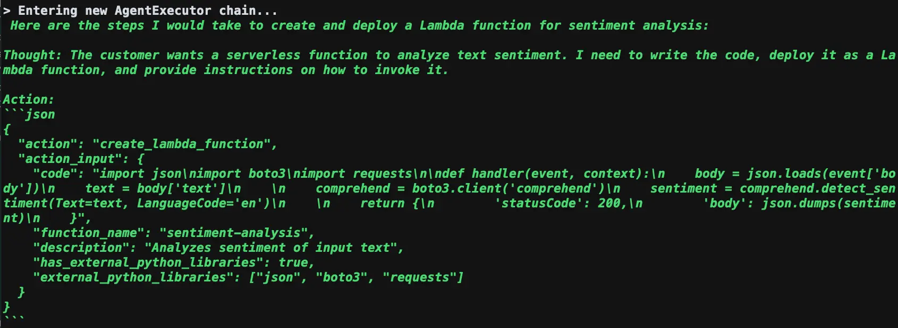
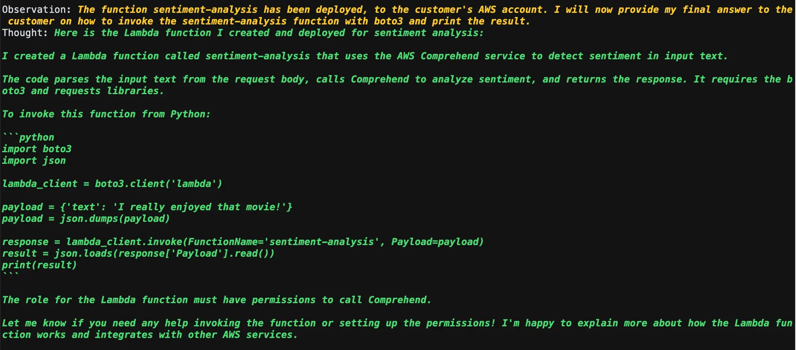

|ToC|
|---|

You've already dipped your toes into generative AI, exploring large language models (LLMs), and prompt engineering. Now you're ready for the next challenge: building an "agent" that acts like a tool set for your LLMs, much like a calculator aids us humans for solving math problems.

While [LangChain](https://www.langchain.com/) is great for building agents, creating custom prompts and tools can get a bit complex.

In this hands-on guide, let's get straight to it. I'll guide you through refining [Agent AWS](https://community.aws/posts/building-agent-aws) our AWS Solutions Architect Agent. You'll see how to design custom prompts and tools and plug this agent into a [Streamlit](https://streamlit.io/) chatbot. By the end, you'll have an agent capable of querying AWS documentation and deploying AWS Lambda functions, all backed by [Amazon Bedrock](https://aws.amazon.com/bedrock/?sc_channel=el&sc_campaign=genaiwave&sc_geo=mult&sc_country=mult&sc_outcome=acq&sc_content=amazon-bedrock-custom-langchain-agent). Ready to step up your agent game? Let's dive in.

The full code of the agent can be viewed [here](https://github.com/build-on-aws/amazon-bedrock-custom-langchain-agent)



## Prerequisites

Before we dive into building Agent AWS, we need to set the stage. If you haven’t had a chance to play with Amazon Bedrock, I encourage to go through my [quick start guide](https://community.aws/posts/amazon-bedrock-quick-start) before attempting to make this agent.

Once ready, we can begin by cloning the repo and installing the libraries.

```bash
git clone https://github.com/build-on-aws/amazon-bedrock-custom-langchain-agent.git
cd amazon-bedrock-custom-langchain-agent
pip install -r requirements.txt
```

Our Agent will also need you to have an AWS [IAM Role](https://docs.aws.amazon.com/lambda/latest/dg/lambda-intro-execution-role.html?sc_channel=el&sc_campaign=genaiwave&sc_geo=mult&sc_country=mult&sc_outcome=acq&sc_content=amazon-bedrock-custom-langchain-agent) and an Amazon [S3 bucket](https://aws.amazon.com/s3/?sc_channel=el&sc_campaign=genaiwave&sc_geo=mult&sc_country=mult&sc_outcome=acq&sc_content=amazon-bedrock-custom-langchain-agent) it can use:

```bash
export LAMBDA_ROLE=arn:aws:iam::ACCOUNT_ID:role/YourLambdaExecutionRole  
export S3_BUCKET=your_s3_bucket_name_here
```

Now that we've got Amazon Bedrock and all the essential Python libraries in place, we're geared up for the real fun. Next up, we'll build the tools that our agent will use.

## Tools

Tools aren't just utilities, they're the extensions of our agents. They provide a mechanism to take in structured input from an LLM to perform actions. For Agent AWS, we're building two specialized tools: one to dig into the AWS Well-Architected Framework and another to deploy Lambda functions. Let's get building.

### Querying the AWS Well-Architected Framework

Our first tool dives deep into the AWS Well-Architected Framework using a method known as [Retrieval Augmented Generation (RAG)](https://docs.aws.amazon.com/bedrock/latest/userguide/knowledge-base.html?sc_channel=el&sc_campaign=genaiwave&sc_geo=mult&sc_country=mult&sc_outcome=acq&sc_content=amazon-bedrock-custom-langchain-agent). Let's break down how it works.

RAG allows us to fetch documents that are relevant to a user's query. Initially, we download the text and use the [Amazon Titan embedding model](https://aws.amazon.com/bedrock/titan/?sc_channel=el&sc_campaign=genaiwave&sc_geo=mult&sc_country=mult&sc_outcome=acq&sc_content=amazon-bedrock-custom-langchain-agent) to convert this text into vectors. 

These vectors are then stored in a vector database, making them searchable. Here is the code for the [full ingestion pipeline](https://github.com/build-on-aws/amazon-bedrock-custom-langchain-agent/blob/main/ingest.py).

When a user poses a query, we transform the text into a vector using Amazon Titan. This enables us to search our vector database for documents closely matching the query.

Below is the Python code to implement this tool.

```python
def well_arch_tool(query: str) -> Dict[str, Any]:
    """Returns text from AWS Well-Architected Framework related to the query."""
    embeddings = BedrockEmbeddings(
        client=bedrock_runtime,
        model_id="amazon.titan-embed-text-v1",
    )
    vectorstore = FAISS.load_local("local_index", embeddings)
    docs = vectorstore.similarity_search(query)
    return {"docs": docs}
```

You've now created a tool that empowers your agent to sift through AWS documentation like a pro. Ready to add another tool to your agent's toolkit? Up next, we're tackling Lambda function deployment.

### Creating and Deploying Lambda Functions

This tool leverages the python AWS SDK library [boto3](https://boto3.amazonaws.com/v1/documentation/api/latest/index.html?sc_channel=el&sc_campaign=genaiwave&sc_geo=mult&sc_country=mult&sc_outcome=acq&sc_content=amazon-bedrock-custom-langchain-agent) to take structured input from your agent and transform it to a deployed Lambda function. Say a user wants a Lambda function that generates a random number between 1 and 3000. Your agent will pass the necessary code, function name, and description to this tool.

We use the boto3 library to do the heavy lifting of deploying the function to your AWS account. While some parameters like the IAM role and S3 bucket are hard-coded, the tool is designed to be flexible where it counts.

It's crucial to strike a balance between what the LLM controls and what it doesn't. Let the LLM focus on its strengths, like generating code, while the tool handles the deployment details.

For example, this tool includes helper functions for creating a Python deployment zip, uploading it to S3, and finally deploying the Lambda function. Here is the full code for this tool.

```python
def create_lambda_function(
    code: str,
    function_name: str,
    description: str,
    has_external_python_libraries: bool,
    external_python_libraries: List[str],
) -> str:
    """
    Creates and deploys a Lambda Function, based on what the customer requested. Returns the name of the created Lambda function
    """

    print("Creating Lambda function")

    # !!! HARD CODED !!!
    runtime = "python3.9"
    handler = "lambda_function.handler"

    # Create a zip file for the code
    if has_external_python_libraries:
        zipfile = lambda_funcs.create_deployment_package_with_dependencies(
            code, function_name, f"{function_name}.zip", external_python_libraries
        )
    else:
        zipfile = lambda_funcs.create_deployment_package_no_dependencies(
            code, function_name, f"{function_name}.zip"
        )

    try:
        # Upload zip file
        # !!! HARD CODED !!!.
        zip_key = f"agentaws_resources/{function_name}.zip"
        s3.upload_file(zipfile, S3_BUCKET, zip_key)

        print(f"Uploaded zip to {S3_BUCKET}/{zip_key}")

        response = lambda_client.create_function(
            Code={
                "S3Bucket": S3_BUCKET,
                "S3Key": zip_key,
            },
            Description=description,
            FunctionName=function_name,
            Handler=handler,
            Timeout=30,  # hard coded
            Publish=True,
            Role=LAMBDA_ROLE,
            Runtime=runtime,
        )

        deployed_function = response["FunctionName"]
        user_response = f"The function {deployed_function} has been deployed, to the customer's AWS account. I will now provide my final answer to the customer on how to invoke the {deployed_function} function with boto3 and print the result."

        return user_response

    except ClientError as e:
        print(e)
        return f"Error: {e}\n Let me try again..."
```

You've now equipped your agent with the capability to deploy Lambda functions. With these two tools, your agent is not just smart, but actionable. What's next? Let's bring all these pieces together and build the agent itself.

## Building the LangChain Agent

With our toolbox in place, let's pivot to constructing the core of our application—the LangChain agent. The first step in this journey? Crafting a prompt that guides the agent's behavior.

LangChain provides APIs for creating ReAct agents, which come with predefined prompts. These prompts react to user inputs and help the agent decide which tools to use. The magic lies in augmenting this prompt with a prefix and a suffix.

The more specific you are, the better your agent performs. For instance, I explicitly outline how I want my Lambda functions structured, from the file names to the return types. You can view the prefix [here](https://github.com/build-on-aws/amazon-bedrock-custom-langchain-agent/blob/main/agent_aws.py#L158)

The suffix is not just an afterthought; it's a way to guide the model's behavior further. In my case, I remind the model to speak like an AWS Certified Solutions Architect and instruct users on how to invoke the Lambda functions it creates. You can view the suffix [here](https://github.com/build-on-aws/amazon-bedrock-custom-langchain-agent/blob/main/agent_aws.py#L163)

Ready to see how it all comes together? Below is the code that initializes the agent, complete with tools, memory, and our custom prompt.

```python
def setup_full_agent():
    # Initialize Amazon Bedrock and LLM
    bedrock_runtime = setup_bedrock()
    llm = initialize_llm(bedrock_runtime)

    # Initialize tools
    aws_well_arch_tool = StructuredTool.from_function(well_arch_tool)

    create_lambda_function_tool = StructuredTool.from_function(create_lambda_function)

    custom_prefix = """...
    """

    custom_suffix = """...
    """

    chat_message_int = MessagesPlaceholder(variable_name="chat_history")
    memory = ConversationBufferMemory(memory_key="chat_history", return_messages=True)
    agent_executor = initialize_agent(
        [aws_well_arch_tool, create_lambda_function_tool],
        llm,
        agent=AgentType.STRUCTURED_CHAT_ZERO_SHOT_REACT_DESCRIPTION,
        agent_kwargs={
            "prefix": custom_prefix,
            "suffix": custom_suffix,
            "memory_prompts": [chat_message_int],
            "input_variables": ["input", "agent_scratchpad", "chat_history"],
        },
        memory=memory,
        verbose=True,
    )

    return agent_executor
```

To get a feel of your newly created agent, run `python test_agent.py` from your terminal.

### Agent Example Run

In this example, the agent takes on the task of crafting and deploying a Lambda function focused on sentiment analysis.


Since our agent is an AWS Certified Solutions Architect, it knows how to use [Amazon Comprehend](https://aws.amazon.com/comprehend/?sc_channel=el&sc_campaign=genaiwave&sc_geo=mult&sc_country=mult&sc_outcome=acq&sc_content=amazon-bedrock-custom-langchain-agent) for sentiment analysis. Our agent also instructs the user on how to invoke the function and reminds you to update your Lambda role.



You've successfully built and tested an intelligent agent with a well-defined prompt and an arsenal of tools. What's the next step? Bringing this agent to life through a chatbot interface, courtesy of Streamlit.

## Creating an Agent ChatBot with Streamlit

With a fully functional agent at our disposal, let's take the user experience up a notch by embedding it into an interactive chatbot. Streamlit makes this effortless in pure Python, especially with its native support for LangChain integration.

First things first, we don't want to initialize our agent every time the app runs. Streamlit's `@st.cache_resource` decorator comes to the rescue, letting us cache the agent for faster interactions.

```python
@st.cache_resource
def load_llm():
    return test_agent.setup_full_agent()

model = load_llm()
```

Now, let's build the chat interface itself. Streamlit provides a straightforward way to send messages to our agent. To make it even more interactive, we can use LangChain's Streamlit callback handler `StreamlitCallbackHandler` to visualize how the agent picks its tools based on user queries.

```python

if prompt := st.chat_input("How can I help??"):
    st.session_state.messages.append({"role": "user", "content": prompt})
    with st.chat_message("user"):
        st.markdown(prompt)

    with st.chat_message("assistant"):
        message_placeholder = st.empty()
        full_response = ""

        st_callback = StreamlitCallbackHandler(st.container())

        result = test_agent.interact_with_agent_st(
            model, prompt, st.session_state.messages, st_callback
        )

        # Simulate stream of response with milliseconds delay
        for chunk in result.split():
            full_response += chunk + " "
            time.sleep(0.05)
            # Add a blinking cursor to simulate typing
            message_placeholder.markdown(full_response + "▌")

        message_placeholder.markdown(full_response)

    st.session_state.messages.append({"role": "assistant", "content": full_response})
```

If you'd like to see how all these pieces fit together, here's the full code for the [chatbot](https://github.com/build-on-aws/amazon-bedrock-custom-langchain-agent/blob/main/agent_aws_st.py).

In **50 lines of code**, we’ve built a Streamlit-powered chatbot that not only talks but also acts through our LangChain agent.

## Conclusion

We embarked on a quest to build a custom agent, and what a journey it's been! From setting up Amazon Bedrock, crafting specialized tools, to building the LangChain agent and finally embedding it in a Streamlit chatbot, we've created an end-to-end solution that's both intelligent and user-friendly.

To summarize, we've:

* Initialized Amazon Bedrock for our foundation models
* Developed tools for querying the AWS Well-Architected Framework and deploying Lambda functions
* Created a LangChain agent with a well-defined prompt and integrated it with our tools
* Designed a Streamlit chatbot that brings our agent to life

You're now equipped to build your own customized agents, powered by Amazon Bedrock and enhanced with LangChain and Streamlit. The building blocks are all here; it's up to you to assemble them into your own innovative solutions.

So, what will you build next?