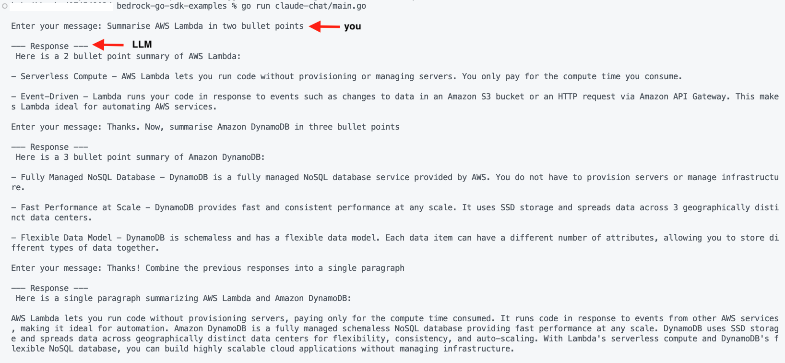

|ToC|
|---|

This article is an introductory guide for Go developers who want to get started building Generative AI applications using [Amazon Bedrock](https://docs.aws.amazon.com/bedrock/latest/userguide/what-is-service.html?sc_channel=el&sc_campaign=genaiwave&sc_content=amazon-bedrock-golang-getting-started&sc_geo=mult&sc_country=mult&sc_outcome=acq) which is a fully managed service that makes base models from Amazon and third-party model providers accessible through an API.

We will be using the [AWS Go SDK](https://aws.github.io/aws-sdk-go-v2/docs/) for Amazon Bedrock and will cover the following topics as we go along: 

- Introduction to the Bedrock Go APIs and learn how to use it for tasks such as content generation.
- Understand how to build a simple chat application and handle streaming output from Bedrock Foundation Models.
- Code walkthrough of the examples

> The code examples are available in this [GitHub repository](https://github.com/build-on-aws/amazon-bedrock-go-sdk-examples) 

## Before you begin

Make sure you have [configured and set up Amazon Bedrock](https://docs.aws.amazon.com/bedrock/latest/userguide/setting-up.html?sc_channel=el&sc_campaign=genaiwave&sc_content=amazon-bedrock-golang-getting-started&sc_geo=mult&sc_country=mult&sc_outcome=acq), including [requesting for access](https://docs.aws.amazon.com/bedrock/latest/userguide/setting-up.html#manage-model-access?sc_channel=el&sc_campaign=genaiwave&sc_content=amazon-bedrock-golang-getting-started&sc_geo=mult&sc_country=mult&sc_outcome=acq) to the Foundation Model(s). 

As we run the examples, we will be using the AWS Go SDK to invoke Amazon Bedrock API operations from our local machine. For this, you need to:

1. [Grant programmatic access](https://docs.aws.amazon.com/bedrock/latest/userguide/setting-up.html#grant-program-access?sc_channel=el&sc_campaign=genaiwave&sc_content=amazon-bedrock-golang-getting-started&sc_geo=mult&sc_country=mult&sc_outcome=acq) using an IAM user/role.
2. Grant the below permission(s) to the IAM identity you are using:

```json
{
    "Version": "2012-10-17",
    "Statement": [
        {
            "Effect": "Allow",
            "Action": "bedrock:*",
            "Resource": "*"
        }
    ]
}
```

**Note on AWS Go SDK authentication**

If you have used the AWS Go SDK before, you will be familiar with this. If not, please note that in the code samples, I have used the following to load the configuration and specify credentials for authentication:

```go
cfg, err := config.LoadDefaultConfig(context.Background(), config.WithRegion(region))
```

When you initialize an `aws.Config` instance using `config.LoadDefaultConfig`, the AWS Go SDK uses its *default* credential chain to find AWS credentials. You can [read up on the details here](https://aws.github.io/aws-sdk-go-v2/docs/configuring-sdk/#specifying-credentials), but in my case, I already have a `credentials` file in `<USER_HOME>/.aws` which is detected and picked up by the SDK.

## Bedrock client types

The Bedrock Go SDK supports two client types:

1. The first one, [bedrock.Client](https://pkg.go.dev/github.com/aws/aws-sdk-go-v2/service/bedrock#Client), can be used for control plane like operations such as getting information about base foundation models, (or [custom models](https://pkg.go.dev/github.com/aws/aws-sdk-go-v2/service/bedrock#Client.ListCustomModels)), [creating a fine-tuning job](https://pkg.go.dev/github.com/aws/aws-sdk-go-v2/service/bedrock#Client.CreateModelCustomizationJob) to customize a base model, etc.
2. The [runtime client](https://pkg.go.dev/github.com/aws/aws-sdk-go-v2/service/bedrockruntime#Client) in the [bedrockruntime](https://pkg.go.dev/github.com/aws/aws-sdk-go-v2/service/bedrockruntime) package is used to run inference on the Foundation models (this is the interesting part!)

## Listing Bedrock Foundation Models

To start off, let's take a look at a [simple example](https://github.com/build-on-aws/amazon-bedrock-go-sdk-examples/blob/master/bedrock-basic/main.go) of the control plane client to list foundation models in Bedrock (error handling, logging omitted):

```go
	region := os.Getenv("AWS_REGION")
	if region == "" {
		region = defaultRegion
	}

	cfg, err := config.LoadDefaultConfig(context.Background(), config.WithRegion(region))

	bc := bedrock.NewFromConfig(cfg)

	fms, err := bc.ListFoundationModels(context.Background(), &bedrock.ListFoundationModelsInput{
		//ByProvider: aws.String("Amazon"),
		//ByOutputModality: types.ModelModalityText,
	})

	for _, fm := range fms.ModelSummaries {
		info := fmt.Sprintf("Name: %s | Provider: %s | Id: %s", *fm.ModelName, *fm.ProviderName, *fm.ModelId)
		fmt.Println(info)
	}
```

We create a [bedrock.Client](https://pkg.go.dev/github.com/aws/aws-sdk-go-v2/service/bedrock#Client) instance and use it to get the supported Foundation Models in Bedrock using [ListFoundationModels](https://pkg.go.dev/github.com/aws/aws-sdk-go-v2/service/bedrock#Client.ListFoundationModels) API.

Clone the GitHub repository and change to the correct directory:

```shell
git clone https://github.com/build-on-aws/amazon-bedrock-go-sdk-examples

cd amazon-bedrock-go-sdk-examples
```

To run this example:

```shell
go run bedrock-basic/main.go
```

You should see the list of supported foundation models.

> Note that you can also filter by provider, modality (input/output) etc. by specifying it in `ListFoundationModelsInput`.

## Invoke model for inferencing (with `bedrockruntime` APIs)

Let's start by using Anthropic Claude (v2) model. Here is an example of a simple content generation scenario with the following prompt:

```text
<paragraph> 
"In 1758, the Swedish botanist and zoologist Carl Linnaeus published in his Systema Naturae, the two-word naming of species (binomial nomenclature). Canis is the Latin word meaning "dog", and under this genus, he listed the domestic dog, the wolf, and the golden jackal."
</paragraph>

Please rewrite the above paragraph to make it understandable to a 5th grader.

Please output your rewrite in <rewrite></rewrite> tags.
```

To run the program:

```shell
go run claude-content-generation/main.go
```

The output might differ slightly in your case, but should be somewhat similar to this:

```text
  <rewrite>
Carl Linnaeus was a scientist from Sweden who studied plants and animals. In 1758, he published a book called Systema Naturae where he gave all species two word names. For example, he called dogs Canis familiaris. Canis is the Latin word for dog. Under the name Canis, Linnaeus listed the pet dog, the wolf, and the golden jackal. So he used the first word Canis to group together closely related animals like dogs, wolves and jackals. This way of naming species with two words is called binomial nomenclature and is still used by scientists today.
</rewrite>
```

Here is the [code](https://github.com/build-on-aws/amazon-bedrock-go-sdk-examples/blob/master/claude-content-generation/main.go) snippet (minus error handling etc.). 

```go
    //...
	brc := bedrockruntime.NewFromConfig(cfg)

	payload := claude.Request{
		Prompt:            fmt.Sprintf(claudePromptFormat, prompt),
		MaxTokensToSample: 2048,
		Temperature:       0.5,
		TopK:              250,
		TopP:              1,
	}

	payloadBytes, err := json.Marshal(payload)

	output, err := brc.InvokeModel(context.Background(), &bedrockruntime.InvokeModelInput{
		Body:        payloadBytes,
		ModelId:     aws.String(claudeV2ModelID),
		ContentType: aws.String("application/json"),
	})

	var resp claude.Response

	err = json.Unmarshal(output.Body, &resp)
    //.....
```

We get the [bedrockruntime.Client](https://pkg.go.dev/github.com/aws/aws-sdk-go-v2/service/bedrockruntime#Client) instance, and create the payload containing the request we need to send Bedrock (this includes the prompt as well). The payload is `JSON` formatted and it's details are well documented here - [Inference parameters for foundation models](https://docs.aws.amazon.com/bedrock/latest/userguide/model-parameters.html?sc_channel=el&sc_campaign=genaiwave&sc_content=amazon-bedrock-golang-getting-started&sc_geo=mult&sc_country=mult&sc_outcome=acq).

> For convenience, I created [this helper library](https://github.com/abhirockzz/amazon-bedrock-go-inference-params) that contains Go `struct`s to represent the inference parameters for different models.

Then, we include the payload in the [InvokeModel](https://pkg.go.dev/github.com/aws/aws-sdk-go-v2/service/bedrockruntime#Client.InvokeModel) call. Note the `ModelId` in the call that you can get from the list of [Base model IDs](https://docs.aws.amazon.com/bedrock/latest/userguide/model-ids-arns.html?sc_channel=el&sc_campaign=genaiwave&sc_content=amazon-bedrock-golang-getting-started&sc_geo=mult&sc_country=mult&sc_outcome=acq). The `JSON` response is then converted to a `claude.Response` struct.

Note that this "workflow" (preparing payload with prompt, marshalling payload, model invocation and un-marshalling) will be common across our examples (and most likely in your applications) going forward with slight changes as per the model/use-case.

You can also try an information extraction scenario using this :

```text
<directory>
Phone directory:
John Latrabe, 800-232-1995, john909709@geemail.com
Josie Lana, 800-759-2905, josie@josielananier.com
Keven Stevens, 800-980-7000, drkevin22@geemail.com 
Phone directory will be kept up to date by the HR manager."
<directory>

Please output the email addresses within the directory, one per line, in the order in which they appear within the text. If there are no email addresses in the text, output "N/A".
```

To run the [program](https://github.com/build-on-aws/amazon-bedrock-go-sdk-examples/blob/master/claude-information-extraction/main.go):

```shell
go run claude-information-extraction/main.go
```

## Chat - A canonical GenAI example

We can't have GenAI article without a chat application, right? 😉

Continuing with the Claude model, let's look at a [coversational example](https://github.com/build-on-aws/amazon-bedrock-go-sdk-examples/blob/master/claude-chat/main.go). While you can exchange one-off messages, this example shows how to exchange multiple messages (chat) and also retain the conversation history. 

> Since it's a simple implementation, the state is maintained in-memory.

To run the application:

```shell
go run claude-chat/main.go

# If you want to log messages being exchanged with the LLM, 
# run the program in verbose mode

go run claude-chat/main.go --verbose
```

Here is an output of a conversation I had. Notice how the last response is generated based on previous responses - thanks to the chat history retention:



## Using the Streaming API

In the previous chat example, you would have waited for a few seconds to get the entire output. This is because the process is completely synchronous - invoke the model and wait for the *complete* response. 

[InvokeModelWithResponseStream](https://pkg.go.dev/github.com/aws/aws-sdk-go-v2/service/bedrockruntime#Client.InvokeModelWithResponseStream) API that allows us to adopt an *asynchronous* approach - also referred to as **Streaming**. This is useful if you want to display the response to the user or process the response as it's being generated - this provides a "responsive" experience to the application.

To try it out, we use the same prompt as in the content generation example, since it generates a response long enough for us to see streaming in action. 

```text
  <rewrite>
Carl Linnaeus was a scientist from Sweden who studied plants and animals. In 1758, he published a book called Systema Naturae where he gave all species two word names. For example, he called dogs Canis familiaris. Canis is the Latin word for dog. Under the name Canis, Linnaeus listed the pet dog, the wolf, and the golden jackal. So he used the first word Canis to group together closely related animals like dogs, wolves and jackals. This way of naming species with two words is called binomial nomenclature and is still used by scientists today.
</rewrite>
```

Run the [application](https://github.com/build-on-aws/amazon-bedrock-go-sdk-examples/blob/master/streaming-claude-basic/main.go):

```shell
go run streaming-claude-basic/main.go
```

> You should see the output being written to the console as the parts are being generated by Bedrock.

Let's take a look at the code. 

Here is the first part - business as usual. We create a payload with the prompt (and parameters) and call the `InvokeModelWithResponseStream` API, which returns a [bedrockruntime.InvokeModelWithResponseStreamOutput](https://pkg.go.dev/github.com/aws/aws-sdk-go-v2/service/bedrockruntime#InvokeModelWithResponseStreamOutput) instance.

```go
    //...
	brc := bedrockruntime.NewFromConfig(cfg)

	payload := claude.Request{
		Prompt:            fmt.Sprintf(claudePromptFormat, prompt),
		MaxTokensToSample: 2048,
		Temperature:       0.5,
		TopK:              250,
		TopP:              1,
	}

	payloadBytes, err := json.Marshal(payload)

	output, err := brc.InvokeModelWithResponseStream(context.Background(), &bedrockruntime.InvokeModelWithResponseStreamInput{
		Body:        payloadBytes,
		ModelId:     aws.String(claudeV2ModelID),
		ContentType: aws.String("application/json"),
	})
    //....
```

The next part is different compared to the synchronous approach with `InvokeModel` API. Since the `InvokeModelWithResponseStreamOutput` instance does not have the complete response (yet), we cannot (or should not) simply return it to the caller. Instead, we opt to process this output bit by bit with the `processStreamingOutput` function. 

The function passed into it is of the type `type StreamingOutputHandler func(ctx context.Context, part []byte) error` which is a custom type I defined to provide a way for the calling application to specify *how* to handle the output chunks - in this case, we simply print to the console (standard out).


```go
    //...
    _, err = processStreamingOutput(output, func(ctx context.Context, part []byte) error {
		fmt.Print(string(part))
		return nil
	})
    //...
```

Take a look at what the `processStreamingOutput` function does (some parts of the code omitted for brevity). `InvokeModelWithResponseStreamOutput` provides us access to a channel of events (of type [types.ResponseStream](https://pkg.go.dev/github.com/aws/aws-sdk-go-v2/service/bedrockruntime/types#ResponseStream)) which contains the event payload. This is nothing but a `JSON` formatted string with the partially generated response by the LLM - we convert it into a `claude.Response` struct. 

We invoke the `handler` function (it prints the partial response to the console) and make sure we keep building the complete response as well by adding the partial bits - the complete response is finally returned from the function.

```go
func processStreamingOutput(output *bedrockruntime.InvokeModelWithResponseStreamOutput, handler StreamingOutputHandler) (claude.Response, error) {

	var combinedResult string
	resp := claude.Response{}

	for event := range output.GetStream().Events() {
		switch v := event.(type) {
		case *types.ResponseStreamMemberChunk:

			var resp claude.Response
			err := json.NewDecoder(bytes.NewReader(v.Value.Bytes)).Decode(&resp)
			if err != nil {
				return resp, err
			}

			handler(context.Background(), []byte(resp.Completion))
			combinedResult += resp.Completion
            //....
	}

	resp.Completion = combinedResult

	return resp, nil
}
```

## Responsive chat application - thanks to streaming API

Now that you have understood the how and why of handling streaming responses, our simple chat app is the perfect candidate for using this! 

I will not walk through the code again - I have updated the chat application to use the `InvokeModelWithResponseStream` API and handle the responses as per previous example.

To run the [new version of the app](https://github.com/build-on-aws/amazon-bedrock-go-sdk-examples/blob/master/claude-chat-streaming/main.go):

```shell
go run claude-chat-streaming/main.go
```


> So far we used the Anthropic Claude v2 model. You can also try the [Cohere model example](https://github.com/build-on-aws/amazon-bedrock-go-sdk-examples/blob/master/cohere-text-generation/main.go) for text generation. To run: `go run cohere-text-generation/main.go`

## Image generation

Another bread and butter use case of Generative AI! [This example](https://github.com/build-on-aws/amazon-bedrock-go-sdk-examples/blob/master/stablediffusion-image-gen/main.go) uses the Stable Diffusion XL model in Bedrock to generate an image given a prompt and other parameters.

To try it out:

```shell
go run stablediffusion-image-gen/main.go "<your prompt>"

# for e.g. 
go run stablediffusion-image-gen/main.go "Sri lanka tea plantation"

go run stablediffusion-image-gen/main.go "rocket ship launching from forest with flower garden under a blue sky, masterful, ghibli"
```

> You should see an output JPG file generated

Here is a quick walkthrough of the code (minus error handling etc.). 

The output payload from the `InvokeModel` call result is converted to a [stabilityai.Response](https://github.com/abhirockzz/amazon-bedrock-go-inference-params/blob/master/stabilityai/stabilityai_diffusion.go) struct which is further deconstructed to extract the `base64` image (encoded as `[]byte`) and decoded using [encoding/base64](https://pkg.go.dev/encoding/base64) and write the final `[]byte` into an output file (format `output-<timestamp>.jpg`).


```go
    //...
	brc := bedrockruntime.NewFromConfig(cfg)

    prompt := os.Args[1]

	payload := stabilityai.Request{
		TextPrompts: []stabilityai.TextPrompt{{Text: prompt}},
		CfgScale:    10,
		Seed:        0,
		Steps:       50,
	}

	payloadBytes, err := json.Marshal(payload)

	output, err := brc.InvokeModel(context.Background(), &bedrockruntime.InvokeModelInput{
		Body:        payloadBytes,
		ModelId:     aws.String(stableDiffusionXLModelID),
		ContentType: aws.String("application/json"),
	})

	var resp stabilityai.Response

	err = json.Unmarshal(output.Body, &resp)

	decoded, err := resp.Artifacts[0].DecodeImage()

	outputFile := fmt.Sprintf("output-%d.jpg", time.Now().Unix())

	err = os.WriteFile(outputFile, decoded, 0644)
    //...
```

> Note that [`DecodeImage` is a utility function](https://github.com/abhirockzz/amazon-bedrock-go-inference-params/blob/master/stabilityai/stabilityai_diffusion.go#L26)

Notice the model parameters (`CfgScale`, `Seed` and `Steps`) - their values depend on your use case. For e.g. `CfgScale` determines how much the final image portrays the prompt - use a lower number to increase randomness in the generation. Refer to the Amazon Bedrock [Inference Parameters](https://docs.aws.amazon.com/bedrock/latest/userguide/model-parameters.html#model-parameters-diffusion?sc_channel=el&sc_campaign=genaiwave&sc_content=amazon-bedrock-golang-getting-started&sc_geo=mult&sc_country=mult&sc_outcome=acq) documentation for details.

## Create Embeddings from text

Text embeddings represent meaningful vector representations of unstructured text such as documents, paragraphs, and sentences. Bedrock currently supports the `Titan Embeddings G1 - Text` model for text embeddings. It supports text retrieval, semantic similarity, and clustering. The maximum input text is `8K` tokens and the maximum output vector length is `1536`.

To run the [example](https://github.com/build-on-aws/amazon-bedrock-go-sdk-examples/blob/master/titan-text-embedding/main.go):

```shell
go run titan-text-embedding/main.go "<your input>"

# for e.g.
go run titan-text-embedding/main.go "cat"
go run titan-text-embedding/main.go "dog"
go run titan-text-embedding/main.go "trex"
```

The truth is, it's hard to figure out anything by looking at a slice of `float64`s 🤷🏽 Yes, this is probably the least exciting output you will see! It is more relevant when combined with other components such as a Vector Database (for *storing* these embeddings) and use cases like semantic search (to *make use* of these embeddings). These topics will be covered in future blog posts - for now, just bear with the fact that "it works".

## Closing thoughts

I hope this proves useful for Go developers as a starting point on how to use Foundation models on Amazon Bedrock to power GenAI applications. 

Watch out for more articles covering Generative AI topics for Go developers. Until then, Happy Building!