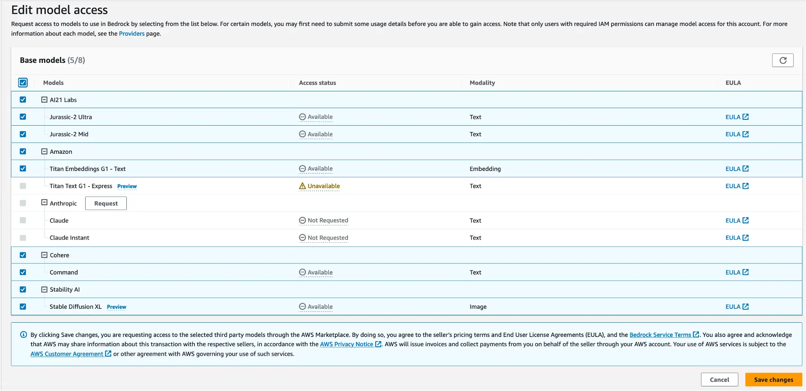
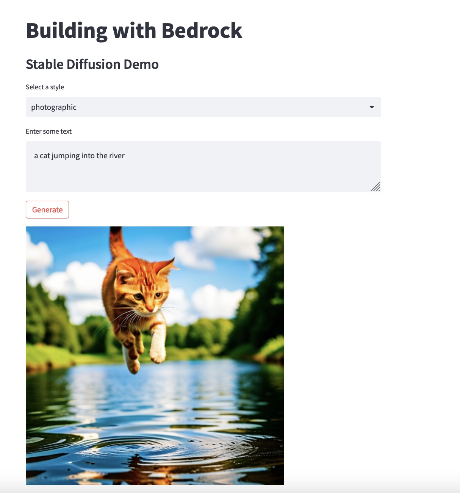
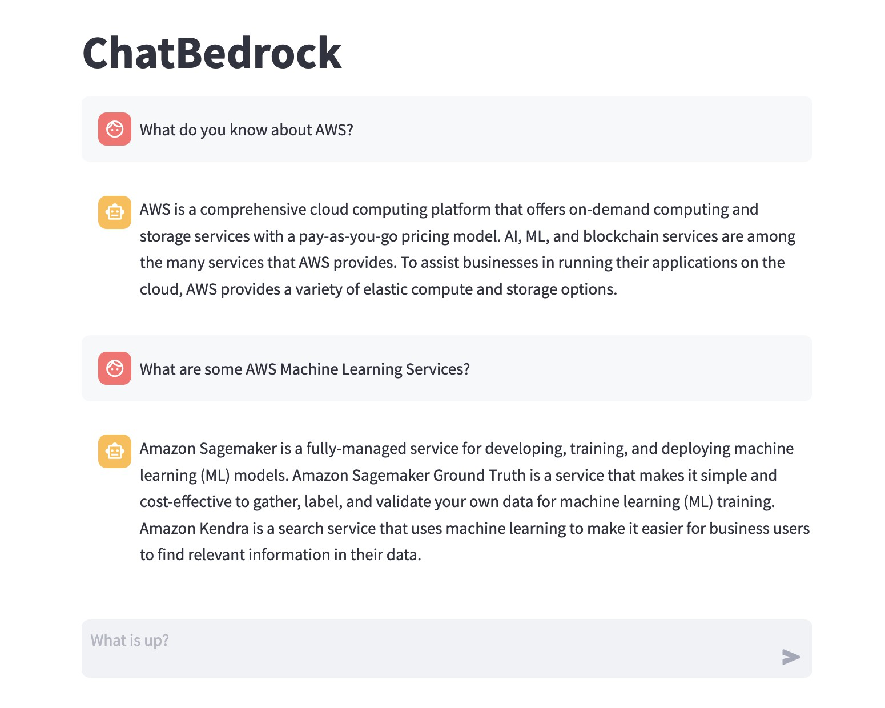

|ToC|
|---|

Amazon Bedrock has just launched, and it's already revolutionizing the generative AI landscape. Amazon Bedrock offers a seamless, serverless API that lets you choose from a variety of foundation models to fit your specific needs. Gone are the days of wrestling with complex setups and infrastructure, Amazon Bedrock simplifies it all. In this guide, we'll explore four distinct use cases, from image generation to text summarization, demonstrating the sheer versatility of this new service.

## Prerequisites

Ready to dive in? Here’s how to set up your [Amazon Bedrock](https://aws.amazon.com/bedrock/?sc_channel=el&sc_campaign=genaiwave&sc_geo=mult&sc_country=mult&sc_outcome=acq&sc_content=amazon-bedrock-quick-start) environment in no time.

### Step 1: Subscribe to Models in the Amazon Bedrock Console

In the Amazon Bedrock console, select Model access in the left navigation pane and enable the models you would like to access. Once model access is enabled, you can then use the API.

**Note:** For Claude models you have to enter some extra details, but you will get access instantly.



### Step 2: Check your Python version

Make sure you're running Python 3.9 or higher. If you're not, update it. Trust me, it'll make your life easier.

```bash
python --version
```

### Step 3: Install the essentials

Run the following command to grab the libraries you’ll need for this guide.

```bash
pip install -U boto3 langchain streamlit pillow faiss-cpu
```

Alright, you're all set to start building your next generative AI masterpiece with Amazon Bedrock.

The full code for the repo is located [here](https://github.com/build-on-aws/amazon-bedrock-quick-start)

## Creating stunning images with Stable Diffusion

You're a developer with an app idea that needs to transform text into detailed images. Maybe it's a game feature, or perhaps it's a unique meme generator. You realize that crafting such an application can be complex, requiring expertise in both natural language processing and computer vision.

Amazon Bedrock brings the power of [Stable Diffusion](https://aws.amazon.com/what-is/stable-diffusion/?sc_channel=el&sc_campaign=genaiwave&sc_geo=mult&sc_country=mult&sc_outcome=acq&sc_content=amazon-bedrock-quick-start) for image generation, and [Streamlit](https://streamlit.io/) adds the flair of interactive web apps. This combination lets you cut through the complexities and jump straight into building your application.

Before we jump into the coding part, let's understand the two core components we'll be using.

* **Streamlit:** This open-source Python library is a game-changer for building interactive web apps. Think of it as your go-to tool for quick and easy front-end development.

* **Stable Diffusion:** Released in 2022, this text-to-image model is a proficient at generating detailed visuals from textual descriptions. Imagine having a virtual artist at your command.

Now that we're familiar with our tools, let's get to the fun part—building the application.

For those who prefer to cut to the chase, the complete code for our image generation example can be found [here](https://github.com/build-on-aws/amazon-bedrock-quick-start/blob/main/sd_sample_st.py). Keep reading to see how I put it all together.

### Step 1: Initialize Amazon Bedrock

Kick things off by initializing Amazon Bedrock in your Python script.

```python
# Define Amazon Bedrock
bedrock_runtime = boto3.client(
    service_name='bedrock-runtime',
    region_name='us-east-1',
)
```

### Step 2: Invoke the Model

Once Bedrock is set up, it's time to bring Stable Diffusion into action.

```python
# Amazon Bedrock api call to stable diffusion
def generate_image(text, style):
    """
    Purpose:
        Uses Bedrock API to generate an Image
    Args/Requests:
         text: Prompt
         style: style for image
    Return:
        image: base64 string of image
    """
    body = {
        "text_prompts": [{"text": text}],
        "cfg_scale": 10,
        "seed": 0,
        "steps": 50,
        "style_preset": style,
    }

    if style == "None":
        del body["style_preset"]

    body = json.dumps(body)

    modelId = "stability.stable-diffusion-xl"
    accept = "application/json"
    contentType = "application/json"

    response = bedrock_runtime.invoke_model(
        body=body, modelId=modelId, accept=accept, contentType=contentType
    )
    response_body = json.loads(response.get("body").read())

    results = response_body.get("artifacts")[0].get("base64")
    return results
```

### Step 3: Display the Image

After the model generates your image, use the Python Imaging Library (PIL) to decode the base64 image and display it.

```python
# Turn base64 string to image with PIL
def base64_to_pil(base64_string):
    """
    Purpose:
        Turn base64 string to image with PIL
    Args/Requests:
         base64_string: base64 string of image
    Return:
        image: PIL image
    """
    import base64

    imgdata = base64.b64decode(base64_string)
    image = Image.open(io.BytesIO(imgdata))
    return image

```

### Step 4: Make it Interactive

Finally, let's make this a two-way street. Use Streamlit to add a text box where users can enter their own descriptions and see the image that Stable Diffusion generates in real-time.

```python
# List of Stable Diffusion Preset Styles
#sd_presets = ["None","3d-model","analog-film","anime",...

# select box for styles
style = st.selectbox("Select Style", sd_presets)
# text input
prompt = st.text_input("Enter prompt")

#  Generate image from prompt,
if st.button("Generate Image"):
    image = base64_to_pil(generate_image(prompt, style))
    st.image(image)
```

And there you have it—a simple yet powerful application that turns text into detailed images, all thanks to Stable Diffusion and Streamlit.



## Versatile Text Tasks with Foundation Models

You've seen how Amazon Bedrock excels in image generation. But what about text? Good news: Amazon Bedrock offers a range of foundation models that are great at text manipulation, far beyond simple generation. Whether you choose [Amazon Titan](https://aws.amazon.com/bedrock/titan/?sc_channel=el&sc_campaign=genaiwave&sc_geo=mult&sc_country=mult&sc_outcome=acq&sc_content=amazon-bedrock-quick-start) or another model, the possibilities are endless.

### Primer on Foundation Models

[Foundation models](https://aws.amazon.com/what-is/foundation-models/?sc_channel=el&sc_campaign=genaiwave&sc_geo=mult&sc_country=mult&sc_outcome=acq&sc_content=amazon-bedrock-quick-start) available through Amazon Bedrock are your Swiss Army knife for text tasks. These models can tackle a broad array of challenges:

* **Summarization:** Boil down lengthy articles into crisp summaries.
* **Code Generation:** Automate the creation of functions, modules, or even whole applications.
* **Q&A:** Design intelligent systems capable of answering queries based on specific data sets or documents.

Eager to see these tasks in action? Check out these [hands-on examples](https://github.com/build-on-aws/amazon-bedrock-quick-start/blob/main/text_examples.py) to get a real feel for what foundation models can do for you.

## Retrieval Augmented Generation (RAG)

Ready to up the ante? Let's explore how Amazon Bedrock can be used for [Retrieval Augmented Generation (RAG)](https://docs.aws.amazon.com/sagemaker/latest/dg/jumpstart-foundation-models-customize-rag.html?sc_channel=el&sc_campaign=genaiwave&sc_geo=mult&sc_country=mult&sc_outcome=acq&sc_content=amazon-bedrock-quick-start). This advanced technique augments your text prompts by pulling in data from a vector database, adding an extra layer of depth and accuracy.

### The Essentials: Embeddings, Vector Databases, and LangChain

Before diving into the code, it's crucial to grasp the key elements that will make our text generation application tick.

* **Embeddings:** These are vectors of floating-point numbers that help measure the relatedness between items. You've likely seen them in action in semantic search, classification, and recommendation systems.
* **Vector Databases:** These specialized databases manage vector embeddings. They simplify data management, offer real-time updates, and come with built-in security features, making them a preferred choice for developers.
* **LangChain:** A framework that supercharges applications with language model capabilities. LangChain makes your applications data-aware and interactive, offering modular components and off-the-shelf chains for various tasks.

For a real-world example of seeing these tools in action, check out blog post on how I built [AWS Solution Architect Agent with Generative AI.](/posts/building-agent-aws)

### QuickStart: Your Own RAG Demo

Feeling pumped? Let's walk through building a text generation app that uses RAG, and FAISS for vector database management, and [LangChain](https://www.langchain.com/) for streamlining the use of embeddings.

If you're ready to jump into the deep end, the full code for this RAG demo is available [here](https://github.com/build-on-aws/amazon-bedrock-quick-start/blob/main/rag_example.py). Below, I'll guide you through the building blocks of this project.

### Step 1: Embed Text with Titan

To work with vector databases, you'll need to embed your text first. Here's how you can do it:

```python
def get_embedding(body, modelId, accept, contentType):
    response = bedrock_runtime.invoke_model(body=body, modelId=modelId, accept=accept, contentType=contentType)
    response_body = json.loads(response.get('body').read())
    embedding = response_body.get('embedding')
    return embedding

body = json.dumps({"inputText": "explain black holes to 8th graders"})
modelId = 'amazon.titan-embed-text-v1'
accept = 'application/json'
contentType = 'application/json'

embedding = get_embedding(body, modelId, accept, contentType)
print(embedding)
```

### Step 2: The Power of LangChain

You can use LangChain to effortlessly manage embeddings and interact with language models. Here's an example:

```python
from langchain.embeddings import BedrockEmbeddings
from langchain.vectorstores import FAISS
import boto3
import json

sentences = [
    # Pets
    "Your dog is so cute.",
    "How cute your dog is!",
    "You have such a cute dog!",
    # Cities in the US
    "New York City is the place where I work.",
    "I work in New York City.",
    # Color
    "What color do you like the most?",
    "What is your favourite color?",
]

embeddings = BedrockEmbeddings()
local_vector_store = FAISS.from_texts(sentences, embeddings)

query = "What type of pet do I have?"
docs = local_vector_store.similarity_search(query)
context = ""

for doc in docs:
    context += doc.page_content
```

### Step 3: Add context to a Prompt

Now, let's look at a sample program that showcases RAG in action. RAG augments your text prompts by pulling in relevant data from a vector database, adding a layer of context to the generated text.

```python
prompt = f"""Use the following pieces of context to answer the question at the end.

{context}

Question: {query}
Answer:"""

bedrock = boto3.client(
    service_name="bedrock",
    region_name="us-east-1",
    endpoint_url="https://bedrock.us-east-1.amazonaws.com",
)

def call_bedrock(prompt):
    prompt_config = {
        "prompt": prompt,
        "max_tokens_to_sample": 4096,
        "temperature": 0.5,
        "top_k": 250,
        "top_p": 0.5,
        "stop_sequences": [],
    }

    body = json.dumps(prompt_config)

    modelId = "anthropic.claude-v2"
    accept = "application/json"
    contentType = "application/json"

    response = bedrock_runtime.invoke_model(
        body=body, modelId=modelId, accept=accept, contentType=contentType
    )
    response_body = json.loads(response.get("body").read())

    results = response_body.get("results")[0].get("outputText")
    return results
```

And there you have it! You've built a text generation application that not only creates text but also enriches it with context, thanks to RAG.

## Create a Chatbot with Amazon Bedrock and Streamlit

You've seen how Amazon Bedrock can generate images and text. But can it chat? You bet! In this module, we'll roll up our sleeves and build a chatbot that not only talks but also remembers previous conversations, thanks to Amazon Bedrock, LangChain, and Streamlit.

To make our chatbot even more reliable and steerable, we're also bringing [Anthropic's Claude](https://aws.amazon.com/bedrock/claude/?sc_channel=el&sc_campaign=genaiwave&sc_geo=mult&sc_country=mult&sc_outcome=acq&sc_content=amazon-bedrock-quick-start) into the mix. Claude is able to perform a wide range of tasks, from sophisticated dialogue and creative content generation to complex reasoning and detailed instruction.

For those eager to dive right in, you can find the complete code for this chatbot project [here](https://github.com/build-on-aws/amazon-bedrock-quick-start/blob/main/chat_bedrock_st.py). In the following section, I'll walk you through how I built it, step by step.

### Initialize Amazon Bedrock with LangChain

First things first, let's set up Amazon Bedrock in our project. We'll use Streamlit's `@st.cache_resource` decorator to cache the LangChain Language Model (LLM) instance. This saves us from recreating it every time we run the app.

```python
@st.cache_resource
def load_llm():
    llm = Bedrock(model_id="anthropic.claude-v2")
    llm.model_kwargs = {"temperature": 0.7, "max_tokens_to_sample": 2048}

    model = ConversationChain(
        llm=llm, verbose=True, memory=ConversationBufferMemory()
    )

    return model

model = load_llm()
```

### Design the UI

For our chatbot UI, we need a couple of things:

* Two message containers for the user and the bot.
* A chat input widget for the user.
* A mechanism to store and display chat history.

```python
# Initialize chat history
if "messages" not in st.session_state:
    st.session_state.messages = []

# Display chat messages from history on app rerun
for message in st.session_state.messages:
    with st.chat_message(message["role"]):
        st.markdown(message["content"])
```

### React to User Input

Now let's capture the user's input, display it, and add it to the chat history.

```python
# React to user input
if prompt := st.chat_input("What is up?"):
    # Display user message in chat message container
    st.chat_message("user").markdown(prompt)
    # Add user message to chat history
    st.session_state.messages.append({"role": "user", "content": prompt}
```

### Generate Chatbot Responses

Next up, let's code the bot's responses. We'll use LangChain's predict function to generate replies based on the user's input.

```python
    with st.chat_message("assistant"):
        message_placeholder = st.empty()
        full_response = ""

        result = model.predict(input=prompt)
```

### Add a Thinking Process

To make the chat experience more dynamic, let's simulate the chatbot's thinking process by streaming its responses.

```python
        # Simulate stream of response with milliseconds delay
        for chunk in result.split():
            full_response += chunk + " "
            time.sleep(0.05)
            # Add a blinking cursor to simulate typing
            message_placeholder.markdown(full_response + "▌")

        message_placeholder.markdown(full_response)
```

And there you have it—a chatbot built with Amazon Bedrock, LangChain, and Streamlit, all in about 50 lines of code. To give your chatbot a whirl, just run `streamlit run chat_bedrock_st.py`.



## Your Generative AI Toolkit

You've just taken a deep dive into the versatile world of Amazon Bedrock. From generating stunning images with Stable Diffusion to enriching text using Amazon Titan and RAG, we've covered a lot of ground. And let's not forget the chatbot that converses like a pro, thanks to Claude.

### What's Next?

You're probably buzzing with ideas by now, and that's exactly where you should be. Your next steps?

* **Experiment:** Take the example codes, tweak them, break them, and make them your own.
* **Explore:** Dive deeper into the features and capabilities of Amazon Bedrock, LangChain, and more.
* **Engage:** Share your projects, and learn from others. Reach out to [@awsdevelopers on X](https://twitter.com/awsdevelopers), [Instagram](https://www.instagram.com/awsdevelopers/), and [LinkedIn](https://www.linkedin.com/showcase/aws-developers/)

### Ready, Set, Build!

Don't just sit there, the world of generative AI is waiting for you. Whether you're looking to augment your existing projects or start a new one, Amazon Bedrock offers the tools to make it happen. So go ahead, get your hands dirty and start building your next application with Amazon Bedrock today!
