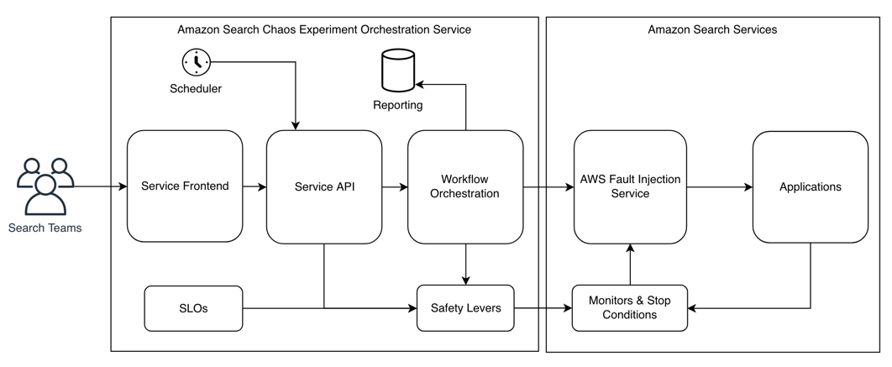
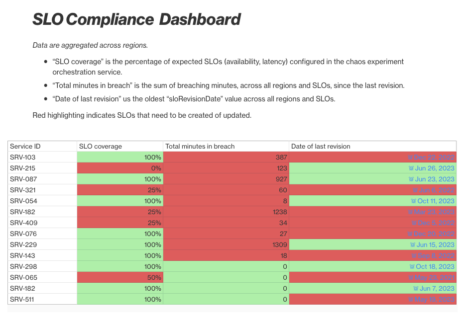

|ToC|
|---|

Our [previous blog post](/posts/how-search-uses-chaos-engineering) provided an overview of how Amazon Search combines technology and culture to empower its builder teams, ensuring platform resilience through chaos engineering. In this follow-up, we will address questions and feedback received from the previous post. We will discuss our Search Resilience team, detailing our progression from running load tests in the production environment to adopting chaos engineering and conducting numerous large-scale experiments. We'll also explore the journey that brought us to this point and delve into the practical aspects and key milestones of this implementation.

## The first Search GameDay in production

Amazon Search owns the product search pages for Amazon mobile apps and websites worldwide. Serving search pages depends on a complex distributed system consisting of dozens of critical services: from the actual information retrieval search engine to rendering search pages with product images, pricing, delivery, and related information.

There are dozens of teams building product search, but today we will talk about our Search Resilience team that improves the resilience of Amazon Search by running chaos experiments in production at scale and driving and promoting resilience initiatives. The Resilience team is part of a larger [Operational Excellence](https://docs.aws.amazon.com/wellarchitected/latest/operational-excellence-pillar/welcome.html?sc_channel=el&sc_campaign=resilience&sc_geo=mult&sc_country=mult&sc_outcome=acq&sc_content=amazon-search-chaos-engineering-journey) organization within Search with the vision to make it effortless for service owners to run their services in production, so they can focus on their primary mission of improving the customer experience by providing the most relevant search results as fast as possible.

Many years ago, our team was scaling up Search services to prepare for a sales event with a large projected increase in traffic. As was Standard Operating Procedure (SOP) at the time, we tested the performance of each service (e.g., Transaction-Per-seconds per server), added a safety buffer in case traffic would be higher than forecasted, and then scaled out the fleets horizontally. As the peak of customer requests during the event arrived, we were suddenly unable to serve some customer requests.

We performed a [Correction of Error (COE)](https://aws.amazon.com/blogs/mt/why-you-should-develop-a-correction-of-error-coe?sc_channel=el&sc_campaign=resilience&sc_geo=mult&sc_country=mult&sc_outcome=acq&sc_content=amazon-search-chaos-engineering-journey), which is Amazon's process for post-incident analysis, to deep dive into the problem and identify corrective actions to prevent any recurrence. We arrived at two key insights: First, the bottleneck in our system had shifted without our awareness. It was no longer centered on the servers managing product indices. Instead, the bottleneck had migrated upstream to the component responsible for aggregating search requests across various indices. Second, we had reached a point where Search had grown so much in response to customer needs, that no individual engineer fully understood all bottlenecks, thresholds, queues, and failover mechanisms.

A corrective action from this COE was to implement end-to-end production load tests of the fully scaled up system before peak, also known as [GameDays](https://www.usenix.org/conference/lisa11/gameday-creating-resiliency-through-destruction). We conducted these tests to specifically assess three aspects: 1) our scaling methodology and validate the expected bottleneck location, 2) our performance benchmarks, and 3) the effectiveness of our resilience mechanisms against the actual reality of the production environment’s scale, configuration, and customer behavior.

## Embracing GameDays at scale in production

As we added production GameDays to our SOPs for peak readiness — being prepared for high-demand periods —, Amazon continued expanding, experiencing new peak events such as [Prime Day](https://aws.amazon.com/blogs/aws/prime-day-2023-powered-by-aws-all-the-numbers?sc_channel=el&sc_campaign=resilience&sc_geo=mult&sc_country=mult&sc_outcome=acq&sc_content=amazon-search-chaos-engineering-journey) that took place globally and throughout the year. Search grew along, with higher query volumes, bigger indexes, and even more services to deliver a better search experience. The next bottleneck we encountered was our engineer resources. Our team's workload for preparing for peak events was steadily increasing, and simply adding more staff in proportion to the growth of Search shouldn't be the first answer. Another problem we encountered was the infrequent use of our load generation tools, which were employed only a few times per year to test a system that had undergone numerous changes since the previous test. This often resulted in the realization that the tools were generating traffic that didn't accurately reflect current traffic patterns. For example, after a peak event, we would find that we had either over-loaded or under-loaded some services, and neither of those results gave us sufficient confidence in our resilience.

We call this problem “traffic fidelity”. The test traffic we generate should be representative of real customer behavior so we test the system (and its dependencies) in a realistic way with realistic load. One of the complexities in Search is that the service load depends on a number of parameters of a request: searching all products in the US on the desktop website has a very different performance profile than searching Kindle books in Mexico from the Amazon app. Even the customer keywords can impact which services are invoked and their performance. Generating synthetic traffic to meet forecasted thresholds along these parameters becomes a hard problem in a large distributed system such as Search: the potential code paths a request can take across dozens of services is too large for any single person to understand. There are also hard limitations, for example, we have to mark our traffic as robot to avoid polluting business metrics.

We were able to solve the challenges of 1) scaling a complex system for peak sales events and 2) validating readiness through one key insight: we needed to be ready and resilient all the time, not just for peak events, but for any traffic spike. We had to massively reduce the cost of running a GameDay and set a goal to fully automate the process. We prioritized a systems and software development effort to enable “one-click GameDays” with zero operator actions or monitoring required. As a result of this effort, we can now run fully automated load and stress tests of varying traffic volumes. These allow us to catch regressions in the architecture or in traffic fidelity shortly after they manifest, instead of during the weeks and days leading up to a peak event. The sooner you detect an issue, the fewer commits and deployments you have to investigate to figure out what changed.

We also learned that validating readiness requires more than a GameDay with good traffic fidelity. Even if we have tooling that can perfectly generate load with arbitrary traffic fidelity, we still cannot perfectly predict customer behavior on Prime Day. To mitigate this potential risk, we allocated resources to construct and validate [emergency levers](https://docs.aws.amazon.com/wellarchitected/latest/framework/rel_mitigate_interaction_failure_emergency_levers.html?sc_channel=el&sc_campaign=resilience&sc_geo=mult&sc_country=mult&sc_outcome=acq&sc_content=amazon-search-chaos-engineering-journey) (tested in production environments) such as load shedding mechanisms, preparedness of on-call engineers through simulated emergency scenarios, periodic review of SOPs and their recent execution history, as well as the development of emergency scaling protocols, among other strategies.

## Towards chaos engineering in production

Following our GameDay automation initiative, we understood its applicability beyond GameDays to various other types of experiments. For instance, we could introduce latency, impair our ability to run across multiple Availability Zones, or employ packet blackholing in Search services, enhancing customer availability without imposing additional tasks on service owners. This expansion aligns with our objective of leveraging automation to enhance service reliability and customer experience.

We were now ready to implement chaos engineering at scale across all Search services. Our approach involves conducting experiments by deliberately increasing system load, operating under the assumption that availability won't be compromised. These tests are executed in the production environment, mirroring the conditions customers encounter, ensuring the highest level of confidence in the results. From an engineering perspective, this process is entirely automated and incorporates multiple safety measures to prevent mishaps.

Despite our achievements, one pressing question remained.

How can our small team effectively manage the creation, execution, and upkeep of hundreds of experiments across the entirety of Search? Moreover, how can we address the overwhelming possibilities resulting from numerous fault injection types, experiment parameters, and involved services? The manual maintenance of such a vast number of experiments, including steady state measurements and evolving experiment parameters, becomes impractical as Search continues to evolve its architecture.

## Building a chaos experiment orchestration service on AWS with FIS

Building on our success with automating GameDays, we made an inventory of all commonalities and manual efforts required to run chaos experiments in production:

1. Implement guard rails to prevent or limit customer impact during experiments.
2. Automatically shut down experiments if there's a disruption in the steady state, meaning unintended customer impact.
3. Set up infrastructure provisioning, such as chaos injecting agents, sidecar containers, and AWS resources.
4. Execute experiments regularly to detect regressions at an early stage.
5. If regressions occur, escalate the issue to service owners.

We call these efforts “undifferentiated heavy lifting” because they are duplicate toil across multiple teams and services. While this work benefits the customer in terms of higher availability, it does not directly contribute to service owners’ missions of improving the customer experience through delivering new features, better ranking, etc. We wanted to build a chaos experiment orchestration service to automate all this heavy lifting, but were wary of the recurring costs in terms of operating and maintaining such a service. We also knew introducing failures in production is a scary proposition to sell, and any unintended impact would set back the adoption of chaos engineering. These were strong motivations to build something simple to understand, maintain, and troubleshoot.

At Amazon, we use tenets to facilitate making hard decisions and trade-offs between our [leadership principles](https://www.aboutamazon.com/about-us/leadership-principles). For example, how can we reconcile our Customer Obsession leadership principle with experimenting in production and affecting actual customer requests? It was useful to write down these tenets and reach a consensus with the Search team *before* we encounter these difficult decisions. Here is what we came up with:

1. Controlled customer impact is preferred to unexpected customer impact during peak traffic.
2. Every experiment tests a hypothesis.
3. We don’t test in production when alternatives are available.
4. We rely on fail-safes and heartbeats in chaos experiments, allowing the system to proactively stop disruptive experiments without needing an external signal to terminate them.
5. We prioritize [crash-only](https://en.wikipedia.org/wiki/Crash-only_software) models over adding complexity for error-handling and recovery.
6. We implement multiple fail-safes and guardrails because we recognize that bugs will happen.

With these [tenets](https://aws.amazon.com/blogs/enterprise-strategy/tenets-supercharging-decision-making/) in mind, we set out to deliver a simple chaos experiment orchestrator starting with a [Cloud Development Kit (CDK)](https://aws.amazon.com/cdk?sc_channel=el&sc_campaign=resilience&sc_geo=mult&sc_country=mult&sc_outcome=acq&sc_content=amazon-search-chaos-engineering-journey) library for internal Search teams. We automated the creation of [Identity and Access Management (IAM)](https://docs.aws.amazon.com/IAM/latest/UserGuide/introduction.html?sc_channel=el&sc_campaign=resilience&sc_geo=mult&sc_country=mult&sc_outcome=acq&sc_content=amazon-search-chaos-engineering-journey) permissions and roles, [AWS Fault Injection Service (FIS)](https://docs.aws.amazon.com/fis/latest/userguide/what-is.html?sc_channel=el&sc_campaign=resilience&sc_geo=mult&sc_country=mult&sc_outcome=acq&sc_content=amazon-search-chaos-engineering-journey) experiments, and CloudWatch monitors, which measure steady state and [stop conditions](https://docs.aws.amazon.com/fis/latest/userguide/stop-conditions.html?sc_channel=el&sc_campaign=resilience&sc_geo=mult&sc_country=mult&sc_outcome=acq&sc_content=amazon-search-chaos-engineering-journey) for FIS. This allows service owners to deploy all the essential infrastructure needed for chaos experiments into their AWS accounts using just one CDK statement. We can then define experiments in a concise 10–15 lines of YAML and seamlessly deploy it alongside their infrastructure pipelines. This approach eliminates the complexities and repetitive tasks associated with preparing a service for conducting safe chaos experiments.

Next, we used AWS EventBridge [scheduled rules](https://docs.aws.amazon.com/fis/latest/userguide/fis-tutorial-recurring-experiment.html?sc_channel=el&sc_campaign=resilience&sc_geo=mult&sc_country=mult&sc_outcome=acq&sc_content=amazon-search-chaos-engineering-journey) as a “cron in the cloud” to run experiments automatically at a monthly or bi-weekly cadence. EventBridge invokes an AWS Lambda function that holds the business logic of our chaos experiment orchestrator. This Lambda verifies our guardrails so that we don’t run experiments during peak sales events or when there is an operational incident ongoing. It keeps experiment history in DynamoDB, and emits both operational and business metrics to CloudWatch. We use Amazon Simple Storage Service (S3) to host a website and API Gateway to enable internal customers to invoke and monitor their experiments from the website. Experiment lifecycles and injecting faults are completely managed by FIS. Finally, we use AWS SSM Parameter Store to manage hierarchical safety levers. We have a top-level safety lever that will immediately halt all experiments everywhere. Anyone in Search can pull this lever if they suspect a chaos experiment is causing unintended customer impact. We also have more granular levers to halt all experiments for a service, or just a single specific experiment.

## Measuring steady state with SLOs and error budgets

Each chaos experiment needs to measure the steady state (a service’s normal operating conditions). These are usually metrics like orders per minute, latency, availability, etc. To stay true to our vision to make it effortless to run services in production, we had to figure out a way to measure steady state without generating extra work for service owners.

The first problem we had to solve was how do we actively cause controlled chaos in production without triggering pages for service on-calls? After all, if we inject latency into a service, it is reasonable to expect that a latency alarm will trip and page an on-call. On-call personnel should ideally only get alerted for sudden problems they can fix. A planned chaos experiment isn't a surprise, so it doesn't need an immediate alert.

We thought about consulting each service team to adjust their alarm settings, but we realized it wouldn't work for many services—there's too much manual work involved. We also thought about making a separate set of alarms for regular system behavior, but that wouldn't be practical to maintain either. We've seen problems before where system changes weren't matched with updated alert settings, causing hidden or long-lasting issues, and we don't want that.

Our solution was to leverage Service Level Objectives (SLO). An SLO is a target value or range of values for a service level that is measured by a Service-Level Indicator (SLI). An SLI is a defined quantitative measure of some aspect of the level of service that is provided to customers of that service. Most services consider request latency—how long it takes to return a response to a request—as a key SLI. Other common SLIs include the error rate, often expressed as a fraction of all requests received, and system throughput, typically measured in requests per second. For example, a service may commit to returning results with a latency of less than 1200ms for at least 99.9% of all requests in a given trailing 30-day window. With this example SLO of 99.9%, we also get a 0.1% “error budget” where errors (failures, down-time, latency spikes) are allowed to occur without breaching the SLO.

We developed an SLO monitoring service and promoted the adoption of SLOs throughout the Search organization. Our goal was to establish a single, authoritative source of truth regarding the expected availability and latency of our services for customers, such as aiming for 99.99% availability. This would grant us an error budget of 0.01% that we could utilize for regular deployments, A/B tests, and, of course, chaos experiments. Having an SLO in place provides an automated means to measure steady state. If your error budget depletes during an experiment, it triggers an automatic abort. Similarly, if the rate at which your error budget is depleting changes, we also initiate an automatic abort. During normal operation of your service, you actually expect to consume some of your error budget. If this natural depletion rate suddenly changes during execution of a chaos experiment, that’s a clear indicator an engineer should investigate if there was a regression. If you use budget burn-rate alerts to notify on-call staff, you can cut down on the number of monitors you have to manage for both regular issues and chaos experiments. And perhaps most importantly, we prioritize the customer experience. If a service has already exhausted its error budget, we don’t schedule any experiments.

Error budgets are replenished using a sliding window approach that observes a specific timeframe, typically in days or weeks. Let's say you have an error budget that allows a certain percentage of errors over a defined period, like a month. As incidents occur and consume your error budget, they gradually affect your available budget within that timeframe. With the sliding window method, as time progresses, older incidents drop out of the window's calculation. For instance, if you're looking at a 28-day window, after a day, the oldest day in the window falls out, and the newest day enters. This continuous sliding mechanism ensures that your error budget is based on a recent timeframe, accounting for new incidents while allowing older ones to no longer impact the current budget. So, as time passes, incidents that occurred earlier will no longer contribute to the current error budget, effectively replenishing it as the sliding window moves forward. This way, the error budget is a dynamic measure that reflects recent system performance, encouraging teams to focus on resolving issues promptly to maintain a healthy error budget for future use.

There's an additional layer of complexity when using burn rates to gauge steady state that's worth exploring. We can categorize chaos experiments into two groups:

1. Experiments that validate the system's resilience to a particular failure: For instance, when we terminate a host, the service seamlessly switches to another host, and the end customer doesn't experience any disruption. In other words, these experiments don't impact the measured steady state during the experiment itself.
2. Experiments where the hypothesis is that the system will recover from the failure without human operator intervention: For example, if a critical dependency experiences an outage, we want to ensure that our service doesn't wait indefinitely, tying up sockets and threads, but rather promptly recovers when it becomes available again. In this case, we want to measure that we've returned to our steady state after the experiment.

In practice, we assess the burn rate both before and after the experiment and make a comparison. If the two burn rates don't align, we consider the experiment to have failed. This approach helps us determine whether the system has truly returned to its expected steady state following the chaos experiment.

## Experiments at scale

We currently conduct a set of default experiments across all our services. These experiments encompass:

1. Instance Termination: testing the system's resilience to a loss of compute resources.
2. Latency Injection: introducing latency to assess the system's performance under degraded network conditions.
3. Packet Black-holing: investigating how the system recovers under 100% packet loss.
4. Emergency Levers: activation of emergency levers (e.g., turning off features to reduce load) to ensure they work without encountering issues when they are most needed.

Considering the multitude of services within Search, spanning various teams and organizations, it is important to provide leaders with visibility into their organization's operational excellence and resilience. To achieve this, we implemented two mechanisms:

The first mechanism is a chaos experiment report that displays the number of days since the last successful execution for each experiment across all services within the leader's organization. Presently, we require every experiment to be executed successfully at least once every 30 days. If an experiment goes without a successful execution for more than 30 days, it is flagged in red. This serves as an indicator for leaders to investigate the underlying reasons. These reasons could include:

1. Insufficient Error Budget: the service may not have any error budget left (i.e., breaching their SLO) so we should prioritize the customer experience instead of running chaos experiments.
2. Issue Detection: the experiment may have uncovered an issue that is being investigated and fixed. In such cases, there is no need to run the experiment until the issue has been addressed.
3. Manual Disabling: Experiments may have been intentionally disabled to preserve error budget for challenging operational migrations or sales events.

It is important to note that we strongly support the third case, encouraging service owners and leaders to use their error budgets and SLOs as tools for making data-driven business trade-offs and prioritization decisions in the best interests of the customer (e.g., prioritizing new feature development over increasing availability).

The second mechanism is an SLO report for leaders that provides insights into the SLOs of all services in their organization. We currently require availability and latency SLOs. We do not separately track errors (e.g., a search page widget failing to render) or coverage (e.g., only partial search results). We consider these as availability issues because we are unable to deliver the intended customer experience, regardless of the underlying technical root cause. We track latency as a separate SLO because our larger organization has specific goals around protecting and reducing latency, as well as reporting on it.

This SLO report has the following operational metrics:

1. SLO Last Revision Time: we document when the SLO was last revised, meaning SLIs (metrics) were added or removed, or thresholds were modified upwards or downwards.
2. SLO Breach Duration: we track the total duration in minutes that a specific SLO revision has spent in breach. This means when the error budget is zero or in the negative range.
3. SLO Coverage: we assess whether all SLOs (availability and latency) are present and actively monitored for a particular service.

Here's an example of this type of dashboard. The service IDs and numbers have been fabricated to maintain anonymity and confidentiality.

We chose these metrics to provide the right insights and influence leaders to ask the right questions. The SLO Last Revision Time is important because customer expectations and business priorities change over time. An SLO that has not been revised for a long time may no longer be the right objective to pursue. We chose SLO Breach Duration because we do not want to penalize teams for breaching SLOs. Setting good SLOs by choosing the right customer-facing SLIs and thresholds is hard. It is an ongoing process and not a one-time effort. By exposing how long an SLO is in a breaching state we encourage leaders to pay attention to their SLO setting process, not to single out teams for breaches. Finally, SLO Coverage ensures services are thinking about how to measure their intended customer experience and actually have SLOs in place.

In large organizations such as Search, there will always be competing business priorities, goals, and projects. By providing these mechanisms we enable teams to make conscious data-driven trade-offs when prioritizing new feature development versus SLOs and resiliency.

## Conclusion

Amazon Search's journey into chaos engineering illustrates the dynamic evolution of modern system resilience. From a pivotal incident during a peak sales event to the implementation of fully automated chaos experiments, the article highlights the significance of proactive testing and the automation of chaos experiments. By leveraging Service Level Objectives (SLOs) and error budgets, the team has made great strides in ensuring steady-state measurements and detecting anomalies during experiments. This journey underscores the importance of embracing chaos engineering as a core practice for maintaining system resilience.
