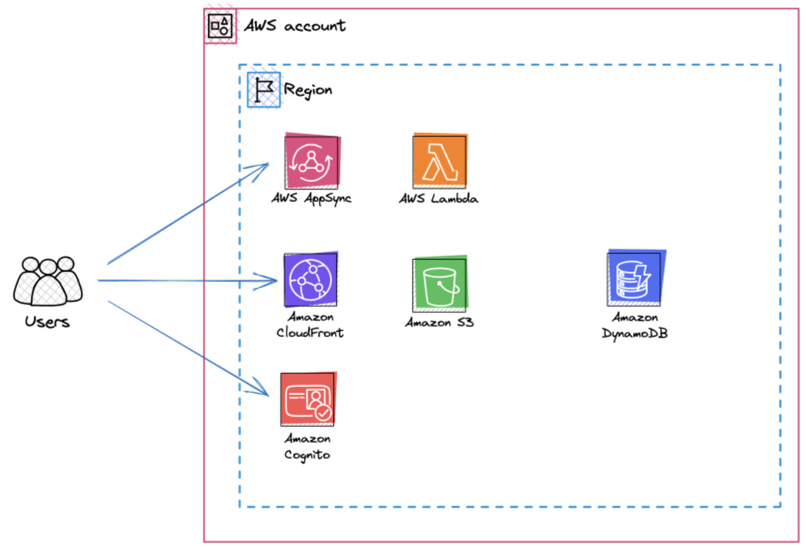
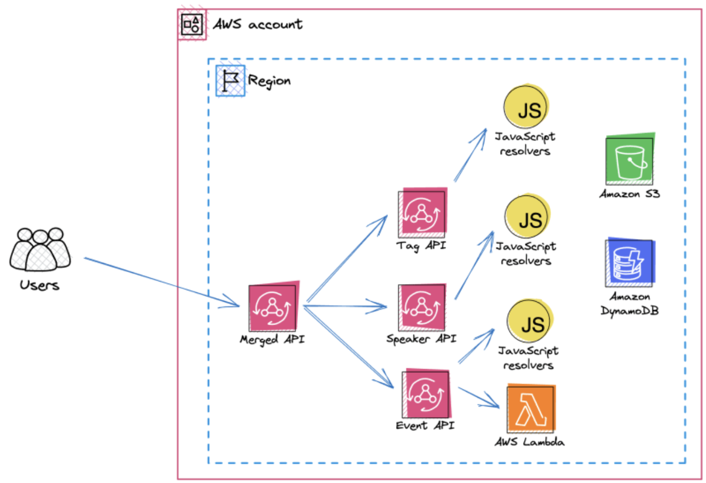
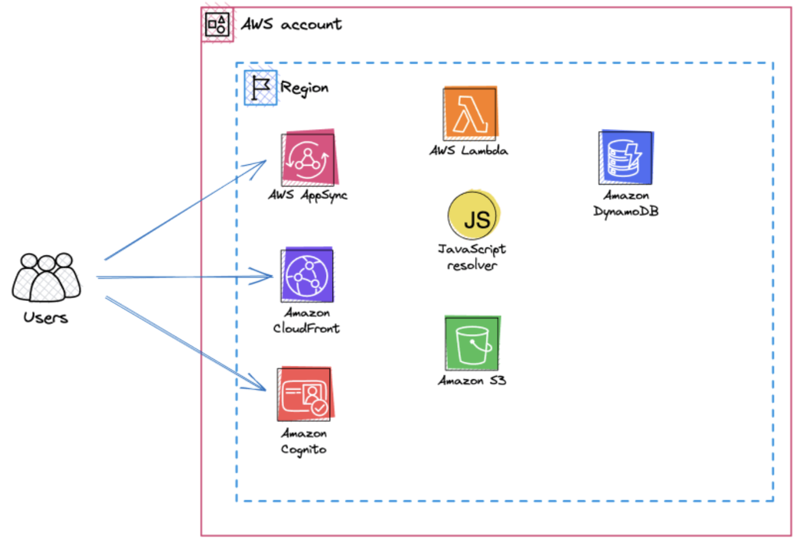
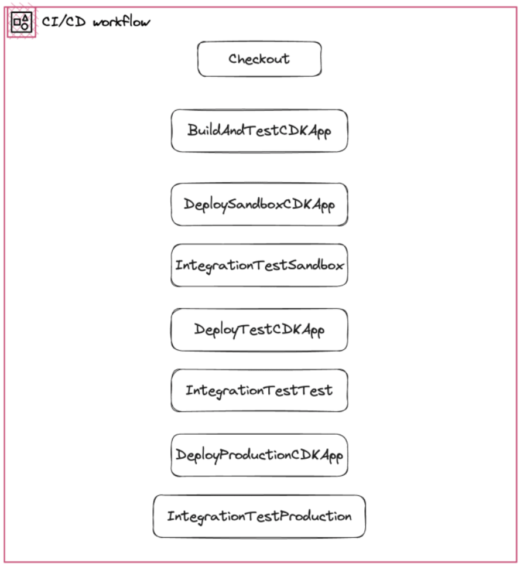

In this article you are going learn how to build a simple Flutter Web application that uses the Amplify SDK to talk to a serverless, AWS backend. The sample project uses Cognito for Authentication and AppSync for the API. On AppSync, you will make use of the "Merged APIs" feature which will enable you to quickly scale out this project if your project becomes "the next big hype" on the net. The deployment happens through CodeCatalyst workflows using AWS CDK.

| ToC |
|-----|

## High-Level architecture


In the sample project we will use a few AWS services:
Our web-page (build in Flutter) will be hosted on Amazon S3 behind Cloudfront. Cognito will be used for Authentication. AppSync will be our API endpoint and we'll connect to DynamoDB as a database. A few API endpoints will have Lambda functions.

## Used technologies in this project

Technology wise this project uses Flutter for our Front-End code, TypeScript for code on the backend. Also our infrastructure as Code (IaC) is written in TypeScript and uses [AWS CDK](https://aws.amazon.com/cdk/).

### What is Flutter? Why Flutter?

[Flutter](https://flutter.dev) is a trending cross-platform development toolkit and although it is mainly sponsored by Google there is a vibrant open source community. Flutter allows you to develop a user interface once and then package it for different platforms like Android, iOS, the Web or even Linux and Windows. The source code you write is being translated into natively readable code for the target platform which makes Flutter faster then other cross platform development tools.
In the project you will use the [Flutter Amplify](https://docs.amplify.aws/lib/q/platform/flutter/) SDK to connect the Flutter application to the serverless backend.

### Using AWS AppSync - what are Merged APIs?

[AppSync Merged APIs](https://docs.aws.amazon.com/appsync/latest/devguide/merged-api.html) have been announced in 2023 and empower development teams to split up responsibilities between different teams as APIs for specific endpoints can be development independently from each other. This is a functionality meant for teams that do not interact on a regular basis and own different parts of a joined API. It simplifies the collaboration of teams and ensures that an API that is supported by different downstream can be updated independently. AppSync takes the responsibility of merging the different backend APIs together and only one API endpoint can be exposed to users of the overall API.

### Writing infrastructure as code using AWS CDK

The [AWS CDK](https://aws.amazon.com/cdk/) is a Infrastructure as Code (IaC) tool that allows you to write and define your infrastructure in different programming languages - Typescript/Javascript, Python, Java, C# and Go. The tool then translates the infrastructure into [AWS Cloudformation](https://aws.amazon.com/cloudformation/) templates and uses CloudFormation APIs to deploy and provision the infrastructure. This allows developers to write infrastructure code in the same language as they use for the backend services.

## Setting up the serverless backend

As mentioned before - in this project you are going to build a fully serverless backend which is connected to Flutter using the AWS Amplify SDK.  The backend consists of a persistence layer and and authentication tool - and an API endpoint.

### Persistance layer & authentication

The persistance layer of this example project is based on [DynamoDB](https://aws.amazon.com/dynamodb/) and [S3](https://aws.amazon.com/s3/). S3 can be used to store and save files, DynamoDB is used as a database backend to store information about users and other data. S3 is used behind CloudFront to store our Flutter Web components - but this is something you will see later.

You will use [Amazon Cognito](https://aws.amazon.com/pm/cognito/) to register and identify users.

#### The CDK code for DynamoDB and Cognito

In DynamoDB, you use the "[single table design](https://aws.amazon.com/blogs/compute/creating-a-single-table-design-with-amazon-dynamodb/)" modelling to store all of your different entities in a single DynamoDB table. This table can be created using CDK in with this code:

```typescript
createTable(namespace: string): Table {
    const table = new Table(this, `BackendTable-${namespace}`, {
      billingMode: BillingMode.PAY_PER_REQUEST,
      partitionKey: {
        name: 'pk',
        type: AttributeType.STRING,
      },
      removalPolicy: RemovalPolicy.DESTROY,
      sortKey: {
        name: 'sk',
        type: AttributeType.STRING,
      },
      stream: StreamViewType.NEW_IMAGE,
      tableName: `backend-table-${namespace}`,
    });

    table.addGlobalSecondaryIndex({
      indexName: 'gsi1',
      partitionKey: {
        name: 'gsi1pk',
        type: AttributeType.STRING,
      },
      sortKey: {
        name: 'gsi1sk',
        type: AttributeType.STRING,
      },
    });

    return table;
  }
```

You will later use the `pk` (primary key), the `sk` (sort key) to access your data. The `pk` needs to be unique across all of your data.
The model additional access patterns, you can use the secondary index `gsi1pk` and `gsi1sk`. 

Setting up the Cognito backend can also be done using CDK:

```typescript
createUserPool(namespace: string): cognito.UserPool {
    const postConfirmationLambda = new NodejsFunction(this, `${namespace}-post-confirmation-lambda`, {
      entry: 'backend/src/auth/post-confirmation.ts',
      runtime: Runtime.NODEJS_18_X,
      bundling: {
        externalModules: ['@aws-sdk/client-dynamodb', '@aws-sdk/lib-dynamodb'],
      },
      environment: {
        TABLE_NAME: this.table.tableName,
      },
    });
    this.table.grantReadWriteData(postConfirmationLambda);

    const userPool = new cognito.UserPool(this, 'UserPool', {
      selfSignUpEnabled: true,
      removalPolicy: RemovalPolicy.DESTROY, // for development only
      standardAttributes: {
        email: {
          required: true,
        },
      },
      autoVerify: {
        email: true,
      },
      keepOriginal: {
        email: true,
      },
      lambdaTriggers: {
        postConfirmation: postConfirmationLambda,
      },
      customAttributes: {
        city: new cognito.StringAttribute(),
        country: new cognito.StringAttribute(),
      },
    });

    const groups = ['Speaker', 'Organizer', 'Admin'];

    groups.forEach((groupName) => {
      new cognito.CfnUserPoolGroup(this, `UserPoolGroupAdmin${groupName}`, {
        groupName,
        userPoolId: userPool.userPoolId,
      });
    });

    userPool.addClient('UserPoolClientFrontend', {
      authFlows: {
        userPassword: true,
        userSrp: true,
        custom: true,
      },

      oAuth: {
        flows: {
          authorizationCodeGrant: true,
        },
        scopes: [
          cognito.OAuthScope.OPENID,
          cognito.OAuthScope.PHONE,
          cognito.OAuthScope.EMAIL,
          cognito.OAuthScope.PROFILE,
          cognito.OAuthScope.COGNITO_ADMIN,
        ],
        callbackUrls: ['https://example.lockhead.info', 'https://test.example.lockhead.info'],
        logoutUrls: ['https://example.lockhead.info/logout', 'https://test.speakers.lockhead.info/logout'],
      },
    });

    return userPool;
  }
```

As you can see, we are defining required fields and available roles in Cognito that we can later map to IAM permissions. To ensure that every newly registered user is automatically added to your DynamoDB table, you can use a post confirmation lambda function as implemented in this code.

```javascript
import { PutCommand } from '@aws-sdk/lib-dynamodb';

import { docClient, tableName } from '../util/docClient';

import type { PostConfirmationTriggerEvent } from 'aws-lambda';
const handler = async (event: PostConfirmationTriggerEvent): Promise<PostConfirmationTriggerEvent> => {
  try {
    const item = {
      pk: `user#${event.userName}`,
      sk: `user#${event.userName}`,
      username: event.userName,
      email: event.request.userAttributes.email,
      firstName: event.request.userAttributes.given_name,
      lastName: event.request.userAttributes.family_name,
      birthdate: event.request.userAttributes.birthdate,
      gender: event.request.userAttributes.gender,
      city: event.request.userAttributes['custom:city'],
      country: event.request.userAttributes['custom:country'],
    };

    await docClient.send(
      new PutCommand({
        TableName: tableName,
        Item: item,
      }),
    );
  } catch (err) {
    console.log(err);
    throw new Error('Registration failed');
  }
  return event;
};

export { handler };
```

With these two code snippets, you have a main part of the application already finished, but you did not yet create an API that can be used to access the contents in the DynamoDB from the frontend. This is what you will do next.

### APIs - the AppSync setup and Schema

This diagram is a visualization of a project that I have been involved recently - the [AWS Community Builders Speakers Directory](https://speakers.awscommunitybuilders.org):



This diagram shows the idea and concept behind the Merged APIs feature that we introduced at the beginning of the post: one central API is exposed to the users (the front-end), and behind that there are multiple different apis that use - if required - different technologies, languages, etc.
This feature is very powerful for bigger organizations that have very segregated teams. Since *v2.94.0* this is also supported by the AWS CDK with an L2 construct:

```typescript
import * as cdk from 'aws-cdk-lib';

// first source API
const firstApi = new appsync.GraphqlApi(this, 'FirstSourceAPI', {
  name: 'FirstSourceAPI',
  definition: appsync.Definition.fromFile(path.join(__dirname, 'appsync.merged-api-1.graphql')),
});
firstApi.addNoneDataSource('FirstSourceDS', {
  name: cdk.Lazy.string({ produce(): string { return 'FirstSourceDS'; } }),
});

// second source API
const secondApi = new appsync.GraphqlApi(this, 'SecondSourceAPI', {
  name: 'SecondSourceAPI',
  definition: appsync.Definition.fromFile(path.join(__dirname, 'appsync.merged-api-2.graphql')),
});
secondApi.addNoneDataSource('SecondSourceDS', {
  name: cdk.Lazy.string({ produce(): string { return 'SecondSourceDS'; } }),
});
    const speakerDataSource = secondApi.addDynamoDbDataSource(`backend-datasource-${namespace}`, this.table);

    createAppsyncResolver(
      secondApi,
      speakerDataSource,
      'Query',
      'getInformation',
      '../lib/gql-functions/Query.getInformation.js',
    );
// Merged API
const mergedApi = new appsync.GraphqlApi(this, 'MergedAPI', {
  name: 'MergedAPI',
  definition: appsync.Definition.fromSourceApis({
    sourceApis: [
      {
        sourceApi: firstApi,
        mergeType: appsync.MergeType.MANUAL_MERGE,
      },
    ],
  }),
});
  createAppsyncResolver(
    graphqlApi: GraphqlApi,
    dataSource: DynamoDbDataSource,
    type: string,
    name: string,
    pathToFunction: string,
  ): void {
    const appsyncFunction = new AppsyncFunction(this, `${name}Function`, {
      name: `${name}Function`,
      api: graphqlApi,
      dataSource,
      runtime: FunctionRuntime.JS_1_0_0,
      code: Code.fromAsset(path.join(__dirname, pathToFunction)),
    });

    new Resolver(this, `${name}FunctionPipelineResolver`, {
      api: graphqlApi,
      typeName: type,
      fieldName: name,
      code: Code.fromAsset(path.join(__dirname, '../lib/gql-functions/passThrough.js')),
      runtime: FunctionRuntime.JS_1_0_0,
      pipelineConfig: [appsyncFunction],
    });
  }
```

In this the `passThrough.js` function is a [Javascript Appsync resolver](https://docs.aws.amazon.com/appsync/latest/devguide/pipeline-resolvers-js.html) that only passes through the request:

```javascript
import { type Context } from '@aws-appsync/utils';
// The before step.
// This runs before ALL the AppSync functions in this pipeline.
// eslint-disable-next-line @typescript-eslint/no-explicit-any
export function request(...args: string[]): any {
  console.log(args);
  return {};
}

// The AFTER step. This runs after ALL the AppSync functions in this pipeline.
// eslint-disable-next-line @typescript-eslint/no-explicit-any
export function response(ctx: Context): any {
  return ctx.prev.result;
}
```

The `getInformation` function accessed the DynamoDB table:

```javascript
import { type Speaker } from '../API';
// import slug from 'slug';
import { util, type DynamoDBQueryRequest, type Context } from '@aws-appsync/utils';

export function request(ctx: Context): DynamoDBQueryRequest {
  if (ctx.identity == null) {
    // util.error(String, String?, Object?, Object?)
    util.error('Failed to fetch information - no identity found', 'IdentityMissing', ctx.prev.result);
    return ctx.prev.result;
  }

  const speaker = ctx.args.speaker;

  const pk = `user#${speaker.replaceAll('information#', '')}`;

  // change to GetItem instead of Query because values.id contains that information
  return {
    operation: 'Query',
    query: {
      expression: '#pk = :pk and begins_with(#sk, :sk)',
      expressionNames: {
        '#pk': 'pk',
        '#sk': 'sk',
      },
      expressionValues: util.dynamodb.toMapValues({
        ':pk': pk,
        ':sk': 'information#',
      }),
    },
  };
}

export function response(ctx: Context): Information {
  const response = ctx.result.items[0];
  return response as Information;
}
```

This code snippet completes the backend code that you need to build up your application. As a next step, we will now connect the Flutter application to this backend using the Amplify SDK.

## Setting up your Flutter project using Amplify SDK



You will start off creating a "sample" Flutter application using `flutter create frontend`. This will create an example application that has no connectivity to the backend.

### Connecting to Cognito

Please follow the [https://docs.amplify.aws/lib/auth/getting-started/q/platform/flutter/#next-steps](documentation) of the Amplify Flutter SDK to enable the connection to Cognito. Please refer to the "Existing resources" tab as you will use the already set up backend endpoints.
I would advice you to also use the [Authenticator UI Library](https://ui.docs.amplify.aws/flutter/components/authenticator) which simplifies the integration and avoids to implement the authentication/authorization flow.

### Accessing the AppSync API

Once you have completed the connection to Cognito, you can also add [the integration to the GraphQL backend](https://docs.amplify.aws/lib/graphqlapi/existing-resources/q/platform/flutter/) by updating your `amplifyconfiguration.dart`.
This then concludes the implementation.

A "final" `amplifyconfiguration.dart` for this project will look similar to this one:

```dart
class EnvironmentConfig {
  static const WEB_URL = String.fromEnvironment('WEB_URL');
  static const API_URL = String.fromEnvironment('API_URL');
  static const CLIENT_ID = String.fromEnvironment('CLIENT_ID');
  static const POOL_ID = String.fromEnvironment('POOL_ID');
}

const amplifyconfig = """{
"UserAgent": "aws-amplify-cli/2.0",
    "Version": "1.0",
    "api": {
        "plugins": {
            "awsAPIPlugin": {
                "frontend": {
                    "endpointType": "GraphQL",
                    "endpoint": "${EnvironmentConfig.API_URL}",
                    "region": "us-east-1",
                    "authorizationType": "AMAZON_COGNITO_USER_POOLS"
                }
            }
        }
    },
    "auth": {
        "plugins": {
            "awsCognitoAuthPlugin": {
                "UserAgent": "aws-amplify-cli/0.1.0",
                "Version": "0.1.0",
                "IdentityManager": {
                    "Default": {}
                },
                "CognitoUserPool": {
                    "Default": {
                        "PoolId": "${EnvironmentConfig.POOL_ID}",
                        "AppClientId": "${EnvironmentConfig.CLIENT_ID}",
                        "Region": "us-east-1"
                    }
                },
                "Auth": {
                    "Default": {
                        "authenticationFlowType": "USER_PASSWORD_AUTH",
                        "socialProviders": [],
                        "usernameAttributes": [
                            "EMAIL"
                        ],
                        "signupAttributes": [
                            "BIRTHDATE",
                            "EMAIL",
                            "FAMILY_NAME",
                            "NAME",
                            "NICKNAME",
                            "PREFERRED_USERNAME",
                            "WEBSITE",
                            "ZONEINFO"
                        ],
                        "passwordProtectionSettings": {
                            "passwordPolicyMinLength": 8,
                            "passwordPolicyCharacters": []
                        },
                        "mfaConfiguration": "OFF",
                        "mfaTypes": [
                            "SMS"
                        ],
                        "verificationMechanisms": [
                            "EMAIL"
                        ]
                    }
                }
            }
        }
    }
}""";
```

## Mixing it all together: Our CI/CD pipeline in CodeCatalyst

As we have now build our the project in one single repository, let's ensure that you can also deploy this application.



### Developer Experience and a minimal Continuous Integration pipeline

To allow developers to deploy the project from their local development machine to the cloud, the approach is to cover a few of the build/integration tests locally (the "Continuous Integration" part). One important aspect here was to also package up the Flutter Web Application locally using asset bundles - this requires you to have both Flutter and Docker installed on your building machine.

```typescript
const execOptions: ExecSyncOptions = {
      stdio: ['ignore', process.stderr, 'inherit'],
    };

    const bundle = Source.asset('./frontend', {
      bundling: {
        command: ['sh', '-c', 'echo "Docker build not supported. Please install flutter."'],
        image: DockerImage.fromRegistry('alpine'),
        local: {
          tryBundle(outputDir: string) {
            try {
              execSync('flutter --version', execOptions);
              /* c8 ignore next 3 */
            } catch {
              return false;
            }
            execSync('cd frontend && flutter clean', execOptions);
            execSync("cd frontend && git config --global --add safe.directory '*'", execOptions);
            execSync('cd frontend && flutter pub get', execOptions);
            execSync('cd frontend && flutter precache --web', execOptions);
            // execSync('cd frontend && flutter test --platform chrome --coverage', execOptions);
            execSync(
              `cd frontend && flutter build web --no-tree-shake-icons --dart-define=WEB_URL=https://${domainName} --dart-define=API_URL=https://api.${domainName}/graphql --dart-define=CLIENT_ID=${userPool.clientId} --dart-define=POOL_ID=${userPool.poolId}`,
              execOptions,
            );
            copySync('./frontend/build/web', outputDir);
            return true;
          },
        },
      },
    });

    new BucketDeployment(this, 'Deployment', {
      destinationBucket: bucket,
      distribution,
      distributionPaths: ['/*'],
      sources: [bundle],
    });
  }
```

After you have finished your sandbox testing with local deployments, you will most probably use a Continuous Deployment tool to promote your changes to higher environments.

### Continuous Deployment and promotion using CodeCatalyst workflows

[Amazon CodeCatalyst](https://codecatalyst.aws/) empowers developers to cover all parts of a product's lifecycle: code, build, test, deploy.

A very [simplistic workflow](https://docs.aws.amazon.com/codecatalyst/latest/userguide/flows.html) for Amazon CodeCatalyst that deploys the complete application first to a sandbox, then to a test and then to a production account:

```yaml
Name: cdk-deployment
Compute:
  Type: LAMBDA
RunMode: SUPERSEDED
SchemaVersion: "1.0"
Triggers:
  - Type: PUSH
    Branches:
      - main
Actions:
  BuildAndTestCDKApp:
    Identifier: aws/github-actions-runner@v1
    Compute:
      Type: EC2
    Inputs:
      Sources:
        - WorkflowSource
      Variables:
        - Name: AWS_REGION
          Value: us-east-1
        - Name: NODE_ENV
          Value: sandbox
    Outputs:
      AutoDiscoverReports:
        Enabled: true
        ReportNamePrefix: rpt
        IncludePaths:
          - ./coverage/lcov.info
    Configuration:
      Steps:
        - name: Flutter Build Web
          uses: subosito/flutter-action@v2.8.0
          with:
            channel: stable
        - name: Java Install
          uses: actions/setup-java@v2
          with:
            distribution: zulu
            java-version: "11"
        - name: Setup Android SDK
          uses: android-actions/setup-android@v2
        - uses: actions/setup-node@v3
          with:
            node-version: 16
        - run: npm ci
        - run: npm test
    Environment:
      Connections:
        - Role: CodeCatalystWorkflowDevelopmentRole-Sandbox
          Name: sandbox-role
      Name: sandbox_account
  DeploySandboxCDKApp:
    DependsOn:
      - BuildAndTestCDKApp
    Actions:
      DeployBase:
        Identifier: aws/github-actions-runner@v1
        Compute:
          Type: EC2
        Inputs:
          Sources:
            - WorkflowSource
          Variables:
            - Name: AWS_REGION
              Value: us-east-1
            - Name: NODE_ENV
              Value: sandbox
        Configuration:
          Steps:
            - name: Flutter Build Web
              uses: subosito/flutter-action@v2.8.0
              with:
                channel: stable
            - name: Java Install
              uses: actions/setup-java@v2
              with:
                distribution: zulu
                java-version: "11"
            - name: Setup Android SDK
              uses: android-actions/setup-android@v2
            - uses: actions/setup-node@v3
              with:
                node-version: 16
            - run: npm ci
            - run: npm run deploy
        Environment:
          Connections:
            - Role: CodeCatalystWorkflowDevelopmentRole-Sandbox
              Name: sandbox-role
          Name: sandbox_account
  IntegrationTestSandbox:
    Identifier: aws/build@v1
    Inputs:
      Sources:
        - WorkflowSource
    Configuration:
      Steps:
        - Run: ls -al
    Compute:
      Type: Lambda
    DependsOn:
      - DeploySandboxCDKApp          
  DeployTestCDKApp:
    DependsOn:
      - IntegrationTestSandbox
    Actions:
      DeployBase:
        Identifier: aws/github-actions-runner@v1
        Compute:
          Type: EC2
        Inputs:
          Sources:
            - WorkflowSource
          Variables:
            - Name: AWS_REGION
              Value: us-east-1
            - Name: NODE_ENV
              Value: test
        Configuration:
          Steps:
            - name: Flutter Build Web
              uses: subosito/flutter-action@v2.8.0
              with:
                channel: stable
            - name: Java Install
              uses: actions/setup-java@v2
              with:
                distribution: zulu
                java-version: "11"
            - name: Setup Android SDK
              uses: android-actions/setup-android@v2
            - uses: actions/setup-node@v3
              with:
                node-version: 16
            - run: npm ci
            - run: npm run deploy
        Environment:
          Connections:
            - Role: CodeCatalystWorkflowDevelopmentRole-TestRole
              Name: test-role
          Name: test_account
  IntegrationTestTest:
    Identifier: aws/build@v1
    Inputs:
      Sources:
        - WorkflowSource
    Configuration:
      Steps:
        - Run: ls -al
    Compute:
      Type: Lambda
    DependsOn:
      - DeployTestCDKApp
  DeployProdCDKApp:
    DependsOn:
      - IntegrationTestTest
    Actions:
      DeployBase:
        Identifier: aws/github-actions-runner@v1
        Compute:
          Type: EC2
        Inputs:
          Sources:
            - WorkflowSource
          Variables:
            - Name: AWS_REGION
              Value: us-east-1
            - Name: NODE_ENV
              Value: prod
        Configuration:
          Steps:
            - name: Flutter Build Web
              uses: subosito/flutter-action@v2.8.0
              with:
                channel: stable
            - name: Java Install
              uses: actions/setup-java@v2
              with:
                distribution: zulu
                java-version: "11"
            - name: Setup Android SDK
              uses: android-actions/setup-android@v2
            - uses: actions/setup-node@v3
              with:
                node-version: 16
            - run: npm ci
            - run: npm run deploy
        Environment:
          Connections:
            - Role: CodeCatalystWorkflowDevelopmentRole-ProductionRole
              Name: role-production
          Name: production_account
  IntegrationTestProd:
    Identifier: aws/build@v1
    Inputs:
      Sources:
        - WorkflowSource
    Configuration:
      Steps:
        - Run: ls -al
    Compute:
      Type: Lambda
    DependsOn:
      - DeployProdCDKApp          
```

This workflow is simplistic and it does not include steps that would be part of a "best practice" pipeline like Security Tests or Integration Tests or automated e2e tests before promotions to higher environments. A very good article covering details on how AWS solves this today was published in the AWS Builder's library: [My CI/CD pipeline is my release captain](https://aws.amazon.com/builders-library/cicd-pipeline/). The open source project [projen-pipelines](https://github.com/taimos/projen-pipelines) tries to optimize CI/CD pipelines and is a work in progress project to watch.

## A community driven example project

This post is based on the "AWS Community Builders Speakers Directory" project which was initially presented in this blog post "[A write up from Matt Morgan - the AWS Community Builders Speakers Directory project](https://dev.to/aws-builders/presenting-aws-speakers-directory-an-ai-hackathon-project-19je)".

This project uses all of the technologies mentioned in the post and can be accessed here: [The AWS Community Builders Speakers Directory](https://speakers.awscommunitybuilders.org/)

## What you learned and what you should take away from this article

In this article you got a basic understanding on building an application that is deployed from a single repository and uses a serverless backend with a Flutter application that uses the Amplify SDK. You are hopefully able to use the code snippets in this article to start your own project using [Amplify Flutter](https://github.com/aws-amplify/amplify-flutter).

### Other links & guides

- [The AWS Community Builders Speakers Directory](https://speakers.awscommunitybuilders.org/)
- [AppSync Merged APIs](https://docs.aws.amazon.com/appsync/latest/devguide/merged-api.html)
- [Amplify Flutter SDK](https://docs.amplify.aws/start/q/integration/flutter/)
- [Amazon CodeCatalyst](https://codecatalyst.aws/explorer)
- [CodeCatalyst Workflows](https://docs.aws.amazon.com/codecatalyst/latest/userguide/flows.html)
- [AWS CDK](https://aws.amazon.com/cdk/)
- [A write up from Matt Morgan - the AWS Community Builders Speakers Directory project](https://dev.to/aws-builders/presenting-aws-speakers-directory-an-ai-hackathon-project-19je)
- [Amplify SDK for Flutter - Developer experience and challenges in a hackathon](https://dev.to/aws-builders/amplify-sdk-for-flutter-developer-experience-and-challenges-in-a-hackathon-2e15)
- [A real project with CodeCatalyst - Our hackathon gave us a good insight into what works and what doesn't](https://dev.to/aws-builders/a-real-project-with-codecatalyst-our-hackathon-gave-us-a-good-insight-into-what-works-and-what-doesnt-1e79)
- [AppSync Merged API – Our real project experience as part of our hackathon](https://dev.to/aws-builders/appsync-merged-api-our-real-project-experience-as-part-of-our-hackathon-2m96)
- [AWS Speakers Directory: Adding AI Functionality](https://dev.to/aws-builders/community-speakers-directory-adding-ai-functionality-3427)
