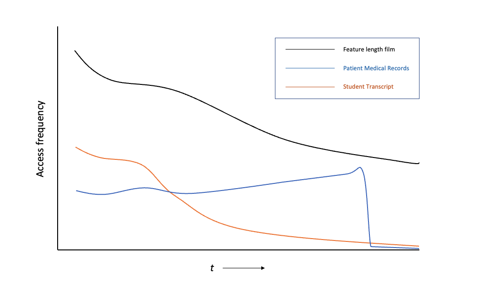
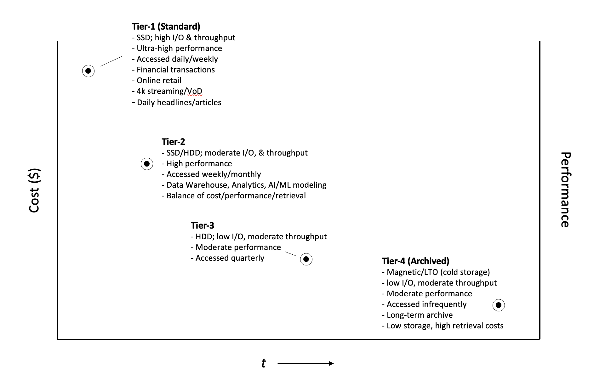

# The Anatomy of Data Objects Through Lifecycle Management

> Tags: *data object, storage, data management, storage archives, lifecycle management*

Walk into any business or technology meeting today and there’s no doubt that at some point the conversation will center around the topic of data. Data in all of its forms is an essential growth asset for every organization, and companies are increasingly challenged with the task of how to best manage every byte being stored. There are a number of factors driving these challenges, chief among them are,

- how to capture and collect data efficiently
- where to store the data securely so authorized users and applications have access
- keeping the data available and maintaining its integrity for business use
- maintaining the right balance of performance & cost

The world is full of business and consumer use cases that generates data of all types, and sizes. Data is comprised of web-clicks — just a few kilobytes in size — that capture online customer activity in real-time, student transcripts, telemetry readings from IoT devices and machinery, and petabytes of financial transactions stored in a relational database. These are the data types that are commonly known as *structured data*. For *unstructured data*, objects can exist in the form of 4K movies streamed into homes, YouTube videos, photos uploaded to social media sites like Instagram, satellite imagery, or scanned E-documents stored in a hospital’s medical records system. By some estimates, data is being generated at an astonishing rate of 2.5 quintillion bytes (that’s 2,500,000 terabytes!) every day. X^1^

In this article, we won’t focus on the sources responsible for the massive production of data, but rather look closer at data lifecycle management concepts and how organizations can understand them better in order to tackle the challenges listed. We will review the lifecycle stages an object goes through, briefly discuss the types of storage media commonly used, and provide some general guidelines for how an object transitions from one stage to the next. As you read this article, bear in mind there is no *one-size-fits-all* approack when it comes to lifecycle management. Multiple factors, some that are beyond the scope of this article, will ultimately determine the best overall storage solution for implementing a lifecycle management strategy. The goal here is to establish a framework organizations can build upon to meet their  objectives by improving data efficiency, increasing storage performance, and controlling costs. By accomplishing these goals, data is easily transformed into **useful information** making it worthy of the investment it is and not the operational burden many consider it to be.

## Lifecycle Management

*Data lifecycle management* is a method to control how information flows throughout an organization over the course of its useful life. From the moment an object is captured until it is rendered obsolete or no longer required, companies must understand the data they own at each stage of the lifecycle and be well-disciplined in establishing processes and utilizing the right tools to manage it effectively. Lifecycle management is broken into multiple stages and within each stage, data is subject to business policies, industry regulations, and other criteria that governs how it is stored, who has access, what operational functions are required, and the impact performance and other factors have on total cost. Not every stage of lifecycle management is mutually exclusive or required therefore, it is not uncommon for a process or storage requirement to be omitted or applied during multiple stages simultaneously.  When an organization reaches the point where it has established well-defined policies, the task of configuring the tools and services to automatically move data through the lifecycle is made more simple, repeatable and highly efficient. 

Lifecycle rules should be flexible and designed to process data based on certain attributes like age, classification (e.g., public, restricted, confidential), object size, or type (media files, database backup, security logs, etc.). Other conditions such as the environment where data is stored (Dev/Test, QA, Prod, etc.), or if it can be reproduced if lost or corrupted also plays a role in data management. As a general rule of thumb, newly captured data is stored on fast, high performance media as it is likely to have the most business value and thus retrieved and processed more frequently. By comparison, old data whose value has diminished is less likely to be used making it a candidate for ‘cold’ storage or media that is cheaper and less performant than other types of media due to longer access and retrieval times. 

The diagram below provides an illustration that shows several different object types and what typical access patterns may look like over the object's life span.

We will discuss these object types in more detail later. For now, we will look closer at the stages of lifecycle management and discuss how each is reliant upon processes and tools for managing data.   

### Data Capture
As data is being created — whether by acquisition, entry, or by a 3rd-party producer — how an organization captures the data varies based on its origin, size, and how frequent it is being generated. Data can be gathered in real-time during creation (e.g., video surveillance), and often times at high rates that exceed several MBs or GBs per second as in the case of packet captures from a busy corporate network. Data can also be collected over long periods of time where it is buffered in a temporary location and then bulk loaded into storage like IoT machine data, or power meter readings from homes across a city. There are even use cases where the data is captured, processed immediately and then discarded after a total lifecycle just several minutes in length. Ultimately, the method of data capture becomes closely associated with the next stage in the lifecycle where objects are maintained in a persistent state for extended periods of time.   

### Storage & Management
Once collected, data must be stored properly so that it remains secure, highly available and free from corruption.  It is inside this storage stage when data is generally processed, encrypted, compressed or subject to other operations. In cases where data undergoes extensive analysis, it can also be transformed into a different format or combined with other sources. With so much activity occurring at the storage level, it is important that the data be managed properly and free from unauthorized access. Additionally, it should be monitored frequently, and kept highly available with redundancy and backups for restore in the event of a system outage or natural disaster.   

### Availability & Use
This stage of lifecycle management is critical because it ensures that users and other data consumers have access to information that is current, accurate and properly formatted to conduct normal business operations. This includes tasks like generating financial reports, building analytics for forecasting, developing machine learning models, or reviewing a customer's service history. At this stage, the value of the data is only as useful as the methods implemented during the two stages described earlier. Companies should be mindful that poor data quality leads to poor business decisions which can result in mistrust, missed opportunities and loss of revenue from customers.  

### Data Archival 
Over time, the effectiveness of data is reduced and is no longer needed to support an organization’s daily operations and business workflows. Timing will vary, but once data reaches this stage it can be archived for long-term retention, compliance and historical preservation. It is possible that the data will be accessed in the future - albeit in limited cases - so it is important to maintain durability and data integrity along with proper levels of security. Another critical aspect during the archival stage is to ensure that the storage media being used is cost-optimized (often measured by price-per-TB of storage), which can impact what format the data is stored, and what service-level agreements (SLAs) can be established for how fast the archived information can be restored after a request for the data is made.

### Data Expiration
If the data has reached *“end-of-life”* meaning there is no longer value to the business, it can be permanently destroyed. When expiring data, it is not enough to simply delete the files from disks; controls should be in place for implementing a proper decommissioning process that completely destroys data and the physical devices where it was once stored in accordance with industry regulations and standards. For example, here at AWS we implement techniques for data destruction as detailed in the NIST 800-88 standards for sanitizing media to prevent access from unauthorized users.^2^

Once an organization understands the lifecycle management stages and develops policies and governance control for each, the process must then rely on products and services that are equipped with features to enable the controls effectively. Most services available on the market today are equipped with a management interface to identify/organize the data, administer access privileges, and provide reporting metrics on the stored objects. They also offer support for programming capabilities to develop and implement policies that move objects through the lifecycle seamlessly. These tools integrate with different forms of storage media designed to hold the data based on characteristics such as access patterns, performance, durability, and cost. Several examples of the types of storage media include solid-state drives (SSDs), magnetic hard drives (HDDs), and linear tape systems (LTO). Each media type can play an important role in the development of a complete lifecycle management system. 

Solid-State Drives (SSD)
: A solid-state drive is a type of media that uses flash memory and other semiconductor based components to store data. Unlike traditional magnetic hard-disk drives, SSD’s are manufactured with few moving parts which make them less susceptible to physical damage, and therefore highly durable with a longer lifespan. Solid-State drives also provide high performance characteristics like low latency, high data throughput, and minimum power consumption. These drive types are optimized for workloads where the frequency of read/write operations are high, and moderate throughput (the amount of data in GBs retrieved per second) is required. These high performance, low energy, and long durability characteristics come with trade-offs as SSD devices are typically more expensive (measured by price-per MB of storage) than traditional hard-disks with the same storage capacity.

Hard Disk Drives (HDD)
: A hard-disk drive stores data using physical disk platters (or cylinders) positioned on a spindle that rotates the platters allowing other motorized components (e.g., actuator arm, disk head device) to read and write information to/from the disk. These physical components make HDDs subject to being less durable with performance limits on latency, I/O operations, and data throughput. Data throughput however, can be optimized enough that makes HDD's a viable option for operations like data backups/restores, video streaming, and other business applications that prioritize cost over durability and power consumption.

Linear Tape Open (LTO) Drive
: LTO tape is a form of magnetic tape storage that is widely used for offline backups and long-term archiving purposes. While considered an older, less efficient approach to data storage, tape backups are still effective ways to manage data because they provide high levels of protection from cyberattacks because data is stored offline and away from computer networks. Because tape archives are maintained in a remote location, the likelihood that data will be completely lost as a result of a natural disaster is also reduced. In addition to these benefits, tape backup exists in a WORM (write-once, read many times) format that protects the data from being over-written thereby maintaining its original form which is a huge benefit for compliance. A potential downside to storing data using tape archives is that most of the equipment and tape media has to be well-maintained for long periods of time so that it remains operational and that can increase the overall storage costs.

For public cloud providers, each of the storage media types described above are offered in the form of managed services commonly categorized as block, object or archived storage. In addition to preserving the data, these services provide the tools, and programmatic access through APIs so that customers can perform the operations needed to build a complete lifecycle management system. Several benefits to using public cloud services for lifecycle management systems are,

- workflows can be developed faster
- services can be used without long-term investments in storage software of hardware
- public cloud providers can provide virtually unlimited amounts of storage capacity across each service tier
- public cloud providers can offer storage services at low-cost, lowering the total price-per-GB as the storage volumes increase

Using AWS again as an example, the Amazon Simple Storage Service (or S3) provides customers with different tiers or classes of cloud storage for frequently accessed data, data with unpredictable access patterns, long-term archival storage for compliance, plus many other offerings. The different tiers can be integrated through the use of program instructions to seamlessly transition data between classes based on a variety of criteria (e.g., age, size, location, name prefix, custom labels, etc.). By having the right services and tools available whether inside the data center or public cloud, storage administrators and IT Operations staff can design, develop and deploy the right solution regardless of how much data is being managed. 

The following chart provides a general illustration of storage service tiers and their basic operational characteristics,

To manage data objects so that they can be moved between tiers and cost effectively throughout the lifecycle, configuration policies are developed. As discussed earlier, these are the business rules that define a series of actions that the services use against the data under management. Configurations are typically built with two basic types of actions,

a) *Transition actions* which initiates the movement of data from one tier to another. Normal transition patterns involve moving objects from the initial storage tier on capture to the next tier after a fixed period (e.g., 60 days), object size (e.g., > 5 MB), or custom criteria defined by the organization (e.g., data_owner = finance). For example, a financial brokerage may store the most current market performance data in the primary storage tier for 60 days when the data is most likely to be accessed, before transitioning it to another class that is accessed less often as the data ages. Once the brokerage has owned the data for one year, another policy rule could transition the data to long-term archive storage where it remains primarily for compliance and historical purposes.

b) *Expire actions* determine when certain data objects can be permanently deleted. For example, a company that offers customers a 10-year warranty on a product can set an expire policy on the warranty information for a particular customer purchase to be destroyed 90 days after the warranty on that product has expired.

Using the above diagrams, we can bring the illustrations together for a holistic view of how data types reside in the different storage tiers when managed by configuration policies implemented as part of a lifecycle management system.

We can now see that a feature film spends most of its time in the lifecycle stored in the higher storage tiers. This is due to the constant access generated by viewers of the film, in addition to the performance requirements of operating on data of this type with a high bitrate format. When combined with additional processing requirements of transcoding the film into multiple standards for playback on different mobile devices and smartTVs, it is easy to see that managing feature films can result in a high price tag for media companies. 

A student transcript on the other hand is most likely to require a moderate amount of access frequency over its useful life, primarily during a student’s academic tenure. The methods in which parents, teachers, or college admissions counselors use to access records require moderate performance for retrieval, and therefore use media systems that are moderately priced. Once the student has completed school, it is less likely that the transcript will be accessed and therefore can be archived for long-term purposes. If a student were to contact the high school (or college) years later to request a copy of the transcript, the expectation should be that it will take several days or perhaps weeks to retrieve the records. That is because as mentioned previously, the records are most likely stored in an archived format and will take longer to retrieve. The retrieval time to obtain the transcript for a student who graduated one or two years ago stands a better chance of having the request processed faster if the lifecycle policy has not completely transitioned the records to the slowest and cheapest storage class at this point.

Patient medical records can present a rather unusual use case from most other data types. The general trend for most data is that as the information ages it is accessed less frequently. For medical records, it is possible that the data is accessed *more frequently* because an aging patient is likely to be under the regular care of a doctor or healthcare provider. The steep drop-off in the access pattern for medical records is also consistent with a patient’s eventual death, thereby causing the records to be archived and in some cases destroyed after a certain period of time. There is even the possibility that some data elements will be extracted and used in cases of medical research thereby giving those elements a fresh new start within the data lifecycle.

By using the concepts and foundational knowledge of data lifecycle management discussed in this article, organizations of all sizes can better position themselves to build frameworks that improve the security, durability and reliability of their data management processes. This will lead to an increase in the overall effectiveness of their storage management strategy, turning the growing amount of data captured into valuable and cost-optimized business information. 

sources:  
^1^ [*Infographic: How Much Data is Produced Every Day?*](https://cloudtweaks.com/2015/03/how-much-data-is-produced-every-day/#:~:text=Today%2C%20our%20best%20estimates%20suggest,a%20staggering%2018%20zeros!.)  
^2^ [*Our Controls - Data Center Compliance at AWS*](https://aws.amazon.com/compliance/data-center/controls/)  
^3^ https://en.wikipedia.org/wiki/Solid-state_drive  
^4^ https://en.wikipedia.org/wiki/Hard_disk_drive  
^5^ https://en.wikipedia.org/wiki/Linear_Tape-Open  

