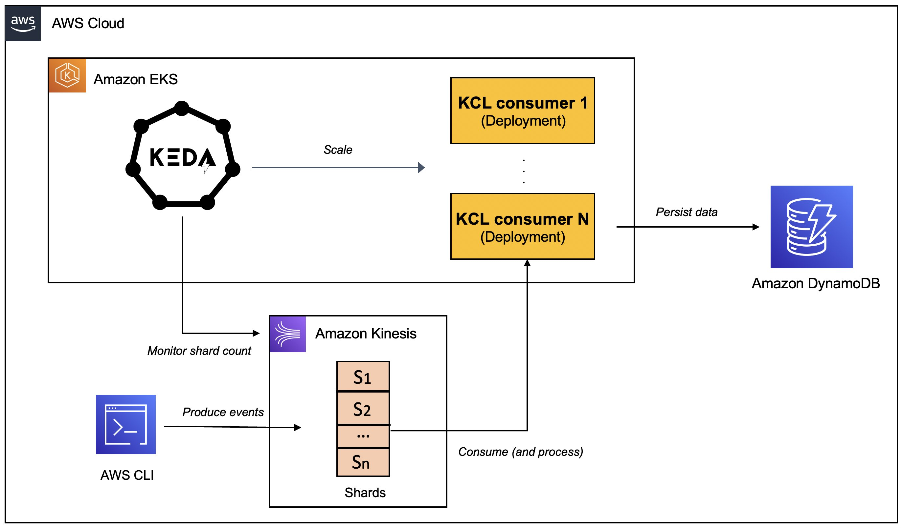
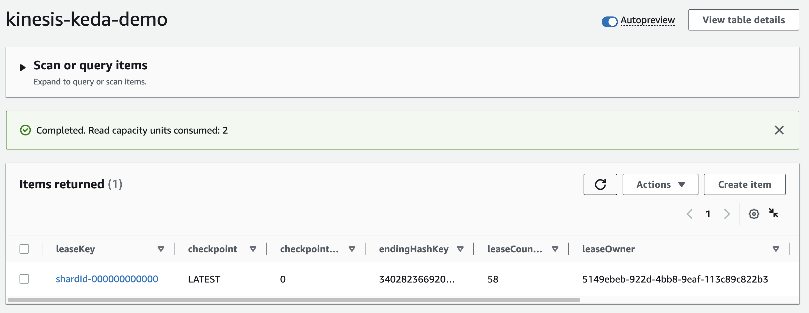
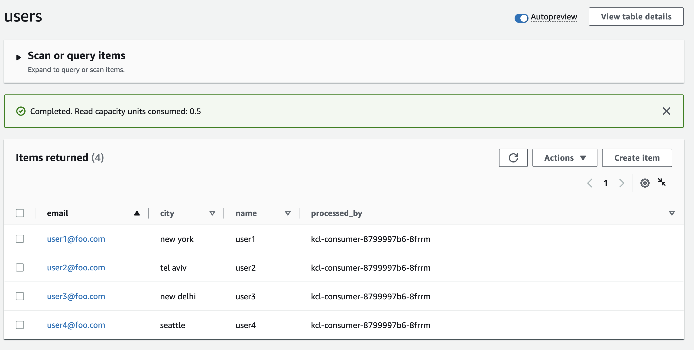
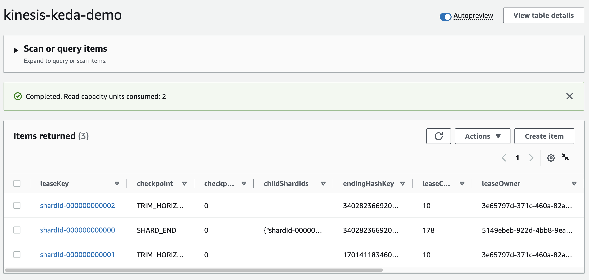
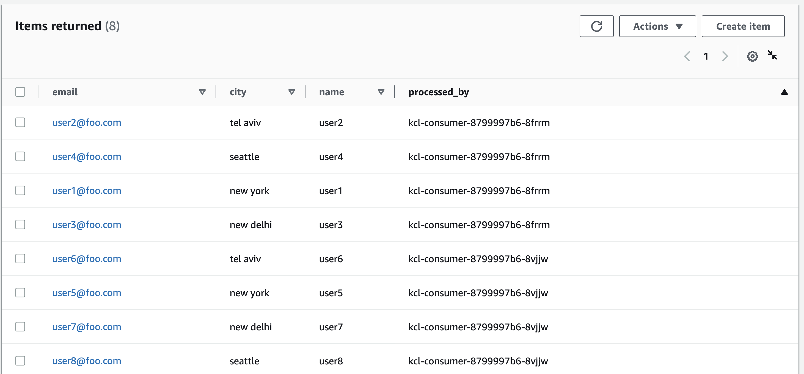

Want to learn how to auto-scale your Kinesis Data Streams consumer applications on Kubernetes, so you can save on costs and improve resource efficiency? This blog offers a step-by-step guide on how to do just that.

## What is Amazon Kinesis and Kinesis Data Streams?

[Amazon Kinesis](https://aws.amazon.com/kinesis/?sc_channel=el&sc_campaign=datamlwave&sc_content=auto-scaling-kinesis-data-streams-apps-on-kubernetes&sc_geo=mult&sc_country=mult&sc_outcome=acq) is a platform for real-time data processing, ingestion, and analysis. [Kinesis Data Streams](https://docs.aws.amazon.com/streams/latest/dev/introduction.html?sc_channel=el&sc_campaign=datamlwave&sc_content=auto-scaling-kinesis-data-streams-apps-on-kubernetes&sc_geo=mult&sc_country=mult&sc_outcome=acq) is a Serverless streaming data service (part of the Kinesis streaming data platform, along with [Kinesis Data Firehose](https://docs.aws.amazon.com/firehose/latest/dev/what-is-this-service.html?sc_channel=el&sc_campaign=datamlwave&sc_content=auto-scaling-kinesis-data-streams-apps-on-kubernetes&sc_geo=mult&sc_country=mult&sc_outcome=acq), [Kinesis Video Streams](https://docs.aws.amazon.com/kinesisvideostreams/latest/dg/what-is-kinesis-video.html?sc_channel=el&sc_campaign=datamlwave&sc_content=auto-scaling-kinesis-data-streams-apps-on-kubernetes&sc_geo=mult&sc_country=mult&sc_outcome=acq), and [Kinesis Data Analytics](https://docs.aws.amazon.com/kinesisanalytics/latest/dev/what-is.html?sc_channel=el&sc_campaign=datamlwave&sc_content=auto-scaling-kinesis-data-streams-apps-on-kubernetes&sc_geo=mult&sc_country=mult&sc_outcome=acq).

Kinesis Data Streams can scale elastically and continuously adapt to changes in data ingestion rates and stream consumption rates. It can be used to build real-time data analytics applications, real-time dashboards, and real-time data pipelines.

Let’s start off with an overview of some key concepts of Kinesis Data Streams.

## Kinesis Data Streams: High-level architecture

- A Kinesis data stream is a set of *shards*. Each shard has a sequence of data records. 
- The *producers* continually push data to Kinesis Data Streams, and the *consumers* process the data in real time. 
- *A partition key* is used to group data by shard within a stream. 
  - Kinesis Data Streams segregates the data records belonging to a stream into multiple shards. 
  - It uses the partition key that is associated with each data record to determine which shard a given data record belongs to. 
- Consumers get records from Amazon Kinesis Data Streams, process them and store their results in Amazon DynamoDB, Amazon Redshift, or Amazon S3 etc. 
  - These consumers are also known as Amazon Kinesis Data Streams Application. 
  - One of the methods of developing custom consumer applications that can process data from KDS data streams is to use the [Kinesis Client Library](https://docs.aws.amazon.com/streams/latest/dev/shared-throughput-kcl-consumers.html?sc_channel=el&sc_campaign=datamlwave&sc_content=auto-scaling-kinesis-data-streams-apps-on-kubernetes&sc_geo=mult&sc_country=mult&sc_outcome=acq) (`KCL`).

### How do Kinesis consumer applications scale horizontally?

The Kinesis Client Library ensures there is a record processor running for every shard and processing data from that shard. `KCL` helps you consume and process data from a Kinesis data stream by taking care of many of the complex tasks associated with distributed computing and scalability. It connects to the data stream, enumerates the shards within the data stream and uses leases to coordinates shard associations with its consumer applications.

A record processor is instantiated for every shard it manages. `KCL` pulls data records from the data stream, pushes the records to the corresponding record processor and checkpoints processed records. More importantly, it balances shard-worker associations (leases) when the worker instance count changes or when the data stream is re-sharded (shards are split or merged). This means that you are able to scale your Kinesis Data Streams application by simply adding more instances since `KCL` will automatically balance the shards across the instances.

But, you still need a way to scale your applications when the load increases. Of course, you could do it manually or build a custom solution to get this done.

This is where [Kubernetes Event-driven Autoscaling](https://keda.sh) (KEDA) can help. `KEDA` is a Kubernetes-based event-driven autoscaling component that can monitor event sources like Kinesis and scale the underlying `Deployment`s (and `Pod`s) based on the number of events needing to be processed.

To witness auto-scaling in action, you will work with a Java application that uses the Kinesis Client Library (`KCL`) 2.x to consume data from a Kinesis Data Stream. It will be deployed to a Kubernetes cluster on [Amazon EKS](https://docs.aws.amazon.com/eks/latest/userguide/what-is-eks.html?sc_channel=el&sc_campaign=datamlwave&sc_content=auto-scaling-kinesis-data-streams-apps-on-kubernetes&sc_geo=mult&sc_country=mult&sc_outcome=acq) and will be scaled automatically using `KEDA`. The application includes an implementation of the `ShardRecordProcessor` that processes data from the Kinesis stream and persists it to a `DynamoDB` table. We will use the AWS CLI to produce data to the Kinesis stream and observe the scaling of the application.



Before, we dive in, here is quick overview of `KEDA`.

## What is KEDA?

`KEDA` is an open-source [CNCF](https://cncf.io/) project that's built on top of native Kubernetes primitives such as the Horizontal Pod Autoscaler and can be added to any Kubernetes cluster. Here is a high level overview of it's key components (you can refer to the [KEDA documentation](https://keda.sh/docs/) for a deep-dive):

1. The `keda-operator-metrics-apiserver` component in `KEDA` acts as a [Kubernetes metrics server](https://kubernetes-sigs.github.io/metrics-server/) that exposes metrics for the Horizontal Pod Autoscaler
2. A [KEDA Scaler](https://keda.sh/docs/2.8/concepts/) integrates with an external system (such as Redis) to fetch these metrics (e.g. length of a List) to drives auto scaling of any container in Kubernetes based on the number of events needing to be processed. 
3. The role of the `keda-operator` component is to *activate* and *deactivate* `Deployment` i.e. scale to and from zero.

You will see the [Kinesis Stream KEDA scaler](https://keda.sh/docs/2.10/scalers/aws-kinesis/) in action that scales based on the shard count of AWS Kinesis Stream.


*From KEDA documentation - https://keda.sh/docs/2.8/concepts/*

Now lets move on the practical part of this post.

## Pre-requisites

In addition to an AWS account, you will need to have the [AWS CLI](https://docs.aws.amazon.com/cli/latest/userguide/getting-started-install.html?sc_channel=el&sc_campaign=datamlwave&sc_content=auto-scaling-kinesis-data-streams-apps-on-kubernetes&sc_geo=mult&sc_country=mult&sc_outcome=acq), [kubectl](https://kubernetes.io/docs/tasks/tools/#kubectl), [Docker](https://docs.docker.com/engine/install/), Java 11 and [Maven](https://maven.apache.org/install.html) installed.

**Setup an EKS cluster, create a DynamoDB table and a Kinesis Data Stream**

There are a variety of ways in which you can create an [Amazon EKS cluster](https://docs.aws.amazon.com/eks/latest/userguide/create-cluster.html?sc_channel=el&sc_campaign=datamlwave&sc_content=auto-scaling-kinesis-data-streams-apps-on-kubernetes&sc_geo=mult&sc_country=mult&sc_outcome=acq). I prefer using [eksctl](https://eksctl.io/) CLI because of the convenience it offers. Creating an an EKS cluster using `eksctl`, can be as easy as this:

```bash
eksctl create cluster --name <cluster name> --region <region e.g. us-east-1>
```

> For details, refer to the [Getting started with Amazon EKS – eksctl](https://docs.aws.amazon.com/eks/latest/userguide/getting-started-eksctl.html?sc_channel=el&sc_campaign=datamlwave&sc_content=auto-scaling-kinesis-data-streams-apps-on-kubernetes&sc_geo=mult&sc_country=mult&sc_outcome=acq).

Create a DynamoDB table to persist application data. You can use the AWS CLI to create a table with the following command:

```bash
aws dynamodb create-table \
    --table-name users \
    --attribute-definitions AttributeName=email,AttributeType=S \
    --key-schema AttributeName=email,KeyType=HASH \
    --provisioned-throughput ReadCapacityUnits=5,WriteCapacityUnits=5
```

Create Kinesis stream with *two* shards using the AWS CLI:

```bash
aws kinesis create-stream --stream-name kinesis-keda-demo --shard-count 2
```

Clone this GitHub repository and change to the right directory:

```bash
git clone https://github.com/abhirockzz/kinesis-keda-autoscaling
cd kinesis-keda-autoscaling
```

Ok let's get started!

## Setup and configure KEDA on EKS

For the purposes of this tutorial, you will use [YAML files](https://keda.sh/docs/2.8/deploy/#yaml) to deploy `KEDA`. But you could also use [Helm charts](https://keda.sh/docs/2.8/deploy/#helm).

Install `KEDA`:

```bash
# update version 2.8.2 if required

kubectl apply -f https://github.com/kedacore/keda/releases/download/v2.8.2/keda-2.8.2.yaml
```

Verify the installation:

```bash
# check Custom Resource Definitions
kubectl get crd

# check KEDA Deployments
kubectl get deployment -n keda

# check KEDA operator logs
kubectl logs -f $(kubectl get pod -l=app=keda-operator -o jsonpath='{.items[0].metadata.name}' -n keda) -n keda
```

## Configure IAM Roles

The KEDA operator as well as the Kinesis consumer application need to invoke AWS APIs. Since both will run as `Deployment`s in EKS, we will use [IAM Roles for Service Accounts (IRSA)](https://docs.aws.amazon.com/eks/latest/userguide/iam-roles-for-service-accounts.html?sc_channel=el&sc_campaign=datamlwave&sc_content=auto-scaling-kinesis-data-streams-apps-on-kubernetes&sc_geo=mult&sc_country=mult&sc_outcome=acq) to provide the necessary permissions.

In this particular scenario:

- `KEDA` operator needs to be able to get the shard count for a Kinesis stream - it does so with using `DescribeStreamSummary` API.
- The application (KCL library to be specific) needs to interact with Kinesis and DynamoDB - it needs a [bunch of IAM permissions](https://docs.aws.amazon.com/streams/latest/dev/tutorial-stock-data-kplkcl2-iam.html?sc_channel=el&sc_campaign=datamlwave&sc_content=auto-scaling-kinesis-data-streams-apps-on-kubernetes&sc_geo=mult&sc_country=mult&sc_outcome=acq) to do so.


**Configure IRSA for KEDA operator**

Set your AWS Account ID and OIDC Identity provider as environment variables:

```bash
ACCOUNT_ID=$(aws sts get-caller-identity --query "Account" --output text)

#update the cluster name and region as required
export EKS_CLUSTER_NAME=demo-eks-cluster
export AWS_REGION=us-east-1

OIDC_PROVIDER=$(aws eks describe-cluster --name $EKS_CLUSTER_NAME --query "cluster.identity.oidc.issuer" --output text | sed -e "s/^https:\/\///")
```

Create a `JSON` file with Trusted Entities for the role:

```bash
read -r -d '' TRUST_RELATIONSHIP <<EOF
{
  "Version": "2012-10-17",
  "Statement": [
    {
      "Effect": "Allow",
      "Principal": {
        "Federated": "arn:aws:iam::${ACCOUNT_ID}:oidc-provider/${OIDC_PROVIDER}"
      },
      "Action": "sts:AssumeRoleWithWebIdentity",
      "Condition": {
        "StringEquals": {
          "${OIDC_PROVIDER}:aud": "sts.amazonaws.com",
          "${OIDC_PROVIDER}:sub": "system:serviceaccount:keda:keda-operator"
        }
      }
    }
  ]
}
EOF
echo "${TRUST_RELATIONSHIP}" > trust_keda.json
```

Now, create the IAM role and attach the policy (take a look at `policy_kinesis_keda.json` file for details):

```bash
export ROLE_NAME=keda-operator-kinesis-role

aws iam create-role --role-name $ROLE_NAME --assume-role-policy-document file://trust_keda.json --description "IRSA for kinesis KEDA scaler on EKS"

aws iam create-policy --policy-name keda-kinesis-policy --policy-document file://policy_kinesis_keda.json
aws iam attach-role-policy --role-name $ROLE_NAME --policy-arn=arn:aws:iam::${ACCOUNT_ID}:policy/keda-kinesis-policy
```

Associate the IAM role and Service Account:

```bash
kubectl annotate serviceaccount -n keda keda-operator eks.amazonaws.com/role-arn=arn:aws:iam::${ACCOUNT_ID}:role/${ROLE_NAME}

# verify the annotation 
kubectl describe serviceaccount/keda-operator -n keda
```

You will need to restart `KEDA` operator `Deployment` for this to take effect:

```bash
kubectl rollout restart deployment.apps/keda-operator -n keda

# to verify, confirm that the KEDA operator has the right environment variables
kubectl describe pod -n keda $(kubectl get po -l=app=keda-operator -n keda --output=jsonpath={.items..metadata.name}) | grep "^\s*AWS_"

# expected output

AWS_STS_REGIONAL_ENDPOINTS:   regional
AWS_DEFAULT_REGION:           us-east-1
AWS_REGION:                   us-east-1
AWS_ROLE_ARN:                 arn:aws:iam::<AWS_ACCOUNT_ID>:role/keda-operator-kinesis-role
AWS_WEB_IDENTITY_TOKEN_FILE:  /var/run/secrets/eks.amazonaws.com/serviceaccount/token
```

**Configure IRSA for the KCL consumer application**

Start by creating a Kubernetes Service Account:

```bash
kubectl apply -f - <<EOF
apiVersion: v1
kind: ServiceAccount
metadata:
  name: kcl-consumer-app-sa
EOF
```

Create a `JSON` file with Trusted Entities for the role:

```bash
read -r -d '' TRUST_RELATIONSHIP <<EOF
{
  "Version": "2012-10-17",
  "Statement": [
    {
      "Effect": "Allow",
      "Principal": {
        "Federated": "arn:aws:iam::${ACCOUNT_ID}:oidc-provider/${OIDC_PROVIDER}"
      },
      "Action": "sts:AssumeRoleWithWebIdentity",
      "Condition": {
        "StringEquals": {
          "${OIDC_PROVIDER}:aud": "sts.amazonaws.com",
          "${OIDC_PROVIDER}:sub": "system:serviceaccount:default:kcl-consumer-app-sa"
        }
      }
    }
  ]
}
EOF
echo "${TRUST_RELATIONSHIP}" > trust.json
```

Now, create the IAM role and attach the policy (take a look at `policy.json` file for details):

```bash
export ROLE_NAME=kcl-consumer-app-role

aws iam create-role --role-name $ROLE_NAME --assume-role-policy-document file://trust.json --description "IRSA for KCL consumer app on EKS"

aws iam create-policy --policy-name kcl-consumer-app-policy --policy-document file://policy.json

aws iam attach-role-policy --role-name $ROLE_NAME --policy-arn=arn:aws:iam::${ACCOUNT_ID}:policy/kcl-consumer-app-policy
```

Associate the IAM role and Service Account:

```bash
kubectl annotate serviceaccount -n default kcl-consumer-app-sa eks.amazonaws.com/role-arn=arn:aws:iam::${ACCOUNT_ID}:role/${ROLE_NAME}

# verify the annotation
kubectl describe serviceaccount/kcl-consumer-app-sa
```

The core infrastructure is now ready. Let's prepare and deploy the consumer application.

## Deploy KCL consumer application to EKS

You first need to build the Docker image and push it to [Amazon Elastic Container Registry](https://docs.aws.amazon.com/AmazonECR/latest/userguide/what-is-ecr.html?sc_channel=el&sc_campaign=datamlwave&sc_content=auto-scaling-kinesis-data-streams-apps-on-kubernetes&sc_geo=mult&sc_country=mult&sc_outcome=acq) (ECR) (refer to the `Dockerfile` for details).

**Build and push the Docker image to ECR**

```bash
# create runnable JAR file
mvn clean compile assembly\:single

# build docker image
docker build -t kcl-consumer-app .

AWS_ACCOUNT_ID=$(aws sts get-caller-identity --query "Account" --output text)

# create a private ECR repo
aws ecr get-login-password --region us-east-1 | docker login --username AWS --password-stdin $AWS_ACCOUNT_ID.dkr.ecr.us-east-1.amazonaws.com

aws ecr create-repository --repository-name kcl-consumer-app --region us-east-1

# tag and push the image
docker tag kcl-consumer-app:latest $AWS_ACCOUNT_ID.dkr.ecr.us-east-1.amazonaws.com/kcl-consumer-app:latest
docker push $AWS_ACCOUNT_ID.dkr.ecr.us-east-1.amazonaws.com/kcl-consumer-app:latest
```

**Deploy the consumer application**

Update the `consumer.yaml` to include the Docker image you just pushed to ECR. The rest of the manifest remains the same:

```yaml
apiVersion: apps/v1
kind: Deployment
metadata:
  name: kcl-consumer
spec:
  replicas: 1
  selector:
    matchLabels:
      app: kcl-consumer
  template:
    metadata:
      labels:
        app: kcl-consumer
    spec:
      serviceAccountName: kcl-consumer-app-sa
      containers:
        - name: kcl-consumer
          image: AWS_ACCOUNT_ID.dkr.ecr.us-east-1.amazonaws.com/kcl-consumer-app:latest
          imagePullPolicy: Always
          env:
            - name: STREAM_NAME
              value: kinesis-keda-demo
            - name: TABLE_NAME
              value: users
            - name: APPLICATION_NAME
              value: kinesis-keda-demo
            - name: AWS_REGION
              value: us-east-1
            - name: INSTANCE_NAME
              valueFrom:
                fieldRef:
                  fieldPath: metadata.name
```

Create the `Deployment`:

```bash
kubectl apply -f consumer.yaml

# verify Pod transition to Running state
kubectl get pods -w
```

## KCL app autoscaling in action with KEDA

Now that you've deployed the consumer application, the `KCL` library should jump into action. The first thing it will do is create a "control table" in DynamoDB - this should be the same as name of the KCL application (which in this case is `kinesis-keda-demo`). 

It might take a few minutes for the initial co-ordination to happen and the table to get created. You can check the logs of the consumer application to track the progress.

```bash
kubectl logs -f $(kubectl get po -l=app=kcl-consumer --output=jsonpath={.items..metadata.name})
```

Once the lease allocation is complete, check the table and note the `leaseOwner` attribute:


```bash
aws dynamodb describe-table --table-name kinesis-keda-demo
aws dynamodb scan --table-name kinesis-keda-demo
```



**Now, let's send some data to the Kinesis stream using the AWS CLI**

```bash
export KINESIS_STREAM=kinesis-keda-demo

aws kinesis put-record --stream-name $KINESIS_STREAM --partition-key user1@foo.com --data $(echo -n '{"name":"user1", "city":"new york"}' | base64)
aws kinesis put-record --stream-name $KINESIS_STREAM --partition-key user2@foo.com --data $(echo -n '{"name":"user2", "city":"tel aviv"}' | base64)
aws kinesis put-record --stream-name $KINESIS_STREAM --partition-key user3@foo.com --data $(echo -n '{"name":"user3", "city":"new delhi"}' | base64)
aws kinesis put-record --stream-name $KINESIS_STREAM --partition-key user4@foo.com --data $(echo -n '{"name":"user4", "city":"seattle"}' | base64)
```

The KCL application persists each record to a target `DynamoDB` table (which is named `users` in this case). You can check the table to verify the records.


```bash
aws dynamodb scan --table-name users
```

Notice that the value for the `processed_by` attribute? It's the same as KCL consumer `Pod`. This will make it easier for us to verify the end to end autoscaling process.




**Create the KEDA scaler for Kinesis**

Here is the `ScaledObject` definition. Notice that it's targeting the `kcl-consumer` `Deployment` (the one we just created) and the `shardCount` is set to `1`:

```yaml
apiVersion: keda.sh/v1alpha1
kind: ScaledObject
metadata:
  name: aws-kinesis-stream-scaledobject
spec:
  scaleTargetRef:
    name: kcl-consumer
  triggers:
    - type: aws-kinesis-stream
      metadata:
        # Required
        streamName: kinesis-keda-demo
        # Required
        awsRegion: "us-east-1"
        shardCount: "1"
        identityOwner: "operator"
```

Create the `KEDA` Kinesis scaler:

```bash
kubectl apply -f keda-kinesis-scaler.yaml
```

**Verify KCL application auto-scaling**

We started off with one `Pod` of our KCL application. But, thanks to `KEDA`, we should now see the second `Pod` coming up.

```bash
kubectl get pods -l=app=kcl-consumer -w

# check logs of the new pod
kubectl logs -f <enter Pod name>
```

Our application was able to auto-scale to two Pods because we had specified `shardCount: "1"` in the `ScaledObject` definition. This means that there will be one `Pod` for per shard in the Kinesis stream.

Check `kinesis-keda-demo` control table in `DynamoDB` - You should see update for the `leaseOwner`.



Let's send some more data to the Kinesis stream. 

```bash
export KINESIS_STREAM=kinesis-keda-demo

aws kinesis put-record --stream-name $KINESIS_STREAM --partition-key user5@foo.com --data $(echo -n '{"name":"user5", "city":"new york"}' | base64)
aws kinesis put-record --stream-name $KINESIS_STREAM --partition-key user6@foo.com --data $(echo -n '{"name":"user6", "city":"tel aviv"}' | base64)
aws kinesis put-record --stream-name $KINESIS_STREAM --partition-key user7@foo.com --data $(echo -n '{"name":"user7", "city":"new delhi"}' | base64)
aws kinesis put-record --stream-name $KINESIS_STREAM --partition-key user8@foo.com --data $(echo -n '{"name":"user8", "city":"seattle"}' | base64)
```

Verify the value for the `processed_by` attribute. Since we have scaled out to two `Pod`s, the value should be different for each record since each `Pod` will process a subset of the records from the Kinesis stream.



**Increase Kinesis stream capacity**

Let's scale out the number of shards from two to three and continue to monitor `KCL` application auto-scaling.

```bash
aws kinesis update-shard-count --stream-name kinesis-keda-demo --target-shard-count 3 --scaling-type UNIFORM_SCALING
```

Once Kinesis re-sharding is complete, the `KEDA` scaler will spring into action and scale out the KCL application to three `Pod`s.

```bash
kubectl get pods -l=app=kcl-consumer -w
```

Just like before, confirm that the Kinesis shard lease has been updated in the `kinesis-keda-demo` control table in `DynamoDB` - check the `leaseOwner` attribute.

Continue to send more data to the Kinesis stream. As expected, the `Pod`s will share the record processing and this will reflect in the `processed_by` attribute in the `users` table.

```bash
export KINESIS_STREAM=kinesis-keda-demo

aws kinesis put-record --stream-name $KINESIS_STREAM --partition-key user9@foo.com --data $(echo -n '{"name":"user9", "city":"new york"}' | base64)
aws kinesis put-record --stream-name $KINESIS_STREAM --partition-key user10@foo.com --data $(echo -n '{"name":"user10", "city":"tel aviv"}' | base64)
aws kinesis put-record --stream-name $KINESIS_STREAM --partition-key user11@foo.com --data $(echo -n '{"name":"user11", "city":"new delhi"}' | base64)
aws kinesis put-record --stream-name $KINESIS_STREAM --partition-key user12@foo.com --data $(echo -n '{"name":"user12", "city":"seattle"}' | base64)
aws kinesis put-record --stream-name $KINESIS_STREAM --partition-key user14@foo.com --data $(echo -n '{"name":"user14", "city":"tel aviv"}' | base64)
aws kinesis put-record --stream-name $KINESIS_STREAM --partition-key user15@foo.com --data $(echo -n '{"name":"user15", "city":"new delhi"}' | base64)
aws kinesis put-record --stream-name $KINESIS_STREAM --partition-key user16@foo.com --data $(echo -n '{"name":"user16", "city":"seattle"}' | base64)
```

> **Scale down** - So far, we have only scaled in one direction. What happens when we reduce the shard capacity of the Kinesis stream? Try this out for yourself - reduce the shard count from three to two and see what happens to the KCL application.

Once you have verified the end to end solution, you should clean up the resources to avoid incurring any additional charges.

## Clean up

Delete the EKS cluster, Kinesis stream, and DynamoDB table.

```bash
eksctl delete cluster --name keda-kinesis-demo
aws kinesis delete-stream --stream-name kinesis-keda-demo
aws dynamodb delete-table --table-name users
```

## Conclusion

In this post, you learned how to use `KEDA` to auto-scale a `KCL` application that consumes data from a Kinesis stream. 

You can configure the KEDA scaler as per your application requirements. For example, you can set the `shardCount` to `3` and have one `Pod` for every three shards in your Kinesis stream. However, if you want to maintain a one to one mapping, you can set the `shardCount` to `1` and `KCL` will take care of distributed co-ordination and lease assignment, thereby ensuring that each `Pod` has one instance of the record processor. This is an effective approach that allows you to scale out your Kinesis stream processing pipeline to meet the demands of your applications.