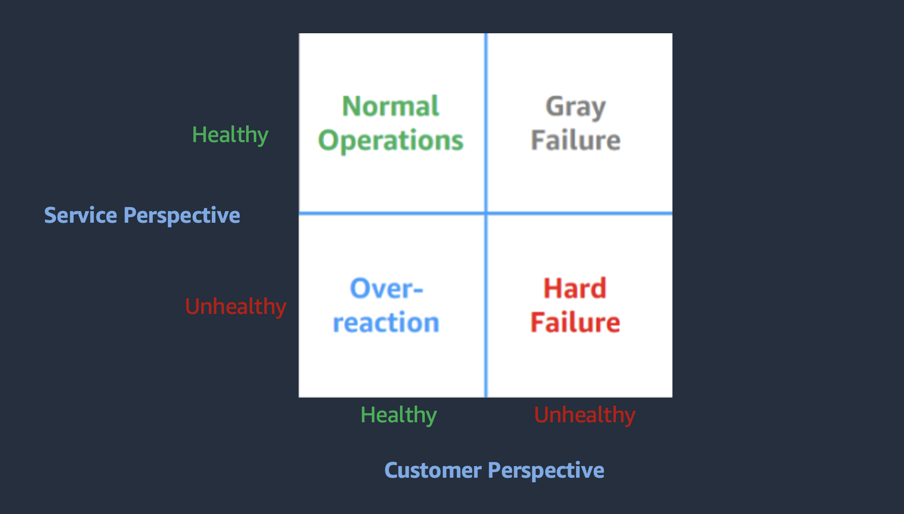
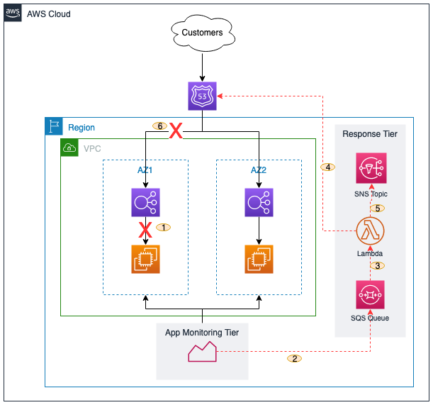

## Introduction

A gray failure in an application can be described as a false positive state where one or more components of an application are unhealthy but do not breach health monitoring of the application. This could be a problem because everything seems fine to the application owner but the application users may be experiencing an application degradation. Here I share a solution that helps you by reducing the mean-time-to-respond to a gray failure and improve your overall end user experience.

## The Impact of Gray Failures

In this modern era, most applications have different components working together to provide a service. When a component is unable to perform its intended function, the overall functionality of the application is impacted. This type of component failure can be difficult to detect.

Let us consider a two-tier blog application that allows users to read and provide comments. The blog article is served by its frontend component and comments are saved to a database in its backend component. Both components are monitored using system health checks to ensure they are up and running. If there is a communication disruption between these components, the monitoring tool does not detect it, the users continue to read the blog but are unable to leave comments. This impacts the end user experience and may result in loss of revenue due to reduced web traffic.

## Detecting Gray Failures

A resilient application is designed to detect gray failures by using differential observability. Differential observability is the process of monitoring an application from different perspectives – customer perspective and service perspective.

||
|:--:|
|Figure 1. Differential Observability Matrix|

Figure 1 above describes customer perspective and service perspective using a matrix. The matrix consists of four quadrants.

- Normal Operations – both service monitoring and customers see the application as healthy.
- Over-reaction – service monitoring sees the application as unhealthy but everything looks fine to the customers
- Hard Failure – both service monitoring and customers perceive the application as unhealthy
- Gray Failure – the service monitoring perceives the application as healthy but the customers are experiencing issues and perceive the application as unhealthy.

The end user experience can be monitored using synthetic monitoring tools like Amazon CloudWatch Synthetics while the infrastructure and application monitoring can be achieved using a combination of application metrics, shallow health checks, and deep health checks. A shallow health check performs a superficial check which may not detect a gray failure but a deep health check performs dependency checks which can easily detect a gray failure. However, deep health checks are expensive and prone to false positives. For more information about implementing health checks, please read this [article](https://aws.amazon.com/builders-library/implementing-health-checks/).

## Responding to Gray Failures in AWS

The AWS global infrastructure provides a platform where applications can be designed to mitigate gray failures by using multiple Availability Zones (AZs).  An AZ is one or more discrete data centers with redundant power, networking, and connectivity in an AWS Region. This isolation boundary provides the capability to contain gray failures and move traffic away from an impaired AZ while you continue to troubleshoot for the root cause. [Amazon Route 53 Application Recovery Controller]("https://aws.amazon.com/route53/application-recovery-controller/") (Route 53 ARC) has a feature called [Zonal Shift]("https://docs.aws.amazon.com/r53recovery/latest/dg/arc-zonal-shift.html"). Zonal Shift provides a mechanism to quickly shift traffic from an impaired AZ. When the AZ recovers, you can cancel the shift to return traffic to the AZ. For example, a multi-AZ application deployed behind a load balancer can use zonal shift to suspend traffic from going to an unhealthy application stack in an AZ but continue to send traffic to healthy application stack(s) in other AZs. When the unhealthy application stack recovers, you can resume sending traffic again by canceling the zonal shift.

It is important to note that Zonal Shift does not validate a gray failure nor verify available resources in other AZs. Determining when and how to shift traffic away from a degraded AZ requires careful consideration. That is, you need to have a mechanism to detect a valid gray failure and a mechanism to valid available resources in other zones to accommodate the shift. For example, an application experiencing a sudden increase in traffic may go into an AZ gray failure mode. Shifting traffic away from one AZ may overwhelm the other AZs and could make the situation even worse. For a more detailed description and recommended best practices for using the zonal shift capability, please refer to this [blog]("https://aws.amazon.com/blogs/networking-and-content-delivery/rapidly-recover-from-application-failures-in-a-single-az/") article.

### Manual Zonal Shift

Route 53 ARC Zonal Shift feature can be accessed through the AWS console and through an API endpoint. In an environment where the monitoring capability is not robust enough to detect false positive gray failures and verify available capacity in other zones, it is important to humanly verify then manually shift traffic. While this prevents the application from self-inflicted failures due to spurious gray failures, it increases the time-to-respond to a gray failure.

### Automated (event-driven) Zonal Shift

The mean-time-to-respond to a zonal gray failure can be reduced by automating the ARC 53 Zonal Shift feature. This mechanism uses a logic designed to respond to a zonal gray failure event by automatically triggering ARC 53 Zonal Shift over an API to stop traffic from going to the impaired AZ. The [AWS SDK tools]("https://aws.amazon.com/developer/tools/?trk=59bef63e-74bc-4cc2-94dc-31f3ce8c0a3f&sc_channel=ps&ef_id=EAIaIQobChMInv2P0KSH_wIVwwlMCh0lOgTdEAAYASAAEgKtO_D_BwE:G:s&s_kwcid=AL!4422!3!658520965868!!!g!!!19852661720!149878734180") provides the ability to integrate and interact with Zonal Shift API endpoint from a programming language of choice.

## Sample Solution

To help you get started with automating your response to a gray failure, you can try out this [AWS CDK Project]("https://github.com/build-on-aws/automated-arc-zonal-shift") sample code in your environment. The solution assumes you have a robust gray failure detection and validation mechanism in place and the mechanism can publish messages to an Amazon SQS queue. It deploys a Lambda function, an SQS queue, and an SNS Topic. The Lambda function is triggered by a message published to the SQS queue. The Lambda function makes an API call to start Zonal Shift and sends a success or failure message to the SNS topic.

||
|:--:|
|Figure 2. Sample Solution: Automated Zonal Shift|

The solution deploys the infrastructure components in the “Response Tier” only. The workflow is as follows:

1. A Gray Failure has occured in an Availability Zone.
2. The Application monitoring mechanism detects it and sends a message to an SQS queue.
3. The SQS `queue` triggers a Lambda Function with information about the degraded AZ.
4. The Lambda `function` makes an API call to start `Route53 ARC Zonal Shift`.
5. The Lambda function publishes a message to an SNS `topic` for notification.
6. Route53 ARC Zonal Shift shifts traffic from the degraded AZ.

### Sample Solution Deployment

The sample solution is authored using AWS CDK with python. When deployed, the following components/resources are created:

- Lambda Layer – contains the boto3 SDK for python required by the logic to make zonal shift API calls
- Lambda function – contains the python logic to start the zonal shift
- SNS topic – receives the gray failure message from the monitoring app and triggers the lambda function.

#### Deployment Steps

1. Clone the GitHub repository [here]("https://github.com/build-on-aws/automated-arc-zonal-shift")

    ```bash
    git clone https://github.com/build-on-aws/automated-arc-zonal-shift
    ```

   Change directory into the cloned repo

    ```bash
    cd automated-arc-zonal-shift
    ```

2. Ensure CDK is installed

    ```bash
    npm install -g aws-cdk
    ```

   Create a Python virtual environment

    ```bash
    python3 -m venv .venv
    ```

3. Activate virtual environment

    _On MacOS or Linux_

    ```bash
    source .venv/bin/activate
    ```

    _On Windows_

    ```bash
    % .venv\Scripts\activate.bat
    ```

4. Install the required dependencies.

    ```bash
    pip install -r requirements.txt
    ```

5. Synthesize (`cdk synth`) or deploy (`cdk deploy`) the example

    ```bash
    cdk deploy
    ```

### Testing the Solution

1. From the root directory change to src/sample.

    ```bash
    cd src/sample
    ```

2. Edit the payload.json file to reflect your load balancer's name.
`DO NOT` change the Key.

    ```bash
    vi payload.json
    ```

3. Save the file and run the command below

    ```bash
    aws sqs send-message --message-body file://payload.json
    ```

### Cleaning Up

```bash
cdk destroy
```

## Conclusion

A gray failure can affect the overall availability of an application. This could impact the end user experience and drive down the application traffic/usage resulting in loss of revenue. The ability to detect and quickly respond to a gray failure reduces its impact to end users and can prevent possible loss of revenue. Automating the [Amazon Route 53 Application Recovery Controller Zonal Shift]("https://docs.aws.amazon.com/r53recovery/latest/dg/arc-zonal-shift.html") feature helps decrease the mean-time-to-respond with little or no user intervention. This improves the overall resilience posture of the application and can help keep end users engaged.
