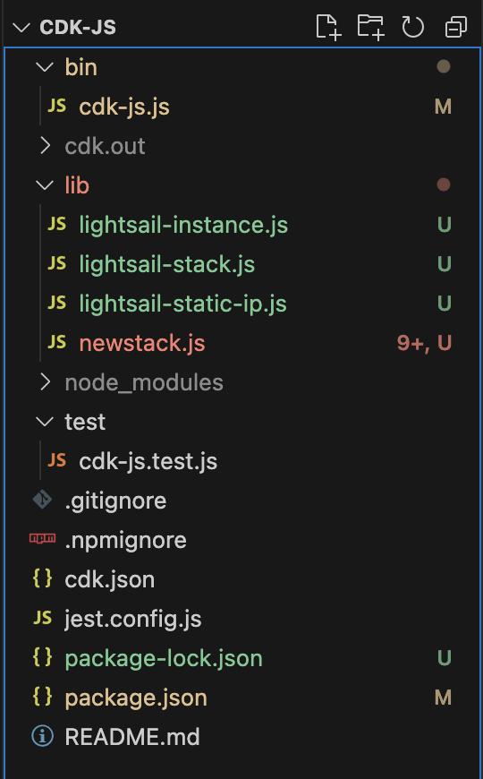
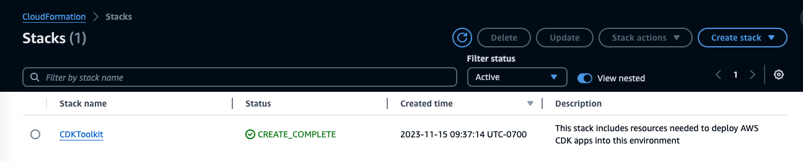
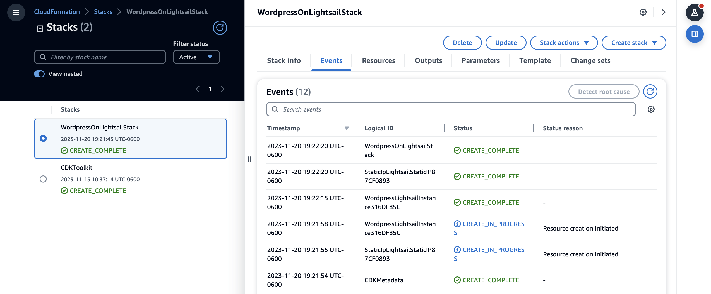
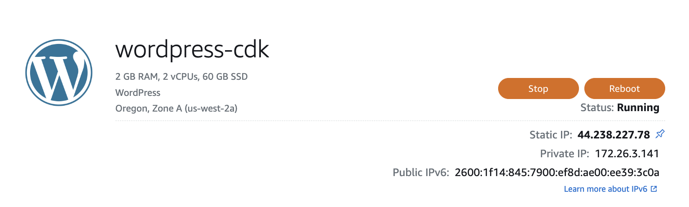
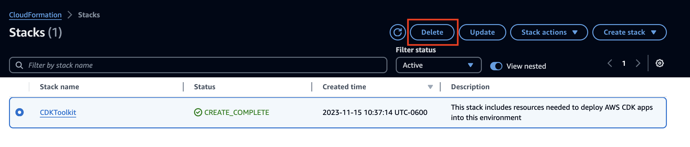

There are many ways of building AWS infrastructure. They range from using the AWS web console to the AWS CLI, and using infrastructure as code (IaC) with CloudFormation, Terraform, and AWS Cloud Development Kit (CDK). While manually building cloud infrastructure with the AWS console or scripting AWS CLI commands can get you started, IaC offers distinct advantages when building and maintaining the cloud infrastructure and applications. First, it provides a single source for all the resources, and unlike manual or scripted methods, IaC allows for version control and rollback. Finally, IaC is reusable, for example you might need to build a VPC in different regions, you can reuse the same code by merely changing the region. This article introduces the AWS CDK by demonstrating how to deploy a Wordpress Lightsail instance with a static IP. 

## AWS CDK Concepts

CDK uses AWS CloudFormation to provision resources and you can use a familiar programming language such as TypeScript, JavaScript, Python, Java. and C#/.NET to create resources from a library of services expressed as [Constructs](https://docs.aws.amazon.com/cdk/v2/guide/constructs.html?sc_channel=el&sc_campaign=post&sc_content=automaticallyreleasesphinxdocumentationcdkpipelinescustomcodebuildimage&sc_geo=mult&sc_country=mult&sc_outcome=acq&sc_publisher=amazon_media&sc_category=lightsail&sc_medium=body). Resources can be combined into a [Stack](https://docs.aws.amazon.com/cdk/v2/guide/stacks.html?sc_channel=el&sc_campaign=post&sc_content=automaticallyreleasesphinxdocumentationcdkpipelinescustomcodebuildimage&sc_geo=mult&sc_country=mult&sc_outcome=acq&sc_publisher=amazon_media&sc_category=lightsail&sc_medium=body), which is the smallest unit of deployment.

Constructs represent services with common defaults used in provisioning resources. AWS CDK includes a Construct library with most of the AWS services. To create a resource, such as S3 bucket or and EC2 instance, you would instantiate a new class from a Construct and configure it as needed for your deployment. Constructs are easily configured and can be composed in a way that facilitates reuse.

There are three levels of CDK Constructs. **Level 1** constructs are low level and provide a one-to-one mapping for resources in CloudFormation. As such, they are called [CFN Resources](https://docs.aws.amazon.com/AWSCloudFormation/latest/UserGuide/cfn-resource-specification.html?sc_channel=el&sc_campaign=post&sc_content=automaticallyreleasesphinxdocumentationcdkpipelinescustomcodebuildimage&sc_geo=mult&sc_country=mult&sc_outcome=acq&sc_publisher=amazon_media&sc_category=lightsail&sc_medium=body). **Level 2** constructs build on Level 1 constructs and include default values, boiler plate code, and glue logic. These additions reduce the effort to know all the details about a resource. **Level 3** constructs implement patterns, or common implementations of resources in combination.

To create a resource, you instantiate a class that extends the Construct base class. All constructs take three parameters:

- **scope** - this is the constructs parent, which is either a stack or another construct. You typically use `this` (in TypeScript or JavaScript) to represent the current object.
- **id** - an identifier that is unique within the scope. The id acts as a namespace for the current construct and it’s used to generate [resource names](https://docs.aws.amazon.com/cdk/v2/guide/resources.html#resources_physical_names?sc_channel=el&sc_campaign=post&sc_content=automaticallyreleasesphinxdocumentationcdkpipelinescustomcodebuildimage&sc_geo=mult&sc_country=mult&sc_outcome=acq&sc_publisher=amazon_media&sc_category=lightsail&sc_medium=body).
- **props** - properties define a constructs attributes and provide sensible default values. If a property is optional, it can be omitted when creating a resource.

CDK applications are called apps and apps have Stacks. A stack contains all the resources defined in the scope. Stacks are implemented with CloudFormation and a CDK app can have multiple stacks. For example, you could have a CDK app that creates dev, test, and prod stacks.

## Deploy WordPress with CDK

In this example, we will deploy Wordpress on a Lightsail instance and attach a static IP to the instance. To get started make sure you have AWS CDK installed. We’re using JavaScript and we can install AWS CDK with NPM.

```bash
$ npm install -g aws-cdk
```

Make a directory for the CDK app, initialize it with the app template in the directory. 

```bash
$ mkdir wordpress-on-lightsail
$ cd wordpress-on-lightsail
$ cdk init app --language javascript
```

CDK will create the directories and configuration files for the app.



CDK has only Level 1 constructs for Lightsail services. That means Lightsail resources are exactly defined by CloudFormation and you must create the the configuration yourself. Using the editor of you choice open a new file in the `lib` directory and name it `lightsail-instance.js`. Copy the code below and save the file. This class creates a Lightsail instance, the required parameters (instanceName, blueprintId, and bundleId) are defined. An optional parameter, availabilityZone, is included.

```javascript
const {Construct} = require("constructs")
const lightsail = require("aws-cdk-lib/aws-lightsail")

class LightsailInstance extends Construct {
  constructor(scope, id, props) {
    super(scope, id)

    const lightsailInstance = new lightsail.CfnInstance(
      this,
      "LightsailInstance",
      {
        instanceName: props.instanceName,
        availabilityZone: props?.availabilityZone,
        blueprintId: props.blueprintId,
        bundleId: props.bundleId
      }
    )
  }
}

module.exports =  LightsailInstance
```

Next, open a file called `lightsail-static-ip.js` and copy the code below to create a static IP class. Note that the `attachedTo` property is optional and uses JavaScript’s optional chaining operator, `?.`

```javascript
const { Construct } = require("constructs");
const lightsail = require("aws-cdk-lib/aws-lightsail");

class LightsailStaticIP extends Construct {
    constructor(scope, id, props) {
        super(scope, id);

        const lightsailStaticIP = new lightsail.CfnStaticIp(
            this,
            "LightsailStaticIP",
            {
                staticIpName: props.staticIpName,
                attachedTo: props?.attachedTo
            }
        );
    }

}

module.exports = LightsailStaticIP
```

The next step is to create a stack. Open the `wordpress-on-lightsail-stack.js` file. First, import the classes for the instance and the static ip. To configure the instance and the static IP, define an array of properties for each, note that the `attachedTo` property uses the instance name set in the instance properties. The stack is created similarly to the resources and it instantiates the Lightsail instance and static IP.

```javascript
const {Stack} = require("aws-cdk-lib")
const LightsailInstance = require("./lightsail-instance")
const LightsailStaticIp = require("./lightsail-static-ip")


// # create properties for a lightsail wordpress instance
const InstanceProps = {
  instanceName: "wordpress-cdk",
  blueprintId: "wordpress",
  bundleId: "small_3_0"
}

// # create properties for a lightsail static ip 
const StaticIpProps = {
  staticIpName: "static-ip-cdk",
  attachedTo: InstanceProps.instanceName
}

class LightsailInstanceStack extends Stack {
  constructor(scope, id, props) {
    super(scope, id, props)

    new LightsailInstance(this, "Wordpress", InstanceProps)
    new LightsailStaticIp(this, "StaticIp", StaticIpProps)
  }
}

module.exports = LightsailInstanceStack
```

To create the stack, change to the `bin` directory and open the `wordpress-on-lightsail.js` file. Edit the file to import the wordpress-on-lightsail-stack module and instantiate the app.

```javascript
#!/usr/bin/env node

const cdk = require("aws-cdk-lib");
const WordpressOnLightsailStack = require("../lib/wordpress-on-lightsail-stack");

const app = new cdk.App();
new WordpressOnLightSailStack(app, 'WordPressOnLightSailStack', {
  /* If you don't specify 'env', this stack will be environment-agnostic.
   * Account/Region-dependent features and context lookups will not work,
   * but a single synthesized template can be deployed anywhere. */

  /* Uncomment the next line to specialize this stack for the AWS Account
   * and Region that are implied by the current CLI configuration. */
  // env: { account: process.env.CDK_DEFAULT_ACCOUNT, region: process.env.CDK_DEFAULT_REGION },

  /* Uncomment the next line if you know exactly what Account and Region you
   * want to deploy the stack to. */
  // env: { account: '123456789012', region: 'us-east-1' },

  /* For more information, see https://docs.aws.amazon.com/cdk/latest/guide/environments.html */
});
```

Before deploying the app, CDK will need to [bootstrap](https://docs.aws.amazon.com/cdk/v2/guide/bootstrapping.html?sc_channel=el&sc_campaign=post&sc_content=automaticallyreleasesphinxdocumentationcdkpipelinescustomcodebuildimage&sc_geo=mult&sc_country=mult&sc_outcome=acq&sc_publisher=amazon_media&sc_category=lightsail&sc_medium=body), or provision the resources before deploying them. This creates a bootstrap stack that contains the resource required by the deployment. The bootstrap stack is called `CDKToolKit` and appears in the CloudFormation console.



Create the bootstrap stack in a terminal.

```bash
$ cdk bootstrap
```

Next, deploy the stack.

```bash
$ cdk deploy
```

You can see the deployment in the the CloudFormation console.



We can see the Wordpress instance with a static IP in the Lightsail console.



To clean up this example and prevent additional charges for the resources, use the destroy command.

```
$ cdk destroy
```

Note that the CDKToolKit stack will not be deleted. To delete the CDKToolKit stack, use the CloudFormation console.



## Summary

In this introduction to infrastructure as code, we demonstrated how to deploy Wordpress on Lightsail using AWS CDK. However, the code can be reused to deploy any type of Lightsail instance by specifying the blueprint and the size of the instance can be set with the bundleId. This illustrates the advantages of using an IaC tools, i.e., reusability, repeatability, and scalability. Although the example creates a single stack, it can be extended to create dev, test, production environments. To learn more about IaC and CDK, checkout the [AWS CDK Getting Started](https://docs.aws.amazon.com/cdk/v2/guide/getting_started.html?sc_channel=el&sc_campaign=post&sc_content=automaticallyreleasesphinxdocumentationcdkpipelinescustomcodebuildimage&sc_geo=mult&sc_country=mult&sc_outcome=acq&sc_publisher=amazon_media&sc_category=lightsail&sc_medium=body).


