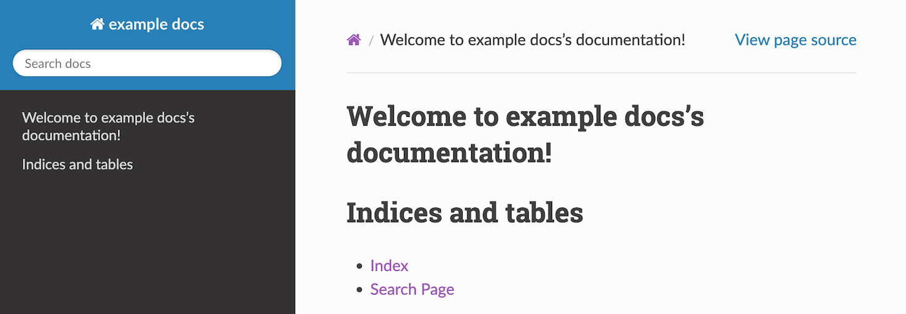
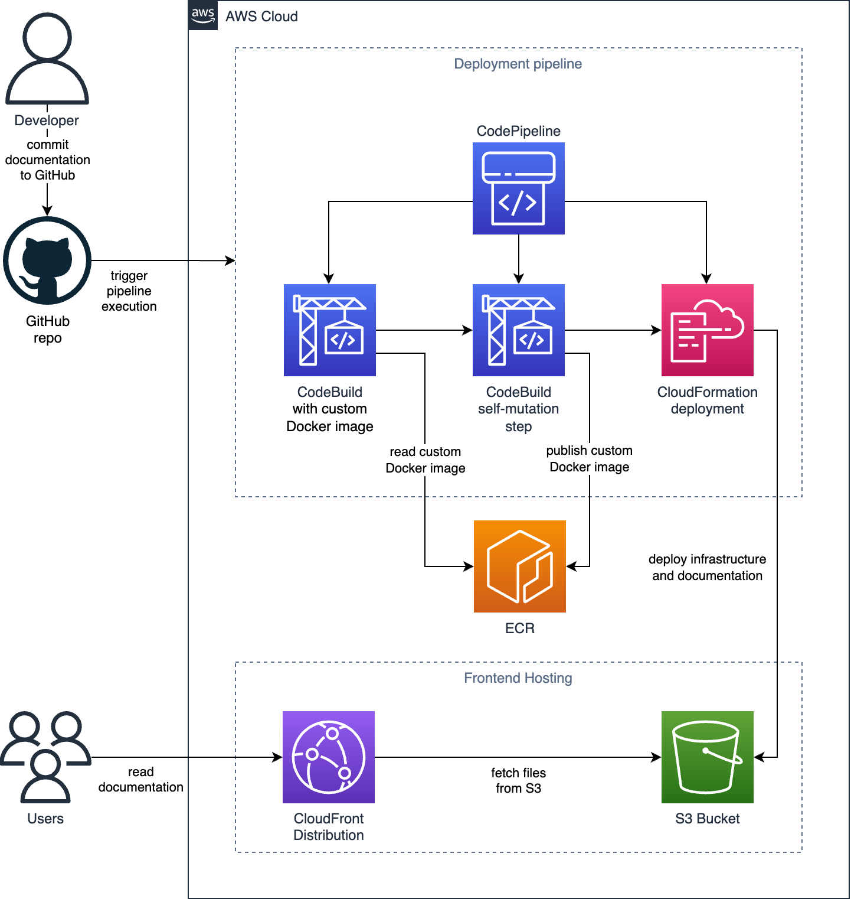
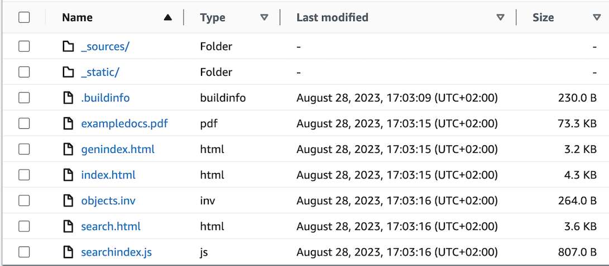

[Sphinx](https://www.sphinx-doc.org/) is a great tool for writing documentation. Source files are stored in a Git repository and can be exported to HTML, PDF and other formats. As with software projects, a pipeline makes it easy to publish a Sphinx documentation project.

Docker is one way to use Sphinx. There is a Docker image containing Sphinx binaries and all dependencies for publishing HTML and PDF versions of documentation. A custom Docker image can be used if, for example, special themes are used.

This article describes how to publish Sphinx projects using CDK pipelines. A custom Docker image is used for CodeBuild, which is published using CDK in ECR. The concepts in this article are not limited to Sphinx, but can be used as an example for other projects with similar requirements.

## Why Sphinx?
Every software project should have good documentation. But how do you create it? Sphinx is a tool for creating professional software documentation. It supports multiple output formats, table of contents, automatic indexing, source code handling and much more. It is also very powerful because of its extension and theme support.



## How does Sphinx work?
Sphinx is based on the reStructuredText format, a markup language similar to Markdown format. Authors can include source code, images, references, etc. Sphinx is a command line tool. A new project can be setup using command `sphinx-quickstart`. After the first pages are created, command `make html` exports to documentation as HTML.

Instead of running `make html` locally on the developer's machine, a pipeline is very useful to publish the documentation. The release of new versions is fully automated and the documentation is kept up to date.

## From requirements to AWS architecture
The `sphinxdoc/sphinx-latexpdf` Docker image provides the Sphinx runtime itself, as well as all the dependencies needed to export the documentation to PDF. The custom theme `sphinx_rtd_theme` should be used. As it is not included in the Docker image, a custom Docker image is required to include the theme. To create the custom docker image, you need to create a Dockerfile that references the original image and contains the theme. It must be published to a Docker registry. AWS ECR is used to manage these Docker images.

Documentation should be published automatically, similar to the way software is released. It makes sense to use the same tools. AWS CodePipeline can be used to orchestrate the CI/CD process. It runs on every commit. AWS CodeBuild can be configured to use a previously created custom Docker image. At the end, the pipelines publish the documentation to the deployment target.

Since documentations are a static files, it can be published to S3 buckets. CloudFront is used to make them public available.

To build this solution, using infrastructure as code makes sense. AWS CDK supports the necessary services, it can create CodePipeline using the CDK pipelines construct, it supports custom Docker images and it can create S3 buckets and CloudFront distributions.

This diagram shows the overall architecture:



## Building the dockerfile
Sphinx is written in Python. Therefore, extensions and themes are installed using Python requirements files. For this particular project, the requirements file `requirements.txt` only contains the custom theme that will be used.

```python
sphinx_rtd_theme==1.2.2
```

The `Dockerfile` contains all commands to create the Docker image used for CodeBuild. Based on the original Docker image `sphinxdoc/sphinx-latexpdf` it includes the commands to install `nodejs` and the custom theme from `requirements.txt`. The Node JS runtime is required to build the AWS CDK project which is based on Node JS.

```dockerfile
FROM sphinxdoc/sphinx-latexpdf

WORKDIR /docs
RUN apt-get update
RUN apt-get -y install curl
RUN curl -fsSL https://deb.nodesource.com/setup_18.x | bash
RUN apt-get install nodejs
ADD requirements.txt /docs
RUN pip3 install -r requirements.txt
```

## Creating AWS infrastructure
The AWS infrastructure for hosting the documentation is quit simple. The AWS CDK stack `SphinxDocumentationAppStack` contains the S3 Bucket that stores the static files and a CloudFront Distribution. For internal documentation, use appropriate services to make it available internally only. The CDK project is written in TypeScript.

```ts
const documentationBucket = new s3.Bucket(this, "DocumentationBucket", {
  blockPublicAccess: s3.BlockPublicAccess.BLOCK_ALL,
});

const distribution = new cloudfront.Distribution(this, "Distribution", {
  defaultBehavior: { origin: new origins.S3Origin(documentationBucket) },
  defaultRootObject: "index.html",
});
```

The AWS S3 Deployment Construct deploys the documentation to the S3 bucket and invalidates the CloudFront cache. It contains two source assets:
- Folder `html` containing all HTML and CSS files for HTML format
- PDF version of the documentation. As folder `latex` contains the PDF file and latex files, the exclude property is used to publish only the PDF file.

```ts
new s3deploy.BucketDeployment(this, "DeployWebsite", {
  sources: [
    s3deploy.Source.asset(
      path.join(__dirname, "..", "..", "documentation", "_build", "html")
    ),
    s3deploy.Source.asset(
      path.join(__dirname, "..", "..", "documentation", "_build", "latex"),
      { exclude: ["**", "!exampledocs.pdf"] }
    ),
  ],
  destinationBucket: documentationBucket,
  distribution,
});
```

## Setting up the CDK Pipeline with Custom CodeBuild image
AWS CDK Stack `SphinxDocumentationPipelineStack` defines the deployment pipeline. Some custom configurations are required to support Sphinx.

The custom build image is defined in property `buildImage`. The directory points to the folder containing the Dockerfile. CDK will automatically build the Docker image based on the Dockerfile. No manual step is required. Platform `LINUX_AMD64` is required when using an Apple M1 chips for local development/deployment. Without this property, `LINUX_ARM64`  will be used, which is not compatible with the default CodeBuild settings.

Property `input` is not specific to the Sphinx project. It contains the connection information to get the source code from GitHub.

Specific build commands need to be used. First, the commands `make html` and `make latexpdf` export the documentation to HTML and PDF. Next, the CDK project will is synthesized into the underlying CloudFormation templates.

Normally, the self-mutation step in CDK pipelines does not require Docker support. Since this project creates a new Docker image during self-mutation, the property `dockerEnabledForSelfMutation` must be enabled.

```ts
const pipeline = new pipelines.CodePipeline(this, "Pipeline", {
  synth: new pipelines.CodeBuildStep("Synth", {
    buildEnvironment: {
      buildImage: codebuild.LinuxBuildImage.fromAsset(this, "Image", {
        directory: path.join(__dirname, "..", "..", "sphinx-docker"),
        platform: Platform.LINUX_AMD64,
      }),
    },
    input: pipelines.CodePipelineSource.connection(
      "jumic/sphinx-documentation-pipeline",
      "main",
      {
        connectionArn:
          "arn:aws:codestar-connections:eu-central-1:352770552266:connection/12345678-1234-1234-1234-123456789abcd",
      }
    ),
    primaryOutputDirectory: "cdk/cdk.out",
    commands: [
      "cd documentation ",
      "make html",
      "make latexpdf",
      "cd ..",
      "cd cdk",
      "npm ci",
      "npx cdk synth",
      "cd ..",
    ],
  }),
  dockerEnabledForSelfMutation: true,
});

pipeline.addStage(new SphinxDocumentationStage(this, "Deployment"));
```

## Deployment and test

For the first deployment, the CDK stack `SphinxDocumentationPipelineStack` must be deployed using `cdk deploy`. This will create the pipeline that will continuously deploy the Sphinx project.

When the pipeline execution is finished, the S3 Bucket shows the HTML and PDF versions of the documentation. It is also accessible via the CloudFront URL.




## Conclusion

AWS provides all the necessary services to automate the release of Sphinx documentation projects. AWS CDK is very powerful in this case - it allows you to easily set up a CodePipeline that uses a custom Docker image. The custom Docker image itself is also published using CDK and the pipeline.

The solution does not require any complex code. It includes the logic to deploy the AWS infrastructure and publish the Sphinx documentation. CodePipeline and CodeBuild were designed to build software projects. However, they are also well suited to the documentation use case.

Working with custom Docker images shows the flexibility of AWS and CDK. This example can be applied to other projects where custom Docker images are required to build software projects.
