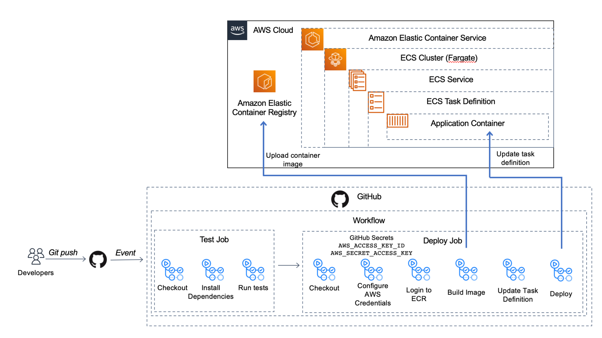
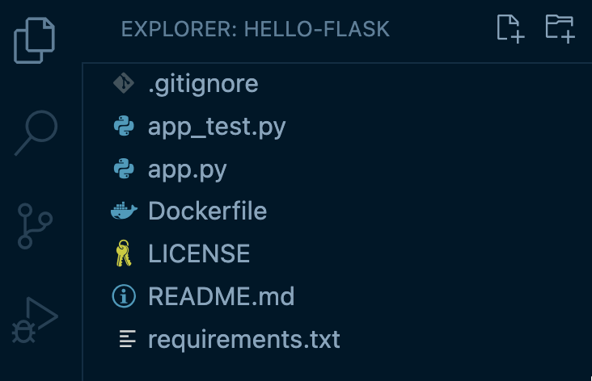
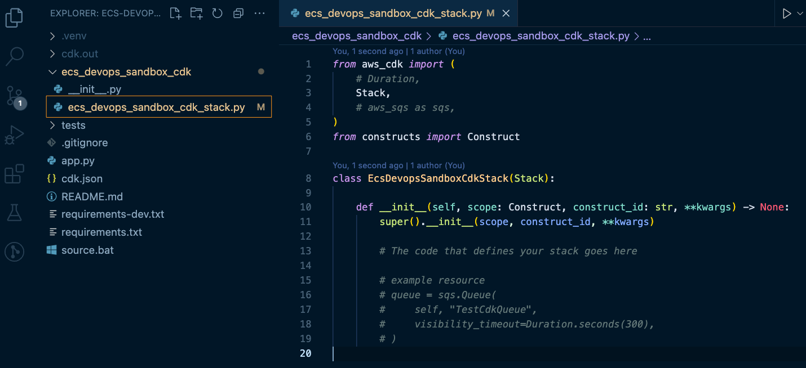
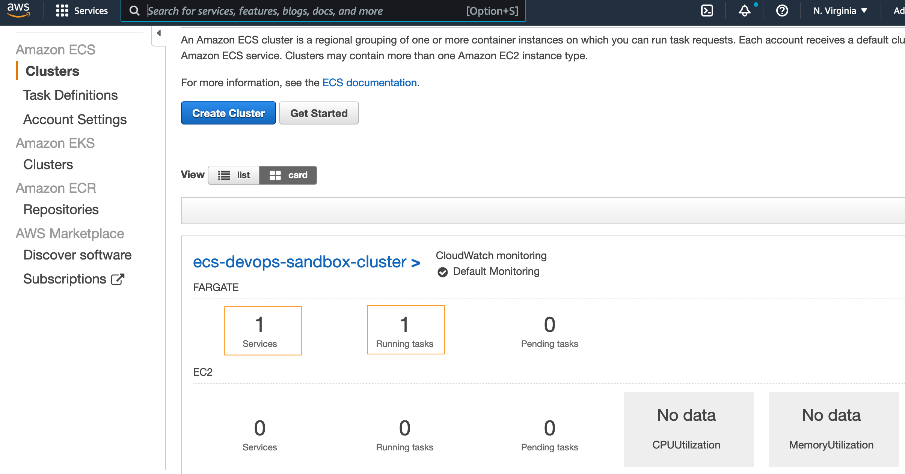
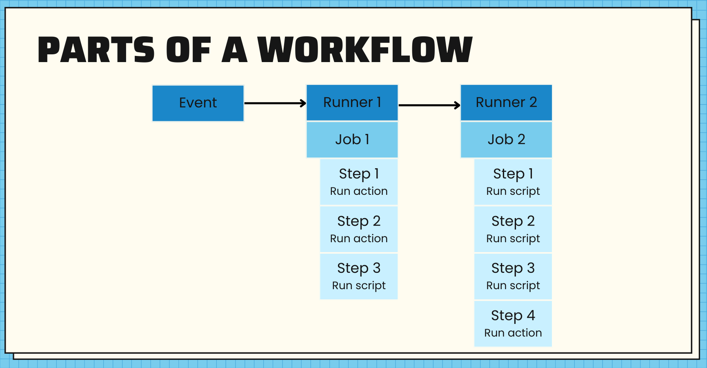
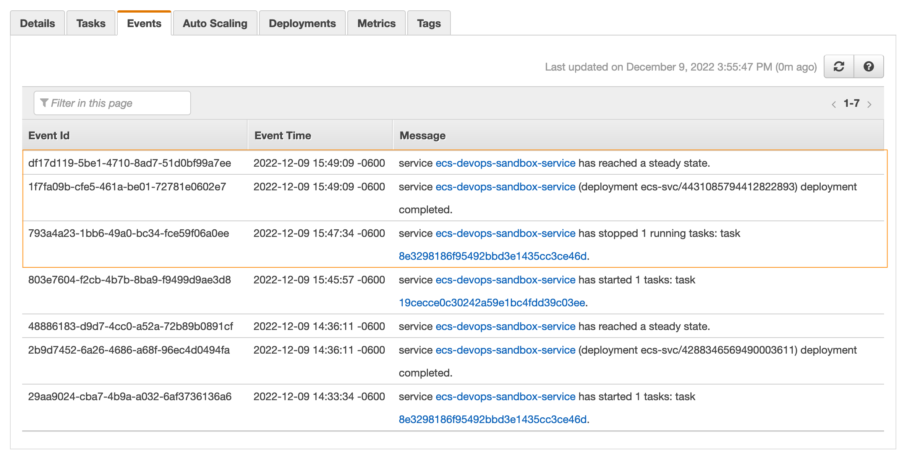

You've built out the first version of your Flask web app and even containerized it with Docker so your developer teammates can run it locally. Now, it's time to figure out how to deploy this container into the world! There are two key goals you want to accomplish with your deployment: first, you want your app to stay current, deploying whenever you or your teammates push a new feature up to the repo; second, you want to make sure your code is high-quality and immediately valuable to customers. To deliver on these goals, you'll need to create a simple CI/CD pipeline to deploy our container to infrastructure in the cloud.

For the CI/CD pipeline, we'll use GitHub Actions to create a workflow with two jobs. The two jobs below will be triggered when we push code to the main branch of our code repo:
- a test job to run unit tests against our Flask app and
- a deploy job to create a container image and deploy that to our container infrastructure in the cloud.

First, we'll configure the containerized Flask app to run in the cloud. Then, we'll create this infrastructure using the AWS CDK, an infrastructure as code framework that let's us create infrastructure with higher-level programming languages like Python. Finally, we'll set up our GitHub Actions workflow to test and deploy our app.

We're only deploying one container today, but this solution would work if you're running multiple containerized services.

Below is an architecture diagram of what we'll be building today:



Let's get started!

| ToC                                                                            |
|--------------------------------------------------------------------------------|
| Steps                                                                          | 
| 1. [Prerequisites](#1-prerequisites)                                           |
| 2. [Configure the Flask App](#2-configure-the-flask-app)                       |
| 3. [Provision Infrastructure Resources](#3-provision-infrastructure-resources) |
| 4. [Setup GitHub Actions Workflow](#4-setup-github-actions-workflow)           |
| 5. [Running the Workflow](#5-running-the-workflow)                             |
| 6. [Check App Deployment](#6-check-app-deployment)                             |
| 7. [Destroy Resources](#7-destroy-resources)                                   |

## 1. Prerequisites

To work through these examples, you'll need a few bits set up first:
- An AWS account. You can create your account [here](https://aws.amazon.com/premiumsupport/knowledge-center/create-and-activate-aws-account/).
- The CDK installed. You can find instructions for installing the CDK [here](https://docs.aws.amazon.com/cdk/v2/guide/getting_started.html). Note: For the CDK to work, you'll also need to have the AWS CLI installed and configured or setup the `AWS_ACCESS_KEY_ID`, `AWS_SECRET_ACCESS_KEY`, and `AWS_DEFAULT_REGION` as environment variables. The instructions above show you how to do both.
- Docker Desktop installed. Here are the instructions to [install Docker Desktop](https://docs.docker.com/desktop/).

Just want the code? Grab the CDK code to create the infrastructure [here](https://github.com/jennapederson/ecs-devops-sandbox-cdk) or the Flask app, container configuration, and GitHub Actions workflow [here](https://github.com/jennapederson/hello-flask).

## 2. Configure the Flask App

Before we provision the infrastruture, let's review our containerized Flask app and configure it to run in the cloud.

### Review App Setup

First, clone the repository using the `start-here` branch:

```
$ git clone https://github.com/jennapederson/hello-flask -b start-here
```

We have a containerized Flask app with the following file structure:



In the main application file, `app.py`, there is one route that reverses the value of a string passed on the URL path and returns it:

```python
"""Main application file"""  
from flask import Flask  
app = Flask(__name__)  
  
@app.route('/<random_string>')  
def returnBackwardsString(random_string):  
"""Reverse and return the provided URI"""  
return "".join(reversed(random_string))  
  
if __name__ == '__main__':  
app.run(host='0.0.0.0', port=8080)
```

And we've implemented one test in the `app_test.py` file to ensure our business functionality of reversing that string value is working:

```python
"""Unit test file for app.py"""  
from app import returnBackwardsString  
import unittest  
  
class TestApp(unittest.TestCase):  
"""Unit tests defined for app.py"""  
  
def test_return_backwards_string(self):  
"""Test return backwards simple string"""  
random_string = "This is my test string"  
random_string_reversed = "gnirts tset ym si sihT"  
self.assertEqual(random_string_reversed, returnBackwardsString(random_string))  
  
if __name__ == "__main__":  
unittest.main()
```

We've already got a `Dockerfile` to set up our container image. This file is a template that gives instructions to [Docker](https://docs.docker.com/get-started/overview/) on how to create our container. The first line starting with `FROM` bases our container on a public Python image and then from there we customize it for our use. We've set up the working directory (`WORKDIR`), copy application files into that directory on the container (`COPY`), install dependencies (`RUN pip install`), open up port 8080 (`EXPOSE`), and run the command to run the app (`CMD python`).

```
FROM python:3  
# Set application working directory  
WORKDIR /usr/src/app  
# Install requirements  
COPY requirements.txt ./  
RUN pip install —no-cache-dir -r requirements.txt  
# Install application  
COPY app.py ./  
# Open port app runs on  
EXPOSE 8080  
# Run application
CMD python app.py
```

### Run App Locally

Let's run this app locally to make sure it works before we start configuring it for the cloud.

Make sure Docker Desktop is running and then, from the `hello-flask` project directory, run the following command to build the container image:

```
$ docker build -t hello-flask .
```

When this is complete, you'll have a container image. Next, we'll run the command to run a container based on that image:

```
$ docker run -dp 8080:8080 --name hello-flask-1 hello-flask
```

You should now be able to point your browser to [`http://localhost:8080/hello-world`](http://localhost:8080/hello-world) and see that it returns `dlrow-olleh`.

If that doesn't work, check to make sure your container is running, using the command `docker system df`:


You can also use Docker Desktop Dashboard to see if the container is running.

### Run the Test

You can also make sure your unit test is working by running the following commands in your project directory:

```
$ pip install -r requirements.txt
$ pip install pytest
$ pytest
```

The first two commands install your app dependencies and the python test command. The third command runs your tests.
  
### Configure App for the Cloud

Now that we know our app works locally, we need to configure it for the cloud. We'll use Amazon ECS with AWS Fargate for our container orchestrator, but there are others you could use as well. Using Fargate, instead of Amazon EC2 instances, means we won't have to manage servers and it will manage scaling containers up and down for us.

To configure our app, we'll create the `task-definition.json` file that ECS needs. This is a blueprint for our application. We can add multiple containers (up to 10) to compose our app. Today, we only need one. Using the code below, you'll replace `YOUR_AWS_ACCOUNT_ID` with your own AWS account ID.

```json
{
  "requiresCompatibilities": [
      "FARGATE"
  ],
  "inferenceAccelerators": [],
  "containerDefinitions": [
      {
          "name": "ecs-devops-sandbox",
          "image": "ecs-devops-sandbox-repository:00000",
          "resourceRequirements": null,
          "essential": true,
          "portMappings": [
              {
                  "containerPort": "8080",
                  "protocol": "tcp"
              }
          ]
      }
  ],
  "volumes": [],
  "networkMode": "awsvpc",
  "memory": "512",
  "cpu": "256",
  "executionRoleArn": "arn:aws:iam::YOUR_AWS_ACCOUNT_ID:role/ecs-devops-sandbox-execution-role",
  "family": "ecs-devops-sandbox-task-definition",
  "taskRoleArn": "",
  "placementConstraints": []
}
```

## 3. Provision Infrastructure Resources

To provision our infrastructure resources, we'll use the CDK, but you could use other Infrastructure as Code frameworks like Terraform or CloudFormation.

### Create CDK App

Now, we're ready to create our CDK app that will create the infrastructure where we'll deploy our app.

First, we'll initialize a CDK app that uses Python. In a new project directory, ``

```bash
$ cdk init --language python
```
This creates the file structure shown below. Today, we'll be hanging out in the `ecs_devops_sandbox_cdk/ecs_devops_sandbox_cdk_stack.py` file.



Copy the code below and replace the contents of this file. We'll walk through the various parts next.

```python
import aws_cdk as cdk
import aws_cdk.aws_ecr as ecr
import aws_cdk.aws_ec2 as ec2
import aws_cdk.aws_ecs as ecs
import aws_cdk.aws_iam as iam
# import aws_cdk.aws_ecs_patterns as ecs_patterns

class EcsDevopsSandboxCdkStack(cdk.Stack):

    def __init__(self, scope: cdk.App, construct_id: str, **kwargs) -> None:
        super().__init__(scope, construct_id, **kwargs)

        ecr_repository = ecr.Repository(self,
            "ecs-devops-sandbox-repository",
            repository_name="ecs-devops-sandbox-repository")

        vpc = ec2.Vpc(self,
            "ecs-devops-sandbox-vpc",
            max_azs=3)

        cluster = ecs.Cluster(self,
            "ecs-devops-sandbox-cluster",
            cluster_name="ecs-devops-sandbox-cluster",
            vpc=vpc)

        execution_role = iam.Role(self,
            "ecs-devops-sandbox-execution-role",
            assumed_by=iam.ServicePrincipal("ecs-tasks.amazonaws.com"),
            role_name="ecs-devops-sandbox-execution-role")

        execution_role.add_to_policy(iam.PolicyStatement(
            effect=iam.Effect.ALLOW,
            resources=["*"],
            actions=[
                "ecr:GetAuthorizationToken",
                "ecr:BatchCheckLayerAvailability",
                "ecr:GetDownloadUrlForLayer",
                "ecr:BatchGetImage",
                "logs:CreateLogStream",
                "logs:PutLogEvents"
                ]
        ))

        #
        # Option 1: Creates service, container, and task definition without creating a load balancer
        #   and other costly resources. Containers will not be publicly accessible.
        #
        task_definition = ecs.FargateTaskDefinition(self,
            "ecs-devops-sandbox-task-definition",
            execution_role=execution_role,
            family="ecs-devops-sandbox-task-definition")

        container = task_definition.add_container(
            "ecs-devops-sandbox",
            image=ecs.ContainerImage.from_registry("amazon/amazon-ecs-sample"),
            logging=ecs.LogDrivers.aws_logs(stream_prefix="ecs-devops-sandbox-container")
        )

        service = ecs.FargateService(self,
            "ecs-devops-sandbox-service",
            cluster=cluster,
            task_definition=task_definition,
            service_name="ecs-devops-sandbox-service")

        # END Option 1

        #
        # Option 2: Creates a load balancer and related AWS resources using the ApplicationLoadBalancedFargateService construct.
        #   These resources have non-trivial costs if left provisioned in your AWS account, even if you don't use them. Be sure to
        #   clean up (cdk destroy) after working through this exercise.
        #
        # Comment out option 1 and uncomment the code below. Uncomment the aws_cdk.aws_ecs_patterns import at top of file.
        #
        # task_image_options = ecs_patterns.ApplicationLoadBalancedTaskImageOptions(
        #     family="ecs-devops-sandbox-task-definition",
        #     execution_role=execution_role,
        #     image=ecs.ContainerImage.from_registry("amazon/amazon-ecs-sample"),
        #     container_name="ecs-devops-sandbox",
        #     container_port=8080,
        #     log_driver=ecs.LogDrivers.aws_logs(stream_prefix="ecs-devops-sandbox-container")
        # )
        #
        # ecs_patterns.ApplicationLoadBalancedFargateService(self, "ecs-devops-sandbox-service",
        #     cluster=cluster,
        #     service_name="ecs-devops-sandbox-service",
        #     desired_count=2,
        #     task_image_options=task_image_options,
        #     public_load_balancer=True
        # )
        #
        # END Option 2
```

#### Create VPC and Task Execution Role
The code below sets up our VPC and a task execution role so that the ECS task can pull our container image from Amazon ECR, the repository where we'll store our container images.

```python
vpc = ec2.Vpc(self,
	"ecs-devops-sandbox-vpc",
	max_azs=3)

execution_role = iam.Role(self,
	"ecs-devops-sandbox-execution-role",
	assumed_by=iam.ServicePrincipal("ecs-tasks.amazonaws.com"),
	role_name="ecs-devops-sandbox-execution-role")

execution_role.add_to_policy(iam.PolicyStatement(
	effect=iam.Effect.ALLOW,
	resources=["*"],
	actions=[
		"ecr:GetAuthorizationToken",
		"ecr:BatchCheckLayerAvailability",
		"ecr:GetDownloadUrlForLayer",
		"ecr:BatchGetImage",
		"logs:CreateLogStream",
		"logs:PutLogEvents"
		]
))
```

#### Create Container Image Repository
Next, we need a place to put our container images after we've built them so that they can be deployed. The code below creates a private ECR repository.

```python
ecr_repository = ecr.Repository(self,
	"ecs-devops-sandbox-repository",
	repository_name="ecs-devops-sandbox-repository")
```

#### Create ECS Cluster, Task Definition, Container, and Service

This code creates an ECS Cluster. A cluster is a logical grouping of tasks or services.

```Python
cluster = ecs.Cluster(self,
	"ecs-devops-sandbox-cluster",
	cluster_name="ecs-devops-sandbox-cluster",
	vpc=vpc)
```

Next, this code creates a simple task definition so our infrastructure will start up (without our app deployed the first time) and adds a container to the task definition.

```python
task_definition = ecs.FargateTaskDefinition(self,
	"ecs-devops-sandbox-task-definition",
	execution_role=execution_role,
	family="ecs-devops-sandbox-task-definition")

container = task_definition.add_container(
	"ecs-devops-sandbox",
	image=ecs.ContainerImage.from_registry("amazon/amazon-ecs-sample"),
	logging=ecs.LogDrivers.aws_logs(stream_prefix="ecs-devops-sandbox-container")
)
```

Finally, there is a service, which allows you to run a specified number of instances of that task definition.

```python
service = ecs.FargateService(self,
	"ecs-devops-sandbox-service",
	cluster=cluster,
	task_definition=task_definition,
	service_name="ecs-devops-sandbox-service")
```

If any of the instances fails or stops, ECS will launch another instance of your task definition to replace it and maintain the desired count of tasks in the service. We always want at least one container running, so we'll use a service. If we were running a one-time or scheduled job, we could omit the service as we wouldn't need to keep it running or restart it.

💰💰💰 Note: In the sample code we copied, we are using Option 1. Option 2 (commented out) creates a load balancer and related AWS resources using the `ApplicationLoadBalancedFargateService` construct. These resources have non-trivial costs if left provisioned in your account, *even if you don't use them*. If you choose Option 2, be sure to clean up (`cdk destroy`) after working through this exercise. 

### Deploy CDK App
Now that we've created our CDK stack of resources, we can deploy it to create the infrastructure in the cloud.

First, activate the python environment and install dependencies like this:

```
$ source .venv/bin/activate
$ pip install -r requirements.txt
```

Then, run this command to deploy your stack of resources:

```bash
$ cdk deploy
```

#### Verify Cluster

Once the CDK deploy finishes, let's navigate to ECS (Elastic Container Service) -> Clusters in the AWS Console to check that the cluster we created has one running task and service as in the image below.



Now that we've created the infrastructure, we need to deploy our application container to the infrastructure.

## 4. Setup GitHub Actions Workflow
We need a tool to implement our CI/CD pipeline to build and test our app and deploy it to that infrastructure. Today, we'll use GitHub Actions. We could even build and test our *infrastructure code* and deploy it with GitHub Actions, but we'll save that for another day.

### What Are GitHub Actions
GitHub Actions provide a way to implement complex orchestration and CI/CD functionality directly in GitHub by initiating a workflow on any GitHub event like a push to a branch or a merge to main or even adding a label every time an issue is opened.

### Parts of a Workflow
The image below shows the parts of a workflow. A workflow runs one or more jobs that runs inside it's own runner or container. Each job has a series of steps and each step runs a specific action or script.



An action can be published on the GitHub Marketplace, either created by GitHub or published by someone else. For example:

-   Checkout code - an action created by the GitHub organization
	- `actions/checkout@v3`
-   Configure aws credentials - an action on the marketplace created by AWS
	- `aws-actions/configure-aws-credentials@v1`

We can also run a script like:
-   `docker build` or `docker push`

This let's us string multiple actions together to build, test, package up, and deploy our app. Each step is dependent on prior steps, so if the checkout code step isn't successful, we won't run the unit test step. Then we can set each job to be dependent on the previous job, so if the test job fails, the deploy job won't run and deploy broken code.

We could create our workflows directly from the GitHub UI, using one of the starter workflows in GitHub (in your repository, go to Actions -> New workflow - Choose a workflow). Today, we're using a customization of the starter workflows for testing a python app and for deploying to ECS.

Let's cover the steps to create this workflow. We'll be setting up:
- one workflow
- that triggers when there's a push to the main branch
- with two jobs, a test job and a deploy job
- the deploy job will depend on the test job, so if our tests fail, the deploy will not happen

### Creating the Workflow

In your Flask application repo, you'll create the `.github/workflows` directory and add the code below to this file, `test-deploy.yml`.

```yaml
name: Test and Deploy

on:
  push:
    branches:
      - main

env:
  AWS_REGION: us-east-1                   # set this to your preferred AWS region, e.g. us-west-1
  ECR_REPOSITORY: ecs-devops-sandbox-repository           # set this to your Amazon ECR repository name
  ECS_SERVICE: ecs-devops-sandbox-service                 # set this to your Amazon ECS service name
  ECS_CLUSTER: ecs-devops-sandbox-cluster                 # set this to your Amazon ECS cluster name
  ECS_TASK_DEFINITION: task-definition.json # set this to the path to your Amazon ECS task definition
                                               # file, e.g. .aws/task-definition.json
  CONTAINER_NAME: ecs-devops-sandbox           # set this to the name of the container in the
                                               # containerDefinitions section of your task definition

permissions:
  contents: read

jobs:
  test:
    name: Test
    runs-on: ubuntu-latest

    steps:
    - uses: actions/checkout@v3
    - name: Set up Python 3.10
      uses: actions/setup-python@v3
      with:
        python-version: "3.10"
    - name: Install dependencies
      run: |
        python -m pip install --upgrade pip
        pip install flake8 pytest
        if [ -f requirements.txt ]; then pip install -r requirements.txt; fi
    - name: Lint with flake8
      run: |
        # stop the build if there are Python syntax errors or undefined names
        flake8 . --count --select=E9,F63,F7,F82 --show-source --statistics
        # exit-zero treats all errors as warnings. The GitHub editor is 127 chars wide
        flake8 . --count --exit-zero --max-complexity=10 --max-line-length=127 --statistics
    - name: Test with pytest
      run: |
        pytest

  deploy:
    name: Deploy
    runs-on: ubuntu-latest
    needs: [test]
    environment: production

    steps:
    - name: Checkout
      uses: actions/checkout@v3

    - name: Configure AWS credentials
      uses: aws-actions/configure-aws-credentials@v1
      with:
        aws-access-key-id: ${{ secrets.AWS_ACCESS_KEY_ID }}
        aws-secret-access-key: ${{ secrets.AWS_SECRET_ACCESS_KEY }}
        aws-region: ${{ env.AWS_REGION }}

    - name: Login to Amazon ECR
      id: login-ecr
      uses: aws-actions/amazon-ecr-login@v1

    - name: Build, tag, and push image to Amazon ECR
      id: build-image
      env:
        ECR_REGISTRY: ${{ steps.login-ecr.outputs.registry }}
        IMAGE_TAG: ${{ github.sha }}
      run: |
        # Build a docker container and
        # push it to ECR so that it can
        # be deployed to ECS.
        docker build -t $ECR_REGISTRY/$ECR_REPOSITORY:$IMAGE_TAG .
        docker push $ECR_REGISTRY/$ECR_REPOSITORY:$IMAGE_TAG
        echo "::set-output name=image::$ECR_REGISTRY/$ECR_REPOSITORY:$IMAGE_TAG"

    - name: Fill in the new image ID in the Amazon ECS task definition
      id: task-def
      uses: aws-actions/amazon-ecs-render-task-definition@v1
      with:
        task-definition: ${{ env.ECS_TASK_DEFINITION }}
        container-name: ${{ env.CONTAINER_NAME }}
        image: ${{ steps.build-image.outputs.image }}

    - name: Deploy Amazon ECS task definition
      uses: aws-actions/amazon-ecs-deploy-task-definition@v1
      with:
        task-definition: ${{ steps.task-def.outputs.task-definition }}
        service: ${{ env.ECS_SERVICE }}
        cluster: ${{ env.ECS_CLUSTER }}
        wait-for-service-stability: true
```

If you're following along with the sample code, you shouldn't have to change anything in the code above. Let's review the different parts of the workflow we created:

- Lines 3-6: This tells GitHub to trigger this workflow when there is a push to the main branch
- Lines 8-16: This sets up some environment variables to be used throughout the workflow
- Lines 18-19: This adds read permission to the contents of the repo for all jobs
- Lines 23-45: Configures the test job
	- Line 27: Checks out the code
	- Lines 28-31: Sets up Python with a specific version
	- Lines 32-36: Installs dependencies
	- Lines 37-42: Lints the code to check for syntax errors, stopping the build if any are found
	- Lines 43-45: Runs the unit tests
- Lines 47-95: Configures the deploy job
	- Line 50: Indicates that this job depends on a successful run of the test job
	- Lines 54-55: Checks out the code
	- Lines 57-62: Uses an external workflow `aws-actions/configure-aws-credentials@v1` to configure our AWS credentials with the environment variables we set earlier and our access key ID and secret access key (that we'll set up in the next step)
	- Lines 64-66: Using an external workflow `aws-actions/amazon-ecr-login@v1`, logs in to ECR using the AWS credentials we just configured
	- Lines 68-79: Builds, tags, and pushes our container image to ECR
		- Line 71: Uses an output from the previous step as the registry to use
		- Lines 77-79: Runs the docker commands to build, tag, and push the image
	- Lines 81-87: Using `aws-actions/amazon-ecs-render-task-definition@v1`, updates the ECS task definition with the values set in environment variables
	- Lines 89-95: Uses `aws-actions/amazon-ecs-deploy-task-definition@v1` to deploy the task definition to the ECS cluster

For more details on how to configure a workflow, checkout [Creating and managing GitHub Actions workflows](https://docs.github.com/en/actions/using-workflows).

Before we commit and push all these changes to GitHub, we need to set up our access key ID and secret access key for AWS in our repo. You'll probably want to create an IAM user specific to this task.

### Create IAM user

In the AWS console, navigate to the IAM service and create a new user with a user name like `github-actions-user`, making sure to give it programmatic access. Then attach the policy below, replacing the placeholder values (<YOUR_AWS_ACCOUNT_ID> and <YOUR_AWS_REGION>) with your AWS account ID and the region you are using:

```json
{
    "Version": "2012-10-17",
    "Statement": [
        {
            "Effect": "Allow",
            "Action": [
                "ecr:GetAuthorizationToken",
                "ecs:RegisterTaskDefinition",
                "sts:GetCallerIdentity"
            ],
            "Resource": "*"
        },
        {
            "Effect": "Allow",
            "Action": [
                "ecr:BatchCheckLayerAvailability",
                "ecr:CompleteLayerUpload",
                "ecr:InitiateLayerUpload",
                "ecr:PutImage",
                "ecr:UploadLayerPart"
            ],
            "Resource": "arn:aws:ecr:<YOUR_AWS_REGION>:<YOUR_AWS_ACCOUNT_ID>:repository/ecs-devops-sandbox-repository"
        },
        {
            "Effect": "Allow",
            "Action": [
                "ecs:DescribeServices",
                "ecs:UpdateService"
            ],
            "Resource": [
                "arn:aws:ecs:<YOUR_AWS_REGION>:<YOUR_AWS_ACCOUNT_ID>:service/default/ecs-devops-sandbox-service",
                "arn:aws:ecs:<YOUR_AWS_REGION>:<YOUR_AWS_ACCOUNT_ID>:service/ecs-devops-sandbox-cluster/ecs-devops-sandbox-service"
            ]
        },
        {
            "Effect": "Allow",
            "Action": [
                "iam:PassRole"
            ],
            "Resource": "arn:aws:iam::<YOUR_AWS_ACCOUNT_ID>:role/ecs-devops-sandbox-execution-role"
        }
    ]
}

```

Once the user is created, note down the “AWS ACCESS KEY ID” and the “AWS SECRET ACCESS KEY” to use in the next step. Treat these like a username and password. If you lose the “AWS SECRET ACCESS KEY”, you’ll need to generate a new one.

For more details on creating an IAM user, following these instructions to [create an IAM user](https://docs.aws.amazon.com/IAM/latest/UserGuide/id_users_create.html#id_users_create_console).

### Set Repository Secrets

Back in the GitHub UI, navigate to the Settings of your `hello-flask` repo. Then go to Secrets -> Actions in the menu. Select New Repository Secret to create a new one. Add both the AWS_ACCESS_KEY_ID and AWS_SECRET_ACCESS_KEY and their corresponding values from the previous step.


Once that is complete, commit and push your changes in the `hello-flask` repo to GitHub. The workflow will kick off momentarily. Let's go check it out!

## 5. Running the Workflow

The workflow we just created should be running now. It was automatically started because of the trigger we configured earlier -- to start when there are new changes pushed to the main branch of our code repo. Navigate over to the Actions tab in the GitHub UI for `hello-flask` to see that the test job has kicked off, as in the image below.


Pretty quickly we can see the tests pass and the Deploy job kicks off, as in the next image.


That will run for a few minutes, but eventually the full workflow will complete successfully, as in the image below.


At this point, our app should be deployed to ECS!

## 6. Check App Deployment

Let's go take a look at our ECS cluster to see if our app was deployed.

Looking at the service, we can see that we have one task running. And we can look at the Events tab to see the history of what's happened.



Above, we see one task was stopped. A service deployment was completed. And the service has reached a ready state.

We have success!

## 7. Destroy resources

If you're done using the cloud resources we created in this project, you can destroy them now to ensure you are not billed for their use. To do that, navigate back to the `ecs-devops-sandbox-repository` project at the command line and run:

```
$ cdk destroy
```

## Wrapping up

In this post, you learned how to use the CDK to provision infrastructure to deploy your Flask app to an ECS cluster. Then you learned to create a simple CI/CD pipeline with GitHub Actions, setting up a workflow to test and deploy your app to that infrastructure.

Next, you might consider exploring other ways to [use containers in the cloud](https://www.buildon.aws/posts/picturesocial/01-how-to-containerize-app-less-than-15-min/) or creating more complex CI/CD pipelines to automate more of your infrastructure and application.

If you'd like to try this out as a workshop, you can learn more about [automating CI/CD on AWS with GitHub Actions](# Automating CI/CD on AWS with GitHub Actions) that also touches on how to integrate this GitHub workflow with Amazon CodePipeline.
