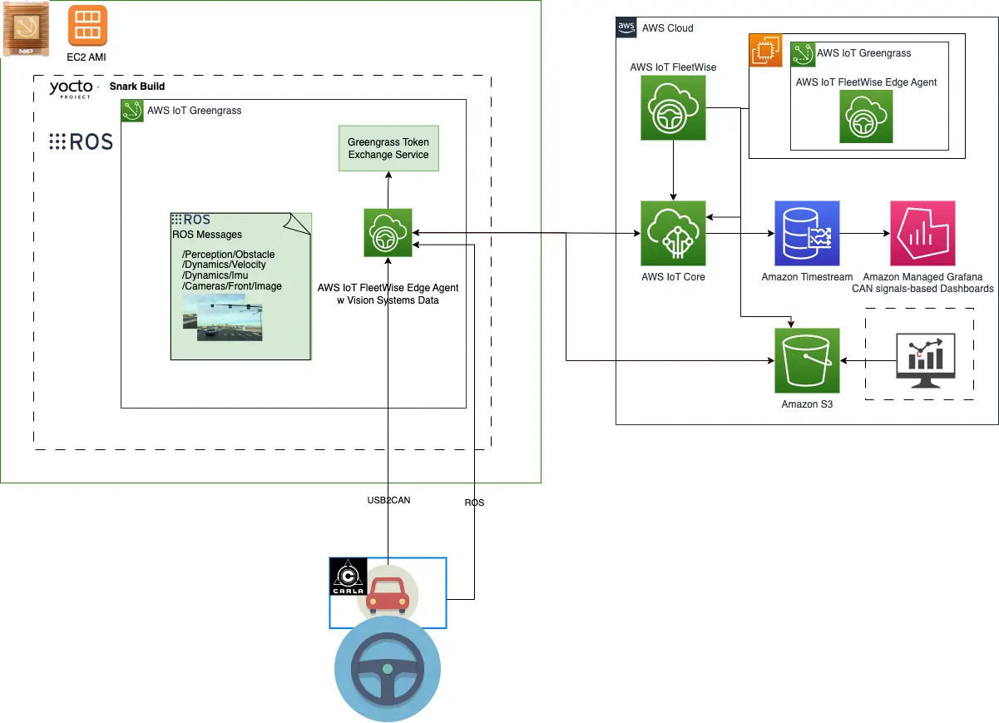
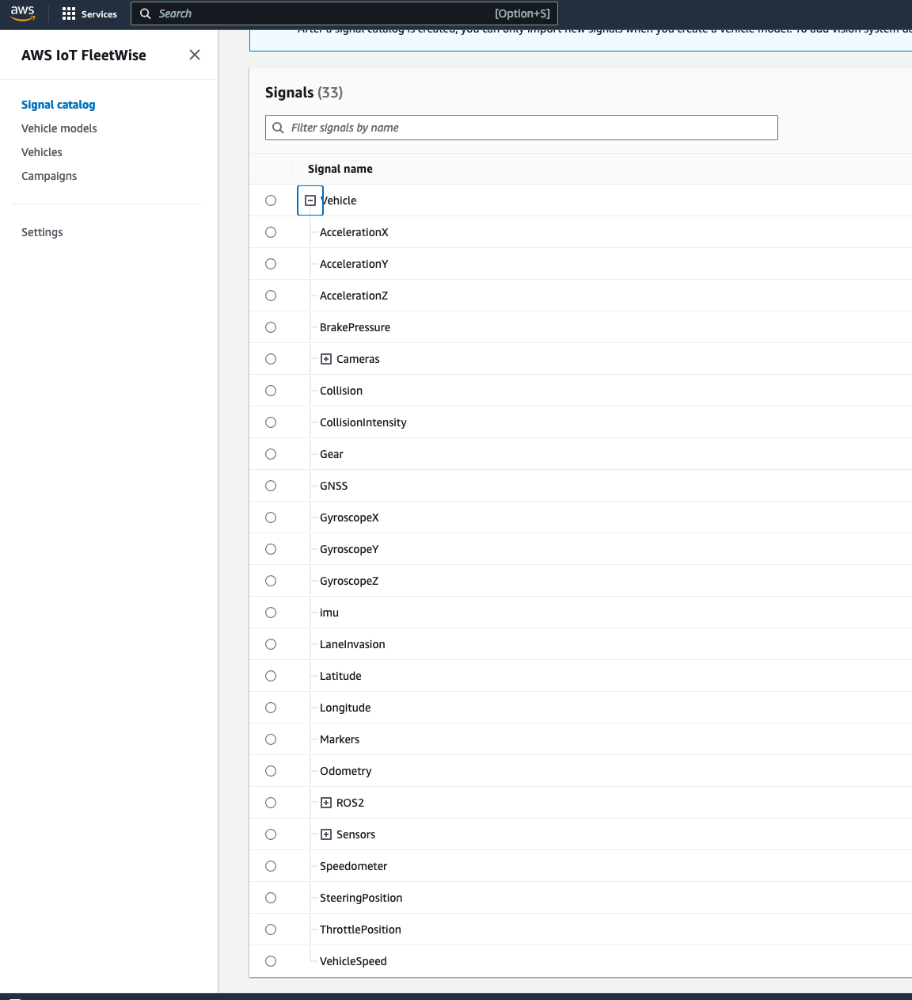
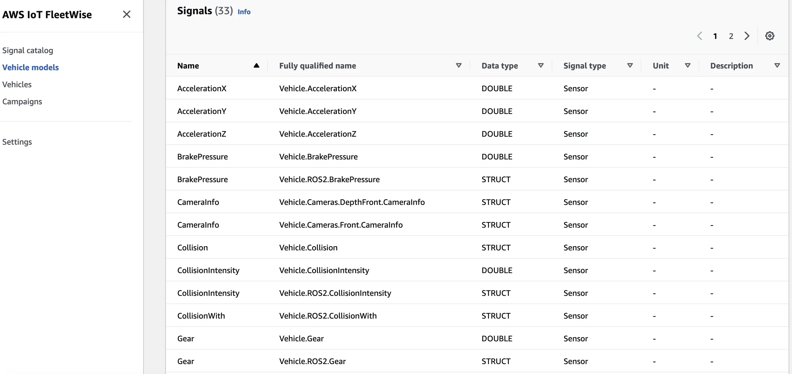
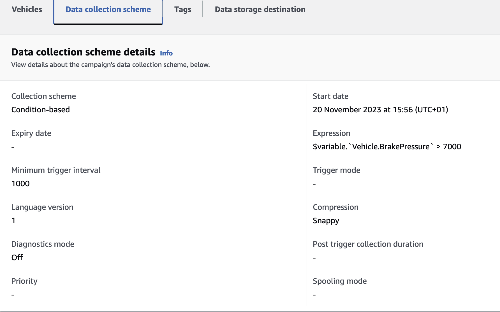
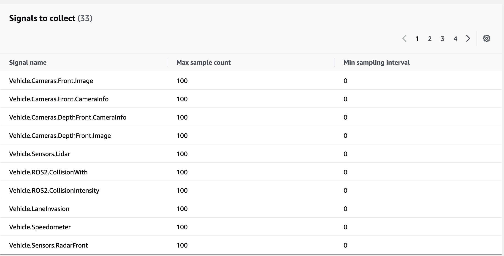
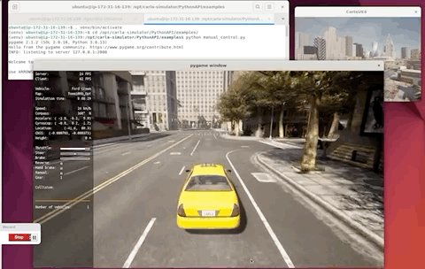
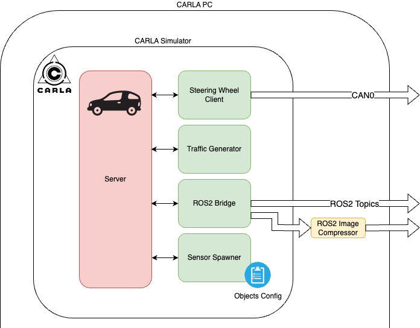

Traditionally, Automotive Original Equipment Manufacturers (OEMs) collect data from the vehicle in a manual way. They transform the data, store it, or not store it at all. The amount of data Automotive OEMs collect is ever increasing. For example, for Autonomous Driving use cases, every single day, from every car, large amounts of data needs to be collected and stored. If shared securely through common standards, data collected from vehicles can save lives and improve overall mobility at every level; from reducing accidents to improving roads to better maintenance of car components.

With AWS IoT FleetWise, you can move the decision if the data collected is meaningful from the cloud to the car. You can create rules based on certain conditions that are significant for you before storing the data in the cloud, to optimize cost.

This blog shows how AWS IoT FleetWise can be leveraged to get a view of different situations that a vehicle may encounter while in a city, in particular, unanticipated/surprising situations. We will use harsh break events as an example, and show how such an event can trigger data collection (of both CAN signals and sensor data).  We will then show how this data can be visualized.

## High Level Architecture

When running IoT data collection on AWS using AWS IoT FleetWise, the following components come into play:

1. A real vehicle or a vehicle simulator (which can be built using the open source simulator, such as [CARLA](https://carla.org/)). To set this up as a requirement, we need a vehicle that produces CAN messages which we use for signal modeling (this usually comes in a form of a DBC file). Additionally, we can monitor other type of sensor data by installing and using the ROS2 middleware.
2. The AWS IoT FleetWise Edge Agent software that receives signal and campaign information from the cloud, monitors data received on the CAN bus, and sends collected data to the cloud via AWS IoT Core.
3. The AWS IoT FleetWise cloud service, that sends campaigns to the edge agent to dynamically configure what data the edge agent should collect and under which conditions, and ingests data received from the edge agent and stores it in Amazon Timestream and/or Amazon S3.
4. An Amazon Managed Grafana dashboard that plots the collected data in near real-time.



## Vehicle Modeling and AWS IoT FleetWise Cloud Set-Up

### Pre-requisites

* To set up the cloud resources, make sure you have the [AWS CLI installed and configured](https://docs.aws.amazon.com/cli/latest/userguide/getting-started-install.html?sc_channel=el&sc_campaign=post&sc_content=automotive-iot-data-collection&sc_geo=mult&sc_country=mult&sc_outcome=acq).

### Vehicle Modeling

As part of the vehicle modeling, the following resources should be created:

1. *A vehicle knowledge graph (called a Signal Catalog), that contains a mixture of signals and sensors, both from a ROS-based perception stack on the vehicle, and the vehicle’s CAN network.*

*For our brake event example, you can set up the following CAN signals:*

* Brake Pressure
* Speed

and the following ROS sensors:

* *Traffic Light Sensor*
* *Object Sensor*
* *RGB Camera (ROS2)*
* *Depth Camera (ROS2)*

You can create a Signal Catalog using the following AWS CLI command:

```bash
aws iotfleetwise create-signal-catalog \
  --region <YOUR_REGION> \
  --name <YOUR_SIGNAL_CATALOG_NAME> \
  --nodes <YOUR_NODES>
```

A nodes object JSON example can be found [here](https://github.com/aws4embeddedlinux/demo-iot-automotive-simulator/blob/main/carla-client/ros2/ros2-nodes-carla.json).

Once created, the Signal Catalog should look like in the screenshot below:



2. *Create a subset of the Signal Catalog (called the Model Manifest), to model a specific vehicle type or a specific vehicle subsystem.* You can use the following AWS CLI command:
    ```bash
    aws iotfleetwise create-model-manifest \
    -—region <REGION> \
    --name <YOUR_MODEL_MANIFEST_NAME> \
    --signal-catalog-arn <YOUR_SIGNAL_CATALOG_ARN> \
    --nodes <YOUR_NODES>`
    ```
    

3. Create the decoder manifest, using the following AWS CLI command:
    ```bash
    aws iotfleetwise create-decoder-manifest \
    --region <REGION> \
    --name <YOUR_DECODER_MANIFEST_NAME>-decoder-manifest \
    --model-manifest-arn <MODEL_MANIFEST_ARN> \
    --network-interfaces <NETWORK_INTERFACES> \
    --signal-decoders "<YOUR_DECODER_JSON_AS_STRING>"
    ```
    You can use the following [decoder JSON configuration](https://github.com/aws4embeddedlinux/demo-iot-automotive-simulator/blob/main/carla-client/ros2/ros2-decoders-carla.json) as input to the decoder creation call.

4. *Create a vehicle that represents the previously created Model Manifest.* You can use the following AWS CLI command:
    ```bash
    aws iotfleetwise create-vehicle \
      -—region <REGION> \
      —-decoder-manifest-arn <YOUR_DECODER_MANIFEST_NAME> \
      --model-manifest-arn <MODEL_MANIFEST_ARN> \
      --vehicle-name <VEHICLE_NAME>
    ```

5. *Create a Data Collection Campaign that collects data anytime a hard braking event is detected and is sending it to S3.* The Data Collection Scheme for the campaign could look like in the screenshot below:
    
    Additionally, you can specify all signals to collect:
    

### AWS IoT FleetWise Edge Agent

Here we used AWS IoT FleetWise Edge Agent that can be configured as a component within AWS IoT Greengrass V2, allowing it to leverage inter-process communication (IPC) with AWS IoT Core. This simplifies the setup by managing authentication through Greengrass, streamlining the configuration process. The Edge Agent is compiled with a specific flag to enable Greengrass V2 support, and once deployed, it can be monitored and tested using Greengrass’s deployment and logging tools. More info on how to use it can be found [here](https://github.com/aws/aws-iot-fleetwise-edge/blob/main/tools/greengrassV2/README.md).

The full setup and development guide for implementing the Edge Agent on different platforms, such as NXP S32G, can be found in the official AWS documentation [NXPS32G](https://github.com/aws/aws-iot-fleetwise-edge/blob/main/docs/dev-guide/edge-agent-dev-guide-nxp-s32g.md) guide and a general [guide](https://github.com/aws/aws-iot-fleetwise-edge/blob/main/docs/dev-guide/edge-agent-dev-guide.md).

### Carla Simulator

Building on the foundation provided by the [CARLA - Open-source simulator for autonomous driving research](https://carla.org/), we wanted to support complex autonomous vehicle testing scenarios. The setup begins with the CARLA simulator hosted on an EC2 instance, allowing for scalable and flexible testing environments in the cloud. The [link](https://github.com/aws4embeddedlinux/demo-iot-automotive-simulator) points to a demo repository which includes a CloudFormation template for easy setup of the CARLA environment on AWS infrastructure.

#### Running the CARLA client



With this setup should be able to add a ROS2-CARLA bridge and spawn different sensor object which will allows us to each frame publish this information on specified ROS2 topics, which we than map to specific signals in AWS IoT FleetWise using the method describe bellow.



#### ROS2-CARLA Bridge

The ROS2-CARLA bridge is a critical component that connects the CARLA simulator with the ROS2 ecosystem. Through this bridge, we can transmit simulation data, including sensor information, between CARLA and ROS2 nodes. This enables the use of ROS2 tools and have those topics consumed by AWS IoT FleetWise Edge Agent running on the device.

#### Sensor Spawning and Configuration

Sensor spawning allows us to dynamically add and configure virtual sensors to the vehicles in the simulation. These sensors, could be used for autonomous driving, such as cameras, LIDAR, or RADAR, mimic real-world data collection. In this specific scenario we have focused camera data thus we are getting:

```bash
/carla/ego_vehicle/rgb_front/image
/carla/ego_vehicle/depth_front/image
...
```

and other sensor data as well. This all can be configured under `ros2/object.json` when spawning the sensors. Additionally since we want to have compressed images we used a small script that republishes compressed images from the original topics:

```bash
python3 ros2/image_converter.py --input_topic /carla/ego_vehicle/rgb_front/image --output_topic /carla/ego_vehicle/rgb_front/image_compressed
python3 ros2/image_converter.py --input_topic /carla/ego_vehicle/depth_front/image --output_topic /carla/ego_vehicle/depth_front/image_compressed
```

This way we save on network bandwidth.

#### Traffic Generation

To mimic real-world conditions, our setup includes a traffic generator. This provided script creates dynamic traffic scenarios within the CARLA environment, including the movement of other vehicles and pedestrians, which is essential for testing vehicles in lifelike situations.

```bash
python3 /opt/carla-simulator/PythonAPI/examples/generate_traffic.py -n 15 -w 20
```

For the instructions on setting this up follow the following [README](https://github.com/aws4embeddedlinux/demo-iot-automotive-simulator/blob/main/carla-client/README.md).

Each of these components works in concert to replicate the complex operations of autonomous driving in a controlled virtual environment. By publishing data on specified ROS2 topics, we can map these to specific signals in AWS IoT FleetWise signals, as outlined in the above section. This comprehensive setup aims to streamline the process from simulation to data analysis, ensuring thorough testing and development of autonomous driving systems.

### re:Invent 2023 - Vehicle Simulation Experience

At  re:invent 2023, we will have a demo using CARLA as a simulator, which allows us to produce CAN messages, as well as publish sensor data on ROS2 topics. Additionally, for testing purposes we have pre-recorded some of the signals which can then be replayed using the `ros2 bag play <bagfile.db3> --loop` command.

Firstly, a ‘heartbeat’ campaign is sent via the AWS IoT FleetWise cloud service to the edge agent. This configures the edge agent to continuously collect data. On a Grafana dashboard, the collected can be seen to be continuously plotted.

While continuously collecting data is useful under certain circumstances and on specific vehicles, it naturally also continuously consumes data bandwidth. To more intelligently collect data and to fit our hard brake event use case, we configure AWS IoT FleetWise with the brake ‘event based’ campaign. As previously described, we collect a given set of signals and sensor data every time drivers brake abruptly.

An event based campaign that triggers collection when the brake pedal is pressed is then sent to the edge agent. Once the campaign has been deployed, it will be seen on a Grafana dashboard that no further data is being collected, until the brake pedal is pressed. When this occurs, it can be seen in the dashboard that not only data after the trigger point is collected, but also from before the trigger point as well. This is possible due to the ‘circular buffer’ implemented inside the edge agent, which continuously stores a configurable amount of the received data, and hence can provide data from before the trigger occurred.

### Conclusion

In this blog, we demonstrate intelligent data collection in the automotive domain using AWS IoT FleetWise. We also showcase the system's capability to optimize data collection based on specific conditions, thus ensuring relevancy and efficiency in data handling. For developers, this highlights a blueprint on leveraging AWS IoT FleetWise to address growing data demands, particularly in Autonomous Driving contexts.

If you are attending re:Invent 2023, come by our booth and step into the driver seat of our automotive simulator. Take a glimpse into the future of connected vehicle technology. Navigate virtual streets in a simulator cockpit and observe vehicle CAN signals and various sensor data, and vehicle cameras, and walk through a demonstration of the hard brake events.
