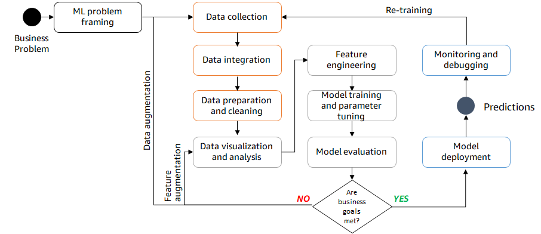
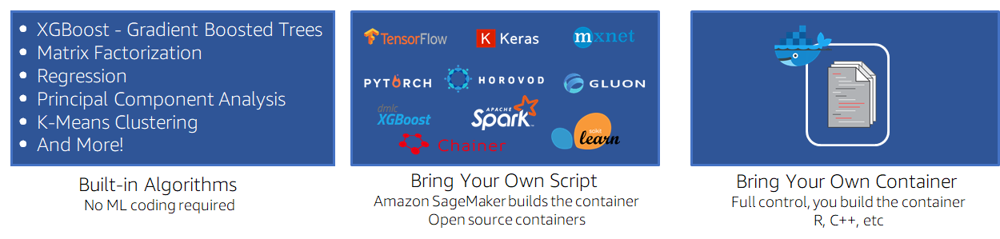
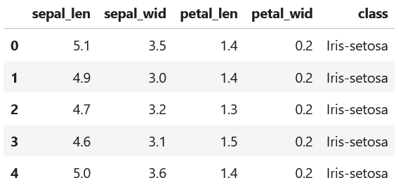
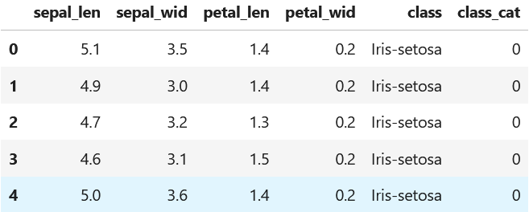
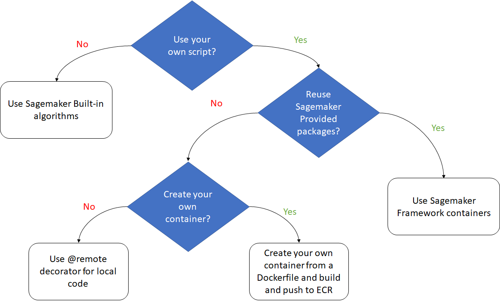

# Bring your own machine learning code to AWS

## Context

In Machine learning, data scientists are working to develop the best fit prediction model through experimentation and algorithms development. They invest in research and have their own local development environment to quickly iterate. But that way of developing machine learning models quickly reaches limits.

Depending on the business application, the infrastructure supporting its deployment and exposure to end-users would be subject to peak loads and scaling issues. 
Therefore, using a cloud provider offers advantages for developing and deploying the models. Data scientists can leverage the speed and power of CPUs/GPUs for training without having to make massive investments in hardware. The cloud elasticity would make machine learning applications at hand to end-users with an underlying infrastructure that is adapting to their consumption patterns and therefore providing both cost and energy saving. 

Now that we established that going to the cloud is an essential step for data scientists to scale their initiatives, do we have to throw away all the development that has been made locally ? Certainly not ! Let’s see how Amazon SageMaker can help data science teams leverage their existing code and scale it on the AWS Cloud. 


## The challenge

Amazon SageMaker offers a large spectrum of Machine Learning features to run an end-to-end Machine Learning application from the ML problem framing into model deployment.



During the model development stage, between data collection and model evaluation, data scientists can choose different approachs to build a model in the AWS Cloud leveraging Amazon SageMaker. 

The first approach is to use [built-in algorithms and pretrained models](https://docs.aws.amazon.com/sagemaker/latest/dg/algos.html) offered by Amazon SageMaker to solve common machine learning use cases for tabular, textual and image datasets. It helps data scientists get started and accelerate models building, evaluation and deployment.

Data scientists may also choose to **bring their existing scripts** that uses the most widely used ML frameworks such as scikit-learn, tensorflow or pytorch. They can then reuse [available SageMaker containers](https://docs.aws.amazon.com/sagemaker/latest/dg/docker-containers-prebuilt.html) to run their code on. 

Finally, data scientists may want complete customization of their applications, they **bring their own code and use specific dependencies** and highly customized machine learning models to serve accuracy sensitive applications. Developing this kind of models often requires time, expertise and resources. 
We are going to see two techniques that enable data scientists to directly use their locally developed code to train ML models on AWS while leveraging specific dependencies. 



## Solution overview

After experimenting and choosing the right algorithm for the usecase, data scientists want to train the model on a dataset then deploy it at scale so it can be used by the end application.
We are going to demonstrate the capabilities offered by Amazon SageMaker with a simple usecase on [Iris dataset](https://archive.ics.uci.edu/dataset/53/iris).

### <ins> Data preparation for model training <ins>

The following script imports the Iris dataset :
```python
import boto3
import pandas as pd
import numpy as np

s3 = boto3.client("s3")
s3.download_file(f"sagemaker-sample-files", "datasets/tabular/iris/iris.data", "iris.data")

df = pd.read_csv(
"iris.data", header=None, names=["sepal_len", "sepal_wid", "petal_len", "petal_wid", "class"]
)
df.head()
```



We then perform some data preparation, namely preparing the target class to predict as a numerical value, so that it meets the expectation of the scikit-learn models:

```python
# Convert the three classes from strings to integers in {0,1,2}
df["class_cat"] = df["class"].astype("category").cat.codes
categories_map = dict(enumerate(df["class"].astype("category").cat.categories))
print(categories_map)
df.head()
```



Finally, we divide the dataset into training and testing subsets to start training the model and upload them to Amazon S3 (making it accessible for further work with Amazon SageMaker):

```python
# Split the data into 80-20 train-test split
num_samples = df.shape[0]
split = round(num_samples * 0.8)
train = df.iloc[:split, :]
test = df.iloc[split:, :]
print("{} train, {} test".format(split, num_samples - split))
# Write train and test CSV files
train.to_csv("train.csv", index=False)
test.to_csv("test.csv", index=False)
# Create a sagemaker session to upload data to S3
import sagemaker
sagemaker_session = sagemaker.Session()
# Upload data to default S3 bucket
prefix = "DEMO-sklearn-iris"
training_input_path = sagemaker_session.upload_data("train.csv", key_prefix=prefix + "/training")
```

### <ins> Bring your own script <ins>

Data scientists can leverage the use of containers provided by Amazon SageMaker as they natively hold the packages needed to run the training script.
In this case, they can use [SageMaker Python SDK](https://sagemaker.readthedocs.io/en/stable/overview.html) to define the estimator relative to the container to use.
An [estimator](https://sagemaker.readthedocs.io/en/stable/api/training/estimators.html) is a SageMaker Python SDK object for managing the configuration and execution of your [SageMaker Training job](https://docs.aws.amazon.com/sagemaker/latest/dg/how-it-works-training.html) which allows to run training workloads on ephemeral compute instances and obtain a zipped trained model.
Examples of ready to use estimators are:

* [Apache MXNet](https://sagemaker.readthedocs.io/en/stable/frameworks/mxnet/index.html)
* [Chainer](https://sagemaker.readthedocs.io/en/stable/frameworks/chainer/index.html)
* [Hugging Face](https://sagemaker.readthedocs.io/en/stable/frameworks/huggingface/index.html)
* [PyTorch](https://sagemaker.readthedocs.io/en/stable/frameworks/pytorch/index.html)
* [Scikit-Learn](https://sagemaker.readthedocs.io/en/stable/frameworks/sklearn/index.html)
* [TensorFlow](https://sagemaker.readthedocs.io/en/stable/frameworks/tensorflow/index.html)

In our example, we use the Scikit-Learn estimator to train the model.  We use a customized script “train.py” and point it as the job’s entry point.
We also define other configurations:

* The AWS IAM role used to run the training job
* The instance configuration (count and type)
* The version of sklearn framework, we use. You can find many other versions open-sourced in https://github.com/aws/sagemaker-scikit-learn-container.
* The model hyperparameters

```python
from sagemaker.sklearn import SKLearn

sk_estimator = SKLearn(
    entry_point="train.py",
    role=role,
    instance_count=1,
    instance_type="ml.c5.xlarge",
    py_version="py3",
    framework_version="1.0-1",
    hyperparameters={"estimators": 20},
)
```
In the training script “train.py”, we perform a feature standardisation using a sklearn standard scaler and define a [SKlearn random forest regressor](https://scikit-learn.org/stable/modules/generated/sklearn.ensemble.RandomForestRegressor.html) as the model to be trained. 

Note: Although we choose this script to be run in a SageMaker Training Job, it can be run on any compute instance having package prerequisites, and the training data location (--train) and model output location (--sm-model-dir) provided. 
Using SageMaker Jobs relieves overheads from these configurations (containers come with pre-installed required packages and model information is provided implicitly in environment variables: respectively SM_CHANNEL_TRAIN and SM_MODEL_DIR).

```python
import argparse, os
import boto3
import json
import pandas as pd
import numpy as np
from sklearn.model_selection import train_test_split
from sklearn.preprocessing import StandardScaler
from sklearn.ensemble import RandomForestRegressor
from sklearn import metrics
import joblib

if __name__ == "__main__":

    # Pass in environment variables and hyperparameters
    parser = argparse.ArgumentParser()
    
    # Hyperparameters
    parser.add_argument("--estimators", type=int, default=15)
    
    # sm_model_dir: model artifacts stored here after training
    parser.add_argument("--sm-model-dir", type=str, default=os.environ.get("SM_MODEL_DIR"))
    parser.add_argument("--train", type=str, default=os.environ.get("SM_CHANNEL_TRAIN"))
    
    args, _ = parser.parse_known_args()
    estimators = args.estimators
    model_dir = args.model_dir
    sm_model_dir = args.sm_model_dir
    training_dir = args.train
    
    # Read in data
    df = pd.read_csv(training_dir + "/train.csv", sep=",")
    
    # Preprocess data
    X = df.drop(["class", "class_cat"], axis=1)
    y = df["class_cat"]
    X_train, X_test, y_train, y_test = train_test_split(X, y, test_size=0.2)
    sc = StandardScaler()
    X_train = sc.fit_transform(X_train)
    X_test = sc.transform(X_test)
    
    # Build model
    regressor = RandomForestRegressor(n_estimators=estimators)
    regressor.fit(X_train, y_train)
    y_pred = regressor.predict(X_test)
    
    # Save model
    joblib.dump(regressor, os.path.join(args.sm_model_dir, "model.joblib"))
```
We can then launch the training:

```python
# Train the estimator
sk_estimator.fit({"train": training_input_path})
```
And that's it, you have your first Random Forest model trained. Now it's on the SageMaker ecosystem, you can easily evaluate, deploy and expose it to end-user, register it to a Model Registry, and many other capabilities that relates to machine learning models lifecycle.

This solution provides simplicity, you just need to provide data and your existing training script and SageMaker takes care of the infrastructure part. 
Next, we'll see what SageMaker has to offer if we need more control on the underlying infrastructure training the model.

### <ins> Bring your own container <ins>

Data scientists can bring their own specific dockerfile or own needed packages to run the training script on.
In this case, there are 2 ways to configure the training job:

* Use SageMaker Estimator with specific [Amazon ECR](https://docs.aws.amazon.com/AmazonECR/latest/userguide/what-is-ecr.html) image deployed for the purpose.
* Use SageMaker provided remote decorator.

#### <ins> Amazon Sagemaker Estimator <ins>

Amazon SageMaker provides the capability to have your own Docker Image to run the training job, instead of reusing SageMaker Provided ones.
For this, data scientists need to leverage Amazon ECR by pushing the docker image to a private ECR repository.
In our example, we prepare a dockerfile at the same level of hierarchy as the train.py script as provided in code/.
We build the image locally using this dockerfile and then push it to ECR using code/build_and_push.sh script (code/build_and_push_studio.sh if using Amazon Sagemaker Studio).

Finally, we setup an Amazon SageMaker estimator with as parameter the ECR image URI and launch the model training:
```python
import boto3

account_id = boto3.client('sts').get_caller_identity().get('Account')
ecr_repository = 'scikit-learn-custom'
tag = ':latest'

region = boto3.session.Session().region_name

uri_suffix = 'amazonaws.com'
if region in ['cn-north-1', 'cn-northwest-1']:
    uri_suffix = 'amazonaws.com.cn'

byoc_image_uri = '{}.dkr.ecr.{}.{}/{}'.format(account_id, region, uri_suffix, ecr_repository + tag)
```
```python
import sagemaker
from sagemaker import get_execution_role
from sagemaker.estimator import Estimator

estimator = Estimator(image_uri=byoc_image_uri,
                      role=get_execution_role(),
                      base_job_name='scikit-custom-container-test-job',
                      instance_count=1,
                      instance_type='ml.c5.xlarge')

# Train the estimator
sk_estimator.fit({"train": training_input_path})
```
We now have our model trained with our own container provided and ready to run in the SageMaker ecosystem. 
In particular, this allows us to use specific dependencies that aren't provided by SageMaker's pre-built containers. We'll see in the next section that there's a more straightforward way of meeting the need for specific dependencies in the training job run in SageMaker.

### <ins> Amazon Sagemaker remote execution <ins>

Amazon SageMaker provides a straightforward way to execute local scripts and train machine learning models with minor code changes as a large single-node Amazon SageMaker training job or as multiple parallel jobs. 

The data scientist must provide information on execution environment (Python packages to install or conda environment configuration or ECR image to use), compute instance configuration and if needed Networking and Permission configurations. Compared to the previous way presented to bring your own container, the remote decorator approach saves you the overhead of building and pushing the docker image to ECR by doing it in the background.

There are [some prerequisites](https://docs.aws.amazon.com/sagemaker/latest/dg/train-remote-decorator.html) to run the script using this functionality depending on the environment:
* Amazon SageMaker Studio 
* Amazon SageMaker notebook
* Local IDE

The configuration information can be provided as a decorator @remote where we define the instance type and conda dependency file:
```python
import json
import pandas as pd
import numpy as np
from sklearn.model_selection import train_test_split
from sklearn.preprocessing import StandardScaler
from sklearn.ensemble import RandomForestRegressor
from sklearn import metrics
import joblib
from sagemaker.remote_function import remote

@remote(instance_type="ml.m5.xlarge", dependencies='./environment.yml')
def perform_training(training_dir, estimators):
# Read in data
df = pd.read_csv(training_dir + "/train.csv", sep=",")

# Preprocess data
X = df.drop(["class", "class_cat"], axis=1)
y = df["class_cat"]
X_train, X_test, y_train, y_test = train_test_split(X, y, test_size=0.2)
sc = StandardScaler()
X_train = sc.fit_transform(X_train)
X_test = sc.transform(X_test)

# Build model
regressor = RandomForestRegressor(n_estimators=estimators)
regressor.fit(X_train, y_train)
y_pred = regressor.predict(X_test)

# Save model
joblib.dump(regressor, "model.joblib")
```
We use the following conda environment packages:
```bash
name: sagemaker_example
channels:
  - conda-forge
dependencies:
  - python=3.10
  - pandas
  - numpy
  - scipy
  - scikit-learn
  - s3fs==0.4.2
  pip:
  - sagemaker
```
Finally, we  execute the script:
```python
input_data_path = "<s3_uri_path_to_data>"
perform_training(input_data_path, 20)
```
It is also possible to use a configuration file called “config.yaml” at the same level as script execution. Then, we can decorate the method we are executing with @remote.
Remote execution can have different configuration inputs:

* Dependencies: Path to requirements.txt file or to Conda environment yaml as demonstrated in the previous example.
* EnvironmentVariables: Environment variables available to the script.
* ImageUri: Amazon ECR image location to run the job.
* InstanceType: Type of instance used for the Amazon SageMaker training job.
* RoleArn: IAM role used to run the Amazon Training job.
* S3KmsKeyId: Id of the KMS key used to encrypt the output data.
* S3RootUri: S3 location used to store output artifacts.
* SecurityGroupIds and Subnets: Networking configuration for the SageMaker training job.
* Tags: Tags used for the SageMaker training job.

```yaml
SchemaVersion: '1.0'
SageMaker:
  PythonSDK:
    Modules:
      RemoteFunction:
        Dependencies: path/to/requirements.txt or path/to/environment.yml
        EnvironmentVariables: {"EnvVarKey": "EnvVarValue"}
        ImageUri: 366666666666.dkr.ecr.us-west-2.amazonaws.com/my-image:latest
        InstanceType: ml.m5.large
        RoleArn: arn:aws:iam::366666666666:role/MyRole
        S3KmsKeyId: somekmskeyid
        S3RootUri: s3://my-bucket/my-project
        SecurityGroupIds:
          - sg123
        Subnets:
          - subnet-1234
        Tags:
          - {"Key": "someTagKey", "Value": "someTagValue"}
```

And now we've got the final model trained, possibly directly from your local development environment, specifying only the dependencies on which your model training is based. The model has benefited from dedicated compute instances and is now ready for use in the SageMaker ecosystem.

## Conclusion

Data scientists can experiment, test and validate their own machine learning code more efficiently in the AWS Cloud by leveraging the use of Amazon SageMaker training jobs. Based on the use case and level of customization, they may choose different options to iterate quickly on the data science experimentation.
The following graph provides some recommendation on the method to use:

* Use Amazon SageMaker build-in algorithms
* Bring your own script but leverage Amazon SageMaker provided framework
* Bring your own container either by building the container or leveraging the @remote execution.



## Useful Resources
* [Bring your own script AWS blog](https://aws.amazon.com/blogs/machine-learning/bring-your-own-model-with-amazon-sagemaker-script-mode/)
* [Bring your own container examples](https://sagemaker-examples.readthedocs.io/en/latest/training/bring_your_own_container.html)
* [Run your local machine learning code AWS blog](https://aws.amazon.com/blogs/machine-learning/run-your-local-machine-learning-code-as-amazon-sagemaker-training-jobs-with-minimal-code-changes/)
## About the Authors

Sarra Kazdaghli is a Machine Learning Professional at AWS. She helps customers across different industries build innovative solutions and make data-driven decisions.

Mehdi Mouloudj is a Analytics & Machine Learning Consultant at AWS. He helps customers building scalable AI and Analytics solutions powered by AWS technologies.