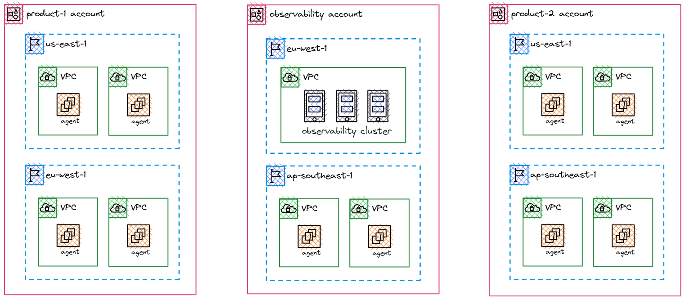
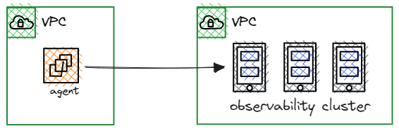
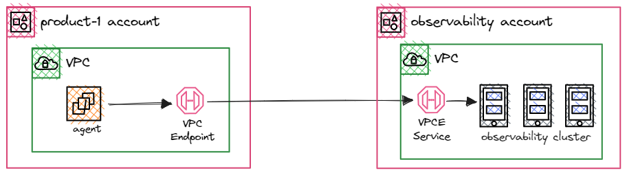
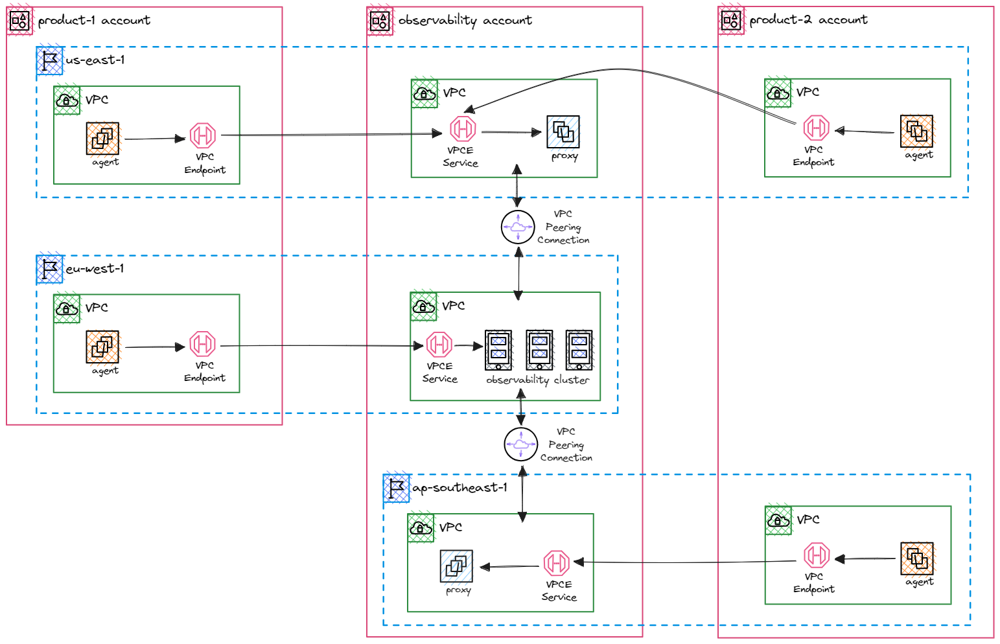
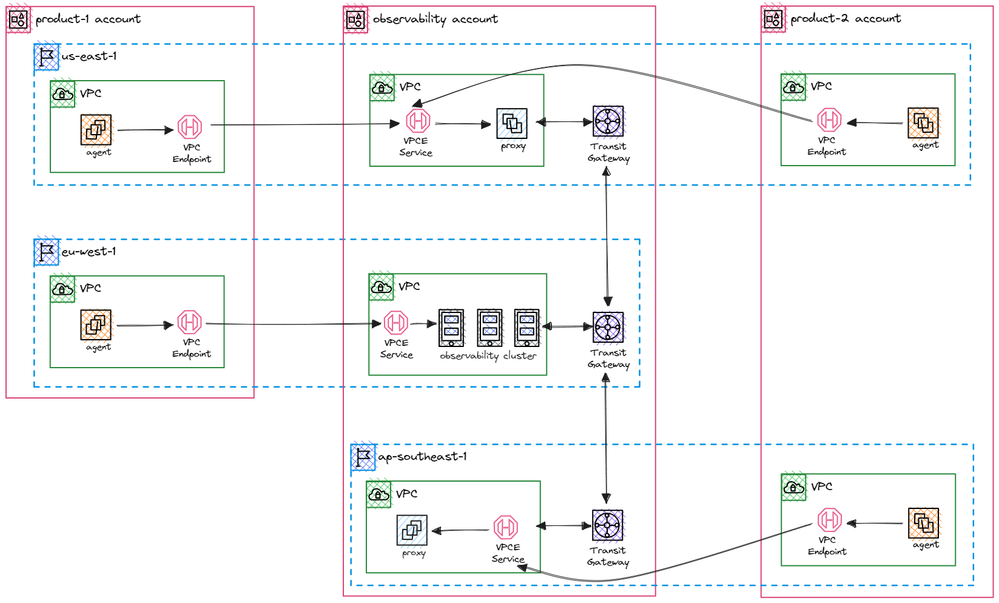

|ToC|
|---|

In today's landscape, organizations usually deploy their flagship product on AWS, orchestrating ecosystem that spans multiple accounts, regions, and utilizes an expanding array of VPCs. This strategic approach allows for efficient workload segmentation and management, aligning with the company's growing scale and complexity.

As the organization continues to expand, the architecture naturally becomes more intricate, with myriad considerations to ensure stability, scalability, and security. Key requirements that must be consistently upheld include establishing secure network communication by keeping data flows privately and maintaining optimal latency levels between applications. By meeting these requirements effectively, the organization can strengthen both the performance and security of its product, ultimately enhancing the overall user experience.

## Problem

Let's consider a focused use case to delve deeper into the challenges and potential solutions for these complexities.

We are tasked with building a comprehensive observability platform that spans across a complex ecosystem, encompassing multiple AWS accounts, regions, and VPCs. This platform consists of two main components:

1. **The control plane** serves as a centralized cluster for storing and serving data to our primary users, developers. The responsibility for managing this cluster rests with our observability team, placing it within the AWS account owned by the team, named `observability`.

2. **The data plane** is a collection of agents that play a critical role in data collection, including metrics, logs, and traces. These agents are designed to transmit this vital data to the control plane, where it's aggregated, stored, and made available for users.

While conceptually straightforward, the complexity arises from the diverse environments in which these data plane agents operate. They may be situated within the same region as the control plane but housed in distinct AWS accounts. Alternatively, they might share the same account but operate in different regions, or they could span both different regions and different accounts.

Given the stringent latency requirements of our platform, we must ensure that the data flow remains within the AWS network. This requirement is aimed at minimizing latency and reducing error rates, which is very important to the observability experience that our platform aims to provide.


## Solution

Let's break it down into pieces and address one by one.

### Cross-account communication

The communication between agents (data plane) and the observability cluster (control plane) is designed as one-way, specifically to facilitate agents in pushing data to the cluster. The architectural design intentionally avoids observability cluster initiate or establish any connections directly to services within the agent network. Instead, the only permitted communication direction is from the agents to the observability cluster, allowing outbound traffic from the agent networks. Making two-way or bi-directional communication unnecessary. This one-way communication setup ensures the security for application. Here are why:

- If a security breach were to occur within observability cluster's network, the one-way communication design limits the extent of the breach. Bad actors cannot use their connection to initiate access into agent's network, reducing the risk of sideways movement by potential attackers
- With one-way communication, the agents have the control to selectively send data to the observability cluster. This controlled data flow ensures that sensitive information remains within the agent network unless explicitly sent to the cluster. This is particularly important for preserving the confidentiality of data


In this scenario, the role of the cluster is similar to that of a service provider, as it is responsible for aggregating and storing data from the agents. Conversely, the agents act as service consumers, utilizing the services provided by the cluster. To establish a private and secure connection in such a setup, the optimal choice is to utilize VPC Endpoint backed by PrivateLink. VPC Endpoints work seamlessly, whether the VPCs are in the same account or different accounts, as we expected.

The following diagram illustrates the setup:


### Inter-region communication

While VPC Endpoints offer efficient communication within a region, they do not support connections between VPCs in different regions. To address this limitation, we're seeking a solution that facilitates cross-region (inter-region) communication, and there are two potential options: VPC peering and Transit Gateway.

#### VPC Peering

To establish inter-region communication, we will leverage both VPC Endpoints and VPC Peering. Our approach involves creating one VPC Endpoint Service in each region and establishing a VPC peering connection to the main region where the observability cluster resides. For the data plane, we will create a VPC Endpoint in each region, connecting them to the corresponding VPC Endpoint Service in that region.

It's important to note that each VPC Endpoint Service is backed by a proxy (a fleet of instances for high availability). This proxy is responsible for forwarding traffic to the observability cluster in the main region. Since these VPCs are peered, traffic is routed between regions as if they are in the same network. We will take a deeper dive into the configuration and setup of the proxy in an upcoming section of this post.

The following diagram illustrates the setup:


Since a full mesh network for the control plane is unnecessary, we don't need to establish peering connections for every VPC pair. For example, there's no requirement to peer the VPCs in `us-east-1` and `ap-southeast-1`. If you do require this full mesh capability, you may prefer the second option, which utilizes the Transit Gateway.

#### Transit Gateway

In the Transit Gateway approach, we'll deploy a Transit Gateway in each region, with VPCs in that region attached to their respective Transit Gateway. These Transit Gateways from different regions will be peered together. With appropriate routing configurations, resources and workloads in VPCs connected to Transit Gateways can communicate with each other as if they're within the same network, similar to the VPC Peering approach.

The following diagram illustrates the setup:


### Proxy

In this section, we will explore setting up and configuring the proxy component. As you already know, the proxy is responsible for forwarding traffic to the main region where the observability cluster resides. We are opting for a simple reverse proxy, and for this purpose, I've chosen nginx, a widely used, high-performance reverse proxy.

The key point is to ensure the proxy is highly available. To achieve this, we will deploy it as a fleet of instances, ideally with the ability to scale automatically. This requirement is straightforward using an Auto Scaling Group if the proxy instances run on EC2, or utilizing Auto Scaling with ECS tasks or EKS pods.

Let's discuss the observability cluster, which exposes three distinct endpoints for ingesting three types of observation data: metrics, logs, and traces. We will utilize host-based routing for this setup. Here are the sample proxy configurations:

- Metrics endpoint:

  ```
  server {
    listen              80;
    server_name         metrics.observability.internal;

    location / {
      proxy_pass http://metrics-alb-123.eu-west-1.elb.amazonaws.com;
    }
  }
  ```

- Logs endpoint:

  ```
  server {
    listen              80;
    server_name         logs.observability.internal;

    location / {
      proxy_pass http://logs-alb-456.eu-west-1.elb.amazonaws.com;
    }
  }
  ```

- Traces endpoint:

  ```
  server {
    listen              80;
    server_name         traces.observability.internal;

    location / {
      proxy_pass http://traces-alb-789.eu-west-1.elb.amazonaws.com;
    }
  }
  ```

Note that you might want to configure SSL/TLS certificates at the ALBs to enable HTTPS endpoints instead of plain HTTP.

At the data plane level, since these endpoints are used by agents, they need to be configured at the agents and resolved to VPC Endpoint addresses. This requires a private hosted zone on Route53, which will be associated with the VPC. We can use either CNAME records or alias records. Here's how it looks when configured:

| Record name                    | Type  | Value                                             |
|--------------------------------|-------|---------------------------------------------------|
| metrics.observability.internal | CNAME | vpce-123.vpce-svc-xyz.\<region>.vpce.amazonaws.com |
| logs.observability.internal    | CNAME | vpce-123.vpce-svc-xyz.\<region>.vpce.amazonaws.com |
| traces.observability.internal  | CNAME | vpce-123.vpce-svc-xyz.\<region>.vpce.amazonaws.com |

So, why opt for host-based routing at the proxy, and why use a private hosted zone at the data plane?

With this design, all agents use the same endpoint, rather than different ones due to VPC Endpoint DNS variations across regions and VPCs. This standardizes the proxy configuration, making it much easier to automate both agent and proxy deployments, and reducing the risk of misconfigurations or human errors.

## Conclusion

The observability platform we have outlined here addresses the challenges posed by a complex ecosystem of multiple AWS accounts, regions, and VPCs. By strategically designing a solution that ensures secure, efficient, and low-latency data flow, we are aimed to provide a comprehensive observability experience that aligns with the organization's growth and complexity.

The use of a one-way communication approach, backed by VPC Endpoint, guarantees the security of data transmission, preventing potential breaches from propagating into the agent network. This controlled data flow not only enhances security but also preserves the confidentiality of sensitive information.

In the context of inter-region communication, we explored two options: VPC peering and Transit Gateway. While both approaches offer effective solutions, the choice between them depends on specific requirements. Combined with VPC Endpoint and proxy configuration provides a robust mechanism for inter-region communication, ensuring a seamless and secure exchange of data.

The proxy, a critical component, serves as the gateway between the data plane and the control plane. By using host-based routing and a private hosted zone on Route53, we simplify the agent's configuration and maintain a standardized and automated deployment process across regions and VPCs. This approach not only reduces the risk of errors but also optimizes scalability and ease of management.

As organizations continue to scale and evolve, it's essential to have an architecture that not only meets the current needs but also provides flexibility and resilience for future growth.
