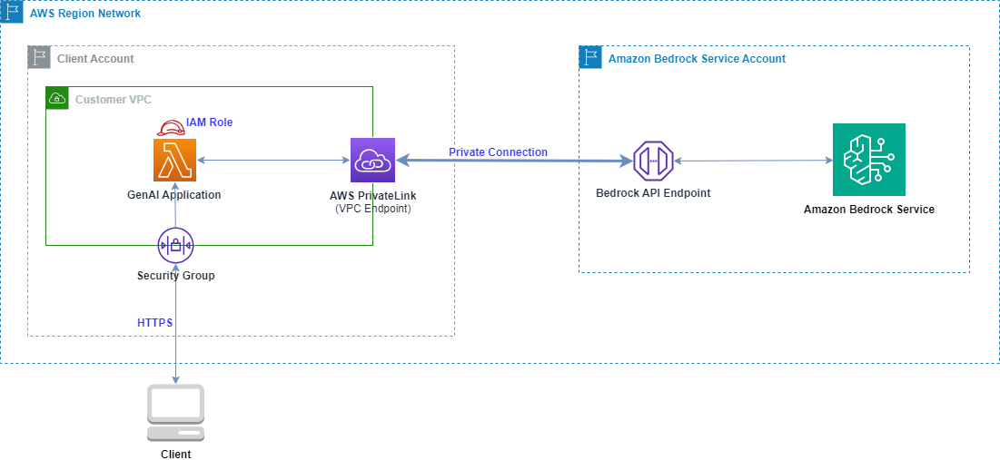
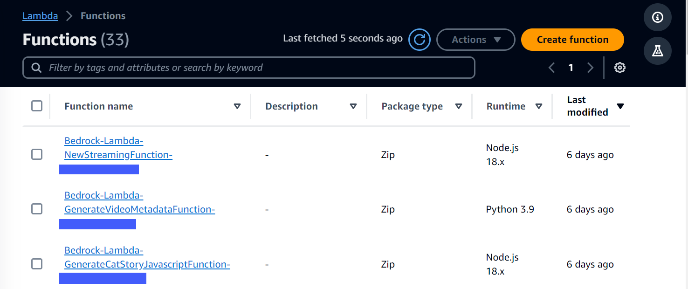
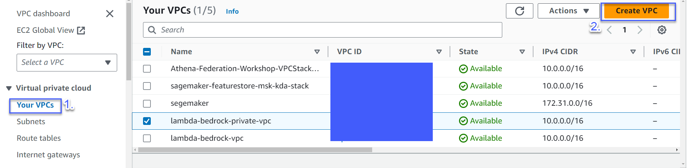
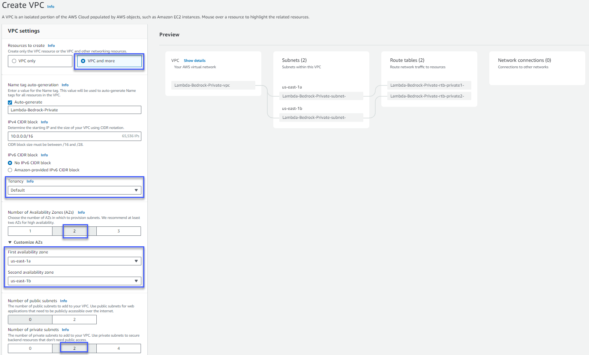
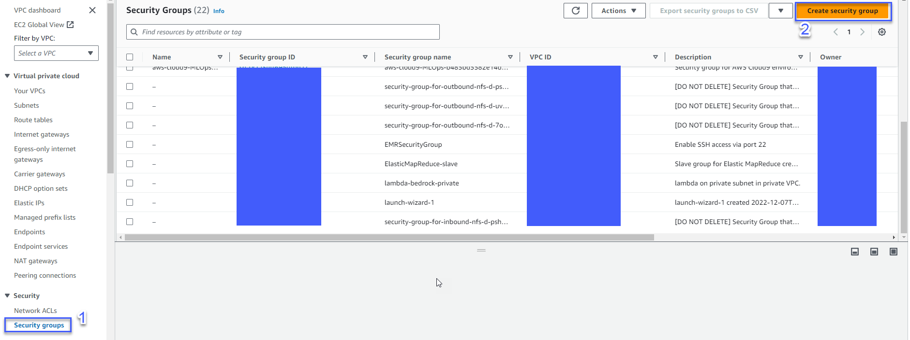
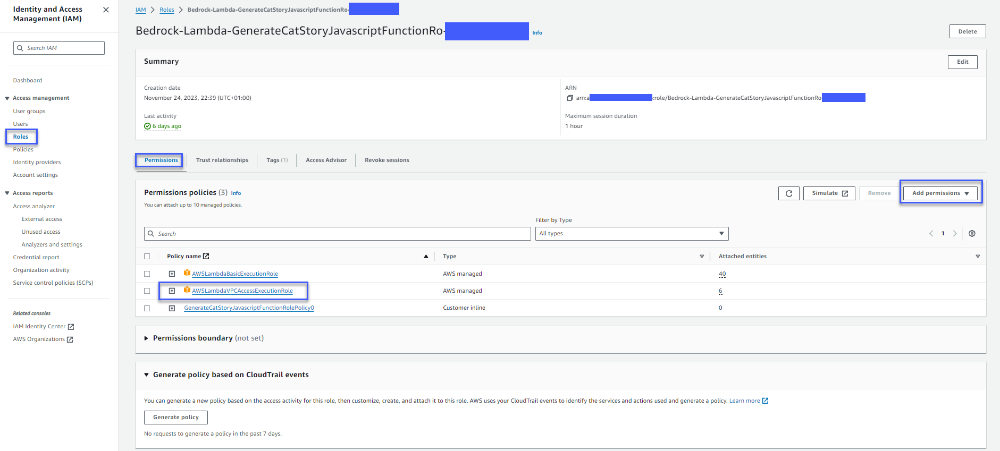
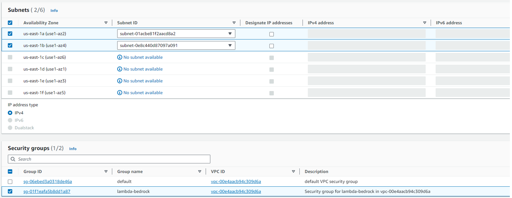
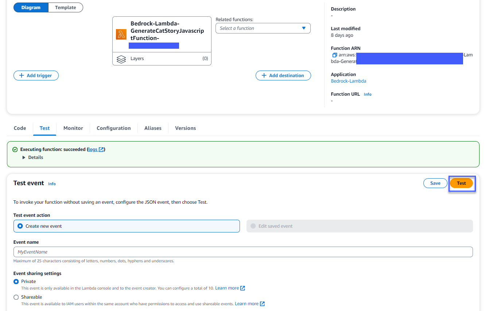
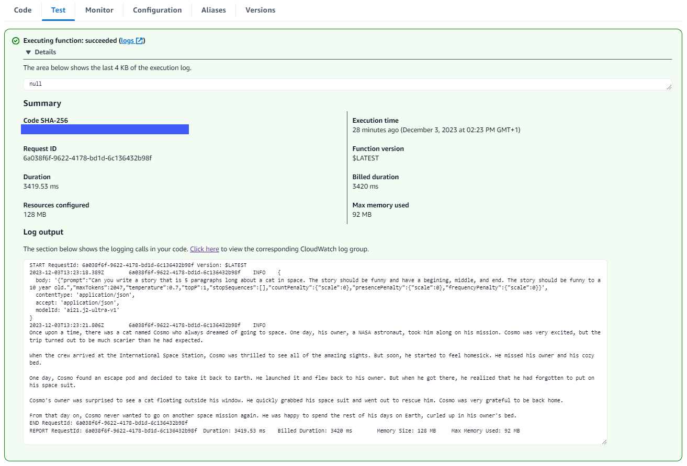
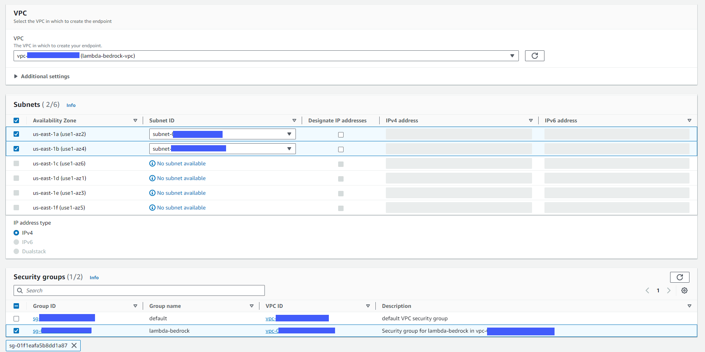

We probably would all agree that **Data Privacy** is a topic that can't be neglected in the context of data analytics and machine learning. **Generative AI** is rocking the world, but without sufficient security controls, Generative AI tools could be vulnerable to data exfiltration, resulting in unauthorized access or disclosure of sensitive information, potentially leading to privacy violations and possible misuse of both sensitive personal data or intellectual property.

[Amazon Bedrock](https://aws.amazon.com/bedrock/security-compliance/), a fully managed service, allows you to build generative AI applications that support data security and compliance standards, including GDPR and HIPAA.

With **Amazon Bedrock**: ***(not limited to)***
* Your **content** (e.g. prompt data, fine-tuning data, vector store data with RAG (***Retrieval Augmented Generation***) etc.) is not shared with 3rd party model providers (including AWS).
* You can use **AWS PrivateLink** to establish private connectivity between your Foundation Models (FM) and on-premises networks or your AWS VPC (Virtual Private Cloud), without exposing your traffic to the Internet. (***this blog post's focus***)
* Your data is always **encrypted in transit** (***TLS1.2***) and **at rest**. You can use your keys or [AWS KMS (Key Management Service)](https://aws.amazon.com/kms/) keys to encrypt the data.
* You can encrypt and store customize (fine-tuned) models with KMS key that either managed by AWS or yourself.
  You can further configure VPC for fine-tuning jobs with Bedrock, which prevent the training data from being accessible over the internet.
* **Potential misuse** is prevented by [Bedrock abuse detection](https://docs.aws.amazon.com/bedrock/latest/userguide/abuse-detection.html). This feature automatically (***no human review or access to user inputs or model outputs***) identify and mitigate potential violations of AWS's [Acceptable Use Policy (AUP)](https://aws.amazon.com/aup/) and [Responsible AI Policy](https://aws.amazon.com/machine-learning/responsible-ai/policy/), or a 3rd party model provider's AUP.

As you can see, Amazon Bedrock provides you comprehensive security and compliance capabilities. Let's dive a bit deeper on using **AWS PrivateLink** to establish private connectivity between your VPC and the FMs or your fine-tuned models.

## AWS PrivateLink

Privacy breaches on the internet present genuine risks, with [AWS PrivateLink](https://docs.aws.amazon.com/vpc/latest/privatelink/what-is-privatelink.html), you can link your own VPCs, on-premise networks, and supported AWS services (e.g. Amazon Lambda, Amazon Bedrock) privately (private IP) without exposing your traffic to the public internet.

The figure below shows how it works. **Interface VPC endpoint**, powered by **PrivateLink**, connect you to: 
- other AWS services
- services hosted by AWS Partners
- supported solutions available in AWS Marketplaces
- enterprise applications in another VPC


Security benefits of AWS PrivateLink:
- **Regulatory Compliance** (e.g. HIPAA, PCI) - prevent sensitive data (e.g.PII) from traversing the internet.
- **Privately access AWS services** - connect your VPC to AWS services privately. 
  You can configure security groups of services (e.g. Lambda) on your VPC, so to control the access to the corresponding AWS services (e.g. Bedrock) as well.

In addition to the security benefit, AWS PrivateLink also makes it easier to connect AWS services across different AWS accounts and VPCs to simplify your network architecture.

## How to build a GenAI application with AWS PrivateLink to Amazon Bedrock

There are many patterns to build up GenAI application with Amazon Bedrock, here let's focus on demonstration of how to establish PrivateLink with Bedrock, with Amazon Lambda function as the key component of a GenAI application.

The figure below shows the reference architecture, where the client can access to the GenAI application via AWS PrivateLink. Client can be on-premise or on AWS VPC, which can be the same or different from where the GenAI application located. Be aware that the GenAI application should be on the same region with the connected Amazon Bedrock. As the time of writing this blog post, Amazon Bedrock is not support in all the AWS Regions, so remember to check the [supported regions](https://docs.aws.amazon.com/bedrock/latest/userguide/what-is-bedrock.html#bedrock-regions).



Here is one way of building this up:

1. Create Lambda functions as part of your GenAI application interacting with Foundation Models via Bedrock.



I use this [example](https://github.com/mavi888/sam-bedrock-lambda) as a simplified GenAI application, which interact with Amazon Bedrock to generate text.

2. Create VPC with private subnets.

   2.1 From VPC console.




**Note:**
  - When creating VPC, choose Tenancy with "Default", since Lambda doesn't work with "[Dedicated](https://docs.aws.amazon.com/AWSEC2/latest/UserGuide/dedicated-instance.html)" tenancy for now.
    To connect to resources in a dedicated VPC, [peer it to a second VPC with default tenancy](https://aws.amazon.com/premiumsupport/knowledge-center/lambda-dedicated-vpc/).

  - It is a good idea to have at least 2 AZs([Availability Zones](https://aws.amazon.com/about-aws/global-infrastructure/regions_az/)) and 2 **subnets** considering resilience.

  - You have the option to choose the specific AZs. This is useful since not all AZs support **Bedrock VPC endpoint**. To identify which AZs in an [**AWS region**](https://aws.amazon.com/about-aws/global-infrastructure/regions_az/) support Bedrock VPC endpoint, run the following command.

```go
//Replace <region> with your chosen region
 aws ec2 describe-vpc-endpoint-services --service-names com.amazonaws.<region>.bedrock-runtime --region <region>
```


    2.2 From CLI command 

3. Create Security Group in the VPC with input rule with **HTTPS**.
   Limit the source IP addresses if you only need to allow list of specific IP address to access your application.




   
4. Connect your Lambda functions to your VPC

Lambda function is by default running on the Lambda service VPC with public internet access. To connect your lambda functions to your own VPC, use a [Hyperplane ENI](https://docs.aws.amazon.com/lambda/latest/dg/foundation-networking.html#foundation-nw-connecting). When create or update a Lambda function, Lambda allocates one Hyperplane ENI for each subnet in the function's VPC configuration.

  a. Before connecting your Lambda function to your VPC, you need to update the lambda function's execution role

  - Get the Lambda function execution role from here:


  - In [AWS IAM(Identity & Access Management)](https://aws.amazon.com/iam/?nc=sn&loc=0) console, add **AWS managed policy - AWSLambdaVPCAccessExecutionRole**



  b. Configure Lambda VPC access
  Add the private subnets and security group to the Lambda function's VPC configuration.


Now the Lambda function is connected with VPC. You can repeat the same steps to other Lambda functions.

5. Create Bedrock VPC endpoint

  In order to connect your VPC and Amazon Bedrock using AWS PrivateLink, you need to create an [**interface endpoint**](https://docs.aws.amazon.com/vpc/latest/privatelink/create-interface-endpoint.html#create-interface-endpoint-aws).

  

  

  

  We can further control Bedrock VPC endpoint access via [endpoint policy](https://docs.aws.amazon.com/vpc/latest/privatelink/vpc-endpoints-access.html).

```go
// An example of a custom endpoint policy, which grants access to listed Amazon Bedrock actions for all principals on all resources.
{
   "Statement": [
      {
         "Principal": "*",
         "Effect": "Allow",
         "Action": [
            "bedrock:InvokeModel",
            "bedrock:InvokeModelWithResponseStream"
         ],
         "Resource":"*"
      }
   ]
}
```

6. Test your GenAI application with PrivateLink connection to Amazon Bedrock

After all the above setup, you can test your GenAI application by invoking lambda functions.

You can create a test from Lambda console:
  
  

You can see detailed logs and trouble-shooting (if any) from Lambda function's corresponding CloudWatch logs.
  

You can also 

## Conclusion

AWS PrivateLink is a powerful service to privately connect your VPC with Amazon Bedrock.
With AWS PrivateLink, you can further control who can access your application via Security Group, and endpoint policy.

