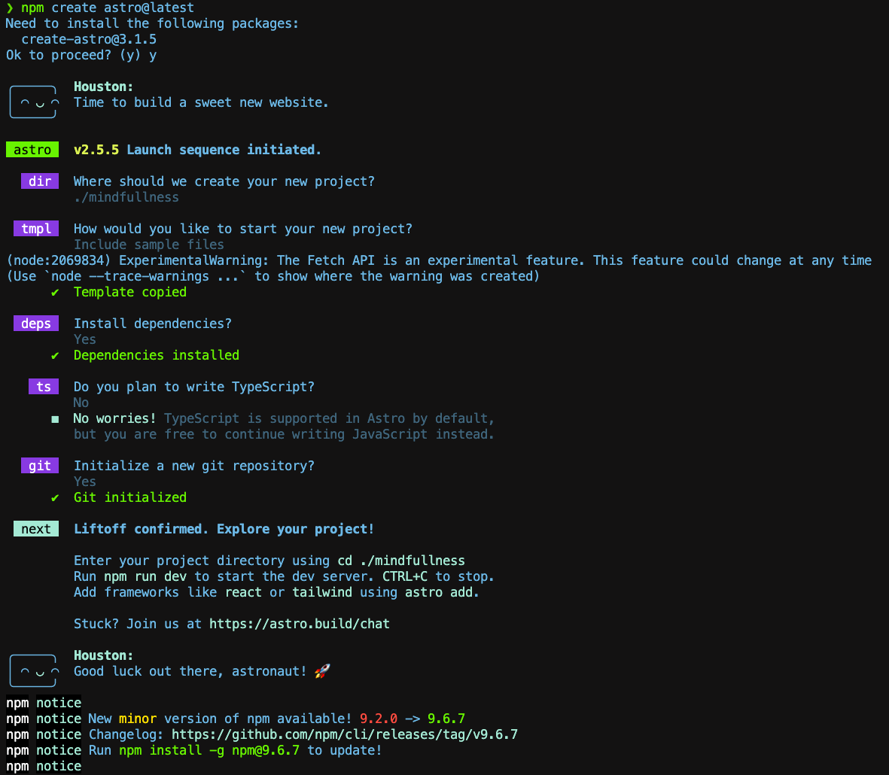
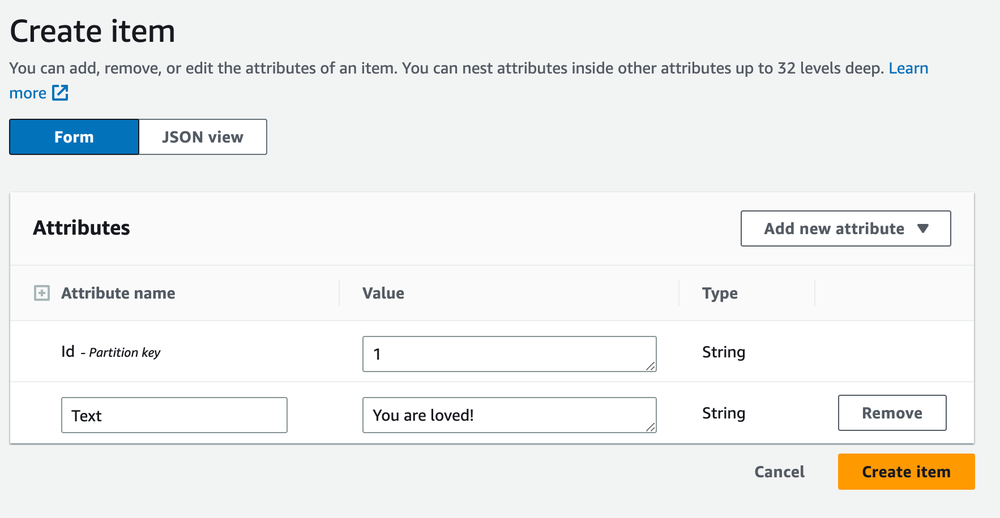

|ToC|
|---|


May is Mental Health Month, and when you think about it, coding up a very simple web app can feel like a mindfulness exercise - if done without pressure in a calm environment. So why not take a little time this month to build yourself a mindfulness app that can deliver a quick affirmation to you or anyone lucky enough to come across it on the internet? Using a lightweight web framework called [Astro](https://astro.build/), plus [a Lambda endpoint](https://docs.aws.amazon.com/lambda/index.html?sc_channel=el&sc_campaign=devopswave&sc_content=build-an-affirmation-app&sc_geo=mult&sc_country=mult&sc_outcome=acq) that can query [a DynamoDB database](https://docs.aws.amazon.com/dynamodb/index.html?sc_channel=el&sc_campaign=devopswave&sc_content=build-an-affirmation-app&sc_geo=mult&sc_country=mult&sc_outcome=acq), you can code up a friendly affirmation app in no time at all. Let's get started!

By the end of this tutorial, you will have built a web app that you can host on GitHub pages. Refresh the page every time you need a little serotonin boost.

> This app was inspired by the instructions given in [this helpful tutorial](https://docs.aws.amazon.com/apigateway/latest/developerguide/http-api-dynamo-db.html?sc_channel=el&sc_campaign=devopswave&sc_content=build-an-affirmation-app&sc_geo=mult&sc_country=mult&sc_outcome=acq) in the Amazon API Gateway docs.


## Set Your Intention

Let's think about the architecture you're going to use. First, you will build a web site connected to Lambda and DynamoDB via [API Gateway](https://docs.aws.amazon.com/apigateway/index.html?sc_channel=el&sc_campaign=devopswave&sc_content=build-an-affirmation-app&sc_geo=mult&sc_country=mult&sc_outcome=acq), something like this:


Let's get set up to start building your app. We'll be using an interesting new framework called [Astro](https://astro.build/). Astro is part of a grouping of lightweight, highly-performant 'meta frameworks' in the JavaScript world, a framework that can pair with or otherwise embed other JavaScript frameworks. Take a look at what you can do with Astro [in their excellent AI-infused docs](https://houston.astro.build/).

> Before starting, make sure your local computer is set up to use `npm`, `git`, and `node`.

You can start working anywhere on your local computer by using Astro's [auto-installer](https://docs.astro.build/en/install/auto/). Run the Astro setup wizard by typing `npm create astro@latest` in your terminal or command line. A wizard will launch and help you create a folder for your project. Ask the wizard to `Include sample files` and be sure to install dependencies. You don't need to use TypeScript in this app, so you can say 'no' to this. Initialize your new Astro folder as a git repository. The terminal will display a message that you've successfully created your app.



Use `cd` to enter the new folder Astro created (you can use `ls -al` to view all the folders, and it should match what you entered earlier for the project name) and make sure all dependencies are installed by typing `npm i` in the terminal. Type `npm run dev` to start your local server. At the moment, your web app looks like this:


Use your favorite code editor to explore the folder that was just scaffolded. I prefer Visual Studio Code.

> tip: type `code .` in your terminal to open the folder in VS Code. If you were already using the VS Code terminal to run the previous commands, click on the `+` to create another terminal instance as you want to leave the app running in the background.

Now you can prune some parts in the scaffolded app, leaving just one box where you'll display your affirmations.

In the `src/pages/index.astro` file, replace all the code with the following:

```javascript
---
import Layout from '../layouts/Layout.astro';
import AffirmationComponent from '../components/AffirmationComponent.jsx';
---

<Layout title="My Affirmations">
	<main>

		<h1>Welcome to <span class="text-gradient">Your Affirmation App</span></h1>
			<section class="text">
				<AffirmationComponent client:load/>
			</section>
	</main>
</Layout>

<style>
	main {
		margin: auto;
		padding: 1.5rem;
		max-width: 80ch;
	}
	h1 {
		font-size: 3rem;
		font-weight: 800;
		margin: 0;
	}
	.text-gradient {
		background-image: var(--accent-gradient);
		-webkit-background-clip: text;
		-webkit-text-fill-color: transparent;
		background-size: 400%;
		background-position: 0%;
	}
	.text {
		line-height: 1.6;
		margin: 1rem 0;
		border: 1px solid rgba(var(--accent), 25%);
		background-color: white;
		padding: 1rem;
		border-radius: 0.4rem;
		text-align: center;
		font-size: 1.5rem;
	}

</style>
```

You'll see that an error appears in your local server, as the file called `AffirmationsComponent.jsx` is missing. Let's fix that.

> What's going on with the above code? Astro offers an interesting syntax allowing you to combine front matter with style, script, and layout tags. You can progressively enhance your app to include more and more functionality by building up your components' capabilities. By using `client:load` you are allowing a child component to load fresh data from a database, which is our use case.

## Embrace the Unknown

Astro is great for generating static web pages such as blogs, but for this app we need it to do a little bit more. It needs to have the ability to pull data from an endpoint and refresh an element of the page. So we need to add a framework on top of Astro. Let's use another lightweight option, Preact, to allow this site to become dynamic in production.

> [Preact](https://preactjs.com/) is a lightweight version of React, "a fast 3kB alternative to React with the same modern API."

You can add [frameworks](https://docs.astro.build/en/guides/integrations-guide/) progressively to an Astro app by using the Astro CLI. Type in `npx astro add preact` in the terminal of your app. Allow Astro to configure your app to suit Preact's requirements (a configuration change is needed). You will be asked a number of times to accept changes to files, so please answer "yes" to all of them.

> Tip: use the built-in terminal in VS Code to keep your environment neat by selecting terminal > new terminal.

Now that you have added Preact, in the `/src/components folder`, remove the Card.astro file and add a file called `components/AffirmationComponent.jsx`, a file type understood by Preact.

In your `AffirmationComponent.jsx` file, add the following code:

```javascript
const Affirmation = () => {
  return <h3>my affirmation</h3>;
};
      
export default Affirmation;
```

Your app should now look like the image below. Change the hard-coded affirmation to anything you like! We'll revisit this code once we have an endpoint built to query a database full of great quotes.


## Capture the Moments

Now it's time to build up a database with some sample affirmations. If you are not signed in to your AWS account, please sign in now (or [create a new account](https://aws.amazon.com/resources/create-account/?sc_channel=el&sc_campaign=devopswave&sc_content=build-an-affirmation-app&sc_geo=mult&sc_country=mult&sc_outcome=acq) if you don't have one yet), and search for [DynamoDB](https://console.aws.amazon.com/dynamodb/). This is a serverless database you will use to store a series of affirmations. Choose `Create table` and name it `Affirmations`. For its partition key, enter `Id`, and leave the dropdown next to it on the default value of `String`. Now click on `Create Table`.



It will take a few seconds to create your table, and once done, click on `Affirmations` to view it. Let's add a few helpful phrases to our table by navigating to `Tables` -> `Explore Items` in the left-hand navigation bar, and confirming that the `Affirmations` table is selected. Now we can add items by using the `Create Item` button. Enter a numeric number next to `Id`, and then click on `Add new attribute`, enter `Text` under the `Attribute name` column, and then the affirmation as text in the `Value` column. Each item should have an `Id` and a `Text`, like this:


> Here's a helpful [list of nice affirmations](https://github.com/annthurium/affirmations/blob/master/affirmations.js).

Next, you need to create a serverless function using Lambda to query this database. Navigate to the [Lambda console](https://console.aws.amazon.com/lambda) and choose `Create function` > `Author from Scratch`. You can call it `get-affirmation-function` and use Node 18 for the runtime. Now you can create your function.

Before adding any function code, make sure that it can read from your DynamoDB table. Select your function and go to the `Configuration` tab in the middle of the screen. Your function has been assigned a basic 'role' with a few permissions. Click `Add Permissions > Attach policies` in the dropdown. Search for `DynamoDB` and select the `AmazonDynamoDBReadOnlyAccess` access to let your new function interact with DynamoDB. Add this permission. Now you can write your function's code.

You need to add a bit of code in your function to query the database, so open the `index.mjs` file in the Lambda code editor. Add the following code and select `Deploy`:

```javascript
import { DynamoDBClient } from "@aws-sdk/client-dynamodb";
import {
  DynamoDBDocumentClient,
  QueryCommand
} from "@aws-sdk/lib-dynamodb";

const client = new DynamoDBClient({});

const dynamo = DynamoDBDocumentClient.from(client);

const tableName = "Affirmations";

function getRandomNumber(min, max) {
  min = Math.ceil(min);
  max = Math.floor(max);
  return Math.floor(Math.random() * (max - min) + min);
}

export const handler = async (event, context) => {
  let body;
  let statusCode = 200;
  const headers = {
    "Content-Type": "application/json",
  };
  
  let params = {
      ExpressionAttributeValues: {
        ':id': getRandomNumber(1,40).toString()
      },
      KeyConditionExpression: 'Id = :id',
      TableName : tableName  
  };  

  try {
        body = await dynamo.send(
          new QueryCommand(params)
        );
  body = body.Items;
  } catch (err) {
    statusCode = 400;
    body = err.message;
  } finally {
    body = JSON.stringify(body);
  }

  return {
    statusCode,
    body,
    headers,
  };
};
```

> Note, you are selecting a random affirmation by its Id - so edit the `min` and `max` variables to reflect how many affirmations you entered into your database.

Now, to connect all the pieces, you can use one more service: [API Gateway](https://console.aws.amazon.com/apigateway).

## Make the Connection

In the AWS console, navigate over to [https://console.aws.amazon.com/apigateway](https://console.aws.amazon.com/apigateway). Choose `Create API` > `HTTP API` > `Build`. Name your new API `http-affirmations-api`. Click the `Next` button and create an integration with the Lambda function that you just created. Then add one route, which is the pathway that the API will use to perform various functions between the Lambda function and your database.

You need to specify that your API can use http `GET` to select elements from the database. Add `/items` as the route's name, then `Next` and `Create`:


Test your new API by visiting the URL listed in the API Gateway console. Append `/items` to the end of the URL; you should see your database items listed!

> Note, you might need to tweak CORS in your API Gateway if you find that the data stops refreshing and there are errors in your browser console related to CORS. Check the CORS settings in API Gateway for your API - add `*` in the allowed headers to allow the data to get to your app.

## A Beautiful Convergence

The last thing to do is to configure your web app to query the database and display a new affirmation each time the screen is refreshed. Normally, Astro will fetch data once, when the component is rendered. To make the affirmation change each time the page is reloaded, you need to make a few edits to allow client-side rendering in Astro.

Go back to make some edits to your Astro app. Replace the hard-coded affirmation in the `AffirmationComponent.jsx` file. Add these lines to the top:

```javascript
const data = await fetch('https://e51pzppdu1.execute-api.us-east-1.amazonaws.com/items').then((response) =>
    response.json()
);
```

And finally make sure that the `<h3>` tag includes just the one affirmation:

```javascript
return <h3>{JSON.stringify(data[0].Text)}</h3>;
```

Your affirmation should change each time you reload the page.

## Find your Happy Place

The last thing you need to do is to celebrate your accomplishment and share it with the world. An easy way to do this is by using GitHub pages, deployed via GitHub Actions.

Commit your code to GitHub, using the git integration that was created by Astro when you scaffolded your app. Make sure the repo is public. Now you'll need a GitHub action to build and [deploy your app to GitHub pages](https://docs.astro.build/en/guides/deploy/github/), since it's not a static app but has a build step.

Navigate to your GitHub repo and visit the Actions tab. Click the `New Workflow` button and search for Astro. Select the Astro Workflow and click `configure`. This process creates a new folder called `.github/workflows` with a `.yml` file outlining the steps needed to build your app. Commit this structure to your repo by selecting `commit changes`.


Finally, navigate to `Settings` > `Pages` to ensure that your app has GitHub Pages configured and that your new Action is building them. GitHub should provide you with an URL. A demo of this whole app is available [on this GitHub page](https://jlooper.github.io/affirmations/).

## Breathe!

Wasn't that calming? By using easy-to-use, beautiful tooling such as Astro, Lambda, DynamoDB, API Gateway, and hassle-free web hosting, you built a lovely application that looks good and helps you feel good, too. Don't forget to hydrate, listen to soothing music, touch grass, and enjoy May!

## Tidy Up

If you don't want your app to live on, don't forget to remove any assets you created in this tutorial. You can remove your `Affirmations` database table in the AWS Console by searching for DynamoDB and choosing the table to delete. Do the same in API Gateway for your `http-affirmations-api` asset, and in Lambda, delete the `get-affirmations` function. Remove the role that you created in IAM as well. This will save you from any costs that fail to spark joy. [Marie Kondo](https://en.wikipedia.org/wiki/Marie_Kondo) would be proud of you.

## About the Author

Jen Looper is the Head of Academic Advocacy at AWS and manages a team in Developer Relations all about curating the higher-ed student journey through great content, cool events, and a valuable community experience on campuses globally called [Cloud Clubs](https://s12d.com/cloud-clubs). Learn more about Academic Advocacy's initiatives [on our website](https://s12d.com/students).
