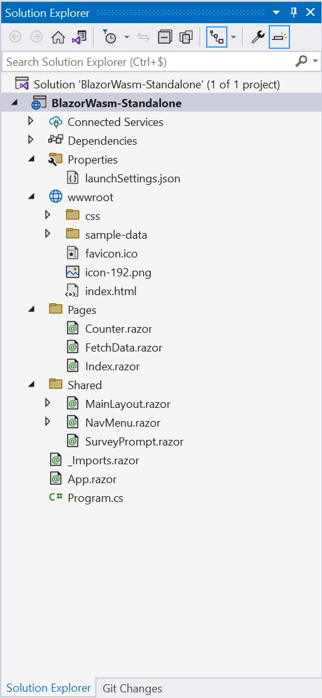
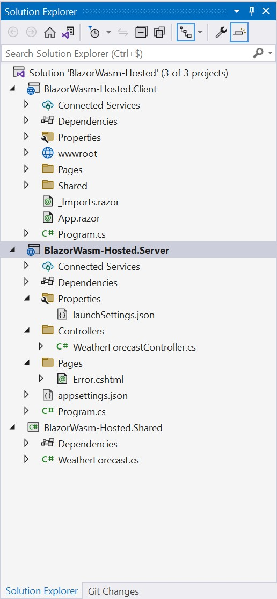
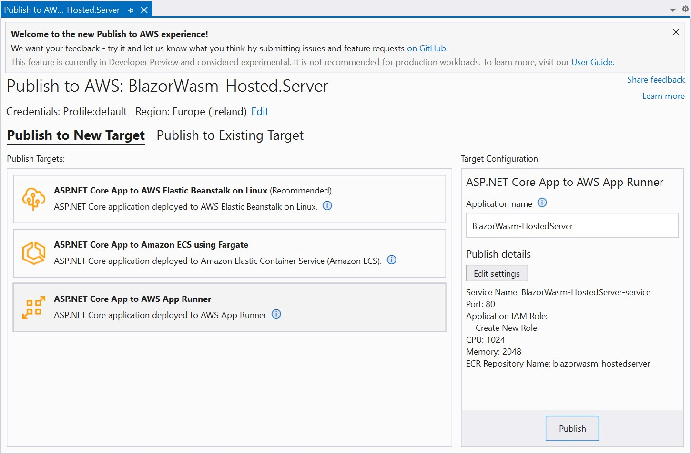
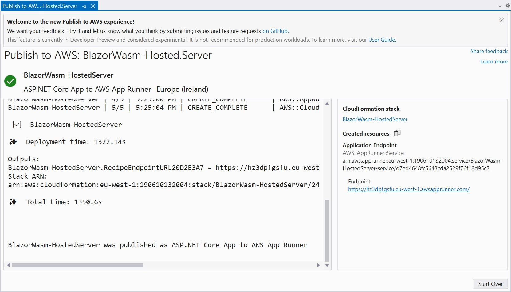

If you’re old enough, Blazor WebAssembly's promise of allowing C# developers to build client-side applications based on open web standards might sound familiar. The last time we heard these kinds of promises, it was about Silverlight, a proprietary plugin that allowed .NET developers to develop XAML-based applications that ran in the browser.

The story is quite different this time because there is an addition to the promise: “based on open web standards”. So where are the open web standards? Well, it is all about WebAssembly. WebAssembly has nothing to do with Blazor, .NET or C#. WebAssembly (abbreviated Wasm) is a binary instruction format. It is designed as a portable compilation target for programming languages, enabling deployment on the web for client and server applications. Its initial design goals are to be fast and efficient, open and debuggable, safe and part of the open web platform. The open standards for WebAssembly are developed in a W3C Community Group and a W3C Working Group. As a result, WebAssembly 1.0 has shipped in the four major browsers.  

So the “based on open web standards” promise is fulfilled. Plus, the framework itself is developed under the MIT license in the [ASP.NET Core GitHub repository](https://github.com/dotnet/aspnetcore).

Let’s dive deeper into what Blazor WebAssembly is, how it works, how you can create and build a Blazor WebAssembly application, how the solution is structured, how you can deploy it, and what you need to know if you want to integrate AWS services with it.


## Blazor WebAssembly, a component-based SPA framework

I think, at some point in time, all good ideas end up in .NET. The .NET solution for rich client-side UI is Blazor. Blazor is a component-based framework. Those familiar with Angular, React, Vue.js or Svelte will be at home on that part. It leverages the [Razor syntax](https://docs.microsoft.com/en-us/aspnet/core/mvc/views/razor?view=aspnetcore-6.0). Razor is a markup syntax for embedding .NET based code into webpages.

Blazor comes with two hosting models:

* **Blazor server:** the component graph is held on the server side. SignalR is used to maintain a connection between the client and the server through WebSockets. User interactions are sent to the server. Blazor rerenders the component graph. A UI diff is calculated and sent back to the browser in binary format. This model allows you to address browsers that don’t support WebAssembly or that are running on very low-resource devices.
* **Blazor WebAssembly:** it is a single-page application (SPA) framework for building rich client-side web app with .NET. As WebAssembly is an open web standard supported in all major browsers, Blazor WebAssembly applications run in all major browsers.

Blazor server has some advantages but requires network hops for every user interaction. Handling all the user interactions on the client-side reduces the server load. It  also enables to serve the application from a Content Delivery Network service like any static content. The good news is that whatever hosting model you choose, the component model is the same. You can switch from one to another without too much pain if you use abstractions that allow your components to be agnostic to the hosting model.

## How does Blazor WebAssembly work?

To answer this question, the important part of the name is *WebAssembly*. It has been initially designed for allowing the execution in the browser of applications built with programming languages other than JavaScript. It has now gone outside the browser thanks to WebAssembly runtimes like [wasmtime](https://github.com/bytecodealliance/wasmtime) and initiative like the [WebAssembly System Interface (WASI)](https://wasi.dev/).

Ok, so my .NET code is compiled to Wasm format? Well... it depends. Until the release of .NET 6, your code wasn't compiled to Wasm. Blazor relies on the open source cross-platform Mono .NET runtime. Mono has been compiled to a Wasm module. Your code is still compiled to .NET Standard Intermediate Language code (IL code). The Wasm version of Mono interprets your IL assemblies or dependencies to execute them.

In .NET 6, the support for Ahead of Time (AOT) compilation has been added. It is not activated by default. You need to add the following lines to your .csproj file to activate it:

```xml
<PropertyGroup>
  <RunAOTCompilation>true</RunAOTCompilation>
</PropertyGroup>
```

AOT compilation occurs only when you publish your application to avoid slowing down your development workflow. AOT compilation adds several minutes to your build on small projects and potentially much more on large projects.

The size of your binary will also be larger than if you compile your application to IL code. That's because the IL instruction set has higher level abstraction instructions.

Using AOT compilation is a tradeoff between runtime performance for CPU intensive application and load-time performance. If your application is not CPU intensive, you may not see any benefits from AOT compilation, or at least not enough to pay for the extra size to download. 

## How to create your first Blazor WebAssembly application

Before creating your first Blazor WebAssembly application, you need to decide how you want to serve it.

A Blazor WebAssembly application is fully downloaded to the browser and executed on the browser UI thread. You have no dependency to a backend server to run your application. It is then a candidate to be served through a static website hosting service like [Amazon S3](https://docs.aws.amazon.com/AmazonS3/latest/userguide/Welcome.html) or a Content Delivery Network (CDN) like [Amazon CloudFront](https://docs.aws.amazon.com/AmazonCloudFront/latest/DeveloperGuide/Introduction.html). In this case, we call it a standalone Blazor WebAssembly application. To bootstrap a standalone Blazor WebAssembly project, you just have to run the following command:

```  
dotnet new blazorwasm
```

As an alternative, you can create a project with an ASP.NET Core backend app to serve your Blazor WebAssembly static files. The downside of this approach is that you have an application running server side with the associated cost. However, you gain the ability to prerender your Blazor WebAssembly application before all the content is loaded into the browser. The server will compute an HTML page to serve for the requested Url while the static assets are downloaded. It may help to improve the perceived load speed of your application by your end users. To bootstrap a hosted Blazor WebAssembly project, you can execute the following command:

```
dotnet new blazorwasm -ho
```

To host your ASP.NET Core backend app, you can use a service like [AWS App Runner](https://docs.aws.amazon.com/apprunner/latest/dg/what-is-apprunner.html). You package your backend application as a container image and AWS App Runner, a fully managed service, will deploy it and run it for you. 

## How to build your first Blazor WebAssembly application?


To build and run your application on your local machine for development purpose whatever the hosting model you choose, you use the standard command of the dotnet cli:

```
dotnet run
```

or if you want to automatically rebuild and rerun your code while you are working on it:

```
dotnet watch
```

Once you are ready, you can package your application with the publish command:

```
dotnet publish -c Release
```

## Anatomy of your Blazor WebAssembly solution

### Standalone Blazor WebAssembly application

If you create a new standalone Blazor WebAssembly solution, you will start with the following solution structure (see picture). You only have one project in your solution and it contains the following files:

* Program.cs which configures the middleware your application use and starts the application
* App.razor which is the root Razor component of your application
* Shared Razor components like the MainLayout.razor or the NavMenu.razor components
* Razor componnents that are related to pages like the Index.razor or Counter.razor components

Your project also contains a wwwroot folder which contains the static assets of your application like css files, icon files, images and your index.html file, which is the main entry point to your application.

 

### Hosted Blazor WebAssembly application

[Image: image.png]If you create a new hosted Blazor WebAssembly solution, you will start with the following solution structure (see picture). Your solution contains three projects:

* **The Client project**: it is your Blazor WebAssembly project. It has the same project structure as a standalone Blazor WebAssembly project.
* **The Server project**: it is the ASP.NET Core application that serves your Blazor WebAssembly application. For demonstration purpose, it also contains the WeatherForecastController.cs file that defines a basic WeatherForecast API. This API is called by the Blazor WebAssembly client application.
* **The Shared project**: it demonstrates who to share code between the client and the server project.

For those who are familiar with ASP.NET Core project structure, nothing specifics there.

 

## How to deploy your Blazor WebAssembly application?

### Standalone Blazor WebAssembly application

As mentioned sooner in this post, the best and cheapest way to host and serve a standalone Blazor WebAssembly application is to use an object storage service coupled to a CDN service.

For example, on AWS, you will use [Amazon S3](https://docs.aws.amazon.com/AmazonS3/latest/userguide/Welcome.html) and [Amazon CloudFront](https://docs.aws.amazon.com/AmazonCloudFront/latest/DeveloperGuide/Introduction.html). For a .NET developer, the easiest and fastest way to get a standalone Blazor WebAssembly application deployed is to use our new [AWS .NET deployment tool](https://github.com/aws/aws-dotnet-deploy).  To install it, you just have to run the following command:

```
dotnet tool install -g aws.deploy.tools
```

Then, in the directory containing the .csproj file, you simply run the following command

```
dotnet aws deploy
```

The tool will suggest the best way to deploy your application. For a standalone Blazor WebAssembly application, it will recommend to deploy it on Amazon S3 and to serve it. You’ll have to answer a few questions, and then the tool will automatically provision the required resources in your AWS account and deploy your application.

### Hosted Blazor WebAssembly application

If you prefer the hosted Blazor WebAssembly application model, you can still use the AWS .NET deployment tool. It will recommend three different services to host your ASP.NET Core application that will serve your Blazor WebAssembly application: AWS Elastic Beanstalk on Linux, Amazon Elastic Container Service using Fargate, and AWS App Runner.

I won’t go into the details of these services and their differences here. Just know that, by default, my favorite one is AWS App Runner as long it meets my requirements, because it's the most managed and straightforward to use of the three.

If you use the [AWS Toolkit for Visual Studio](https://marketplace.visualstudio.com/items?itemName=AmazonWebServices.AWSToolkitforVisualStudio2022) to integrate the AWS .NET deployment tool inside Visual Studio, you‘ll get this nice UI.

 

By default, the ASP.NET Core server project is not containerized. By selecting the AWS App Runner recommendation and clicking on the Publish button, the AWS .NET deployment tool will automatically add a Docker file to your project, provision the required resources in your AWS account and deploy and run your container image in AWS App Runner. When everything is deployed, you simply get the Url of your application in the deployment outputs. It is ready to use!

 


## What to know about Blazor WebAssembly app consuming AWS services

You can find content to help with your first steps with Blazor WebAssembly on AWS like this [post](https://aws.amazon.com/blogs/developer/run-blazor-based-net-web-applications-on-aws-serverless/) and this [one about Blazor WebAssembly and Amplify](https://aws.amazon.com/blogs/devops/deploy-net-blazor-webassembly-application-to-aws-amplify/). But the most important information lies in what they miss: the limitations you will likely encounter. Let's dive in.

### Blazor WebAssembly authentication and authorization with Amazon Cognito

Blazor WebAssembly's default authentication and authorization mechanism is built on top of OpenID Connect protocol. It is nowadays a standard choice for SPAs.

When you work with AWS and you want to implement scenarios and grant permissions to your end users to interact with some of your AWS services, using [Amazon Cognito](https://aws.amazon.com/cognito/) is the most straightforward option. Amazon Cognito is a fully managed identity service that manages user identities, federation with external SAML and OpenID Connect identity providers and user permissions to access AWS services. While Amazon Cognito implements itself parts of the OpenID Connect protocol, it is not a fully OpenID Connect compliant provider. 

Thus, if you use Amazon Cognito as you OpenID Connect provider for your Blazor WebAssembly application, you will experience time-out when sign-in because it doesn’t support the prompt=none parameter. You may want to build your custom version of the AuthenticationService.js file as mentioned [here](https://docs.microsoft.com/en-us/aspnet/core/blazor/security/webassembly/additional-scenarios?view=aspnetcore-6.0#build-a-custom-version-of-the-authenticationmsal-javascript-library), but I don’t recommend this workaround. You will find yourself maintaining your own fork of this library which is highly sensitive since it is related to identity.

### AWS service APIs call from Blazor WebAssembly, why it is not supported

Another limitation comes from the [lack of support for the System.Security.Cryptography APIs on Blazor WebAssembly since .NET 5](https://docs.microsoft.com/en-us/dotnet/core/compatibility/cryptography/5.0/cryptography-apis-not-supported-on-blazor-webassembly). To make an API call to AWS services, you need to sign your request with the AWS Sigv4 algorithm. The AWS SDK for .NET relies on the System.Security.Cryptography APIs. So you can’t use the AWS SDK for .NET to make API call to AWS services. 

### Backend For Frontend pattern is your Best Friend Forever

OK, so what does it mean? Is the game over? The short answer is no. You can call the Backend For Frontend pattern to the rescue. This pattern is becoming more and more popular in the SPA application development space to apply a strict separation of concerns between your frontend needs and your backend needs. But it can help to secure your application too.

You can use it for encapsulating interactions with Amazon Cognito and calls to AWS service APIs. Your Blazor WebAssembly application only knows your BFF APIs. You can secure authentication between your frontend and your BFF API through cookie authentication.  To do so, on the Blazor WebAssembly side, you have to implement your own AuthenticationStateProvider. I will dive deeper on this part in a future post.

## Conclusion

Blazor WebAssembly may be a viable option to you, but I highly recommend you to build a proof of concept to get your hands dirty and get a deep understanding of what you will get and the trade-offs you’ll have to make. When you know the Razor syntax, it's pretty straightforward to start with Blazor WebAssembly. And if you have already worked with ASP.NET MVC or Razor Pages, you know Razor.

If your team already has frontend development skills with JavaScript or TypeScript, I highly recommend you carefully measure the benefits of switching to Blazor WebAssembly; JavaScript and TypeScript communities are large and vibrant with a high pace of innovation. 

If your team is a highly skilled .NET development team and you have little to no knowledge of frontend development with JavaScript or TypeScript, then Blazor WebAssembly is probably your fastest way to accomplish frontend development. Some teams have chosen Blazor WebAssembly for this exact reason, as Steve Peirce testifies in this [post](https://medium.com/powered4-tv/why-we-chose-blazor-wasm-for-our-spa-c62524cde4a9). They already are in production with Blazor WebAssembly for an on-demand video service and are happy.

If you want to know more about Blazor WebAssembly on AWS, you can watch this [video](https://www.youtube.com/watch?v=hyJVWM36dP0).
