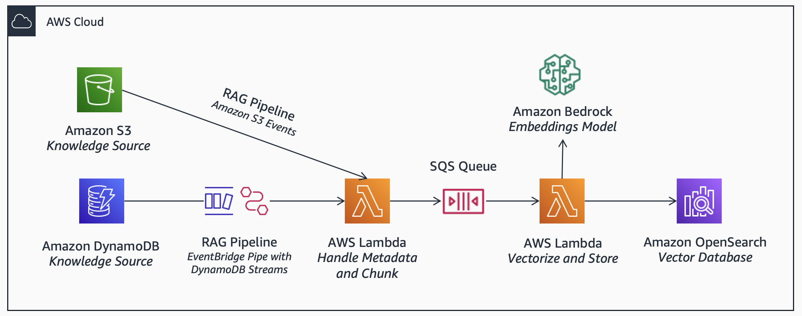

|ToC|
|---|

## Introduction to Generative AI

Software developers are embracing generative AI. With foundation models (FMs) now accessible on [Amazon Bedrock](https://aws.amazon.com/bedrock/), small teams can build and scale generative AI applications without deep machine learning (ML) expertise and resources. This post covers three high-level reference architectures for common scenarios, considerations and best-practices learned from our experience working with early adopters.
## Why Generative AI?

Typically, traditional ML models only perform a single task. They require a build, train and deploy lifecycle (MLOps) which can be challenging for smaller teams. On the other hand, FMs are trained on large datasets. They use broad knowledge to solve multiple tasks, such as text generation, classification, analysis and summarisation. They enable emerging architectures previously not possible. They are significantly easier to build, scale and maintain. 

## Retrieval Augmented Generation (RAG) Application

You can incorporate generative AI into your applications leveraging your own data. This is driven by a foundational architecture, *retrieval-augmented generation (RAG)*. It solves inherent knowledge limitations of FMs by integrating with data that are not part of the model’s training. All achieved without complexities associated with re-training and managing MLOps processes.

### Example RAG Prompt

To illustrate, imagine a skilled researcher (retrieval) that fetches the most relevant books from a vast library, and a creative expert professional (generation) that suggests ideas and answers with the knowledge in the books. 

Now, consider a prompt with *context* (retrieval) and *instruction* (generation) elements:

```
Context:
{Generative AI on AWS}
{AWS Machine Learning Blog}
{AWS Documentation}
{Well-Architected Framework}
{AWS Reference Architectures}

Instruction: 
You are an expert AWS Solutions Architect. 
Provide me with expert insights on {question}. 
Summarize insights and recommendations based only on the context. 
If the context does not provide the answer, say "I don't know".
```

Here, you provide *context* by finding and inserting the relevant data to the question (retrieval). And, you provide *instruction* to conduct a task based on the context such as summarization (generation). Commonly, instructions can also: 
* Prevent hallucination by [letting the model say “I don’t know”](https://docs.anthropic.com/claude/docs/let-claude-say-i-dont-know)  
* Provide a level of explainability by [asking to cite sources](https://docs.anthropic.com/claude/docs/advanced-text-analysis) 

Note curly brackets `{placeholders}` are template placeholders and you replace them with actual data.   

### AWS Reference Architecture for RAG Application 

A RAG application consists of key components:
* **RAG Pipeline** to process data from your knowledge sources
* **RAG Runtime** to process user prompts 

### RAG Pipeline

First, you convert data from your knowledge source (such as Amazon S3 or Amazon DynamoDB) to an appropriate vector format for later retrieval. You adopt an open-source FM orchestration tool, such as [LangChain](https://js.langchain.com/docs/get_started/introduction) (alternatively, [LlamaIndex](https://docs.llamaindex.ai/) and [Haystack](https://docs.haystack.deepset.ai/)). These tools contain pre-built libraries for [integrating with Bedrock](https://python.langchain.com/docs/integrations/platforms/aws) and [various data sources](https://js.langchain.com/docs/modules/data_connection/).  

Consider the following steps:

**Prepare:** You collect, clean and transform data for later processing. For example, you transform raw data into a structured format such as JSON, identify metadata that are useful for filtering and access control, and remove any erroneous or unnecessary data. 

**Chunk:** For large text, you use [document transformers](https://js.langchain.com/docs/modules/data_connection/document_transformers/) to split them into chunks. This is because FMs have a limited context window. Typically, you find an optimal chunking strategy through trial and error. As it depends highly on the specific content, you will need to balance preserving context and maintaining accuracy.

**Vectorize:** You convert data into embeddings. Embeddings is simply a vector representation of the data in a multi-dimensional space. It facilitates retrieval through similarity search. To get started, try an [embeddings model from Amazon Bedrock](https://docs.aws.amazon.com/bedrock/latest/userguide/embeddings.html). Alternatively, there are open-source models that are benchmarked on [Massive Text Embedding Benchmark \(MTEB\) leaderboard](https://huggingface.co/spaces/mteb/leaderboard) such as [sentence-transformer](https://huggingface.co/sentence-transformers). 

*Dimensionality:* Consider dimensionality of vector embeddings. For example, *Amazon Titan Text Embeddings* have 1,536 dimensions. Dense vectors with higher dimensions provide greater factors for similarity. However, your vector database may have limitations on dimensions. Sparse vectors with lower dimensions can also improve efficiency and performance.

**Store:** You store the generated embeddings into a [vector database](https://aws.amazon.com/blogs/database/the-role-of-vector-datastores-in-generative-ai-applications/), such as [Amazon OpenSearch Serverless](https://aws.amazon.com/opensearch-service/serverless-vector-engine/). Initially, you load data in [bulk](https://opensearch.org/docs/latest/api-reference/document-apis/bulk/). As new data is generated, you build a pipeline. For example, you use [knowledge bases for Amazon Bedrock](https://docs.aws.amazon.com/bedrock/latest/userguide/knowledge-base.html) or build an event-driven architecture with [Amazon S3 events](https://docs.aws.amazon.com/AmazonS3/latest/userguide/EventNotifications.html) or [Amazon DynamoDB streams with Amazon EventBridge Pipe](https://docs.aws.amazon.com/eventbridge/latest/userguide/eb-pipes-dynamodb.html) to trigger a Lambda function to [index](https://opensearch.org/docs/latest/api-reference/document-apis/index-document/) new data. 

As the vector store may handle sensitive data, consider security capabilities such as encryption and access control. You can also redact or mask of personal information prior to storage. For SaaS applications, consider [multi-tenancy](https://aws.amazon.com/blogs/apn/storing-multi-tenant-saas-data-with-amazon-opensearch-service/). In addition, there are many alternative vector database options, such as [Pinecone](https://aws.amazon.com/marketplace/seller-profile?id=03ee3233-4417-4279-81ac-8e3bbd6282e8), [Weaviate](https://aws.amazon.com/marketplace/seller-profile?id=seller-jxgfug62rvpxs) and [pgvector](https://aws.amazon.com/blogs/database/leverage-pgvector-and-amazon-aurora-postgresql-for-natural-language-processing-chatbots-and-sentiment-analysis/). For prototyping, in-memory stores, such as  [Faiss](https://js.langchain.com/docs/modules/data_connection/vectorstores/integrations/faiss) and [Chroma](https://js.langchain.com/docs/modules/data_connection/vectorstores/integrations/chroma), provide a convenient developer experience.

### RAG Runtime

At runtime, your application will need to process the user’s input prompt and augment it with retrieved context. Consider the following steps:

**Retrieve:** You retrieve relevant data from the vector database. In addition to vector storage, vector databases provide indexing and retrieval capabilities. A starting approach is *semantic search*. Here, you convert the input prompt into embeddings. Then, you find similar embeddings in the vector database using a k-nearest neighbors (kNN) algorithm. By using vectors, you can understand the meaning behind prompts and deliver contextually relevant results.

*Advanced retrieval:* Domain-specific terminologies may not be represented well in the training data of the embeddings model. If this is the case, search results may be less accurate. You improve this with *hybrid search*. You combine semantic search with a [traditional document search, such as BM25](https://aws.amazon.com/what-is/document-search/).  In addition, consider orchestrating advanced retrieval techniques. For example , [maximal marginal relevance (MMR)](https://python.langchain.com/docs/modules/model_io/prompts/example_selectors/mmr) for diversity of results, or [ensemble retrieval](https://gpt-index.readthedocs.io/en/stable/examples/retrievers/ensemble_retrieval.html) to attempt multiple strategies at the same time.

**Generate:** You generate an output by inputing a prompt with the retrieved data as context. The output depends on the model you choose, and prompt you design.

*Model selection:* With Bedrock, you get access to leading foundation models with enterprise-grade security. You choose a model that supports your use case, context length, and price-performance requirements. You use [InvokeModel](https://docs.aws.amazon.com/bedrock/latest/APIReference/API_runtime_InvokeModel.html) via the [AWS SDK](https://docs.aws.amazon.com/bedrock/latest/userguide/api-setup.html). Consistent with other AWS services, you configure access using AWS Identity and Access Management (IAM), view audit logs in AWS CloudTrail, optionally enable private connectivity using AWS PrivateLink. 

*Prompt design:* For effective prompts, be specific with instructions. This includes the desired output format (such as text within specific template or length, or a structured format such as JSON, XML, YAML and markdown). Consider best-practices from the model provider. For example, see [prompt design for Anthropic Claude](https://docs.anthropic.com/claude/docs/introduction-to-prompt-design). For prototyping, you design a number of test cases. You set [temperature](https://docs.aws.amazon.com/bedrock/latest/userguide/model-parameters.html#model-parameters-claude) to `0` to mitigate randomness in the output for evaluation. 

## Generative AI Chat Applications

With RAG as foundation, you build a conversational chat feature to provide a fast, intuitive and natural experience for your users. While this sounds simple, it can be deceivingly challenging to build. Consider additional elements required:  

**Memory:** You may need to remember previous interactions to understand follow-up questions. By default, models are stateless. However, you can incorporate [memory](https://js.langchain.com/docs/modules/memory/) with low-latency store such as [DynamoDB](https://js.langchain.com/docs/modules/memory/integrations/dynamodb).  There are advanced types of memory. For example, [conversation summary ](https://js.langchain.com/docs/modules/memory/how_to/summary)  for handling long-chat interactions. 

**Latency:** As users increasingly expect fast experiences, consider response streaming. Response streaming is supported in both [Bedrock](https://docs.aws.amazon.com/bedrock/latest/APIReference/API_runtime_InvokeModelWithResponseStream.html) and [Lambda](https://aws.amazon.com/blogs/compute/introducing-aws-lambda-response-streaming/).  With streaming, you return a response to the user as soon as a chunk is generated by the FM. For less complex tasks, you use a smaller FM such as [Claude Instant](https://aws.amazon.com/bedrock/claude/). Smaller models handle a narrower set of tasks, but can perform faster than larger models. 

**Throughput (requests):** Your application may require high throughput. Consider [service quotas](https://docs.aws.amazon.com/bedrock/latest/userguide/quotas.html). To manage requests per minute (RPM), you use an [Amazon Simple Queue Service \(SQS\)](https://aws.amazon.com/sqs/) queue to asynchronously process requests. 

**Throughput (tokens):** With generative AI services, you also need to manage tokens processed per minute (TPM). Tokens consumed depends on the length of prompts, usage frequency which can vary widely depending on the use case. 10,000 tokens is approximately equivalent to 750 words. One approach is to limit input prompts to a maximum number of words. When you achieve scale, consider [provisioned throughput](https://docs.aws.amazon.com/bedrock/latest/userguide/prov-throughput.html).   

**Monitoring:** You monitor token consumption by instrumenting [custom metrics](https://docs.aws.amazon.com/AmazonCloudWatch/latest/monitoring/publishingMetrics.html).  You add any additional context that can help you understand and manage performance, such as the model name and the tenant context. In addition, consider the [quota monitoring](https://aws.amazon.com/solutions/implementations/quota-monitor/) solution.

## Generative AI Advanced Workflow Applications

As you build AI applications, you may start with simple model interactions. However, your user journey may have multiple steps that benefit from AI. You may require advanced, multi-step and parallel processes integrating with various systems. 

As an example, content creation tools can invoke the same prompt in parallel. Leveraging the randomness of generative models, they generate multiple outputs for users to select. These outputs can be further improved through additional prompts and operations.

Consider additional elements required:

**Orchestration:** In the infrastructure layer, you can orchestrate with event-driven services such as [Amazon EventBridge](https://aws.amazon.com/eventbridge/) and [AWS Step Functions](https://aws.amazon.com/step-functions/). In the application layer, tools such as LangChain support [chains](https://js.langchain.com/docs/modules/chains/) and [agents](https://js.langchain.com/docs/modules/agents/) for advanced workflows. 

**Prompt Chaining:** Many workflows require conditional logic, breaking down complex questions into multiple steps, and multiple retrievals. They may also require a precise output. For example, a JSON format with a specific structure. One approach is to feed the model’s response to a prompt, into the input for another prompt. See [prompt chaining](https://docs.anthropic.com/claude/docs/prompt-chaining) to learn more.

**Function Calling:** Some foundation models, such as Claude, have been tuned for function calling. This enables a wide range of possibilities, including mathematical computation, external data and performing actions, such as email notifications. Here, you convert natural language into function instructions. For example, you can the following instruction to output: 
* Instruction: `What is the current weather in Sydney in celsius?` 
* Output: `get_weather(location = "Sydney", units = "C")` 

Then, you process the output text, and *actually* call the function separately. To achieve this, you simply define functions as context into a prompt. See example: 

```xml
<function>
	<function_name>get_weather</function_name>
	<function_description>Returns the current weather for a given location</function_description>
	<required_argument>location (str): Name of city or airport code</	required_argument>
	<optional_argument>units (str): Temperature units, either "F" for Fahrenheit or "C" for Celsius, default "F"</optional_argument>
	<returns> weather (dict): - temperature (float): Current temperature in degrees - condition (str): Short text description of weather conditions </returns>
	<raises>ValueError: If invalid location provided</raises>
	<example_call>
		get_weather(location="New York", units="F")
	</example_call>
</function>
```

Alternatively, consider [Agents for Amazon Bedrock](https://aws.amazon.com/bedrock/agents/) for a managed solution.

**Multi-modal:**  In addition to text, many generative and embeddings models can process also process other modalities of data such as images, audio and videos. For example, embedding models such as CLIP can facilitate [similarity search for images](https://aws.amazon.com/blogs/machine-learning/implement-unified-text-and-image-search-with-a-clip-model-using-amazon-sagemaker-and-amazon-opensearch-service/). And, generative models such as stable diffusion can [generate images from text](https://aws.amazon.com/blogs/machine-learning/generate-images-from-text-with-the-stable-diffusion-model-on-amazon-sagemaker-jumpstart/).   

**AWS AI/ML Stack:** For advanced use cases, it is not uncommon to combine multiple AI/ML capabilities. [AI services](https://aws.amazon.com/machine-learning/ai-services/) such as [Amazon Comprehend](https://aws.amazon.com/comprehend/) for entity detection. [Amazon SageMaker](https://aws.amazon.com/pm/sagemaker/) to access open-source models from [Hugging Face](https://docs.aws.amazon.com/sagemaker/latest/dg/hugging-face.html).  And, purpose-built ML [infrastructure](https://aws.amazon.com/machine-learning/infrastructure/) , such as [AWS Inferentia2](https://aws.amazon.com/machine-learning/inferentia/) for cost optimization at scale.

## Conclusion
Generative AI enables new and exciting applications and use cases. This post aims to guide you in building these applications. It outlines high-level reference architectures, considerations and best-practices. It covers key elements of common generative AI applications, including: retrieval-augmented generation (RAG), chat and advanced workflow applications. 

To get started with Amazon Bedrock, try the [hands-on workshop](https://github.com/aws-samples/amazon-bedrock-workshop).