[Amazon SageMaker Studio](https://docs.aws.amazon.com/sagemaker/latest/dg/studio.html) is the first fully integrated development environment (IDE) for machine learning that provides a single, web-based visual interface to perform all the steps for ML development.

In this tutorial, you will learn how to use Amazon SageMaker Studio to build, train, deploy, and monitor an [XGBoost](https://docs.aws.amazon.com/sagemaker/latest/dg/xgboost.html) model. You will go through the entire machine learning (ML) workflow from feature engineering and model training, to batch and live deployments for [ML models](https://aws.amazon.com/getting-started/hands-on/build-train-deploy-machine-learning-model-sagemaker/).

Specifically, you will learn how to:

- Set up the Amazon SageMaker Studio Control Panel
- Download a public dataset using an Amazon SageMaker Studio Notebook and upload it to Amazon S3
- Create an Amazon SageMaker Experiment to track and manage training and processing jobs
- Run an Amazon SageMaker Processing job to generate features from raw data
- Train a model using the built-in XGBoost algorithm
- Test the model performance on the test dataset using Amazon SageMaker Batch Transform
- Deploy the model as an endpoint, and set up a Monitoring job to monitor the model endpoint in production for data drift
- Visualize results and monitor the model using SageMaker Model Monitor to determine any differences between the training dataset and the deployed model


## Table of Contents

| Attributes                |                                   |
| ------------------- | -------------------------------------- |
| ‚úÖ AWS Level        | Intermediate                         |
| ‚è± Time to complete  | 1 hour                              |
| üí∞ Cost to complete | Less than $10     |
| üß© Prerequisites    | [AWS Account](https://aws.amazon.com/resources/create-account/?sc_channel=el&sc_campaign=devopswave&sc_content=cicdcdkpthnec2aws&sc_geo=mult&sc_country=mult&sc_outcome=acq)
| 📢 Feedback            | <a href="https://pulse.buildon.aws/survey/DEM0H5VW" target="_blank">Any feedback, issues, or just a</a> 👍 / 👎 ?    |
| ‚è∞ Last Updated     | YYYY-MM-DD                             |


| ToC |
|-----|


## Creating your Amazon SageMaker Studio Control Panel

In this step, you will start the onboarding with Amazon SageMaker Studio and set up your Amazon SageMaker Studio Control Panel.

For more information, read [Get Started with Amazon SageMaker Studio](https://docs.aws.amazon.com/sagemaker/latest/dg/gs-studio.html) in the Amazon SageMaker documentation.

Begin by signing in to the [Amazon SageMaker console](https://console.aws.amazon.com/sagemaker/).In the top-right corner, make sure to select an AWS Region where SageMaker Studio is available. For a list of Regions, read [Onboard to Amazon SageMaker Studio](https://docs.aws.amazon.com/sagemaker/latest/dg/gs-studio-onboard.html):


Next, in the `Amazon SageMaker` navigation pane, choose `Amazon SageMaker Studio`. Keep in mind,  if you are using Amazon SageMaker Studio for the first time, you must complete the [Studio onboarding process](https://docs.aws.amazon.com/sagemaker/latest/dg/gs-studio-onboard.html). When onboarding, you can choose to use either AWS Single Sign-On (AWS SSO) or AWS Identity and Access Management (IAM) for authentication methods. When you use IAM authentication, you can choose the quick start or the standard setup procedure. If you are unsure of which option to choose, read [Onboard to Amazon SageMaker Studio](https://docs.aws.amazon.com/sagemaker/latest/dg/gs-studio-onboard.html) and ask your IT administrator for assistance. For simplicity, this tutorial uses the Quick start procedure:


In the `Get started` box, choose `Create a SageMaker domain` and specify the domain name and user name:


For `Execution role`, choose `Create a new role`. In the dialog box that appears, choose any S3 bucket and choose `Create role`.

Amazon SageMaker then creates a role with the required permissions and assigns it to your instance:

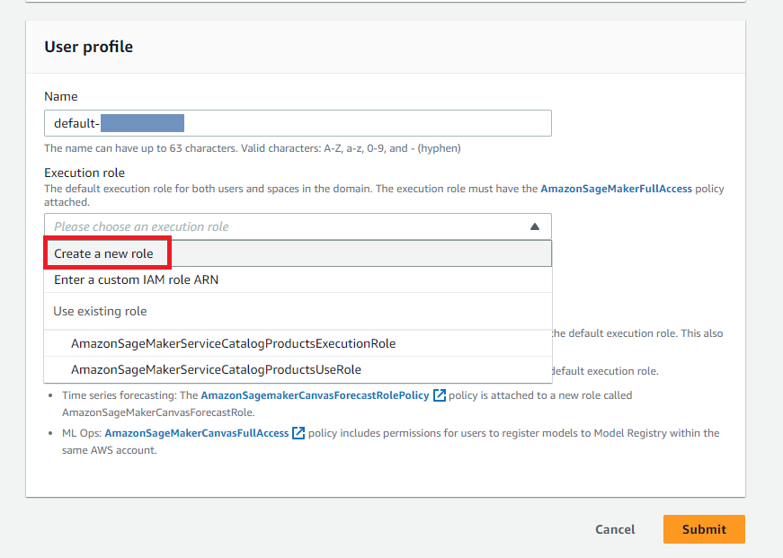

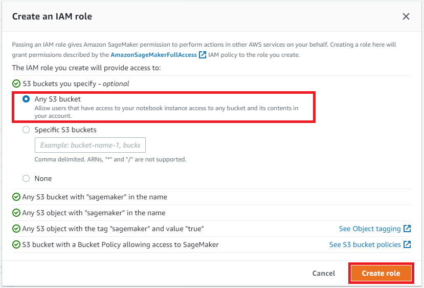

Now press `Submit`:


Your Amazon SageMaker Studio Control Panel is now set up and ready for the next step. 


## Downloading the dataset

In this step, you willComplete the following steps to create a SageMaker Notebook, download the dataset, and then upload the dataset to Amazon S3. Amazon SageMaker Studio notebooks are one-click Jupyter notebooks that contain everything you need to build and test your training scripts. SageMaker Studio also includes experiment tracking and visualization so that it’s easy to manage your entire machine learning workflow in one place.

For more information, read [Use Amazon SageMaker Studio Notebooks](https://docs.aws.amazon.com/sagemaker/latest/dg/notebooks.html) in the Amazon SageMaker documentation.

First, in the `Amazon SageMaker Studio Control Panel`, choose `Open Studio`:

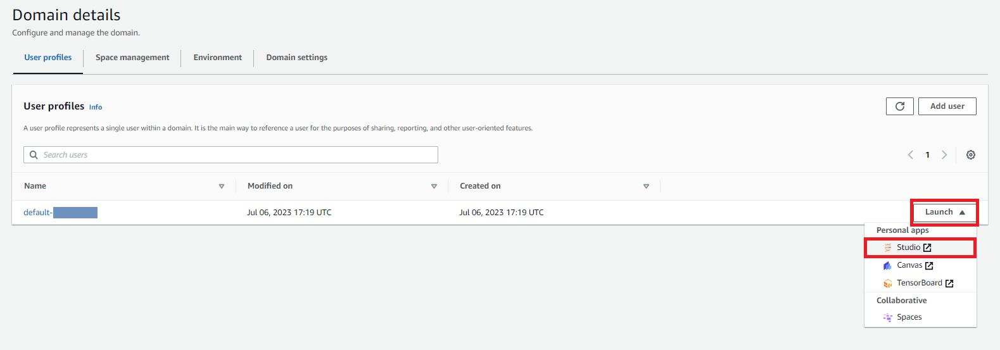

In `JupyterLab`, on the `File` menu, choose `New`, then `Notebook`. In the `Set up notebook environment`, choose `Image: Data Science`, `Kernel: Python 3`, `Instance type: mlt3.medium` and `Start-up script: No script` as in the following: 

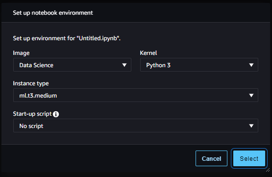

Next, verify your version of the [Amazon SageMaker Python SDK](https://sagemaker.readthedocs.io/en/stable/). Insert the following code block and select `Run`.

Note that while the code runs, an `*` appears between the square brackets. After a few seconds, the code execution completes and the `*` is replaced with a number:

```python
import boto3
import sagemaker
from sagemaker import get_execution_role
import sys
import IPython

if int(sagemaker.__version__.split('.')[0]) == 2:
    print("Installing previous SageMaker Version and restarting the kernel")
    !{sys.executable} -m pip install sagemaker==1.72.0
    IPython.Application.instance().kernel.do_shutdown(True)

else:
    print("Version is good")

role = get_execution_role()
sess = sagemaker.Session()
region = boto3.session.Session().region_name
print("Region = {}".format(region))
sm = boto3.Session().client('sagemaker')
```
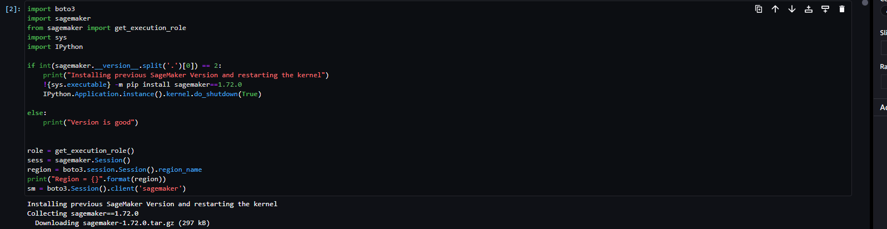

Now you will import libraries. Insert the following code and select `Run`:

```Python
import matplotlib.pyplot as plt
import numpy as np
import pandas as pd
import os
from time import sleep, gmtime, strftime
import json
import time
```

Finally, import the experiments. Insert the following code and select `Run`:

```Python
!pip install sagemaker-experiments 
from sagemaker.analytics import ExperimentAnalytics
from smexperiments.experiment import Experiment
from smexperiments.trial import Trial
from smexperiments.trial_component import TrialComponent
from smexperiments.tracker import Tracker
```
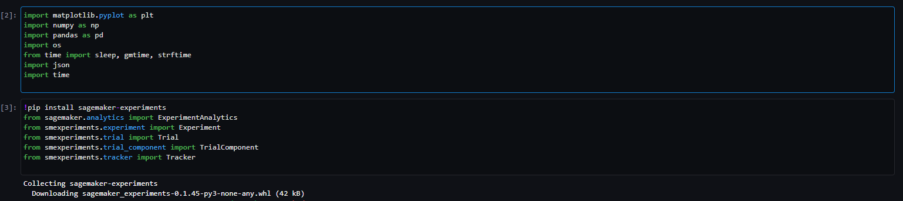

Once this is complete, you will define the Amazon S3 buckets and folders for the project. Insert the following code and select `Run`:

```Python
rawbucket= sess.default_bucket() # Alternatively you can use our custom bucket here. 

prefix = 'sagemaker-modelmonitor' # use this prefix to store all files pertaining to this workshop.

dataprefix = prefix + '/data'
traindataprefix = prefix + '/train_data'
testdataprefix = prefix + '/test_data'
testdatanolabelprefix = prefix + '/test_data_no_label'
trainheaderprefix = prefix + '/train_headers'
```

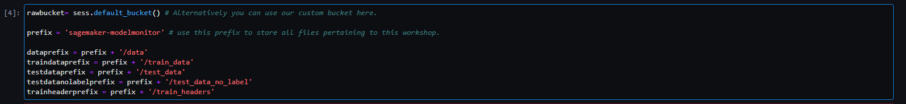

Download the dataset and import it using the pandas library. Insert the following code into a new code block and choose `Run`:

```Python
! wget https://archive.ics.uci.edu/ml/machine-learning-databases/00350/default%20of%20credit%20card%20clients.xls
data = pd.read_excel('default of credit card clients.xls', header=1)
data = data.drop(columns = ['ID'])
data.head()
```

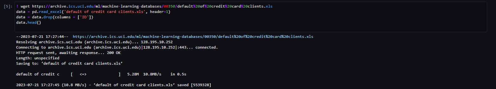

Rename the last column as `Label` and extract the label column separately. For the Amazon SageMaker built-in [XGBoost algorithm](https://docs.aws.amazon.com/sagemaker/latest/dg/xgboost.html), the label column must be the first column in the dataframe. To make that change, insert the following code into a new code block and choose `Run`:

```Python
data.rename(columns={"default payment next month": "Label"}, inplace=True)
lbl = data.Label
data = pd.concat([lbl, data.drop(columns=['Label'])], axis = 1)
data.head()
```

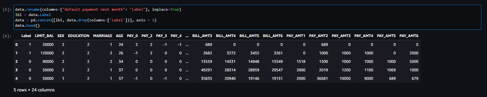

Upload the CSV dataset into an [Amazon S3](https://aws.amazon.com/s3/) bucket. Insert the following code into a new code block and choose `Run`:

```Python
if not os.path.exists('rawdata/rawdata.csv'):
    !mkdir rawdata
    data.to_csv('rawdata/rawdata.csv', index=None)
else:
    pass
# Upload the raw dataset
raw_data_location = sess.upload_data('rawdata', bucket=rawbucket, key_prefix=dataprefix)
print(raw_data_location)
```

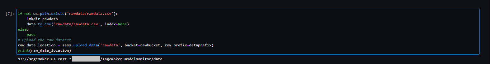

After this is done running, you’re done.The code output displays the S3 bucket URI like the following example:

`s3://sagemaker-us-east-2-ACCOUNT_NUMBER/sagemaker-modelmonitor/data`

You can now move on to the next step and process your data. 


## Processing the data using Amazon SageMaker Processing

In this step, you will use Amazon SageMaker Processing to pre-process the dataset, including scaling the columns and splitting the dataset into train and test data. Amazon SageMaker Processing allows you to run your pre-processing, post-processing, and model evaluation workloads on fully managed infrastructure.

Here, you will process the data and generate features using Amazon SageMaker Processing.

Amazon SageMaker Processing runs on separate compute instances from your notebook. This means you can continue to experiment and run code in your notebook while the processing job is under way. This will incur additional charges for the cost of the instance which is up and running for the duration of the processing job. The instances are automatically terminated by SageMaker once the processing job completes. For pricing details, read [Amazon SageMaker Pricing](https://aws.amazon.com/sagemaker/pricing/).

Additionally, for more information, read [Process Data and Evaluate Models](https://docs.aws.amazon.com/sagemaker/latest/dg/processing-job.html) in the Amazon SageMaker documentation.

First, import the [`scikit-learn processing`](https://github.com/awslabs/amazon-sagemaker-examples/tree/master/sagemaker_processing/scikit_learn_data_processing_and_model_evaluation) container. Insert the following code into a new code cell and choose `Run`.

Note thatAmazon SageMaker provides a managed container for `scikit-learn`. For more information, read [Process Data and Evaluate Models with `scikit-learn`](https://docs.aws.amazon.com/sagemaker/latest/dg/use-scikit-learn-processing-container.html):

```Python
from sagemaker.sklearn.processing import SKLearnProcessor
sklearn_processor = SKLearnProcessor(framework_version='0.20.0',
                                     role=role,
                                     instance_type='ml.c4.xlarge',
                                     instance_count=1)
```

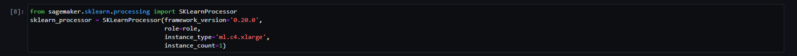

Now insert the following pre-processing script into a new cell and choose `Run`:

```Python
%%writefile preprocessing.py

import argparse
import os
import warnings

import pandas as pd
import numpy as np
from sklearn.model_selection import train_test_split
from sklearn.preprocessing import StandardScaler, MinMaxScaler
from sklearn.exceptions import DataConversionWarning
from sklearn.compose import make_column_transformer

warnings.filterwarnings(action='ignore', category=DataConversionWarning)

if __name__=='__main__':
    parser = argparse.ArgumentParser()
    parser.add_argument('--train-test-split-ratio', type=float, default=0.3)
    parser.add_argument('--random-split', type=int, default=0)
    args, _ = parser.parse_known_args()
    
    print('Received arguments {}'.format(args))

    input_data_path = os.path.join('/opt/ml/processing/input', 'rawdata.csv')
    
    print('Reading input data from {}'.format(input_data_path))
    df = pd.read_csv(input_data_path)
    df.sample(frac=1)
    
    COLS = df.columns
    newcolorder = ['PAY_AMT1','BILL_AMT1'] + list(COLS[1:])[:11] + list(COLS[1:])[12:17] + list(COLS[1:])[18:]
    
    split_ratio = args.train_test_split_ratio
    random_state=args.random_split
    
    X_train, X_test, y_train, y_test = train_test_split(df.drop('Label', axis=1), df['Label'], 
                                                        test_size=split_ratio, random_state=random_state)
    
    preprocess = make_column_transformer(
        (['PAY_AMT1'], StandardScaler()),
        (['BILL_AMT1'], MinMaxScaler()),
    remainder='passthrough')
    
    print('Running preprocessing and feature engineering transformations')
    train_features = pd.DataFrame(preprocess.fit_transform(X_train), columns = newcolorder)
    test_features = pd.DataFrame(preprocess.transform(X_test), columns = newcolorder)
    
    # concat to ensure Label column is the first column in dataframe
    train_full = pd.concat([pd.DataFrame(y_train.values, columns=['Label']), train_features], axis=1)
    test_full = pd.concat([pd.DataFrame(y_test.values, columns=['Label']), test_features], axis=1)
    
    print('Train data shape after preprocessing: {}'.format(train_features.shape))
    print('Test data shape after preprocessing: {}'.format(test_features.shape))
    
    train_features_headers_output_path = os.path.join('/opt/ml/processing/train_headers', 'train_data_with_headers.csv')
    
    train_features_output_path = os.path.join('/opt/ml/processing/train', 'train_data.csv')
    
    test_features_output_path = os.path.join('/opt/ml/processing/test', 'test_data.csv')
    
    print('Saving training features to {}'.format(train_features_output_path))
    train_full.to_csv(train_features_output_path, header=False, index=False)
    print("Complete")
    
    print("Save training data with headers to {}".format(train_features_headers_output_path))
    train_full.to_csv(train_features_headers_output_path, index=False)
                 
    print('Saving test features to {}'.format(test_features_output_path))
    test_full.to_csv(test_features_output_path, header=False, index=False)
    print("Complete")
```

After, copy over the preprocessing code to the Amazon S3 bucket using the following code, then choose `Run`:

```Python
# Copy the preprocessing code over to the s3 bucket
codeprefix = prefix + '/code'
codeupload = sess.upload_data('preprocessing.py', bucket=rawbucket, key_prefix=codeprefix)
print(codeupload)
```

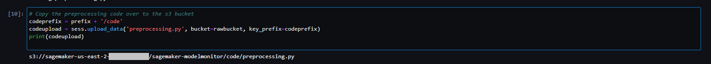

Then, specify where you want to store your training and test data after the SageMaker Processing job completes. Amazon SageMaker Processing automatically stores the data in the specified location:

```Python
train_data_location = rawbucket + '/' + traindataprefix
test_data_location = rawbucket+'/'+testdataprefix
print("Training data location = {}".format(train_data_location))
print("Test data location = {}".format(test_data_location))
```

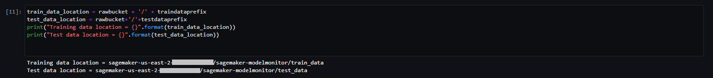

Next, insert the following code to start the Processing job. This code starts the job by calling `sklearn_processor.run` and extracts some optional metadata about the processing job, such as where the training and test outputs were stored:

```Python
from sagemaker.processing import ProcessingInput, ProcessingOutput

sklearn_processor.run(code=codeupload,
                      inputs=[ProcessingInput(
                        source=raw_data_location,
                        destination='/opt/ml/processing/input')],
                      outputs=[ProcessingOutput(output_name='train_data',
                                                source='/opt/ml/processing/train',
                               destination='s3://' + train_data_location),
                               ProcessingOutput(output_name='test_data',
                                                source='/opt/ml/processing/test',
                                               destination="s3://"+test_data_location),
                               ProcessingOutput(output_name='train_data_headers',
                                                source='/opt/ml/processing/train_headers',
                                               destination="s3://" + rawbucket + '/' + prefix + '/train_headers')],
                      arguments=['--train-test-split-ratio', '0.2']
                     )

preprocessing_job_description = sklearn_processor.jobs[-1].describe()

output_config = preprocessing_job_description['ProcessingOutputConfig']
for output in output_config['Outputs']:
    if output['OutputName'] == 'train_data':
        preprocessed_training_data = output['S3Output']['S3Uri']
    if output['OutputName'] == 'test_data':
        preprocessed_test_data = output['S3Output']['S3Uri']
```

Note locations of the code, train and test data in the outputs provided to the processor. Also, note the arguments provided to the processing scripts.

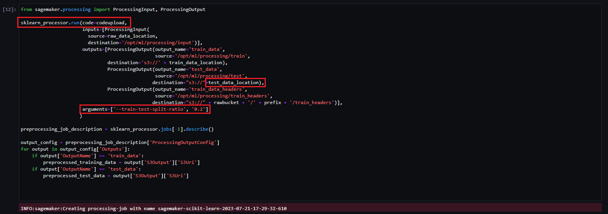

Now that you’re done processing your data, next you will create an experiment using Amazon SageMaker.


## Creating an Amazon SageMaker Experiment

With your dataset downloaded and staged in Amazon S3, now you can create an Amazon SageMaker Experiment. An experiment is a collection of processing and training jobs related to the same machine learning project. Amazon SageMaker Experiments automatically manages and tracks your training runs for you.

For more information, read[Experiments](https://docs.aws.amazon.com/sagemaker/latest/dg/experiments.html) in the Amazon SageMaker documentation.


First, insert the following code to create an experiment named `Build-train-deploy-xxxxx`:

```python
# Create a SageMaker Experiment
cc_experiment = Experiment.create(
    experiment_name=f"Build-train-deploy-{int(time.time())}", 
    description="Predict credit card default from payments data", 
    sagemaker_boto_client=sm)
print(cc_experiment)
```

Every training job is logged as a trial. Each trial is an iteration of your end-to-end training job. In addition to the training job, it can also track pre-processing and post-processing jobs,datasets, and other metadata. A single experiment can include multiple trials, which makes it easy for you to track multiple iterations over time within the Amazon SageMaker Studio Experiments pane:

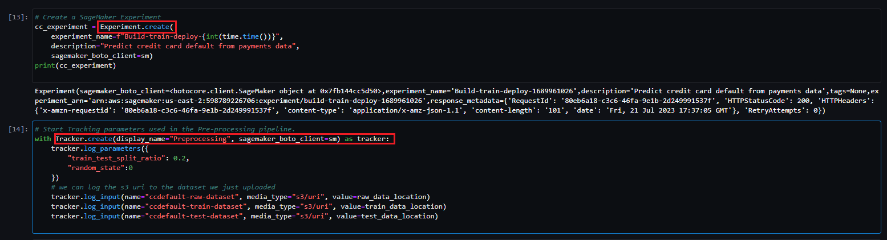

Insert the following code to track your pre-processing job under Experiments as well as a step in the training pipeline:

```python
# Start Tracking parameters used in the Pre-processing pipeline.
with Tracker.create(display_name="Preprocessing", sagemaker_boto_client=sm) as tracker:
    tracker.log_parameters({
        "train_test_split_ratio": 0.2,
        "random_state":0
    })
    # we can log the s3 uri to the dataset we just uploaded
    tracker.log_input(name="ccdefault-raw-dataset", media_type="s3/uri", value=raw_data_location)
    tracker.log_input(name="ccdefault-train-dataset", media_type="s3/uri", value=train_data_location)
    tracker.log_input(name="ccdefault-test-dataset", media_type="s3/uri", value=test_data_location)
```

To view the details of the experiment, go to the `Experiments` pane, press the experiment named `Build-train-deploy-xxxxx`:

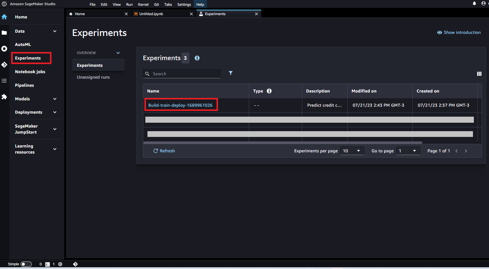


Insert the following code, then choose `Run`. Review the code closely.

It’s important to know how to train an XGBoost classifier. First you need to import the [XGBoost](https://docs.aws.amazon.com/sagemaker/latest/dg/xgboost.html) container maintained by Amazon SageMaker. Then, you log the training run under a `Trial` so SageMaker Experiments can track it under a `Trial` name. The pre-processing job is included under the same trial name since it is part of the pipeline. 

Next, create a SageMaker Estimator object, which automatically provisions the underlying instance type of your choosing, copies over the training data from the specified output location from the processing job, trains the model, and outputs the model artifacts:

```python
from sagemaker.amazon.amazon_estimator import get_image_uri
container = get_image_uri(boto3.Session().region_name, 'xgboost', '1.0-1')
s3_input_train = sagemaker.s3_input(s3_data='s3://' + train_data_location, content_type='csv')
preprocessing_trial_component = tracker.trial_component

trial_name = f"cc-default-training-job-{int(time.time())}"
cc_trial = Trial.create(
        trial_name=trial_name, 
            experiment_name=cc_experiment.experiment_name,
        sagemaker_boto_client=sm
    )

cc_trial.add_trial_component(preprocessing_trial_component)
cc_training_job_name = "cc-training-job-{}".format(int(time.time()))

xgb = sagemaker.estimator.Estimator(container,
                                    role, 
                                    train_instance_count=1, 
                                    train_instance_type='ml.m4.xlarge',
                                    train_max_run=86400,
                                    output_path='s3://{}/{}/models'.format(rawbucket, prefix),
                                    sagemaker_session=sess) # set to true for distributed training

xgb.set_hyperparameters(max_depth=5,
                        eta=0.2,
                        gamma=4,
                        min_child_weight=6,
                        subsample=0.8,
                        verbosity=0,
                        objective='binary:logistic',
                        num_round=100)

xgb.fit(inputs = {'train':s3_input_train},
       job_name=cc_training_job_name,
        experiment_config={
            "TrialName": cc_trial.trial_name, #log training job in Trials for lineage
            "TrialComponentDisplayName": "Training",
        },
        wait=True,
    )
time.sleep(2)
```


The training job will take about 70 seconds to complete. You should receive the message  “Completed - Training job completed”.

In the left toolbar, choose `Experiment`. Press the `Build-train-deploy-xxxxx` experiment. Amazon SageMaker Experiments then captures all the runs including any failed training runs:

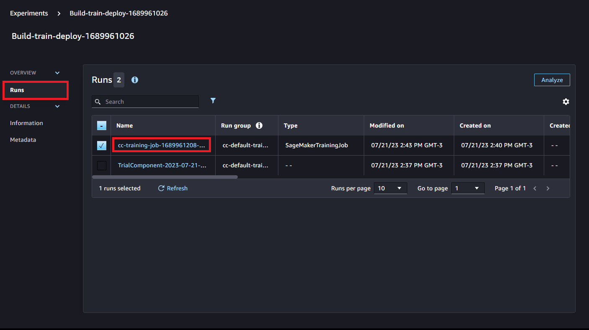

Now press  `cc-training-job-xxxxxx` to explore the associated metadata with the training job. Note, you  may need to refresh the page to view the latest results:

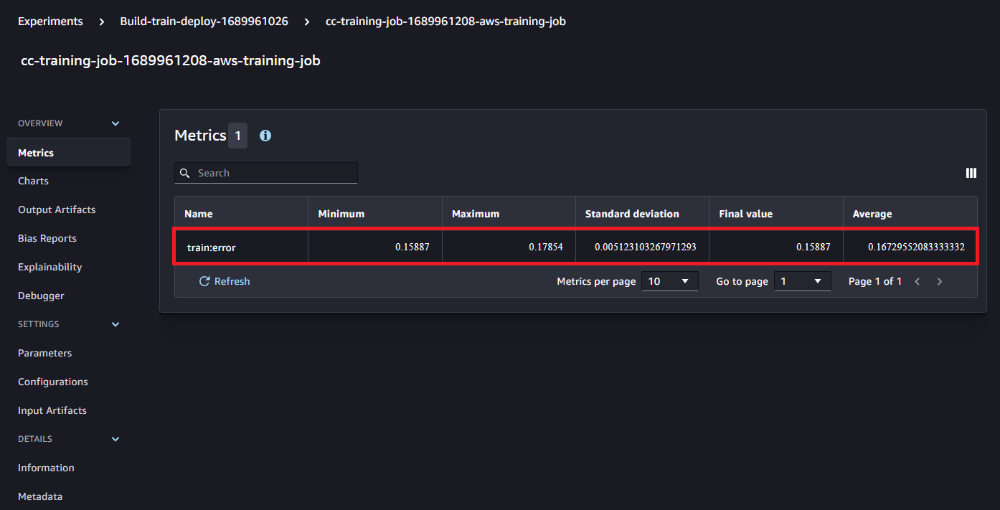

Now that you’re done creating your Amazon SageMaker Experiment, next you can deploy the model. 


## Deploying the model for offline inference

In your pre-processing step, you generated some test data. In this step, you will generate offline or batch inference from the trained model to evaluate the model performance on unseen test data.

For more information, read [Batch Transform](https://docs.aws.amazon.com/sagemaker/latest/dg/batch-transform.html) in the Amazon SageMaker documentation.

Insert the following code and choose `Run`. This step copies the test dataset over from the Amazon S3 location into your local folder:

```Python
test_data_path = 's3://' + test_data_location + '/test_data.csv'
! aws s3 cp $test_data_path .
```

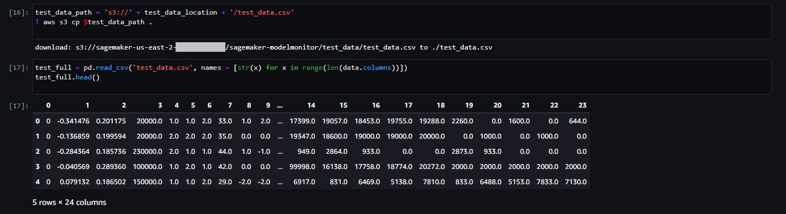

Now insert the following code and choose `Run`:

```Python
test_full = pd.read_csv('test_data.csv', names = [str(x) for x in range(len(data.columns))])
test_full.head()
```

Then insert the following code and choose `Run`:

```Python
label = test_full['0'] 
```

Finally, insert the following code and choose `Run` to create the Batch Transform job. Then, review the code closely:

```Python
%%time

sm_transformer = xgb.transformer(1, 'ml.m5.xlarge', accept = 'text/csv')

# start a transform job
sm_transformer.transform(test_data_path, split_type='Line', input_filter='$[1:]', content_type='text/csv')
sm_transformer.wait()
```

Like the training job, SageMaker provisions all the underlying resources, copies over the trained model artifacts, sets up a Batch endpoint locally, copies over the data, and runs inferences on the data and pushes the outputs to Amazon S3. Note that by setting the `input_filter`, you are letting Batch Transform know to neglect the first column in the test data which is the label column:

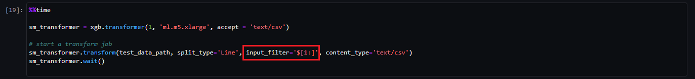

The Batch Transform job will take about four minutes to complete. Then,you can evaluate the model results.

Once this is done, run the following code to evaluate the model metrics. Then, take a closer review of the code:

First, define a function that pulls the output of the Batch Transform job, which is contained in a file with a `.out` extension from the Amazon S3 bucket. Then, extract the predicted labels into a dataframe and append the true labels to this dataframe:

```Python
import json
import io
from urllib.parse import urlparse

def get_csv_output_from_s3(s3uri, file_name):
    parsed_url = urlparse(s3uri)
    bucket_name = parsed_url.netloc
    prefix = parsed_url.path[1:]
    s3 = boto3.resource('s3')
    obj = s3.Object(bucket_name, '{}/{}'.format(prefix, file_name))
    return obj.get()["Body"].read().decode('utf-8')
output = get_csv_output_from_s3(sm_transformer.output_path, 'test_data.csv.out')
output_df = pd.read_csv(io.StringIO(output), sep=",", header=None)
output_df.head(8)
output_df['Predicted']=np.round(output_df.values)
output_df['Label'] = label
from sklearn.metrics import confusion_matrix, accuracy_score
confusion_matrix = pd.crosstab(output_df['Predicted'], output_df['Label'], rownames=['Actual'], colnames=['Predicted'], margins = True)
confusion_matrix
```

You should receive an output similar to the following image, which shows the total number of `Predicted` True and False values compared to the `Actual` values: 

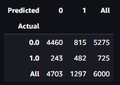

Use the following code to extract both the baseline model accuracy and the model accuracy. Note, a helpful model for the baseline accuracy can be the fraction of non-default cases. A model that always predicts that a user will not default, has that accuracy: 

```Python
print("Baseline Accuracy = {}".format(1- np.unique(data['Label'], return_counts=True)[1][1]/(len(data['Label']))))
print("Accuracy Score = {}".format(accuracy_score(label, output_df['Predicted'])))
```

The results show that a simple model can already beat the baseline accuracy. To improve the results, you can tune the hyperparameters. You can use hyperparameter optimization (HPO) on SageMaker for automatic model tuning. To learn more, read [How Hyperparameter Tuning Works](https://docs.aws.amazon.com/sagemaker/latest/dg/automatic-model-tuning-how-it-works.html). 

Although it is not included in this tutorial, you also have the option of including Batch Transform as part of your trial. When you call the `.transform` function, simply pass in the `experiment_config` as you did for the Training job. Amazon SageMaker automatically associates the Batch Transform as a trial component:

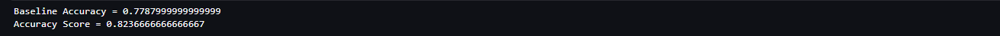

Now that you’ve successfully deployed your model for offline inference, now you will do it as an endpoint and set up data capture. 


## Deploying the model as an endpoint and set up data capture

In this step, you deploy the model as a RESTful HTTPS endpoint to serve live inferences. Amazon SageMaker automatically handles the model hosting and creates the endpoint for you.

Insert the following code and choose `Run`:

```Python
from sagemaker.model_monitor import DataCaptureConfig
from sagemaker import RealTimePredictor
from sagemaker.predictor import csv_serializer

sm_client = boto3.client('sagemaker')

latest_training_job = sm_client.list_training_jobs(MaxResults=1,
                                                SortBy='CreationTime',
                                                SortOrder='Descending')

training_job_name=TrainingJobName=latest_training_job['TrainingJobSummaries'][0]['TrainingJobName']

training_job_description = sm_client.describe_training_job(TrainingJobName=training_job_name)

model_data = training_job_description['ModelArtifacts']['S3ModelArtifacts']
container_uri = training_job_description['AlgorithmSpecification']['TrainingImage']

# create a model.
def create_model(role, model_name, container_uri, model_data):
    return sm_client.create_model(
        ModelName=model_name,
        PrimaryContainer={
        'Image': container_uri,
        'ModelDataUrl': model_data,
        },
        ExecutionRoleArn=role)

try:
    model = create_model(role, training_job_name, container_uri, model_data)
except Exception as e:
        sm_client.delete_model(ModelName=training_job_name)
        model = create_model(role, training_job_name, container_uri, model_data)

print('Model created: '+model['ModelArn'])
```


Next, specify the data configuration settings by inserting the following code and choosing `Run`.

This code tells SageMaker to capture 100% of the inference payloads received by the endpoint, capture both inputs and outputs, and note the input content type as `csv`:

```python
s3_capture_upload_path = 's3://{}/{}/monitoring/datacapture'.format(rawbucket, prefix)
data_capture_configuration = {
    "EnableCapture": True,
    "InitialSamplingPercentage": 100,
    "DestinationS3Uri": s3_capture_upload_path,
    "CaptureOptions": [
        { "CaptureMode": "Output" },
        { "CaptureMode": "Input" }
    ],
    "CaptureContentTypeHeader": {
       "CsvContentTypes": ["text/csv"],
       "JsonContentTypes": ["application/json"]}}
```

Insert the following code and choose `Run`. This step creates an endpoint configuration and deploys the endpoint. In the code, you can specify instance type and whether you want to send all the traffic to this endpoint:

```python
def create_endpoint_config(model_config, data_capture_config): 
    return sm_client.create_endpoint_config(
                                                EndpointConfigName=model_config,
                                                ProductionVariants=[
                                                        {
                                                            'VariantName': 'AllTraffic',
                                                            'ModelName': model_config,
                                                            'InitialInstanceCount': 1,
                                                            'InstanceType': 'ml.m4.xlarge',
                                                            'InitialVariantWeight': 1.0,
                                                },
                                                    
                                                    ],
                                                DataCaptureConfig=data_capture_config
                                                )

try:
    endpoint_config = create_endpoint_config(training_job_name, data_capture_configuration)
except Exception as e:
    sm_client.delete_endpoint_config(EndpointConfigName=endpoint)
    endpoint_config = create_endpoint_config(training_job_name, data_capture_configuration)

print('Endpoint configuration created: '+ endpoint_config['EndpointConfigArn'])
```

Now, insert the following code and choose `Run` to create the endpoint:

```python
# Enable data capture, sampling 100% of the data for now. Next we deploy the endpoint in the correct VPC.

endpoint_name = training_job_name
def create_endpoint(endpoint_name, config_name):
    return sm_client.create_endpoint(
                                    EndpointName=endpoint_name,
                                    EndpointConfigName=training_job_name
                                )


try:
    endpoint = create_endpoint(endpoint_name, endpoint_config)
except Exception as e:
    sm_client.delete_endpoint(EndpointName=endpoint_name)
    endpoint = create_endpoint(endpoint_name, endpoint_config)

print('Endpoint created: '+ endpoint['EndpointArn'])
```


In the left toolbar, choose `Endpoints`. The `Endpoints` list displays all of the endpoints in service.

Notice the endpoint shows a status of `Creating`. To deploy the model, Amazon SageMaker must first copy your model artifacts and inference image onto the instance and set up a HTTPS endpoint to interface with client applications or RESTful APIs:

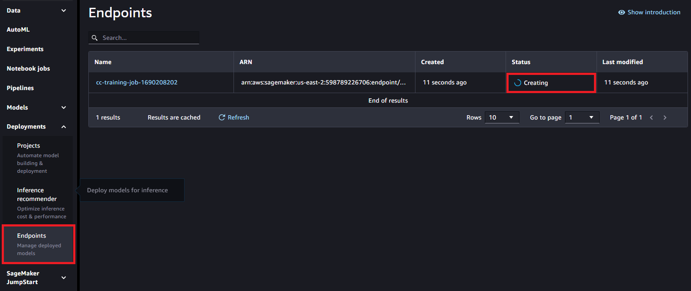

Once the endpoint is created, the status changes to `InService`. Note that creating an endpoint may take about 5-10 minutes. 

You may also need to press `Refresh` to get the updated status:

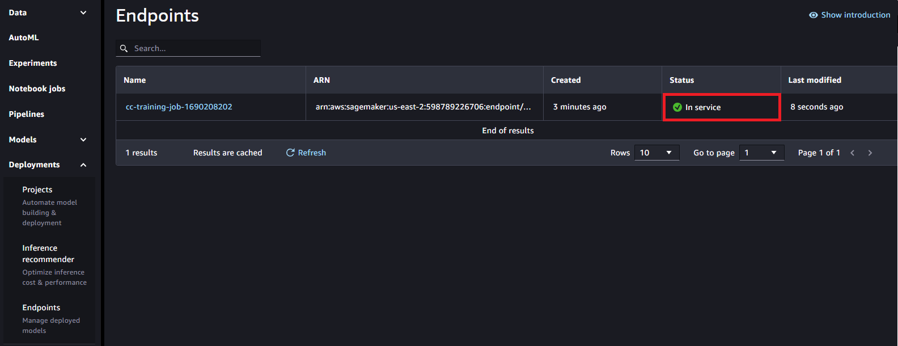

In the `JupyterLab Notebook`, insert the following code to take a sample of the test dataset. This code takes the first 10 rows:

```python
!head -10 test_data.csv > test_sample.csv
```

Then, run the following code to send some inference requests to this endpoint. If you specified a different endpoint name, you will need to replace the following endpoint with your endpoint name:

```python
from sagemaker import RealTimePredictor
from sagemaker.predictor import csv_serializer

predictor = RealTimePredictor(endpoint=endpoint_name, content_type = 'text/csv')

with open('test_sample.csv', 'r') as f:
    for row in f:
        payload = row.rstrip('\n')
        response = predictor.predict(data=payload[2:])
        sleep(0.5)
print('done!')
```

Verify that Model Monitor is correctly capturing the incoming data with the following code.In the code, the `current_endpoint_capture_prefix` captures the directory path where your Model Monitor outputs are stored. Navigate to your Amazon S3 bucket, to check if the prediction requests are being captured. Note that this location should match the `s3_capture_upload_path` in the previous code: 

```python
# Extract the captured json files.
data_capture_prefix = '{}/monitoring'.format(prefix)
s3_client = boto3.Session().client('s3')
current_endpoint_capture_prefix = '{}/datacapture/{}/AllTraffic'.format(data_capture_prefix, endpoint_name)
print(current_endpoint_capture_prefix)
result = s3_client.list_objects(Bucket=rawbucket, Prefix=current_endpoint_capture_prefix)
capture_files = [capture_file.get("Key") for capture_file in result.get('Contents')]
print("Found Capture Files:")
print("\n ".join(capture_files))

capture_files[0]
```

The captured output indicates that data capture is configured and is saving the incoming requests. If you initially receive a Null response, the data may not have been synchronously loaded onto the Amazon S3 path when you first initialized the data capture. Wait about a minute and try again:

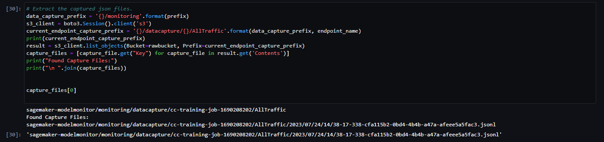

Run the following code to extract the content of one of the `json` files and view the captured outputs: 

```python
# View contents of the captured file.
def get_obj_body(bucket, obj_key):
    return s3_client.get_object(Bucket=rawbucket, Key=obj_key).get('Body').read().decode("utf-8")

capture_file = get_obj_body(rawbucket, capture_files[0])
print(json.dumps(json.loads(capture_file.split('\n')[5]), indent = 2, sort_keys =True))
```

The output indicates that data capture is capturing both the input payload and the output of the model.  

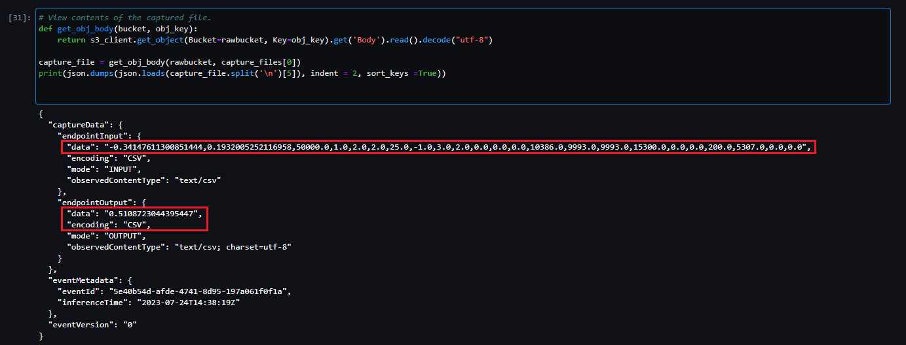

You’ve now successfully deployed the model as an endpoint and set up data capture. You’re ready to start monitoring the endpoint in the next step. 


## Monitoring the endpoint with SageMaker Model Monitor

In this step, you will enable SageMaker Model Monitor to monitor the deployed endpoint for data drift. To do so, you will compare the payload and outputs sent to the model against a baseline and determine whether there is any drift in the input data, or the label.  

For more information, read [Amazon SageMaker Model Monitor](https://docs.aws.amazon.com/sagemaker/latest/dg/model-monitor.html) in the Amazon SageMaker documentation.

Begin by running the following code to create a folder in your Amazon S3 bucket to store the outputs of the Model Monitor. This code creates two folders: one folder that stores the baseline data you used for training your model; and the second folder stores any violations from that baseline:

```python
model_prefix = prefix + "/" + endpoint_name
baseline_prefix = model_prefix + '/baselining'
baseline_data_prefix = baseline_prefix + '/data'
baseline_results_prefix = baseline_prefix + '/results'

baseline_data_uri = 's3://{}/{}'.format(rawbucket,baseline_data_prefix)
baseline_results_uri = 's3://{}/{}'.format(rawbucket, baseline_results_prefix)
train_data_header_location = "s3://" + rawbucket + '/' + prefix + '/train_headers'
print('Baseline data uri: {}'.format(baseline_data_uri))
print('Baseline results uri: {}'.format(baseline_results_uri))
print(train_data_header_location)
```

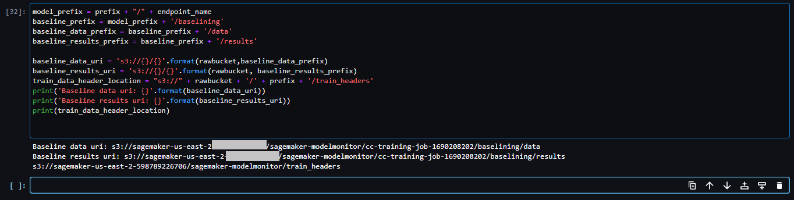

To set up a baseline job for Model Monitor to capture the statistics of the training data, run the following code. To do this, Model Monitor uses the [`deequ`](https://github.com/awslabs/deequ) library built on top of Apache Spark for conducting unit tests on data:  

```python
from sagemaker.model_monitor import DefaultModelMonitor
from sagemaker.model_monitor.dataset_format import DatasetFormat

my_default_monitor = DefaultModelMonitor(
    role=role,
    instance_count=1,
    instance_type='ml.m5.xlarge',
    volume_size_in_gb=20,
    max_runtime_in_seconds=3600)

my_default_monitor.suggest_baseline(
    baseline_dataset=os.path.join(train_data_header_location, 'train_data_with_headers.csv'),
    dataset_format=DatasetFormat.csv(header=True),
    output_s3_uri=baseline_results_uri,
    wait=True
)
```

Model Monitor sets up a separate instance, copies over the training data, and generates some statistics. The service generates a lot of Apache Spark logs, which you can ignore. Once the job is completed, you will receive a `Spark job completed` in the output:

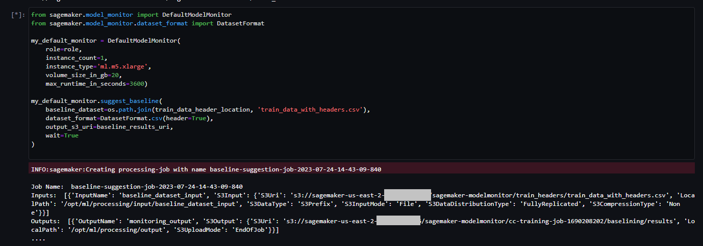

To review the outputs generated by the baseline job, run the following:

```python
s3_client = boto3.Session().client('s3')
result = s3_client.list_objects(Bucket=rawbucket, Prefix=baseline_results_prefix)
report_files = [report_file.get("Key") for report_file in result.get('Contents')]
print("Found Files:")
print("\n ".join(report_files))

baseline_job = my_default_monitor.latest_baselining_job
schema_df = pd.io.json.json_normalize(baseline_job.baseline_statistics().body_dict["features"])
schema_df
```

There will be two files listed: : `constraints.json` and `statistics.json`. Next, dive deeper into their contents:


This code converts the `json` output in `/statistics.json` into a pandas dataframe. Note how the `deequ` library infers the data type of the column, the presence or absence of `Null` or missing values, and statistical parameters such as the `mean`, `min`, `max`, `sum`, `standard deviation`, and `sketch parameters` for an input data stream:

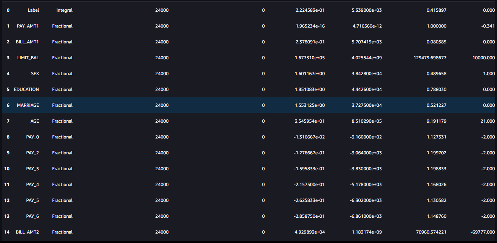

Likewise, the `constraints.json` file consists of a number of constraints the training dataset obeys such as non-negativity of values, and the data type of the feature field:

```python
constraints_df = pd.io.json.json_normalize(baseline_job.suggested_constraints().body_dict["features"])
constraints_df
```

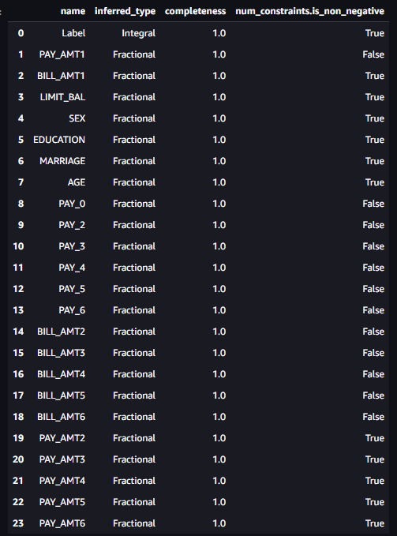

To set up the frequency for endpoint monitoring, add the following code. You can specify daily or hourly. This code specifies an hourly frequency, but you may want to change this for production applications as hourly frequency will generate a lot of data. Model Monitor will produce a report consisting of all the violations it finds:

```python
reports_prefix = '{}/reports'.format(prefix)
s3_report_path = 's3://{}/{}'.format(rawbucket,reports_prefix)
print(s3_report_path)


from sagemaker.model_monitor import CronExpressionGenerator
from time import gmtime, strftime

mon_schedule_name = 'Built-train-deploy-model-monitor-schedule-' + strftime("%Y-%m-%d-%H-%M-%S", gmtime())
my_default_monitor.create_monitoring_schedule(
    monitor_schedule_name=mon_schedule_name,
    endpoint_input=predictor.endpoint,
    output_s3_uri=s3_report_path,
    statistics=my_default_monitor.baseline_statistics(),
    constraints=my_default_monitor.suggested_constraints(),
    schedule_cron_expression=CronExpressionGenerator.hourly(),
    enable_cloudwatch_metrics=True,
)
```

Note that this code enables Amazon CloudWatch Metrics, which instructs Model Monitor to send outputs to CloudWatch. You can use this approach to trigger alarms using CloudWatch Alarms to let engineers or admins know when data drift has been detected:


Now that you’ve successfully  monitored your endpoint with SageMaker Model Monitory, now you will test its performance. 


## Testing SageMaker Model Monitor performance

In this step, you will evaluate Model Monitor’s performance against some sample data. Instead of sending the test payload as is, you modify the distribution of several features in the test payload to test that Model Monitor can detect the change.

For more information, read [Amazon SageMaker Model Monitor](https://docs.aws.amazon.com/sagemaker/latest/dg/model-monitor.html) in the Amazon SageMaker documentation.

First,  import the test data and generate some modified sample data with the following code:

```python
COLS = data.columns
test_full = pd.read_csv('test_data.csv', names = ['Label'] +['PAY_AMT1','BILL_AMT1'] + list(COLS[1:])[:11] + list(COLS[1:])[12:17] + list(COLS[1:])[18:]
)
test_full.head()
```

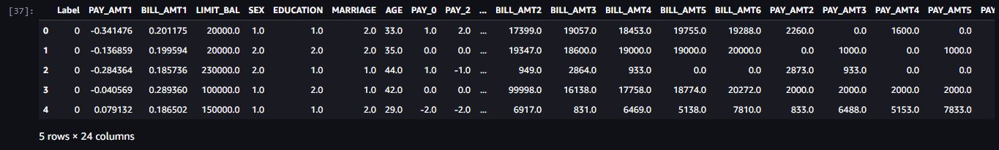

Run the following code to change a few columns. Note the differences marked in red in the image from the previous step. Drop the label column and save the modified sample test data:

```python
faketestdata = test_full
faketestdata['EDUCATION'] = -faketestdata['EDUCATION'].astype(float)
faketestdata['BILL_AMT2']= (faketestdata['BILL_AMT2']//10).astype(float)
faketestdata['AGE']= (faketestdata['AGE']-10).astype(float)

faketestdata.head()
faketestdata.drop(columns=['Label']).to_csv('test-data-input-cols.csv', index = None, header=None)
```

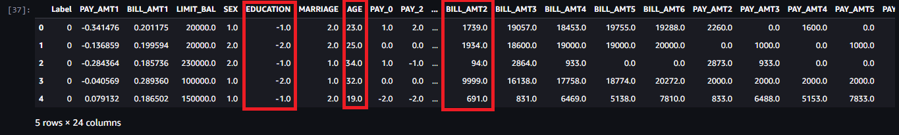

To repeatedly invoke the endpoint with this modified dataset, run:

```python
from threading import Thread

runtime_client = boto3.client('runtime.sagemaker')

# (just repeating code from above for convenience/ able to run this section independently)
def invoke_endpoint(ep_name, file_name, runtime_client):
    with open(file_name, 'r') as f:
        for row in f:
            payload = row.rstrip('\n')
            response = runtime_client.invoke_endpoint(EndpointName=ep_name,
                                          ContentType='text/csv', 
                                          Body=payload)
            time.sleep(1)
            
def invoke_endpoint_forever():
    while True:
        invoke_endpoint(endpoint, 'test-data-input-cols.csv', runtime_client)
        
thread = Thread(target = invoke_endpoint_forever)
thread.start()
# Note that you need to stop the kernel to stop the invocations
```

Now check the status of the Model Monitor job by running:

```python
desc_schedule_result = my_default_monitor.describe_schedule()
print('Schedule status: {}'.format(desc_schedule_result['MonitoringScheduleStatus']))
```

You should receive an output of `Schedule status: Scheduled`.

Run the following code to check every 10 minutes. If any monitoring outputs have been generated. Note that the first job may run with a buffer of about 20 minutes: 

```python
mon_executions = my_default_monitor.list_executions()
print("We created ahourly schedule above and it will kick off executions ON the hour (plus 0 - 20 min buffer.\nWe will have to wait till we hit the hour...")

while len(mon_executions) == 0:
    print("Waiting for the 1st execution to happen...")
    time.sleep(600)
    mon_executions = my_default_monitor.list_executions()
```

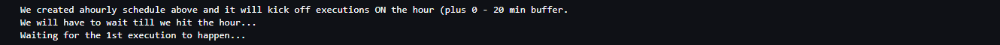

In the left toolbar of `Amazon SageMaker Studio`, choose `Endpoints`. Pressthe `cc-training-job-xxxxx`:

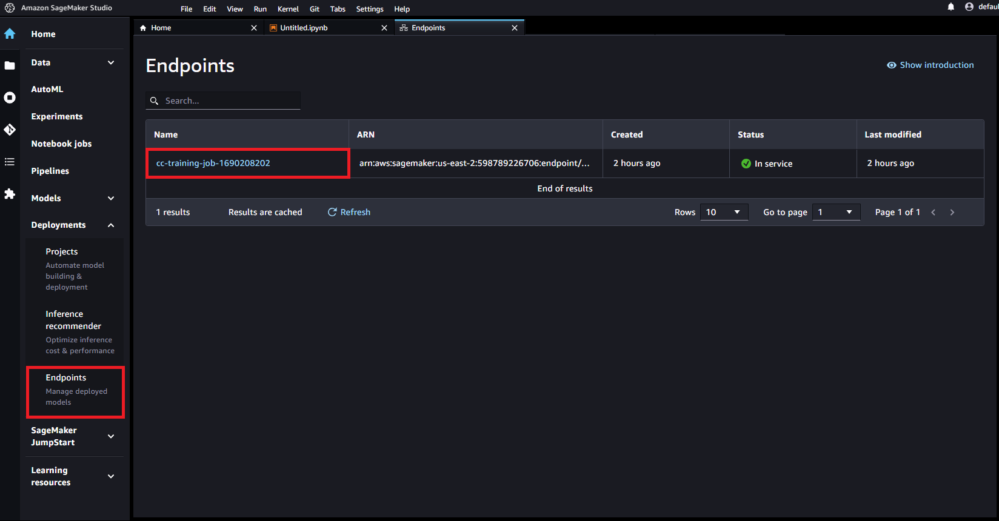

Choose `Monitoring job history`. Notice that the `Monitoring status` shows `In progress`:

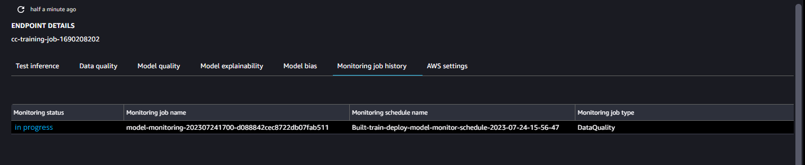

Once the job is complete, the `Monitoring status` displays `Issue found`, if any issues were found:  

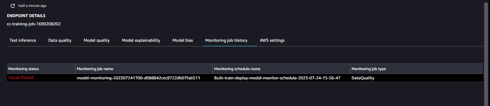

Double-click the issue to view details. You will learn that Model Monitor detected large baseline drifts in the `EDUCATION` and `BILL_AMT2` fields that you previously modified.

Model Monitor also detected some differences in data types in two other fields. The training data consists of integer labels, but the XGBoost model predicts a probability score. Therefore, Model Monitor reported a mismatch:  

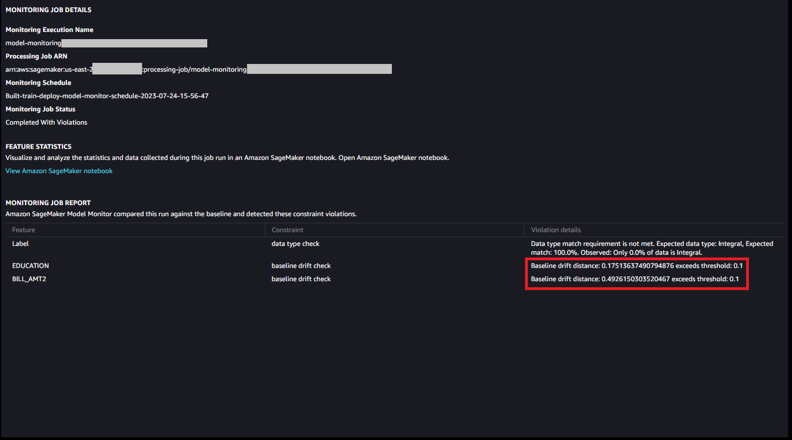

In your `JupyterLab Notebook`, run the following code to receive the output from Model Monitor:

```python
latest_execution = mon_executions[-1] # latest execution's index is -1, second to last is -2 and so on..
time.sleep(60)
latest_execution.wait(logs=False)

print("Latest execution status: {}".format(latest_execution.describe()['ProcessingJobStatus']))
print("Latest execution result: {}".format(latest_execution.describe()['ExitMessage']))

latest_job = latest_execution.describe()
if (latest_job['ProcessingJobStatus'] != 'Completed'):
        print("====STOP==== \n No completed executions to inspect further. Please wait till an execution completes or investigate previously reported failures.")
```

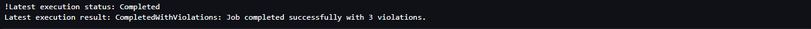

To view the reports generated by Model Monitor, run the following:

```python
report_uri=latest_execution.output.destination
print('Report Uri: {}'.format(report_uri))
from urllib.parse import urlparse
s3uri = urlparse(report_uri)
report_bucket = s3uri.netloc
report_key = s3uri.path.lstrip('/')
print('Report bucket: {}'.format(report_bucket))
print('Report key: {}'.format(report_key))

s3_client = boto3.Session().client('s3')
result = s3_client.list_objects(Bucket=rawbucket, Prefix=report_key)
report_files = [report_file.get("Key") for report_file in result.get('Contents')]
print("Found Report Files:")
print("\n ".join(report_files))
```

You will notice that in addition to `statistics.json` and `constraints.json`, there is a new file generated named `constraint_violations.json`. The contents of this file were displayed previously in Amazon SageMaker Studio:

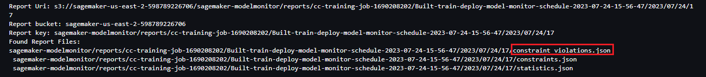

Once you set up data capture, Amazon SageMaker Studio automatically creates a notebook for you that contains the previous code to run monitoring jobs. To access the notebook, press the endpoint, monitoring job details, and then choose `View Amazon SageMaker Notebook`. After, follow the steps for Enable Monitoring.

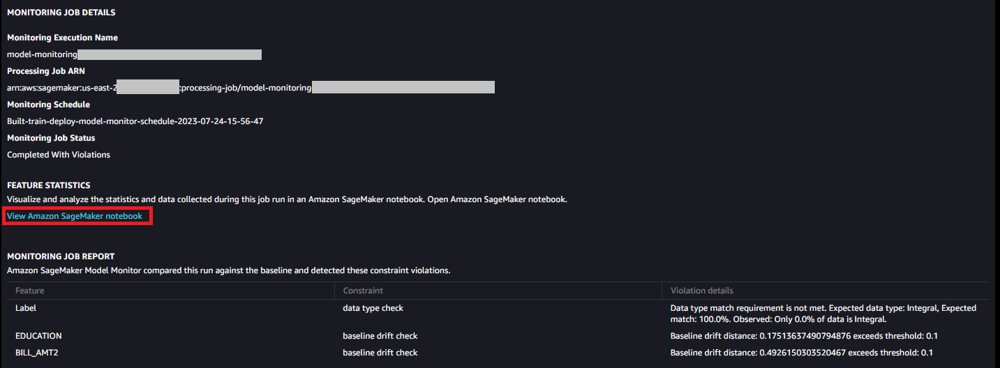

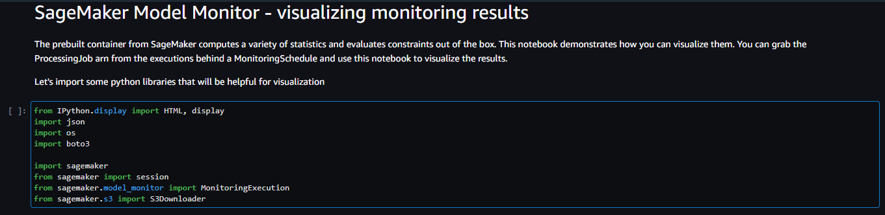

Now that you’ve successfully tested your SageMaker Model Monitor’s performance, next you will clean up your resources. 


## Cleaning up resources

In this step, you will terminate the resources you used in this lab.

It’s important to note that terminating resources that are not actively being used reduces costs and is a best practice. Not terminating your resources will result in charges to your account.

First, `Delete monitoring schedules` in your Jupyter notebook, insert the following code and choose `Run`. Note that you cannot delete the Model Monitor endpoint until all of the monitoring jobs associated with the endpoint are deleted:

```python
my_default_monitor.delete_monitoring_schedule()
time.sleep(10) # actually wait for the deletion
```

Next, `Delete your endpoint` in your Jupyter notebook, insert the following code and choose `Run`. Make sure you have first deleted all monitoring jobs associated with the endpoint:

```python
sm.delete_endpoint(EndpointName = endpoint_name)
```

If you want to clean up all training artifacts such as models, pre-processed data sets, etc., insert the following code into your code cell and choose `Run`. Be sure to replace `ACCOUNT_NUMBER` with your account number:

```python
%%sh
aws s3 rm --recursive s3://sagemaker-us-east-2-ACCOUNT_NUMBER/sagemaker-modelmonitor/data
```

You’ve now successfully cleaned up and terminated all of your resources. 


## Conclusion

Congratulations! You created, trained, deployed, and monitored a machine learning model with Amazon SageMaker Studio.
