In this post we will take a look at how to build a multi-region serverless IoT system. We will dig deep into concepts how to replicate certificates across regions, and how to setup a DNS record for device connection. All in an event-driven and serverless way.

## Why creating a multi-region setup ?

There are many reasons why we create multi-region systems on AWS. It can be compliance requirements, resiliency, or latency requirements. In an IoT system, we often have small devices with limit bandwidth which makes latency requirements even more important. With a large system with a global footprint a multi-region solution help us solve that challenge. However, building a multi-region IoT system comes with challenges of its own.

In an multi-region IoT system we don't want our IoT devices to be aware of what or how many AWS Regions we are running in. This should be totally transparent to the device, it should only connect to iot.example.com. For this to work we must register our IoT Things, Policies, and certificates in all regions. We must therefor be able to replicate all of this information across all Regions, despite what Region the device connect to.

We will look at the steps needed to perform this replication in a efficient way. What services to use, and what the setup looks like.

## Architectural overview

What we are building in this post is an architecture that will span two AWS Regions, devices connect to the closest region using Route53. AWS StepFunctions state-machine will act on incoming events from IoT Core and carry out the needed work. So now let's get started and let's get building.

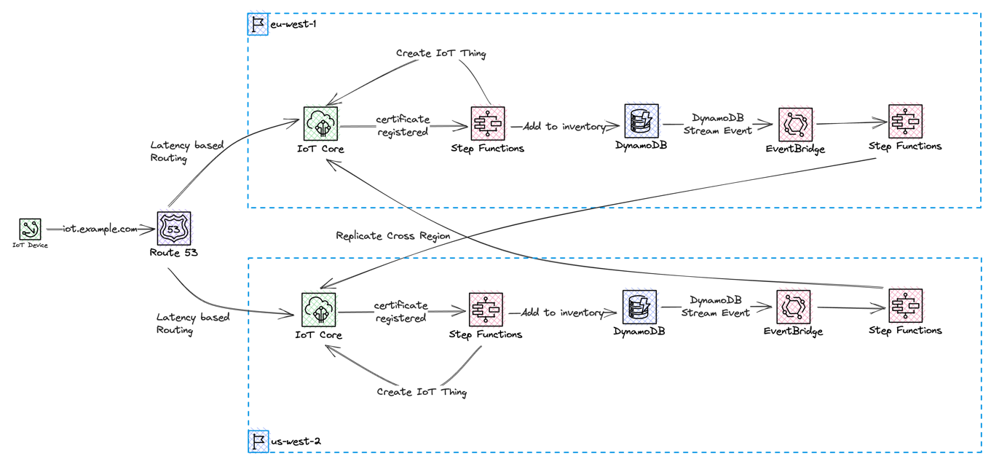

We will use an [configurable endpoint](https://docs.aws.amazon.com/iot/latest/developerguide/iot-custom-endpoints-configurable.html) with an custom domain, iot.example.com. This will be configured in two regions and we'll use a latency based record to let devices connect to the Region closest to them. When a device connect for the very first time, the device certificate will be registered in IoT Core, using Just In Time Registration. If a device certificate is successfully registered and activated it will be stored in an Device registry, which is a Global DynamoDB table. By utilizing DynamoDB Streams the replication, of the device certificate, can be done in an event-driven way, utilizing EventBridge Pipes and a custom event-bus. Devices will use certificates issued by a self-signed Root CA. When we authenticate our devices towards AWS IoT Core we will be using Mutual TLS.

Data from the IoT devices will be stored in a Global DynamoDB table, to allow access from both regions. Through out this blog post we will be using us-west-2 (Oregon) and eu-west-1 (Ireland) region when we build and create resources.

Let’s start off with creating the DynamoDB tables we need.

## Creating device registry and data table

We will create two global DynamoDB tables, these will only be deployed to a single Region but configured with a replica in a second Region. We need a way to keep track of the devices that have already been registered, despite which Region it was initially registered in. For this we will create a Device Inventory table. For testing purposes we will also create a global DynamoDB table where we can store data coming from the devices.

These resources we deploy using AWS CloudFormation / [Serverless Application Model (SAM)](https://aws.amazon.com/serverless/sam/)

```yaml
AWSTemplateFormatVersion: "2010-09-09"
Transform: AWS::Serverless-2016-10-31
Description: multi-region IoT Global Infrastructure

Parameters:
  Application:
    Type: String
    Description: Name of the application
    Default: multi-region-iot
  PrimaryRegion:
    Type: String
    Description: The primary region name
    Default: eu-west-1
  SecondaryRegion:
    Type: String
    Description: The secondary region name
    Default: us-west-2

Resources:
  ##########################################################################
  #  DynamoDB Data Tables
  ##########################################################################
  DeviceInventoryTable:
    Type: AWS::DynamoDB::GlobalTable
    Properties:
      TableName: !Sub ${Application}-device-inventory
      BillingMode: PAY_PER_REQUEST
      Replicas:
        - Region: !Ref PrimaryRegion
        - Region: !Ref SecondaryRegion
      StreamSpecification:
        StreamViewType: NEW_IMAGE
      AttributeDefinitions:
        - AttributeName: ThingName
          AttributeType: S
      KeySchema:
        - AttributeName: ThingName
          KeyType: HASH

  IoTDataTable:
    Type: AWS::DynamoDB::GlobalTable
    Properties:
      TableName: !Sub ${Application}-data
      BillingMode: PAY_PER_REQUEST
      Replicas:
        - Region: !Ref PrimaryRegion
        - Region: !Ref SecondaryRegion
      StreamSpecification:
        StreamViewType: NEW_AND_OLD_IMAGES
      AttributeDefinitions:
        - AttributeName: PK
          AttributeType: S
        - AttributeName: SK
          AttributeType: S
      KeySchema:
        - AttributeName: PK
          KeyType: HASH
        - AttributeName: SK
          KeyType: RANGE

##########################################################################
#  Outputs                                                               #
##########################################################################
Outputs:
  DeviceInventoryTable:
    Description: Name of the created Device Inventory Table
    Value: !Ref DeviceInventoryTable
  IoTDataTable:
    Description: Name of the created IoT Data Table
    Value: !Ref IoTDataTable
```

## Creating Certificates

We are going to use a self signed Root CA when issuing server and device certificates. In a production environment you should use Root CA signed by a 3rd party trusted source. Our certificate chain will include a Root CA and an Intermediate CA. It will be the Intermediate CA that will issue both the server and client certificates. Read this to learn more about [SSL/TLS certificates](https://aws.amazon.com/what-is/ssl-certificate/). Read this to learn more about the [process](https://www.golinuxcloud.com/openssl-create-certificate-chain-linux/) we will be using to create the certificates. We will be using [OpenSSL](https://www.openssl.org/) when creating certificates.

First of all we start by creating the folder structure needed, and the files needed to track our certificate creation.

```bash
mkdir -p ./myCA/rootCA/{certs,crl,newcerts,private,csr}
mkdir -p ./myCA/intermediateCA/{certs,crl,newcerts,private,csr}
mkdir -p ./myCA/server/{certs,crl,newcerts,private,csr}
mkdir -p ./myCA/clients/{certs,crl,newcerts,private,csr}

# Needed to keep track of the last serial number that was used to issue a certificate
echo 1000 > ./myCA/rootCA/serial
echo 1000 > ./myCA/intermediateCA/serial

# This is incremented each time a new Certificate Revocation List (CRL) is generated.
echo 0100 > ./myCA/rootCA/crlnumber 
echo 0100 > ./myCA/intermediateCA/crlnumber

# Create index.txt file which is a database of sorts that keeps track of the certificates that have been issued by the CA
touch ./myCA/rootCA/index.txt
touch ./myCA/intermediateCA/index.txt
```

Next we create the private key, and certificate for the Root CA.

```bash
# Root CA:
openssl genrsa -out ./myCA/rootCA/private/ca.key 4096
openssl req -config ./myCA/ca_root.cnf -key ./myCA/rootCA/private/ca.key -new -x509 -days 7300 -sha256 -extensions v3_ca -out ./myCA/rootCA/certs/ca.crt -subj "/C=SE/ST=Scania/L=Malmo/O=MyOrg/OU=/CN=Root CA"
```

With the Root CA created we can use this to create and sign the Intermediate CA and create a certificate bundle with the Root and Intermediate CA.

```bash
# Intermediate CA:
openssl genrsa -out ./myCA/intermediateCA/private/ca_intermediate.key 4096
openssl req -config ./myCA/ca_intermediate.cnf -key ./myCA/intermediateCA/private/ca_intermediate.key -new -sha256 -out ./myCA/intermediateCA/csr/ca_intermediate.csr -subj "/C=SE/ST=Scania/L=Malmo/O=MyOrg/OU=/CN=Intermediate CA"
openssl ca -config ./myCA/ca_root.cnf -extensions v3_intermediate_ca -days 3650 -notext -md sha256 -in ./myCA/intermediateCA/csr/ca_intermediate.csr -out ./myCA/intermediateCA/certs/ca_intermediate.crt

# Create Certificate Bundle / Certificate Chain.
cat ./myCA/intermediateCA/certs/ca_intermediate.crt ./myCA/rootCA/certs/ca.crt > ./myCA/intermediateCA/certs/ca-chain.crt.pem
```

With the Root CA and Intermediate CA created we can continue to create the server certificate and generate a couple of device certificates as well. The process is very similiar to the one when creating the Intermediate CA. When the server certificate is created, it's very important that the CommonName is set to the server FQDN, in our case iot.example.com.

```bash
# Server Certificate
openssl genrsa -out ./myCA/server/private/iot.example.com.key 2048
openssl req -config ./myCA/ca_intermediate.cnf -key ./myCA/server/private/iot.example.com.key -new -sha256 -out ./myCA/server/csr/iot.example.com.csr -subj "/C=SE/ST=Scania/L=Malmo/O=MyOrg/OU=/CN=iot.example.com"
openssl ca -config ./myCA/ca_intermediate.cnf -extensions server_cert -days 375 -notext -md sha256 -in ./myCA/server/csr/iot.example.com.csr -out ./myCA/server/certs/iot.example.com.crt
```

Finally we create a set of different client certificates, here we can create a simple bash script that help us create the certificate, and copy it to clients folder so we can easily access them. For the client certificates we like the common name to match the Thing name we'll use in IoT Core later.

```bash
#!/bin/bash

NAME=$1

if [ -z "$NAME" ]
then
      echo "You must enter a device name!"
      exit 1
fi

openssl genrsa -out ./myCA/clients/private/$NAME.key 2048
openssl req -config ./myCA/ca_intermediate.cnf -key ./myCA/clients/private/$NAME.key -new -sha256 -out ./myCA/clients/csr/$NAME.csr -subj "/C=SE/ST=Scania/L=Malmo/O=MyOrg/OU=/CN=$NAME"
openssl ca -config ./myCA/ca_intermediate.cnf -extensions usr_cert -days 365 -notext -md sha256 -in ./myCA/clients/csr/$NAME.csr -out ./myCA/clients/certs/$NAME.crt

# For easy access copy the key and cert to a clients folder.
cp ./myCA/clients/certs/$NAME.crt ./clients
cp ./myCA/clients/private/$NAME.key ./clients
```

The configuration files used is the standard [OpenSSL configuration file](https://github.com/openssl/openssl/blob/master/apps/openssl.cnf) with the absolute path to the keys set.

With all the certificates created, we can continue with everything and setup the IoT Core endpoints. 

## Creating configurable endpoint

The first thing we need to do is import the server certificate to AWS Certificate Manager (ACM). We need three things, the server certificate, the server private key, and the certificate chain we also created earlier.

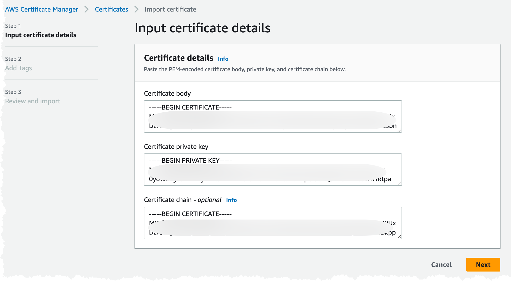

The import can also be done using the [AWS CLI](https://aws.amazon.com/cli/).

```bash
aws acm import-certificate --certificate fileb://myCA/server/certs/iot.example.com.crt \
      --certificate-chain fileb://myCA/intermediateCA/certs/ca-chain.cert.pem \
      --private-key fileb://myCA/server/private/iot.example.com.key
```

```text
Note!
The server certificate must be imported in both regions for the setup to work properly.
```

The next step in the process is process is to create the domain configuration and a latency based Route53 record. To prove that we are the rightful owners of the domain name we also need to create a validation certificate in ACM. To create all of this we can turn to AWS CloudFormation and SAM. It's assumed that a Hosted Zone for the domain exists in Route53.

We need the IoT Core Endpoint, so we can point the Route53 record to it. There is only one Iot Core endpoint per account and Region. The endpoint can be found under the Setting in the IoT Core console.

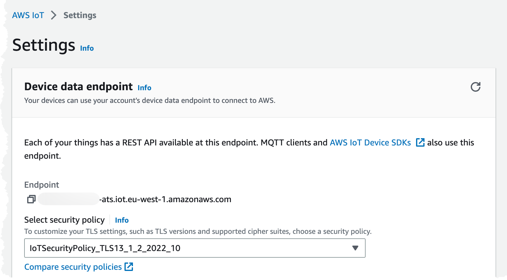

It's also possible to get the endpoint using the `CLI`, we need to get the Data ATS endpoint.

```bash
aws iot describe-endpoint --endpoint-type iot:Data-ATS
```

We will be using the same template through out this blog post and just continue to add resources to it.

```yaml
AWSTemplateFormatVersion: 2010-09-09
Transform: AWS::Serverless-2016-10-31
Description: multi-region IoT Regional Infrastructure

Parameters:
  Application:
    Type: String
    Description: Name of the application
    Default: multi-region-iot
  IoTCoreEndpoint:
    Type: String
    Description: Connection Endpoint for IoT Core
  ServerCertificateArn:
    Type: String
    Description: ARN for the server certificate in ACM
  HostedZoneId:
    Type: String
    Description: The ID of the hosted zone
  DNSName:
    Type: String
    Description: The Name of the DNS record
  DeviceInventoryTable:
    Type: String
    Description: The Name of the DeviceInventoryTable
  DeviceInventoryTableStreamArn:
    Type: String
    Description: The Name ARN to the DeviceInventoryTable DynamoDB Stream
  DataTable:
    Type: String
    Description: The DynemoDB Table to Store data in

Resources:

  ValidationCertificate:
    Type: AWS::CertificateManager::Certificate
    Properties:
      DomainName: !Ref DNSName
      DomainValidationOptions:
        - DomainName: !Ref DNSName
          HostedZoneId: !Ref HostedZoneId
      ValidationMethod: DNS

  IoTCoreDomainConfiguration:
    Type: AWS::IoT::DomainConfiguration
    Properties:
      DomainConfigurationName: !Sub ${Application}-primary
      DomainConfigurationStatus: ENABLED
      DomainName: !Ref DNSName
      ServerCertificateArns:
        - !Ref ServerCertificateArn
      ServiceType: DATA
      TlsConfig:
        SecurityPolicy: IotSecurityPolicy_TLS13_1_2_2022_10
      ValidationCertificateArn: !Ref ValidationCertificate

  LatencyBasedRecord:
    Type: AWS::Route53::RecordSet
    Properties:
      ResourceRecords:
        - !Ref IoTCoreEndpoint
      SetIdentifier: !Ref AWS::Region
      HostedZoneId: !Ref HostedZoneId
      Name: !Ref DNSName
      TTL: 60
      Region: !Ref AWS::Region
      Type: CNAME

```

To validate the IoT domain configuration we can navigate to IoT Core console and check the configuration under settings. Validate that the domain configuration looks like the images below.

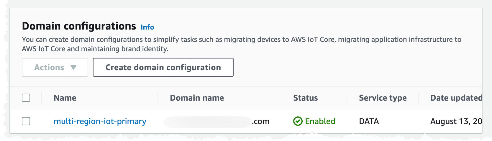

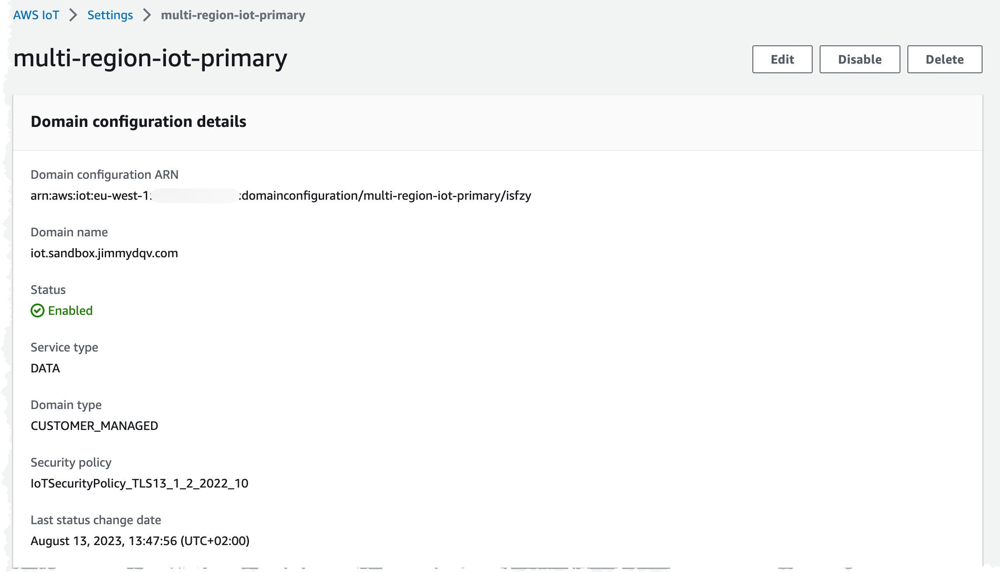

With the endpoint configured we can move to the next step, activating just in time registration.

## Activate Just In Time Registration

The first time a device connects to IoT Core with a certificated signed by our Intermediate CA, the certificate from the device will be registered in IoT Core. This way we can manufacture our devices, bundle them with certificates but not have them registered in IoT Core. The device will receive an immediate disconnect and then need to reconnect. There need to be some form of wait logic in the device, to allow for the cloud to activate the device in IoT Core, before reconnecting. We can add our own validation in this activation step, making sure the device is who it claim to be.

We need to run these steps in both regions, the reason for that is that our devices will connect using the configured DNS `iot.example.com` and will connect to the closest Region.

1. Register our CA certificate in IoT core and turn on auto-registration.
2. Create a IoT Core Rule that will invoke an AWS StepFunction to carry out our activation logic.
3. Replicate our device to the second Region. This step will use an event-driven architecture and react when our device is registered in the primary Region.

To register the CA certificate, we use the `CLI` to do so. We'll register the certificate in `SNI_ONLY` mode. This way the same CA can be registered in several accounts and regions.

```bash
## Register in eu-west-1
aws iot register-ca-certificate --allow-auto-registration  --ca-certificate file://myCA/intermediateCA/certs/ca_intermediate.crt --certificate-mode SNI_ONLY --set-as-active --region eu-west-1

## Register in us-west-2
aws iot register-ca-certificate --allow-auto-registration  --ca-certificate file://myCA/intermediateCA/certs/ca_intermediate.crt --certificate-mode SNI_ONLY --set-as-active --region us-west-2
```

It is also possible to do the registration using the console. Navigate to the IoT Console and select security. When using the console the `SNI_ONLY` mode is called `Multi-account`, this is the same as `SNI_ONLY`, the graphical interface just calls it something different. Upload the `ca_intermediate.crt` file, that we created in the steps when creating certificates.

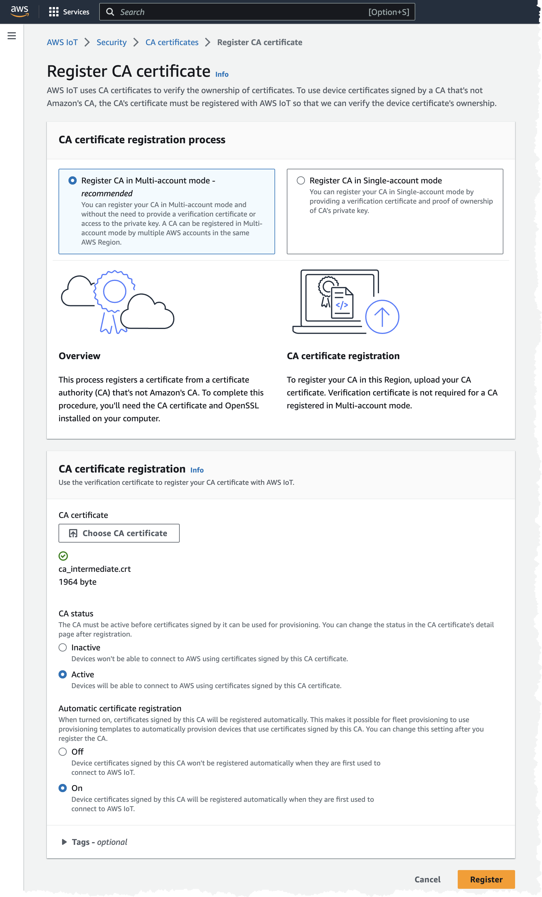

As usual, we can also do this using the `CLI`


To be able to invoke an AWS StepFunction when a certificate is registered we must enable [IoT Core Events](https://docs.aws.amazon.com/iot/latest/developerguide/iot-events.html). These events will be posted onto a reserved AWS topic, `$aws/events/xyz` that we then can create a rule for. The events for registered certificates can ONLY be enabled using the `CLI` this option is not available in the console. To enable the events we need we run the commands.

```bash
## Enable in eu-west-1
aws iot update-event-configurations --event-configurations '{"THING":{"Enabled":true},"CERTIFICATE":{"Enabled":true},"CA_CERTIFICATE":{"Enabled":true},"POLICY":{"Enabled":true}}' --region eu-west-1
## Verify
aws iot describe-event-configurations --region eu-west-1

## Enable in us-west-2
aws iot update-event-configurations --event-configurations '{"THING":{"Enabled":true},"CERTIFICATE":{"Enabled":true},"CA_CERTIFICATE":{"Enabled":true},"POLICY":{"Enabled":true}}' --region us-west-2
## Verify
aws iot describe-event-configurations --region us-west-2
```

Once again, we turn to our CloudFormation / SAM template and add some additional resources. To start with we'll create the IoT Policy that we attach to our devices, the IoT Core Rule, and the StepFunction that implements our logic.

```yaml

  JustInTimeRegistrationIoTRule:
    Type: AWS::IoT::TopicRule
    Properties:
      TopicRulePayload:
        AwsIotSqlVersion: 2016-03-23
        RuleDisabled: false
        Sql: SELECT * FROM '$aws/events/certificates/registered/#'
        Actions:
          - StepFunctions:
              RoleArn: !GetAtt JustInTimeRegistrationIoTRuleRole.Arn
              StateMachineName: !GetAtt JustInTimeRegistrationStateMachineStandard.Name

  JustInTimeRegistrationIoTRuleRole:
    Type: AWS::IAM::Role
    Properties:
      AssumeRolePolicyDocument:
        Version: 2012-10-17
        Statement:
          - Effect: Allow
            Principal:
              Service: iot.amazonaws.com
            Action:
              - sts:AssumeRole
      Policies:
        - PolicyName: InvokeStateMachine
          PolicyDocument:
            Version: 2012-10-17
            Statement:
              Action:
                - states:StartExecution
              Effect: Allow
              Resource:
                - !Ref JustInTimeRegistrationStateMachineStandard

  ReadCertificateFunction:
    Type: AWS::Serverless::Function
    Properties:
      CodeUri: JITRStateMachine/lambda/ReadCertificateData
      Handler: data.handler

  JustInTimeRegistrationStateMachineStandard:
    Type: AWS::Serverless::StateMachine
    Properties:
      DefinitionUri: JITRStateMachine/jitr.asl.yaml
      Tracing:
        Enabled: true
      DefinitionSubstitutions:
        InventoryTable: !Ref DeviceInventoryTable
        IoTPolicyName: !Ref IoTDeviceStandardPolicy
        ReadCertificateFunctionArn: !GetAtt ReadCertificateFunction.Arn
      Policies:
        - Statement:
            - Effect: Allow
              Action:
                - logs:*
              Resource: "*"
        - Statement:
            - Effect: Allow
              Action:
                - iot:*
              Resource: "*"
        - LambdaInvokePolicy:
            FunctionName: !Ref ReadCertificateFunction
        - DynamoDBCrudPolicy:
            TableName: !Ref DeviceInventoryTable

  IoTDeviceStandardPolicy:
    Type: AWS::IoT::Policy
    Properties:
      PolicyDocument:
        Version: 2012-10-17
        Statement:
          - Effect: Allow
            Action:
              - iot:Connect
            Resource:
              - arn:aws:iot:*:*:client/${iot:Connection.Thing.ThingName}
          - Effect: Allow
            Action:
              - iot:Publish
            Resource:
              - arn:aws:iot:*:*:topic/i/${iot:Connection.Thing.ThingName}/*
          - Effect: Allow
            Action:
              - iot:Receive
            Resource:
              - arn:aws:iot:*:*:topic/e/${iot:Connection.Thing.ThingName}/*
          - Effect: Allow
            Action:
              - iot:Subscribe
            Resource:
              - arn:aws:iot:*:*:topic/e/${iot:Connection.Thing.ThingName}/*
      PolicyName: Iot-Device-Policy
```

## Deep dive JITR logic

The JITR logic include several steps that need to be coordinated and orchestrated. StepFunctions is an excellent service for this, and we can use the built in error handling to rollback certain steps if we have an failure. We need to fetch information about the registered certificate and read out information from it. We'll check so this is a new device and that it doesn't already exists in our registry of devices. We then create an IoT Thing, attach the registered certificate to that Thing, attach our standard IoT Policy, that we created in pervious part, and then we activate the certificate to allow the device to actually connect to IoT Core. Finally we register the device in our global device registry DynamoDB table.

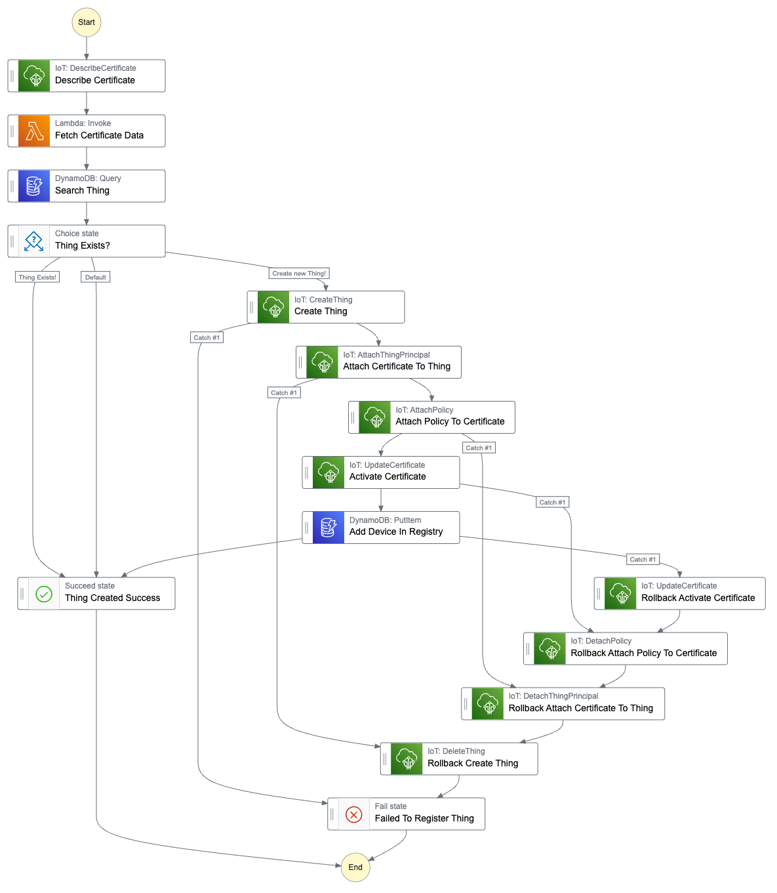

The state-machine definition would be.

```yaml
Comment: JITR StateMachine
StartAt: Describe Certificate
States:
    Describe Certificate:
        Type: Task
        Next: Fetch Certificate Data
        Parameters:
            CertificateId.$: $.certificateId
        Resource: arn:aws:states:::aws-sdk:iot:describeCertificate
        ResultPath: $.CertificateInfo
    Fetch Certificate Data:
        Type: Task
        Resource: ${ReadCertificateFunctionArn}
        ResultPath: $.CertificateData
        Next: Search Thing
    Search Thing:
        Type: Task
        Next: Thing Exists?
        Parameters:
            TableName: ${InventoryTable}
            KeyConditionExpression: ThingName = :pk
            ExpressionAttributeValues:
                ":pk":
                    S.$: $.CertificateData.CommonName
        ResultPath: $.ThingQueryResult
        Resource: arn:aws:states:::aws-sdk:dynamodb:query
    Thing Exists?:
        Type: Choice
        Choices:
            - Variable: $.ThingQueryResult.Count
              NumericGreaterThan: 0
              Comment: Thing Exists!
              Next: Thing Created Success
            - Variable: $.ThingQueryResult.Count
              NumericLessThanEquals: 0
              Comment: Create new Thing!
              Next: Create Thing
        Default: Thing Created Success
    Create Thing:
        Type: Task
        Next: Attach Certificate To Thing
        Parameters:
            ThingName.$: $.CertificateData.CommonName
        Resource: arn:aws:states:::aws-sdk:iot:createThing
        ResultPath: $.Thing
        Retry:
            - ErrorEquals:
                  - States.ALL
              BackoffRate: 2
              IntervalSeconds: 1
              MaxAttempts: 2
              Comment: Retry Create thing
        Catch:
            - ErrorEquals:
                  - States.ALL
              Comment: Failed to Create Thing
              Next: Failed To Register Thing
    Attach Certificate To Thing:
        Type: Task
        Next: Attach Policy To Certificate
        Parameters:
            Principal.$: $.CertificateInfo.CertificateDescription.CertificateArn
            ThingName.$: $.CertificateData.CommonName
        Resource: arn:aws:states:::aws-sdk:iot:attachThingPrincipal
        ResultPath: null
        Retry:
            - ErrorEquals:
                  - States.ALL
              BackoffRate: 2
              IntervalSeconds: 1
              MaxAttempts: 2
              Comment: Retry Attach Certificate
        Catch:
            - ErrorEquals:
                  - States.ALL
              Comment: Failed to Attach Certificate
              Next: Rollback Create Thing
    Rollback Create Thing:
        Type: Task
        Next: Failed To Register Thing
        Parameters:
            ThingName.$: $.CertificateData.CommonName
        Resource: arn:aws:states:::aws-sdk:iot:deleteThing
    Attach Policy To Certificate:
        Type: Task
        Next: Activate Certificate
        Parameters:
            PolicyName: Iot-Device-Policy
            Target.$: $.CertificateInfo.CertificateDescription.CertificateArn
        Resource: arn:aws:states:::aws-sdk:iot:attachPolicy
        ResultPath: null
        Retry:
            - ErrorEquals:
                  - States.ALL
              BackoffRate: 2
              IntervalSeconds: 1
              MaxAttempts: 2
              Comment: Retry Attach Policy
        Catch:
            - ErrorEquals:
                  - States.ALL
              Comment: Failed to Attach Policy
              Next: Rollback Attach Certificate To Thing
    Rollback Attach Certificate To Thing:
        Type: Task
        Next: Rollback Create Thing
        Parameters:
            Principal.$: $.CertificateInfo.CertificateDescription.CertificateArn
            ThingName.$: $.CertificateData.CommonName
        Resource: arn:aws:states:::aws-sdk:iot:detachThingPrincipal
    Activate Certificate:
        Type: Task
        Next: Add Device In Registry
        Parameters:
            CertificateId.$: $.certificateId
            NewStatus: ACTIVE
        Resource: arn:aws:states:::aws-sdk:iot:updateCertificate
        ResultPath: null
        Retry:
            - ErrorEquals:
                  - States.ALL
              BackoffRate: 2
              IntervalSeconds: 1
              MaxAttempts: 2
              Comment: Retry Activate Certificate
        Catch:
            - ErrorEquals:
                  - States.ALL
              Comment: Failed to Activate Certificate
              Next: Rollback Attach Policy To Certificate
    Rollback Attach Policy To Certificate:
        Type: Task
        Next: Rollback Attach Certificate To Thing
        Parameters:
            PolicyName: Iot-Device-Policy
            Target.$: $.CertificateInfo.CertificateDescription.CertificateArn
        Resource: arn:aws:states:::aws-sdk:iot:detachPolicy
    Add Device In Registry:
        Type: Task
        Resource: arn:aws:states:::dynamodb:putItem
        Parameters:
            TableName: ${InventoryTable}
            Item:
                ThingName:
                    S.$: $.Thing.ThingName
                ThingId:
                    S.$: $.Thing.ThingId
                ThingArn:
                    S.$: $.Thing.ThingArn
                CertificateArn:
                    S.$: $.CertificateInfo.CertificateDescription.CertificateArn
                CaCertificateId:
                    S.$: $.CertificateInfo.CertificateDescription.CaCertificateId
                NotAfter:
                    S.$: $.CertificateInfo.CertificateDescription.Validity.NotAfter
        ResultPath: null
        Retry:
            - ErrorEquals:
                  - States.ALL
              BackoffRate: 2
              IntervalSeconds: 1
              MaxAttempts: 2
              Comment: Retry Store thing
        Catch:
            - ErrorEquals:
                  - States.ALL
              Comment: Failed to Store Thing
              Next: Rollback Activate Certificate
        Next: Thing Created Success
    Rollback Activate Certificate:
        Type: Task
        Next: Rollback Attach Policy To Certificate
        Parameters:
            CertificateId.$: $.certificateId
            NewStatus: INACTIVE
        Resource: arn:aws:states:::aws-sdk:iot:updateCertificate
    Thing Created Success:
        Type: Succeed
    Failed To Register Thing:
        Type: Fail
```

All but one of the tasks can be completed using the powerful [service and SDK integration](https://docs.aws.amazon.com/step-functions/latest/dg/connect-to-services.html) that exists in StepFunctions. For the task to read out information from the actual certificate we need to use an AWS Lambda Functions. We need to get the name of the thing, and this should match the common name in the certificate.

```python
# Read the CommonName from the certificate PEM
from cryptography import x509
from cryptography.x509.oid import NameOID


def handler(event, context):
    certificatePEM = event["CertificateInfo"]["CertificateDescription"]["CertificatePem"]

    return {"CommonName": read_certificate_data(certificatePEM)}


def read_certificate_data(certificatePem):
    cert = x509.load_pem_x509_certificate(certificatePem.encode("utf-8"))

    subject = cert.subject
    return subject.get_attributes_for_oid(NameOID.COMMON_NAME)[0].value
```

## Replicate device to the second region

When a device has been registered and activated in one Region, we need to copy all of that information to the second Region. This will include the actual device certificate and we need to create the Thing, attach policy and certificate. We do this so our devices then can connect to any of our Regions, creating a multi-region setup with failover possibilities. This part of the system will be event-driven and invoked when a new device is stored in our device inventory. To accomplish this we will use DynamoDB streams, we will use EventBridge Pipes to publish an event to an EventBridge event-bus when there is a new record in the stream. From the event-bus we can invoke a StepFunction that will carry out the work. This StepFunction state-machine will be running in the destination Region, meaning we need to fetch information cross-region from the source Region.

We add some additional resources to our template and deploy this to both Regions.

```yaml
  ServiceEventBus:
    Type: AWS::Events::EventBus
    Properties:
      Name: !Sub ${Application}-${AWS::Region}-event-bus

  EventBridgePipeRole:
    Type: AWS::IAM::Role
    Properties:
      AssumeRolePolicyDocument:
        Version: 2012-10-17
        Statement:
          - Effect: Allow
            Principal:
              Service:
                - pipes.amazonaws.com
            Action:
              - sts:AssumeRole
      Policies:
        - PolicyName: ReadDynamoDB
          PolicyDocument:
            Version: 2012-10-17
            Statement:
              - Effect: Allow
                Action:
                  - dynamodb:DescribeStream
                  - dynamodb:GetRecords
                  - dynamodb:GetShardIterator
                  - dynamodb:ListStreams
                Resource: !Ref DeviceInventoryTableStreamArn
        - PolicyName: WriteEventBridge
          PolicyDocument:
            Version: 2012-10-17
            Statement:
              - Effect: Allow
                Action:
                  - events:PutEvents
                Resource: !GetAtt ServiceEventBus.Arn

  Pipe:
    Type: AWS::Pipes::Pipe
    Properties:
      Name: !Sub ${Application}-deviceinventory-to-eventbridge
      Description: Pipe to connect DeviceInventoryTable Stream to EventBridge event bus
      RoleArn: !GetAtt EventBridgePipeRole.Arn
      Source: !Ref DeviceInventoryTableStreamArn
      SourceParameters:
        DynamoDBStreamParameters:
          StartingPosition: LATEST
          BatchSize: 1
      Target: !GetAtt ServiceEventBus.Arn
      TargetParameters:
        EventBridgeEventBusParameters:
          DetailType: DeviceTableUpdate
          Source: !Sub ${Application}.devices

  GetCertificatePemFunction:
    Type: AWS::Serverless::Function
    Properties:
      CodeUri: CopyDeviceStateMachine/lambda/GetCertificatePem
      Handler: get-pem.handler
      Policies:
        - Statement:
            - Effect: Allow
              Action:
                - iot:*
              Resource: "*"

  CopyDeviceStateMachineStandard:
    Type: AWS::Serverless::StateMachine
    Properties:
      DefinitionUri: CopyDeviceStateMachine/copy.asl.yaml
      Tracing:
        Enabled: true
      DefinitionSubstitutions:
        InventoryTable: !Ref DeviceInventoryTable
        IoTPolicyName: !Ref IoTDeviceStandardPolicy
        GetCertificatePemFunctionArn: !GetAtt GetCertificatePemFunction.Arn
      Policies:
        - Statement:
            - Effect: Allow
              Action:
                - logs:*
              Resource: "*"
        - Statement:
            - Effect: Allow
              Action:
                - iot:*
              Resource: "*"
        - DynamoDBCrudPolicy:
            TableName: !Ref DeviceInventoryTable
        - LambdaInvokePolicy:
            FunctionName: !Ref GetCertificatePemFunction
      Events:
        Delete:
          Type: EventBridgeRule
          Properties:
            EventBusName: !Ref ServiceEventBus
            InputPath: $.detail
            Pattern:
              source:
                - !Sub ${Application}.devices
              detail-type:
                - DeviceTableUpdate
```

The state-machine is very similar to the one used to register a new device. The main difference is that the device is not written to the device table. We also need to fetch certification data cross-region.

```python
# Read certificate data cross-region
import boto3
import json

from cryptography import x509
from cryptography.x509.oid import NameOID


def handler(event, context):
    certificateId = event["CertificateId"]
    region = event["ThingRegion"]
    certificateData = describe_certificate(certificateId, region)

    certificatePem = certificateData["certificateDescription"]["certificatePem"]
    commonName = read_certificate_data(certificatePem)

    return {"Pem": certificatePem, "CommonName": commonName}


def describe_certificate(certificateId, region):
    client = boto3.client("iot", region_name=region)
    response = client.describe_certificate(certificateId=certificateId)
    return response


def read_certificate_data(certificatePem):
    print(certificatePem)
    cert = x509.load_pem_x509_certificate(certificatePem.encode("utf-8"))

    subject = cert.subject
    return subject.get_attributes_for_oid(NameOID.COMMON_NAME)[0].value
```
TODO: QUESTION TO PROOF READERS. DO YOU FEEL I NEED TO ADD THE state-machine DEFINITION ONE MORE TIME? IT'S BASICALLY THE SAME MINUS THE STORE DEVICE IN DYNAMODBß

With the replication done we are ready to start testing the solution using our two regions.

## Testing

What we will do during testing is setup an IoT Rule that will invoke a StepFunction state-machine, this will store the incoming data in our global data DynamoDB table.
To imitate devices we will use EC2 instances, running in the different regions, add use [Eclipse Mosquitto](https://mosquitto.org/) and [mosquitto_pub](https://mosquitto.org/man/mosquitto_pub-1.html).

First of all let's create the resources we need, we addon to our CloudFormation template.

```yaml
  ##########################################################################
  #  Test Resources
  ##########################################################################
  StoreDataIoTRuleRole:
    Type: AWS::IAM::Role
    Properties:
      AssumeRolePolicyDocument:
        Version: 2012-10-17
        Statement:
          - Effect: Allow
            Principal:
              Service: iot.amazonaws.com
            Action:
              - sts:AssumeRole
      Policies:
        - PolicyName: InvokeStateMachine
          PolicyDocument:
            Version: 2012-10-17
            Statement:
              Action:
                - states:StartExecution
              Effect: Allow
              Resource:
                - !Ref StoreDataStateMachineStandard

  StoreDataStateMachineStandard:
    Type: AWS::Serverless::StateMachine
    Properties:
      DefinitionUri: StoreMessagesStateMachine/store.asl.yaml
      Tracing:
        Enabled: true
      DefinitionSubstitutions:
        DataTable: !Ref DataTable
      Policies:
        - Statement:
            - Effect: Allow
              Action:
                - logs:*
              Resource: "*"
        - DynamoDBCrudPolicy:
            TableName: !Ref DataTable

  CertificateStoreBucket:
    Type: AWS::S3::Bucket
    Properties:
      BucketEncryption:
        ServerSideEncryptionConfiguration:
          - ServerSideEncryptionByDefault:
              SSEAlgorithm: AES256
      BucketName: !Sub ${Application}-certificate-store-${AWS::Region}

  InstanceRole:
    Type: AWS::IAM::Role
    Properties:
      Policies:
        - PolicyName: AccessCertificateStoreBucket
          PolicyDocument:
            Version: 2012-10-17
            Statement:
              - Effect: Allow
                Action: s3:*
                Resource: !Sub arn:aws:s3:::${CertificateStoreBucket}/*
              - Effect: Allow
                Action: s3:*
                Resource: !Sub arn:aws:s3:::${CertificateStoreBucket}
      AssumeRolePolicyDocument:
        Version: 2012-10-17
        Statement:
          - Effect: Allow
            Principal:
              Service:
                - ec2.amazonaws.com
            Action: sts:AssumeRole

  EC2InstanceProfile:
    Type: AWS::IAM::InstanceProfile
    Properties:
      Roles:
        - !Ref InstanceRole
```

```yaml
Comment: Store Incoming IoT Data
StartAt: Refine data
States:
    Refine data:
        Type: Pass
        Parameters:
            Message.$: $.message
            Device.$: $.device
            TS.$: $.ts
            Region.$: States.ArrayGetItem(States.StringSplit($$.StateMachine.Id,':'),3)
        Next: Add Data Item
    Add Data Item:
        Type: Task
        Resource: arn:aws:states:::dynamodb:putItem
        Parameters:
            TableName: ${DataTable}
            Item:
                PK:
                    S.$: $.Device
                SK:
                    S.$: States.Format('{}',$.TS)
                Device:
                    S.$: $.Device
                Region:
                    S.$: $.Region
                Message:
                    S.$: $.Message
        ResultPath: null
        End: true
```

Make sure to upload the Root CA certificate, the intermediate CA certificate, the device certificates and private keys, that you have created, to the `CertificateStoreBucket` bucket in both Regions. Since we use our self signed CA certificate to sign the server certificate we must present this during the connection attempt.

From the EC2 console let's create an Ubuntu 22.04 instance.

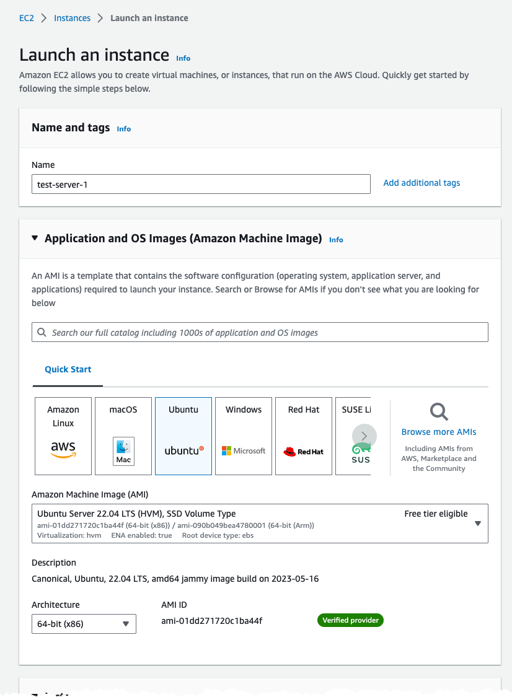

For network setting use the default VPC and allow SSH access from anywhere.

```text
!!IMPORTANT!! 

This is only for testing purposes using an transient EC2 instance! 
It's not recommended to allow SSH from anywhere on a long running instance!!

!!IMPORTANT!!
```

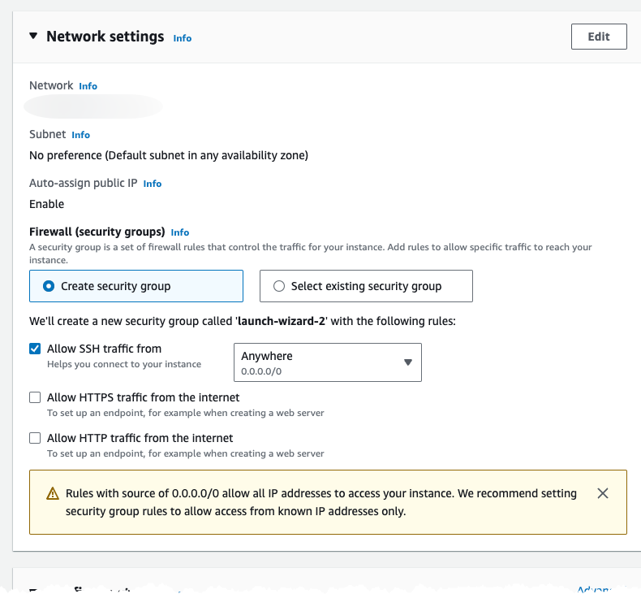

Under advanced settings select the Instance Profile, in the Region, that we created using the CloudFormation template.

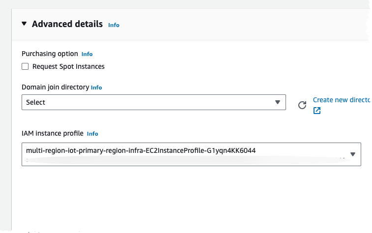

Make sure to create an test instance in both Regions.

We can now connect to the instance using Instance Connect from the console.

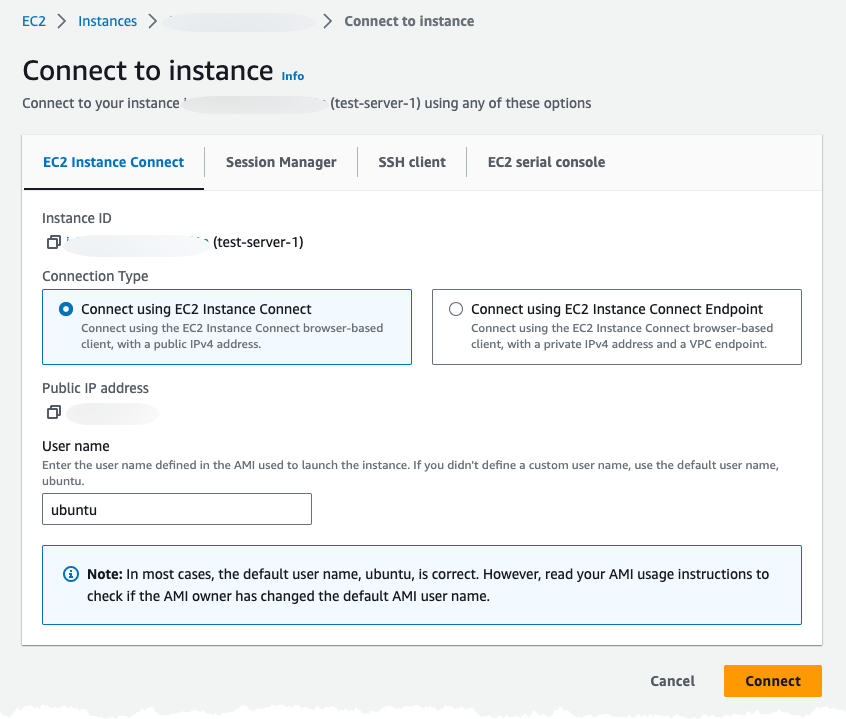

When connected to the instance install AWS CLI, Mosquitto using `snap`, and download the device certificates from the S3 Bucket.

```bash
## Install AWS CLI
sudo apt update
sudo apt install awscli

## Create a test folder and download certificates
mkdir mqtt-test
cd mqtt-test
aws s3 sync s3://multi-region-iot-certificate-store-eu-west-1 .

## Install Mosquitto
sudo snap install mosquitto
sudo snap connect mosquitto:home snapd:home

```

With this installed with can use to connect and try to publish an message. The first time we try to connect the device will receive an immidieate disconnect, this since the device certificate is not registered and active.

```bash
mosquitto_pub -h iot.example.com --cafile ./ca.crt --cert ./test_001.crt --key ./test_001.key -p 8883 -q 1 -d -t i/test_001/m -i test_001 -m "{\"message\": \"Hello From Test-001\"}"

## You will see message saying
Client test_001 sending CONNECT
Error: The connection was lost.
```

Navigating to StepFunctions console in our current (primary) test Region should show at least one invocation of the JITR state-machine with a success.

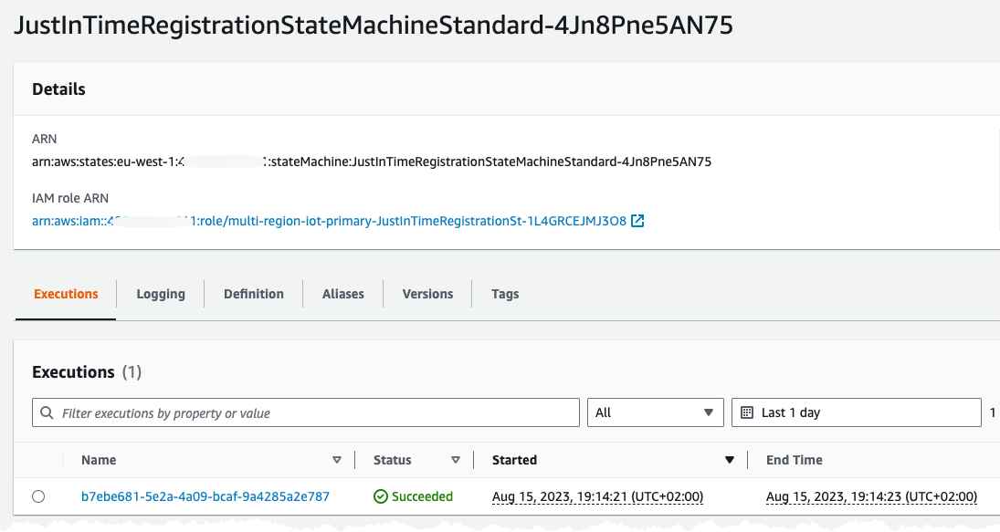

In our other (replication) Region we should see an successful invocation of the replication state-machine.

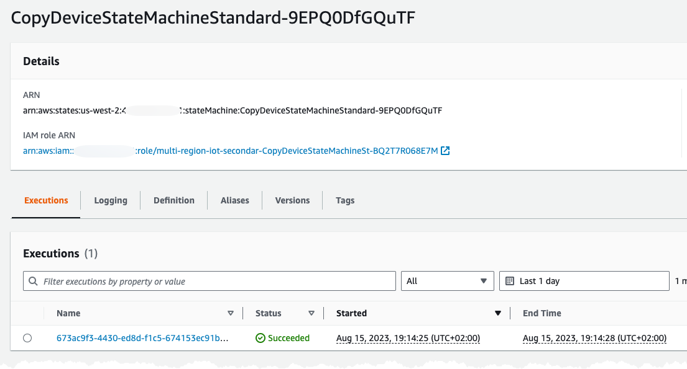

Returning to our instance connect session and issuing the command again will now generate a different result.

```bash
mosquitto_pub -h iot.example.com --cafile ./ca.crt --cert ./test_001.crt --key ./test_001.key -p 8883 -q 1 -d -t i/test_001/m -i test_001 -m "{\"message\": \"Hello From Test-001\"}"

## You will see message saying
Client test_001 sending CONNECT
Client test_001 received CONNACK (0)
Client test_001 sending PUBLISH (d0, q1, r0, m1, 'i/test_001/m', ... (32 bytes))
Client test_001 received PUBACK (Mid: 1, RC:0)
Client test_001 sending DISCONNECT
```

Repeat the above using an EC2 instances in both Regions. You can imitate the same device from both regions. After sending some data we can navigate to the DynamoDB table, containing our IoT data. Verify what Region the data was written to the table from, this is from our test state-machine writing ingress data to the table.

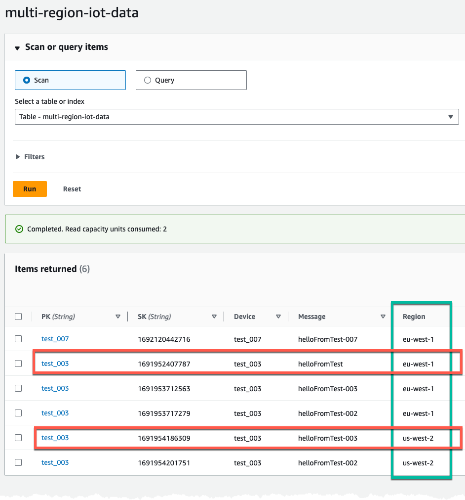

## Conclusion

Creating a multi-region IoT system can be challenge, with replication of Things and certificates. As shown in this post this can be automated in a event-driven and serverless way, allowing our IoT devices to connect and send data to several Regions using FQDN custom endpoint.
