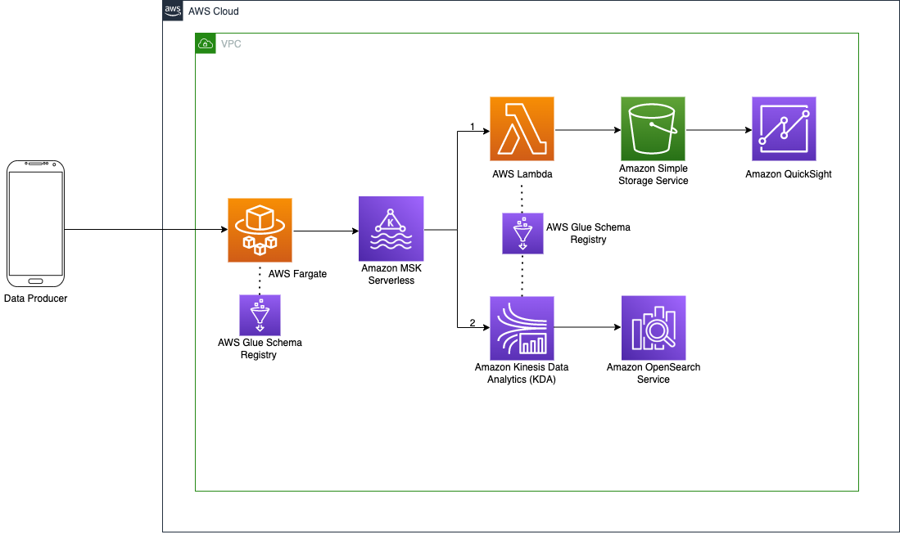

In recent years, there has been a growing trend towards using serverless architectures for building and deploying applications. One technology that has seen particular growth in this area is Apache Kafka, an open-source, distributed event streaming platform.

Serverless services allow us to build applications without having to worry about the underlying infrastructure. When it comes to Apache Kafka this allows developers to avoid provisioning, scaling, and managing resource utilization of their clusters. This allows you to focus on building and deploying end to end solutions.

This post will highlight the tradeoffs of using the AWS version of Serverless Apache Kafka, [Amazon MSK (Managed Streaming for Apache Kafka) Serverless](https://aws.amazon.com/msk/features/msk-serverless/) and provide a hands-on workshop to practice building out a serverless Apache Kafka data pipeline

## Serverless Kafka Tradeoffs

Apache Kafka provides a mechanism to decouple data processing from the source and target destinations as it's highly scalable and resilient. Kafka is very customizable, based on your workload, which introduces operational overhead. With Amazon MSK Serverless the tradeoff is you lose the flexibility of being able to configure the capacity of your cluster while gaining

* The ability to use Kafka through a single interface that provides an endpoint for clients. 
* Throughput based scaling so you don't need to monitor cluster capacity or reassign Apache Kafka partitions.
* Throughput based pricing so you pay for the data volume you stream and retain, and don’t have to worry about idle brokers and storage

Amazon MSK Serverless provides 200 Mib/s for ingress and 400 Mib/s of egress which is great for default workloads. When workloads grow in size, and the serverless cluster is unable to keep up with the write/read throughput, you can explore using the [Managed AWS Kafka](https://aws.amazon.com/msk/) cluster that provides the flexibility to tune the cluster for your workload but at a higher operational cost.

## Let’s Build

In the following workshop you will deploy an end-to-end Serverless Apache Kafka Data Pipeline that can produce and consume data that can be visualized in a dashboard. You will complete the following steps...

* Start a Serverless MSK Cluster
* Deploy a Kafka Client Container based Lambda Function
* Ingest data from various sources into a Kafka Client
* Consume data for downstream tasks such as QuickSight Dashboards

You can begin the workshop [here](https://catalog.us-east-1.prod.workshops.aws/workshops/6f017075-2245-4bbb-9e06-76f013dce1c9/en-US). The code for the workshop is stored in this [GitHub repo](https://github.com/aws-samples/msk-serverless-data-pipeline/)

This solution can be extended to fit different use cases such as reading data from a database on periodic intervals using [EventBridge](https://aws.amazon.com/eventbridge/), or uploading processed messages to [S3](https://aws.amazon.com/s3/). The flexibility of [Lambda](https://aws.amazon.com/lambda/) paired with Kafka’s ability to decouple data processing from the source and target destinations provide the foundation for serverless data pipelines.

Follow Banjo on Twitter [@banjtheman](https://twitter.com/banjtheman) and [@AWSDevelopers](https://twitter.com/awsdevelopers) for more useful tips and tricks about the cloud in general and AWS.

## About the Author

Banjo is a Senior Developer Advocate at AWS, where he helps builders get excited about using AWS. Banjo is passionate about operationalizing data and has started a podcast, a meetup, and open-source projects around utilizing data. When not building the next big thing, Banjo likes to relax by playing video games especially JRPGs and exploring events happening around him.