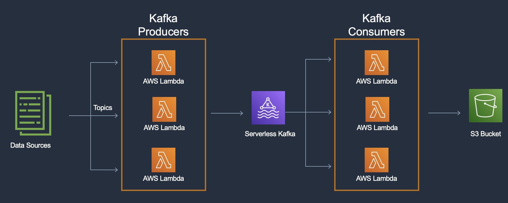
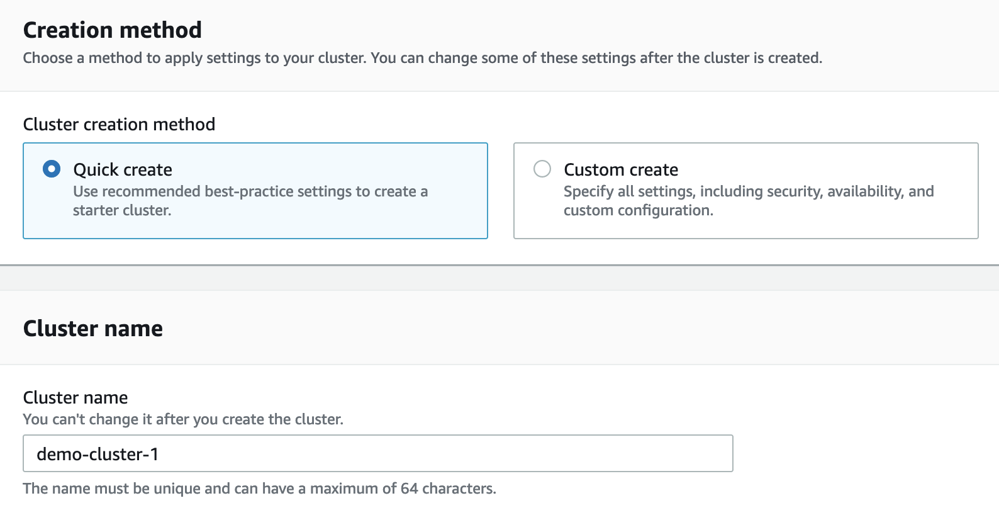
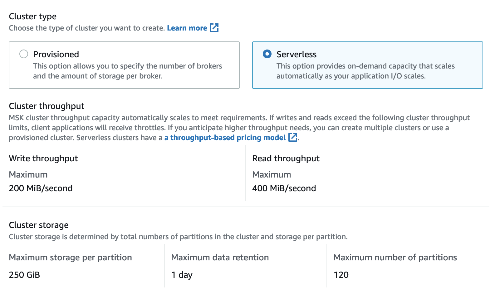
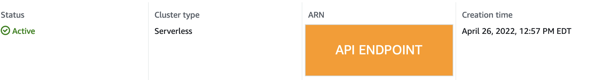
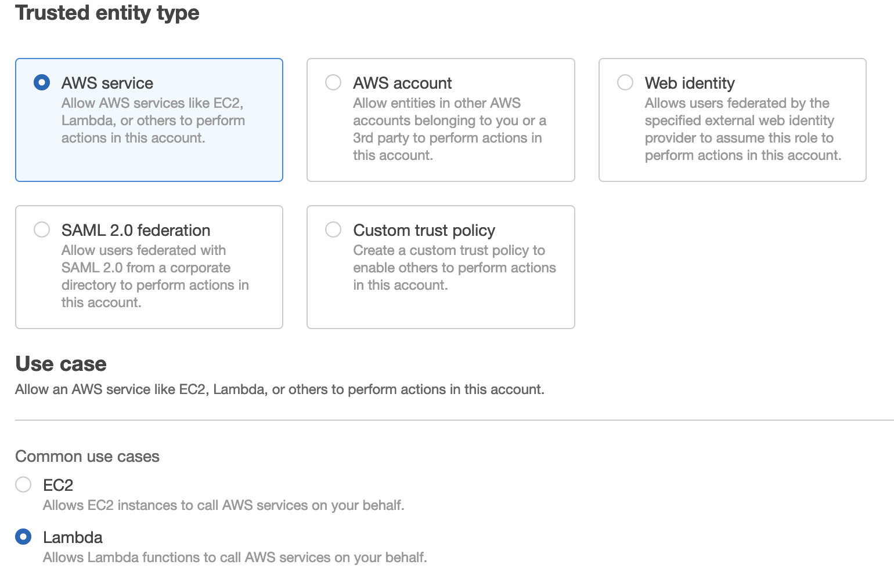
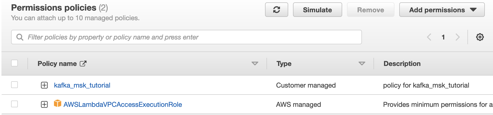
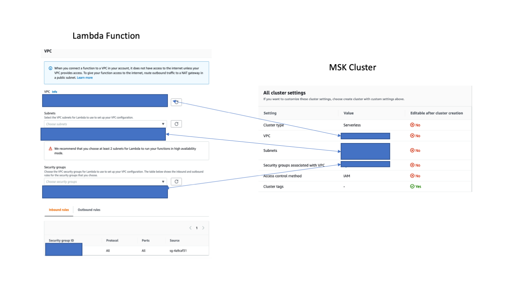
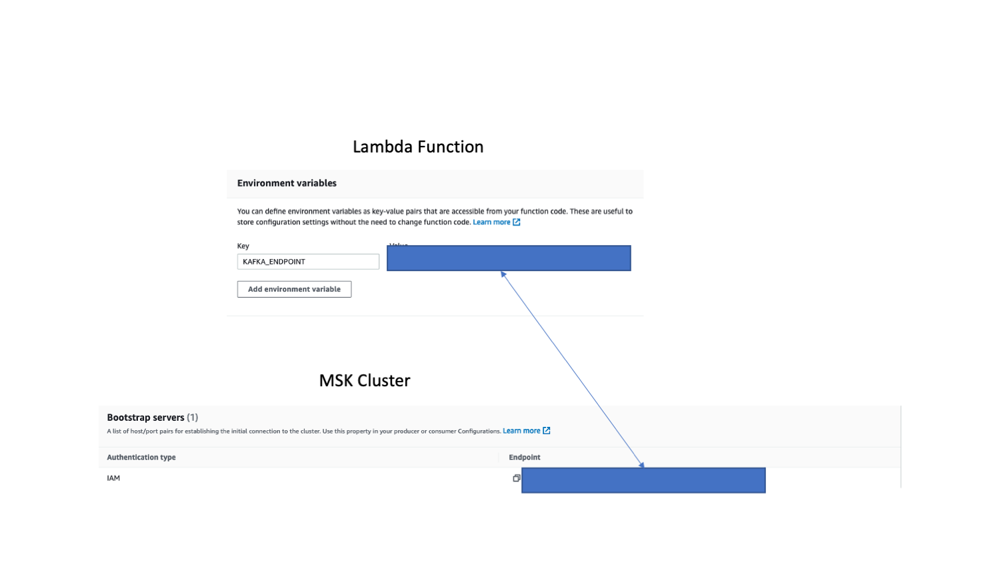
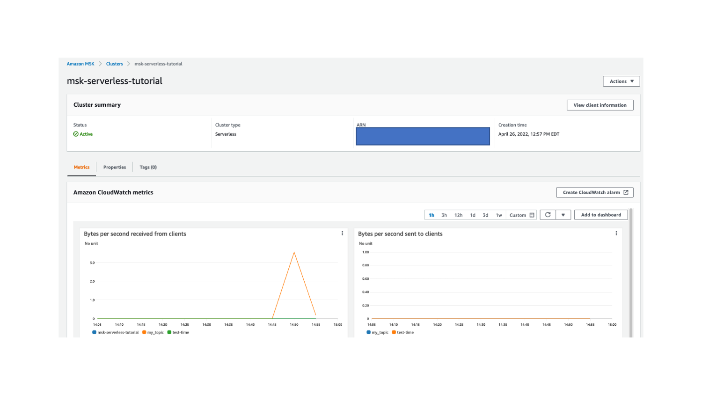

Serverless services allow us to build applications without having to worry about the underlying infrastructure. When it comes to Apache Kafka this allows developers to avoid provisioning, scaling, and managing resource utilization of their clusters. In this post I will explore the tradeoffs of using Amazon MSK (Managed Streaming for Apache Kafka) Serverless and walk through setting up a cluster.



## Serverless Kafka Tradeoffs

Apache Kafka is a distributed event store and stream-processing platform. Kafka provides a mechanism to decouple data processing from the source and target destinations as it's highly scalable and resilient. Kafka is very customizable, based on your workload, which introduces operational overhead. With Amazon MSK Serverless the tradeoff is you lose the flexibility of being able to configure the capacity of your cluster while gaining...

* The ability to use Kafka through a single interface that provides an endpoint for clients. 
* Throughput based scaling so you don't need to monitor cluster capacity or reassign Apache Kafka partitions.
* Throughput based pricing so you pay for the data volume you stream and retain, and don’t have to worry about idle brokers and storage

Amazon MSK Serverless provides 200 Mib/s for ingress and 400 Mib/s of egress which are great for workloads when you don't know much data is needed to process. When workloads grow in size, and the serverless cluster is unable to keep up with the write/read throughput, you can explore using the [Managed AWS Kafka](https://aws.amazon.com/msk/) cluster that provides the flexibility to tune the cluster for your workload but at a higher operational cost.


## Starting a Serverless Kafka Cluster

To get started on AWS you can create a cluster from the [console page](https://aws.amazon.com/msk/features/msk-serverless/).



With Serverless, you don't have to worry about configuration. You can simply just continue on and have a cluster up in minutes.




The default options of 200 Mib/s for ingress and 400 Mib/s are great for just getting started with Kafka workloads when you don't know much data is needed to process. If your workload grows in size, and the serverless cluster is unable to keep up with the default write/read throughput, you can explore using the Managed AWS Kafka cluster (https://aws.amazon.com/msk/) that provides the flexibility to tune the cluster for your workload.

Once the cluster is up, you can view the API endpoint needed for the clients in the properties tab in the console.



For more information on setting up the cluster check out the official [documentation](https://docs.aws.amazon.com/msk/latest/developerguide/serverless-getting-started.html)

## Creating Serverless Kafka Clients

Once the cluster is up, we can create Kafka clients to send data to the cluster and consume from it. In this section I will explain the following...

* How to set up the required IAM permissions for our Lambda Function
* Build a Docker image for the Lambda Function
* Configure the Lambda Function to communicate with the serverless Kafka cluster

### Setting permissions

Currently IAM based authentication is required to communicate with the cluster.  The following is an example policy that can be used for the clients. Be sure to replace REGION, Account-ID, and CLUSTER_NAME with your values.

```
{
    "Version": "2012-10-17",
    "Statement": [
        {
            "Effect": "Allow",
            "Action": [
                "kafka-cluster:Connect",
                "kafka-cluster:AlterCluster",
                "kafka-cluster:DescribeCluster"
            ],
            "Resource": [
                "arn:aws:kafka:REGION:Account-ID:cluster/CLUSTER_NAME/*"
            ]
        },
        {
            "Effect": "Allow",
            "Action": [
                "kafka-cluster:*Topic*",
                "kafka-cluster:WriteData",
                "kafka-cluster:ReadData"
            ],
            "Resource": [
                "arn:aws:kafka:REGION:Account-ID:topic/CLUSTER_NAME/*"
            ]
        },
        {
            "Effect": "Allow",
            "Action": [
                "kafka-cluster:AlterGroup",
                "kafka-cluster:DescribeGroup"
            ],
            "Resource": [
                "arn:aws:kafka:REGION:Account-ID:group/CLUSTER_NAME/*"
            ]
        }
    ]
}
```


Next, we can create a new role for the Lambda function and attach the policy above to the role.



Additionally, the Role will need to have the AWSLambdaVPCAccessExecutionRole policy as the function needs to be deployed in the same VPC as the serverless cluster.




### Building a Docker Image

For our Lambda function we will use a custom container that has all the prerequisites needed to connect to the Kafka cluster. Below is an example Dockerfile that can be used for building a Kafka client Lambda function. Check out the resources section at the bottom for the handler.py and client.properties files.

```Dockerfile
# Lambda base image
FROM public.ecr.aws/lambda/python:3.8
# Install Kafka prereqs
RUN yum -y install java-11 wget tar
RUN wget https://archive.apache.org/dist/kafka/2.8.1/kafka_2.12-2.8.1.tgz
RUN tar -xzf kafka_2.12-2.8.1.tgz
RUN wget https://github.com/aws/aws-msk-iam-auth/releases/download/v1.1.1/aws-msk-iam-auth-1.1.1-all.jar
RUN mv aws-msk-iam-auth-1.1.1-all.jar ${LAMBDA_TASK_ROOT}/kafka_2.12-2.8.1/libs
COPY ./client.properties ${LAMBDA_TASK_ROOT}
# Remove tgz
RUN rm kafka_2.12-2.8.1.tgz
# Lambda code
COPY handler.py ${LAMBDA_TASK_ROOT}
# Run handler
CMD ["handler.action"]
```


Follow the instructions [here](https://docs.aws.amazon.com/AmazonECR/latest/userguide/docker-push-ecr-image.html) to push your image to [Amazon Elastic Container Registry](https://aws.amazon.com/ecr/) (ECR). Once your image is in ECR, you can create a [Lambda Function using the container image](https://docs.aws.amazon.com/lambda/latest/dg/gettingstarted-images.html). Once the function is created we need to update some settings.

### Configuring the Lambda Function

Finally we need to configure the Lambda Function, so it can interact with the cluster.  For the basic settings we need to increase the memory to 1024 MB, timeout to 1 min and use the IAM role we created above.


Next we need to make sure the Lambda Function has the same VPC, subnets, and security group as the MSK Cluster



Finally we need to add the KAFKA_ENDPOINT environment variable set as the MSK cluster endpoint from the “View client information” button.



With that we are ready to begin producing and consuming data.

## Producing and Consuming Data

With Lambda we can send test events through the “Test” tab in the console to verify that our container image is working.  To test the produce function we can send this simple payload to push data to my_topic

```
{
  "action": "produce",
  "topic": "my_topic",
}
```

The producer code simply invokes the producer script with the passed in parameters, using sample data.

```
./kafka_2.12-2.8.1/bin/kafka-console-producer.sh  
--topic {topic} 
--bootstrap-server {KAFKA_ENDPOINT} 
--producer.config client.properties < /tmp/test.json
```

Once the code runs the metrics from the MSK cluster will update in a few minutes to indicate that data was received . The metrics can be viewed from the metrics tab on the cluster main page.




We can also then test the consumer code by updating the payload 

```
{
  "action": "consume",
  "topic": "my_topic",
}
```

Similarly the consumer code invokes the consumer script with the passed in parameters and writes the output to a sample file. The file can be uploaded to S3 or have other functions run on the data depending on your use case. The timeout parameter is there to ensure the script shutdowns or it would stay up waiting for input. 

```
"./kafka_2.12-2.8.1/bin/kafka-console-consumer.sh 
--topic {topic} --from-beginning 
--bootstrap-server {KAFKA_ENDPOINT} 
--consumer.config client.properties --timeout-ms 12000 > /tmp/output.json"
```

All of the code is configurable to fit your use case, so feel free to use this as a starter guide and adapt as needed.

## Conclusion

In this post, we discussed how to successfully set up the infrastructure needed to begin scaling out a serverless Kafka pipeline by...

* Starting a Serverless MSK Cluster
* Creating a Kafka Client Docker Image
* Deploying a Container based Lambda Function
* Producing and Consuming data through the Lambda Console

This solution can be extended to fit different use cases such as reading data from a database on periodic intervals using Eventbridge, or uploading processed messages to S3.  The flexibility of Lambda paired with Kafka’s ability to decouple data processing from the source and target destinations provide the foundation for a serverless data pipeline.

Follow Banjo on Twitter [@banjtheman](https://twitter.com/banjtheman) and [@AWSDevelopers](https://twitter.com/awsdevelopers) for more useful tips and tricks about the cloud in general and AWS.


## About the Author

Banjo is a Senior Developer Advocate at AWS, where he helps builders get excited about using AWS. Banjo is passionate about operationalizing data and has started a podcast, a meetup, and open-source projects around utilizing data. When not building the next big thing, Banjo likes to relax by playing video games especially JRPGs and exploring events happening around him


## Resources 

**client.properties**

```
security.protocol=SASL_SSL
sasl.mechanism=AWS_MSK_IAM
sasl.jaas.config=software.amazon.msk.auth.iam.IAMLoginModule required;
sasl.client.callback.handler.class=software.amazon.msk.auth.iam.IAMClientCallbackHandler
```

**handler.py**

This code provides a template for Lambda to interact with the serverless Kafka Cluster. Due to the IAM based authentication the standard Kafka python library could not interact with the cluster, so I developed a wrapper around the Java scripts to interact with the cluster.  

```python
import json
import logging
import os
import subprocess
from typing import List, Dict, Any

KAFKA_ENDPOINT = os.environ["KAFKA_ENDPOINT"]


def action(event, context) -> Dict[str, Any]:
    """
    Purpose:
        Entrypoint for action on cluster
    Args:
        event - data from lambda
        context - context data from lambda
    Returns:
        response - JSON response
    """

    body = {
        "message": "Running Action",
        "input": event,
    }

    curr_action = event["action"]
    topic = event["topic"]

    # If creating topic, can specify number of partitions
    if "num_partitions" in event:
        num_partitions = event["num_partitions"]
    else:
        num_partitions = 1

    if curr_action == "produce":
        response = produce(topic, num_partitions)
    elif curr_action == "consume":
        response = consume(topic)
    else:
        raise ValueError("Invalid action")

    return response


def consume(topic: str) -> Dict[str, Any]:
    """
    Purpose:
        Consume data in a topic
    Args:
        topic - topic to consume on
    Returns:
        response - JSON response
    """
    body = {
        "message": "Data consumed!!!",
    }

    # TODO can play with the timeout, on how long you want to collect data
    # TODO can also configure if you want to get data from the beginning or not
    cmd = f"./kafka_2.12-2.8.1/bin/kafka-console-consumer.sh --topic {topic} --from-beginning --bootstrap-server {KAFKA_ENDPOINT} --consumer.config client.properties --timeout-ms 12000 > /tmp/output.json"

    os.system(cmd)

    # TODO
    # Do what you need to do with output.json i.e upload to s3, run analytics, etc..

    response = {"statusCode": 200, "body": json.dumps(body)}
    logging.info(response)

    return response


def produce(topic: str, num_partitions: int) -> Dict[str, Any]:
    """
    Purpose:
        Produce data in a topic
    Args:
        topic - topic to create
        num_partitions - number of num_partitions to use
    Returns:
        response - JSON response
    """
    # TODO would input your process to get data to send to topic
    sample_data = '{"user":"Alice","number":105,"timestampInEpoch":1650880895}\n{"user":"Bob","number":5,"timestampInEpoch":1650880324}'

    # Write sample output to temp file
    write_to_file("/tmp/test.json", sample_data)

    body = {
        "message": "Data produced!!!",
        "input": sample_data,
    }

    # Check if topic exists, if not create it
    topics = list_topics()
    if not topic in topics:
        if not create_topic(topic, num_partitions):
            raise RuntimeError("Topic not created")

    produce_topic_command = f"./kafka_2.12-2.8.1/bin/kafka-console-producer.sh  --topic {topic} --bootstrap-server {KAFKA_ENDPOINT} --producer.config client.properties < /tmp/test.json"

    os.system(produce_topic_command)

    response = {"statusCode": 200, "body": json.dumps(body)}
    logging.info(response)

    return response


def create_topic(topic:str, num_partitions:int) -> bool:
    """
    Purpose:
        Create topic in cluster
    Args:
        topic - topic to create
        num_partitions - number of num_partitions to use
    Returns:
        bool - True if created, false if not
    """
    
    cmd = f"./kafka_2.12-2.8.1/bin/kafka-topics.sh --bootstrap-server {KAFKA_ENDPOINT} --command-config client.properties --create --topic {topic} --partitions {num_partitions}"

    output = subprocess.check_output(cmd, shell=True)
    output_string = output.decode("utf-8")
    outputs = output_string.split("\n")

    # Check if created
    success_string = f"Created topic {topic}."
    if success_string in outputs:
        logging.info(outputs)
        return True
    else:
        logging.error(outputs)
        return False


def list_topics() -> List[str]:
    """
    Purpose:
        List topics in cluster
    Args:
        N/A
    Returns:
        topics - list of topics
    """
    cmd = f"./kafka_2.12-2.8.1/bin/kafka-topics.sh --list --bootstrap-server {KAFKA_ENDPOINT} --command-config client.properties"

    # Run the command to get list of topics
    output = subprocess.check_output(cmd, shell=True)
    output_string = output.decode("utf-8")
    topics = output_string.split("\n")  # turn output to array

    return topics


def test_produce_consume() -> None:
    """
    Purpose:
        Test producing and consuming
    Args:
        N/A
    Returns:
        N/A
    """
    logging.info("testing produce")
    response = produce("my_topic", 1)
    logging.info(response)
    logging.info("testing consume")
    consume("my_topic")
    logging.info("Done and Done")


def write_to_file(file_path: str, file_text: str) -> bool:
    """
    Purpose:
        Write text from a file
    Args/Requests:
         file_path: file path
         file_text: Text of file
    Return:
        Status: True if written, False if failed
    """

    try:
        with open(file_path, "w") as myfile:
            myfile.write(file_text)
            return True

    except Exception as error:
        logging.error(error)
        return False


if __name__ == "__main__":
    loglevel = logging.INFO
    logging.basicConfig(format="%(levelname)s: %(message)s", level=loglevel)
    test_produce_consume()

```