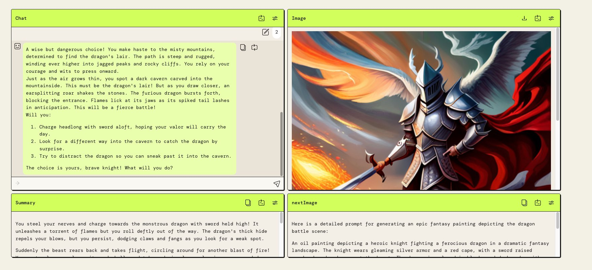
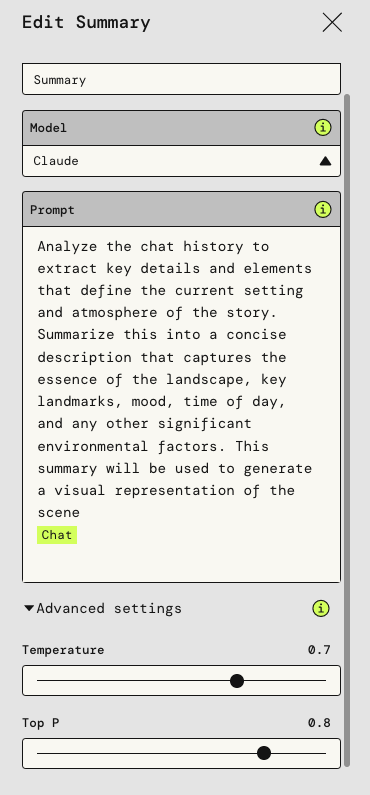
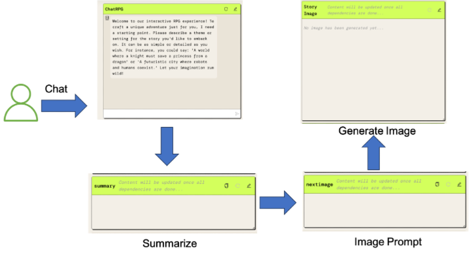

|ToC|
|---|

In the software development world, we often look for ways to merge classic experiences with modern capabilities. Text-based games, while seemingly old-fashioned in today's gaming environment, offer a unique kind of engagement. They're driven by imagination and choice, reminiscent of the interactive books I relished as a child. These books, with their branching narratives, were only a precursor to the deeper worlds I'd soon dive into.

My introduction to Role Playing Games (RPGs) was `Super Mario RPG` and yes, I'm as excited as you are about the [remake!](https://www.nintendo.com/us/store/products/super-mario-rpg-switch/) Series like `Final Fantasy` and `Elder Scrolls` further fueled my interest. While these games provided expansive, predetermined worlds, it was the agency and narrative control of those early interactive books that stayed with me. This blend of experiences made me wonder, could I build something that merges the depth of modern RPGs with the open-ended narratives of text-based adventures?

Thus, ChatRPG was created, where players' choices drive the narrative in real-time.

Using [PartyRock](https://partyrock.aws/?sc_channel=el&sc_campaign=genaiwave&sc_geo=mult&sc_country=mult&sc_outcome=acq&sc_content=building-chatrpg-with-partyrock), I transformed a concept into a working application without a single line of code. Let's explore how ChatRPG was built.

You can play with ChatRPG here: [https://partyrock.aws/u/banjtheman/CnsW_HHSL/ChatRPG](https://partyrock.aws/u/banjtheman/CnsW_HHSL/ChatRPG)

## Building with PartyRock

PartyRock provides a powerful platform for builders, enabling the creation of applications through an intuitive user interface, a wide array of models, and a mechanism to chain outputs effectively. These capabilities allow for the transformation of ideas into interactive experiences.

PartyRock is free to get started and doesn’t require an AWS account. This is the fastest way to start building generative AI applications today!

Building applications with PartyRock can be likened to orchestrating [AWS Lambda Step functions](https://docs.aws.amazon.com/step-functions/latest/dg/welcome.html?sc_channel=el&sc_campaign=genaiwave&sc_geo=mult&sc_country=mult&sc_outcome=acq&sc_content=building-chatrpg-with-partyrock). In each paradigm, sequences are determined by specific outputs, ensuring a consistent progression. With ChatRPG I used the following widgets to construct the application:

* **Chat Box with the DM Role:** Analogous to the initial trigger in a step function, this is the player's primary interaction point. As they input responses or choices, the AI—serving in the Dungeon Master (DM) role—processes this input, crafting narrative responses. Each interaction determines the subsequent flow, much like a lambda function reacting to specific input parameters.
* **The Summarize Function:** Given the extensive narrative arcs, it's crucial to periodically distill the essence. This function operates similarly to an intermediary lambda step, taking the accumulated chat history, processing it, and generating a concise summary representing the current narrative landscape.
* **Image Generation Prompt from Summary:** This step can be likened to a function converting data into actionable insights. Harnessing the generated summary, it crafts a precise prompt tailored for an image generation model, converting textual narrative into a request for visual representation.
* **Displaying the Image:** The final step in our narrative step function sequence. Post-processing and visualization are crucial in data workflows, and in ChatRPG, this translates to presenting players with a visual snapshot of their current in-game scenario.

Using a structure akin to step functions, ChatRPG ensures a fluid narrative experience. It's an example of how principles from software development can be applied to interactive storytelling, offering players a dynamic, evolving narrative.

## Keep the Party going

With PartyRock, rapid prototyping and experimentation are the name of the game. It enabled me to transform ChatRPG from an idea into a working application without any coding.

ChatRPG is merely a proof of concept, demonstrating just a fraction of PartyRocks's capabilities. With this toolkit, builders have the freedom to create a wide array of applications, ranging from interactive narratives to educational platforms and more.

But what does this mean for the future of game development? The implications are significant and multi-faceted.
Here are some examples builders are already using AI to streamline game development:

* [Building game assets](https://twitter.com/ProperPrompter/status/1710172917982708093)
* [Creating dynamic NPCs](https://twitter.com/Akshit2089/status/1701273517772382558)
* [Procedural world building](https://twitter.com/_akhaliq/status/1671191880262926336)

The generative AI-driven capabilities offered by platforms like PartyRock could revolutionize the way we approach not just game design, but application development at large.

The only limit is your creativity. The tools are here, and they're robust enough to turn even the most ambitious ideas into reality.

So as we step into this exciting new frontier, the question is: 

**What will you build?**

Have a project you want to share? Tag [@awsdevelopers on X](https://twitter.com/awsdevelopers), [Instagram](https://www.instagram.com/awsdevelopers/), and [LinkedIn](https://www.linkedin.com/showcase/aws-developers/) use the hashtag #partyrockplayground
