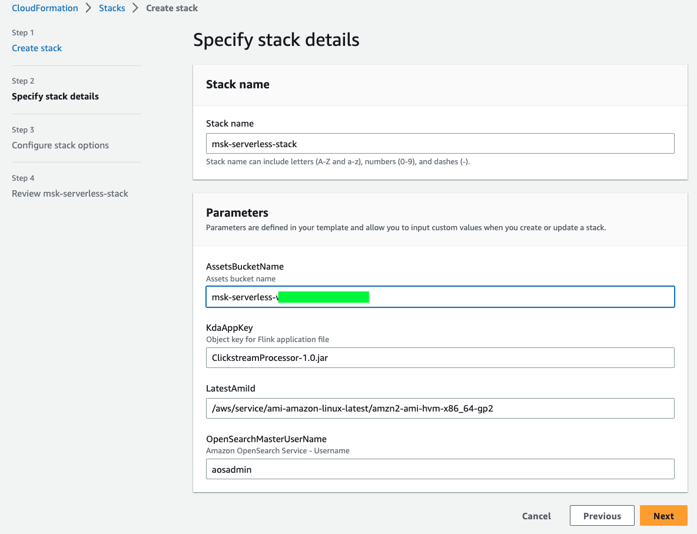
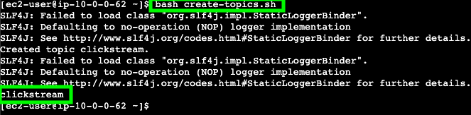
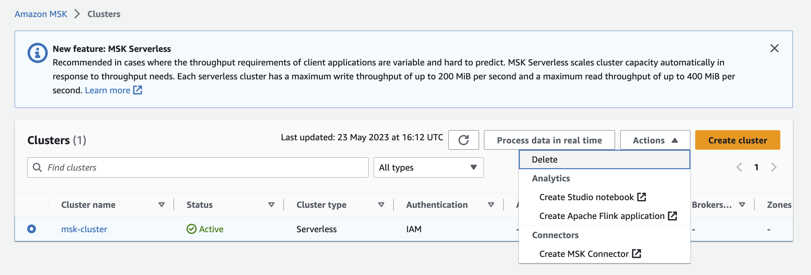

In today’s fast-paced digital world, real-time streaming analytics has become increasingly important as companies require to understand what customers, application and products are doing right now and react promptly. For example, companies need to analyse data in real-time to continuously monitor an application to ensure high service uptime and personalize promotional offers and product recommendations to customers. This tutorial “Building a Real-Time Streaming Analytics Application on Apache Kafka” shows you how to setup and implement a real-time data pipeline using Amazon MSK. More specifically, the guide details how streaming data can be ingested to the Kafka cluster, processed in real-time and consumed by a downstream application.

## Table of Content

| Attributes          |                                   |
| ------------------- | -------------------------------------- |
| ✅ AWS Level        | 200                             |
| ⏱ Time to complete  | 45 mins - 60 mins                      |
| 💰 Cost to complete | USD 4.00                               |
| 🧩 Prerequisites       | - An [AWS Account](https://aws.amazon.com/resources/create-account/?sc_channel=el&sc_campaign=devopswave&sc_content=cicdetlsprkaws&sc_geo=mult&sc_country=mult&sc_outcome=acq) <br> - An IAM user that has the access to create AWS resources. <br> - Basic understanding of CLI <br> - Java and Apache Maven installed |
| ⏰ Last Updated     | 2023-06-15                           |

|ToC|
|--|

## What you will accomplish

In this tutorial, you will:

* Start a Serverless Amazon MSK Cluster 
* Produce streaming data to MSK Serverless using Kafka Client Container
* Consume the streaming data using Amazon Kinesis Data Analytics 
* Visualise streaming data in Amazon OpenSearch Service 

Let’s get started!

## Architecture

The following architecture provides an overview of all the AWS resources and services that we will use to write real-time clickstream data to the Kafka cluster and consume it. We make use of AWS Fargate to deploy a container application that produces sample click stream data to the MSK Serverless cluster. The click stream data is consumed by an Apache Flink application running in Amazon Kinesis Data Analytics. The Kinesis Data Analytics application processes the clickstream data and writes it to Amazon OpenSearch Service for visualisation.


## Implementation

The following provides a step-by-step tutorial to implement a real-time streaming analytics application on Apache Kafka. Before you start, make sure you have the following pre-requisites installed in your machine:

* Java JDK 
* Apache Maven

### Step 1: Get the repository

The repository `build-on-aws/building-real-time-streaming-analytics-application-on-apache-kafka` contains the required files that help us to get started. Run the following command to download the repository to your local machine:

```bash
git clone https://github.com/build-on-aws/building-real-time-streaming-analytics-application-on-apache-kafka.git
``` 

### Step 2: Build the Flink application

After you have successfully installed Apache Maven on your machine, navigate to the `flink-clickstream-consumer` folder using the following command inside the previously downloaded repository:
```bash
cd flink-clickstream-consumer
``` 
Then, you can build the Flink application from inside the `flink-clickstream-consumer` folder by running:
```bash
mvn package
```
Once the application is successfully built you should see a following message in your terminal:

Maven packages the compiled source code of the project in a distributable JAR format in the directory `target/` named `ClickStreamProcessor-1.0-Snapshot.jar`.

### Step 3: Upload the files to Amazon S3

1. Log into your AWS account and navigate to the [Amazon S3 console](https://s3.console.aws.amazon.com/s3/) and click `Create bucket`.


2. Provide a unique bucket name of your choice, select the region (e.g. `us-east-1`) you want to deploy your resources and click `Create Bucket` at the bottom of the page. Take note your bucket name.


3. Click on the newly created bucket and `Upload` to upload the following to files to the S3 bucket.


4. Click `Add files` and select the JAR file `ClickStreamProcessor-1.0-Snapshot.jar` that you recently generated. 


### Step 4:  Create a stack using AWS CloudFormation 

Next, we create a CloudFormation stack and automatically deploy the following resources by uploading the CloudFormation template:

* `Amazon OpenSearch Cluster`: This is where we can visualize the consumed clickstream data. It is deployed in private subnets of a VPC.
* `Amazon ECS Cluster + Task definition`: The container application that generates the sample clickstream data runs inside the ECS cluster as a Fargate task.
* `Amazon Kinesis Data Analytics`: This is where the Flink application runs, consuming the clickstream data from the MSK cluster, processing it and writing it to the OpenSearch Service.
* `Amazon EC2 Instance (Kafka client)`: This EC2 instance serves as a Kafka client and allows us to interact with the MSK cluster by e.g. creating Kafka topics. 
* `Amazon EC2 Instance (Nginx proxy)`: This EC2 instance serves as a Nginx proxy and allows us to access the OpenSearch Dashboard from outside of the VPC, i.e., from the Internet. 
* `Security groups`: Security group help us to control the traffic that is allowed to reach and leave a particular resource.
* `IAM roles`: An IAM role is an IAM identity that has specific permissions attached to it and can be assumed by an IAM user or an AWS service. For example, an IAM role can be used to grant permissions to an application running on an EC2 instance that requires access to a specific Amazon S3 bucket.

Rather than creating the required resources manually we make use of the CloudFormation template to automatically deploy the resources in your account. 

1. Navigate to the [CloudFormation console](https://console.aws.amazon.com/cloudformation/) and click on `Create Stack`. 

2. Choose `Upload a template file` and click `Choose file` to upload the CloudFormation template file `cf_template.yml` that can be found in the root of the downloaded repository. Then, click `Next`.


3. Provide the stack with a `Stack name` of your choice (e.g. `msk-serverless-stack`). Additionally, you have to provide a value to the parameter `AssetsBucketName`. Enter the name of the S3 bucket that you created earlier as `AssetsBucketName`. You can leave the default `ClickstreamProcessor-1.0-Snapshot.jar` as `KdaAppKey` unless you have changed the name of the JAR file that you created earlier and uploaded to S3. Leave the `OpenSearchmasterUserName` as is. Click `Next`.



4. Scroll down the page `Configure stack options` and click `Next`. 

5. Scroll down the page `Review <Your_Stack_Name>`. Make sure to tick the box  `I acknowledge that AWS CloudFormation might create IAM resources with custom names`. Lastly, click `Submit` to create the CloudFormation stack.

Wait until the status of the stack changes from `CREATE_IN_PROGRESS` to `CREATE_COMPLETE`. Note: This can take some time.


### Step 5: Create the MSK Serverless Cluster

1. Navigate to the [Amazon MSK console](https://console.aws.amazon.com/msk/) and click `Create cluster`.

2. Choose `Custom create` and provide a cluster name of your choice (e.g. `msk-cluster`). Select `Serverless` as cluster type. Then, click `Next`. 


3. In the `Networking` view, select the custom VPC named `MMVPC`. Then, click `Add subnet` to add a third subnet and choose the three available private subnets (`PrivateSubnetMSKOne`, `PrivateSubnetMSKTwo`, `PrivateSubnetMSKThree`) for the the different zones in `us-east-1a`, `us-east-1b` and `us-east-1c`. 

4. Rather than the default security group select the security group named `MSK Security Group`. Lastly, click `Next`.


5. Click `Next`.

6. Click `Next`.

7. Finally, click `Create cluster` to create the MSK Serverless cluster.

8. Once your MSK Serverless cluster status changes to `Active` click  on `View client information`. 


9. Take note of the endpoint of your MSK Serverless cluster. Notice that we use IAM access control to handle the authentication to the MSK cluster.


### Step 6: Create the Kafka topics

Now that the MSK Serverless cluster is ready and available to use, we need to create Kafka topics to produce and consume the data. We create create the Kafka topics as shown below:

1. Navigate to the [Amazon EC2 console](https://console.aws.amazon.com/ec2/). On the EC2 home page click in `Instances (running)`. 


2. On the EC2 Instances page select the checkbox for the instance named `KafkaClientInstance` and click on the `Connect` button on top right as shown in the image below. 


3. On the page `Connect to instance`, ensure to select `Session Manager` and click the `Connect button`. This opens a new tab with a EC2 terminal.

4. In the terminal window execute the following command to change to `ec2-user`: 

```bash
sudo su - ec2-user
```


5. Execute the command below to set your MSK cluster endpoint to the shell variable BS. Please replace `<Your_Cluster_Endpoint>` with the endpoint you noted down after you created the MSK Serverless cluster. 

```bash
export BS=<Your_Cluster_Endpoint> 
````


6. Then, execute the following command to create the Kafka topics.
````bash
./create_topics.sh
````
You will encounter warnings printed to the terminal. You may ignore them. 



7. You should see the four MSK topics (`clickstream`, `Departments_Agg`, `ClickEvents_UserId_Agg_Result`, `User_Sessions_Aggregates_With_Order_Checkout`) that have been created.


### Step 7: Start container application to produce clickstream data 

After we have successfully created topics in the MSK cluster, the next step is to produce data to the cluster. For that we deploy a serverless Amazon ECS Fargate container that runs an application producing sample clickstream data to MSK Serverless cluster. 

1. Navigate to the [Amazon ECS console](https://console.aws.amazon.com/ecs/v2/). On the left side menu click on `Task Definitions` to view all available Task definitions. Select the checkbox of the available Task definition and `Click Run` task option from the Deploy menu.


2. On the Run Task page, select the existing cluster (`msk-serverless-[...]-cluster`) and leave the default settings. 


3. Expand the `Networking` section. Change the default VPC to `MMVPC`. Similar to before, select the three subnets `PrivateSubnetMSKOne`, `PrivateSubnetMSKTwo` and `PrivateSubnetMSKThree`. Finally, uncheck the default security group and select the security group that contains `-ProducerECSTaskSecurityGroup-`.


4. Expand the `Container overrides` section. For `BOOTSTRAP_STRING` the value of your MSK Serverless cluster endpoint (written down earlier with `View client information` from the MSK cluster console page).


5. Finally, click the `Create button`.

6. Wait for your task to change into `Running` status as shown below.


You now successfully created a producer ECS task that will continuously produce clickstream data to the MSK Serverless cluster.

### Step 8: Check schema in AWS Glue Schema Registry

In the last step we have successfully created a ECS producer task. This task creates the clickstream schema in the AWS Glue Schema Registry. 

1. Navigate to the [Amazon Glue console](https://console.aws.amazon.com/glue/). Select `Stream schema registries` under `Data Catalog` from the left menu. You can see the schema registry named `serverless`. Click on it. 

2. You can see the available Schemas of the schema registry `serverless`. Click on the schema `clickstream` to see the different schema versions. You should see Version 1 here. 


3. Click on the Version `1` to see the Avro schema of the clickstream data produced by the ECS task.


### Step 9: Consume clickstream data using Kinesis Data Analytics 

We have set up the MSK Serverless Cluster and are continuously writing clickstream data to the cluster. Now, we would like to consume the clickstream data from the MSK Serverless cluster using a Amazon Kinesis Data Analytics and Flink. The Apache Flink Application processes the clickstream data in real-time and writes the data to Amazon OpenSearch Service. 

The OpenSearch Service is already deployed in your AWS account and the Dashboard is already configured. What is missing is the correct runtime parameters for the Kinesis Data Analytics application. 

1. Navigate to the [AWS Kinesis Analytics console](https://console.aws.amazon.com/kinesisanalytics/) and click on the open streaming application `KDAFlinkCLickstream-msk-serverless-stack`. 

2. Configure and update the application by clicking on the `Configure` button. 


3. Scroll down to the `Runtime properties`. Update `BootstrapServers` to the MSK Serverless cluster endpoint you have written down earlier. Keep the rest of the values as default.


4. Finally, save your changes. 

5. Click on the `Run` button to run the Flink application. Choose `Run without snapshot`. 


6. Once the Kinesis Analytics application is running, click on `Open Apache Flink dashboard` to open the Flink dashboard.


7. Click on `Running Jobs` on the left side of the menu. Click on `Flink Streaming Job` to access the details of the running job.


8. This opens a screen with a directed acyclic graph (DAG), representing the flow of data throughout each of the operators of your application. Each blue box in the job workflow represents a series of chained operators, known as *Tasks* in Apache Flink.  
In addition, we can see the status of each task, as well as the Bytes Received, Bytes Sent, Records Received and Records Sent at the bottom of the screen. Note that Flink can only measure the bytes sent or received between operators. That’s why you can not see the metrics for the source or sink operator as the data is coming from outside of Flink. 


You have now successfully setup a Kinesis Analytics application that reads messages from a Kafka topic, processes the data and then writes the data to Amazon OpenSearch Service. Let’s check the data in OpenSearch dashboard!

### Step 10: View clickstream data in the Amazon OpenSearch Dashboard

In the last step we want to see the dashboard visualisation generated based on the ingested data from Kinesis Analytics application. 

1. Navigate to the [CloudFormation console](https://console.aws.amazon.com/cloudformation/) and click on the stack that we created earlier. Go to the `Outputs` tab of the stack. 

2. Take note of the `OpenSearchMasterUserName` and `OpenSearchMasterPassword`. You will need the values in the next step. 


3. Click on the `OpenSearchDashboardEndpoint` to open the OpenSearch Dashboard login page  in a new tab. As the OpenSearch Service is deployed in a VPC, we are relying on Nginx reverse proxy to access the OpenSearch Dashboard outside of the VPC. Note that we are using a self signed certificate for Nginx. However, we strongly recommend to use a valid certificate for production deployments. If you are acce

4. If you are accessing the URL using Google Chrome, you have to click on the `Advanced` button and click on `Proceed to <Your_EC2_DNS>`. 


5. Use the `OpenSearchMasterUserName` and `OpenSearchMasterPassword` from the previous step and login to OpenSearch Dashboards.


6. Select `Global` tenant on the popup dialog box. 

7. Click on the hamburger menu on the left of the screen and click on `Dashboards` as shown below.


8. In the `Dashboards` view select the dashboard named  `Clickstream Dashboard` to see the plotted data:


You have now confirmed data flowing to OpenSearch Service and visualisations are rendered.

## Clean up resources

Now that you’ve finished building a real-time streaming analytics application on Apache Kafka, you can delete all resources to avoid incurring unexpected costs.

* Delete the MSK Serverless Cluster under the `Actions` menu.



* Delete the CloudFormation Stack.


* Empty and delete the S3 Bucket you have created earlier.


## Conclusion

Congratulations! You have built a real-time streaming analytics application on Apache Kafka. More specifically, you have setup a ECS task to produce sample clickstream data to the MSK Serverless Cluster. This clickstream data is then consumed by a Flink application running in Amazon Kinesis Analytics, processed and written to Amazon OpenSearch

If you enjoyed this step-by-step guide, found any issues or have feedback for us, please send it our way!
