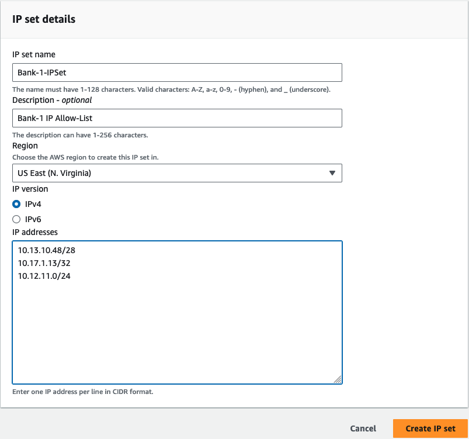
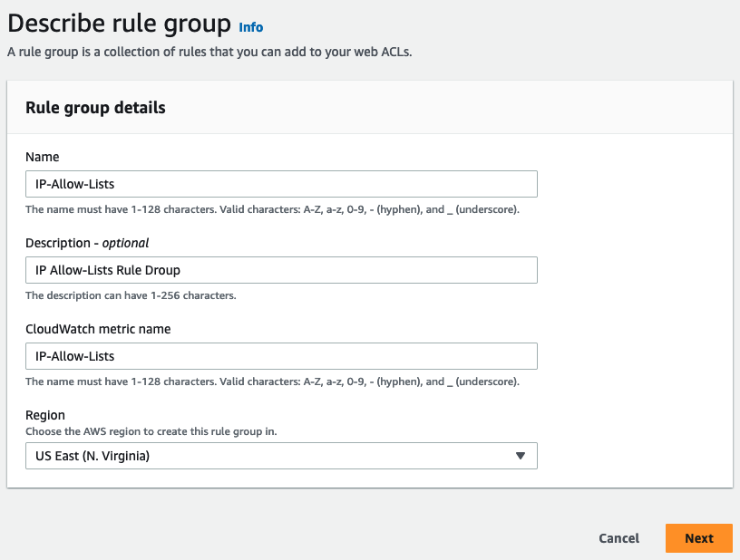
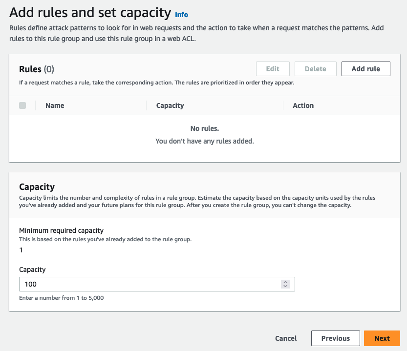
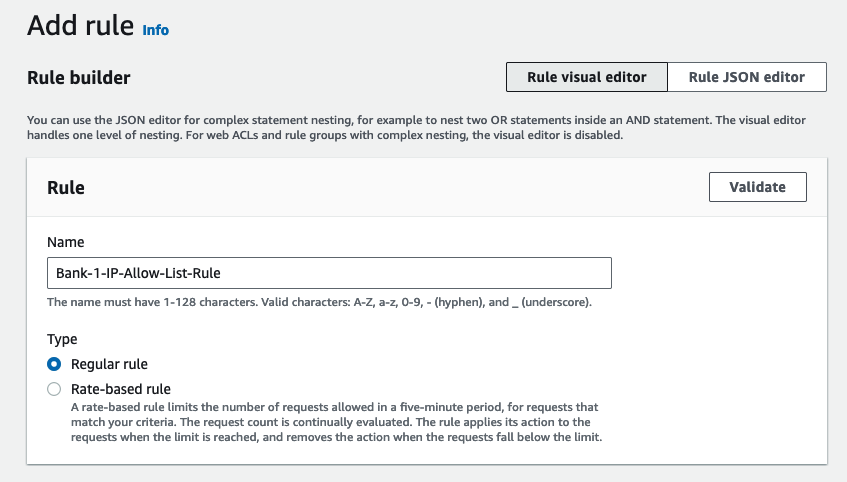
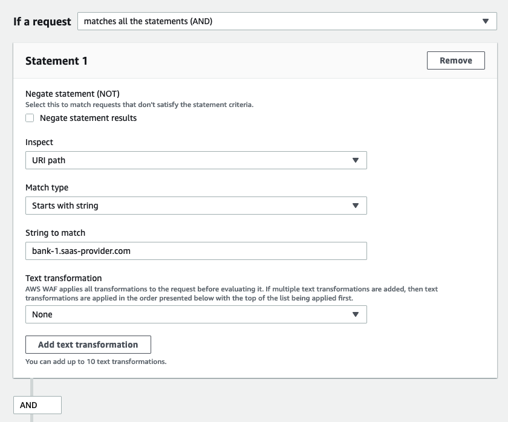
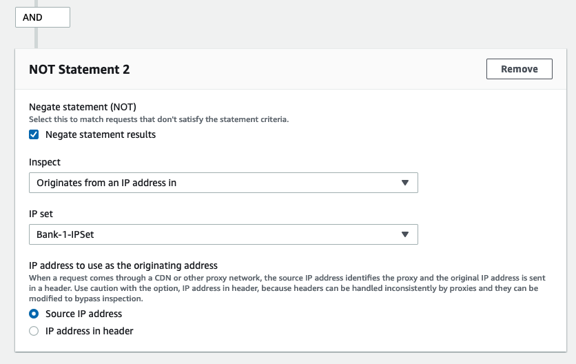
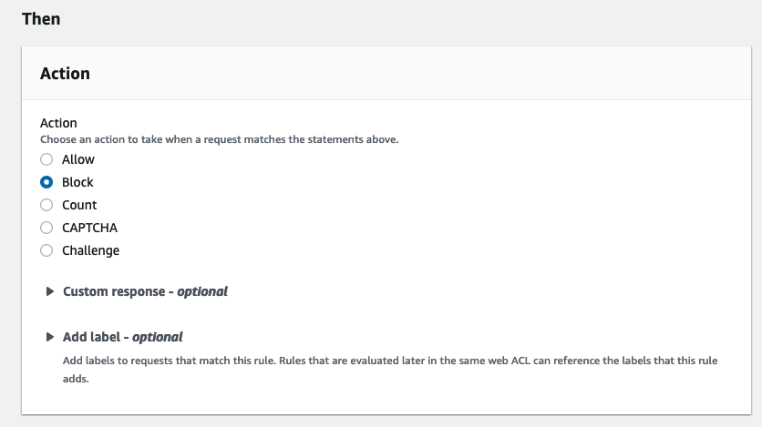
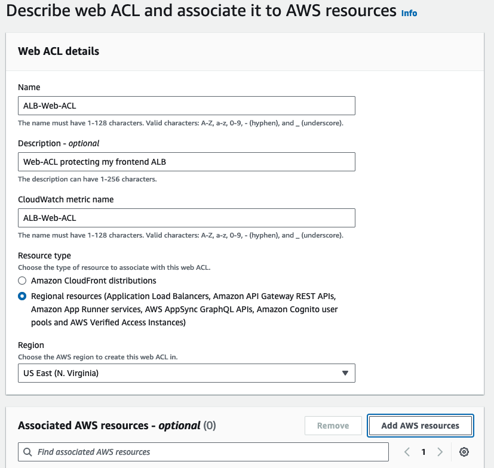
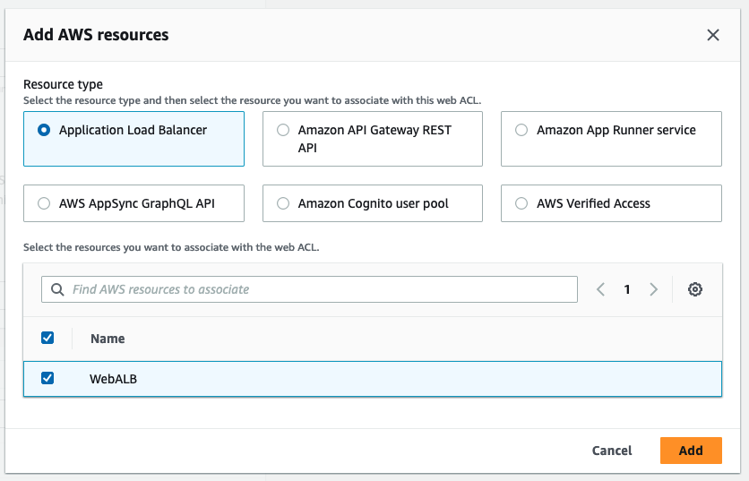
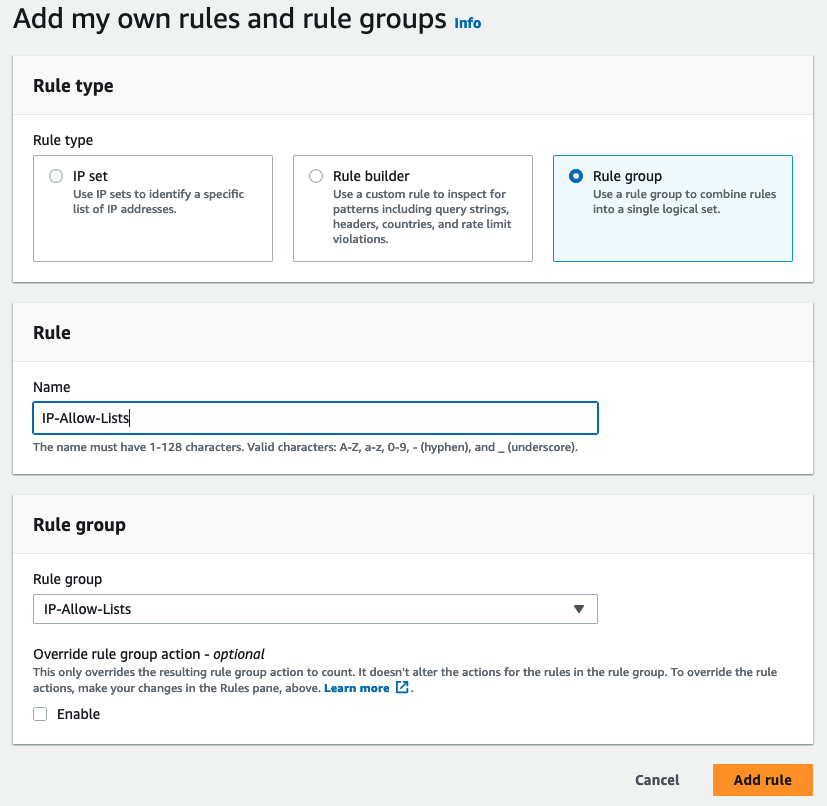

|ToC|
|---|

SaaS providers in regulated industries, Financial Services as an example, often serve multiple clients using the same frontend infrastructure, e.g. same [Application Load Balancer (ALB)](https://aws.amazon.com/elasticloadbalancing/?sc_channel=el&sc_campaign=post&sc_geo=mult&sc_country=mult&sc_outcome=acq&sc_content=building-scalable-multi-domain-IP-allow-listing-aws-alb-aws-waf). To facilitate dedicated tenant backend, clients are often assigned client specific sub-domains to use i.e. client-1.saas-provider.com . Traffic is then routed to different backends based on URI path (in this case the client specific sub-domain). At times SaaS providers are yet required to only accept traffic from a per-determined list of source IPs per client (per domain/sub-domain IP allow-listing).

To further demonstrate the challenge, imaging you are a SaaS provider that makes B2B software used by banks. Each one of your banks accesses your infrastructure using a custom domain, i.e. customer Bank-1 through domain bank-1.saas-provider.com, and customer Bank-2 through domain bank-2.saas-provider.com, both domains are served by the same ALB. Since traffic to domain bank-x.saas-provider.com is expected to be originated from Bank-x source IPs, to enhance security it is often required to restrict traffic to bank-x.saas-provider.com to source IPs from bank-x-allow-list.

This use case can be easily satisfied using ALB forwarding rules and conditions,  i.e. match condition: for host bank-x.saas-provider.com, and source IP  bank-x CIDR forward traffic to target group x and a default rule to reject else. This solution is only feasible if your source IPs can be summarized to a few CIDR blocks. We are often faced with the challenge that these source IP lists are changing, long, and can not be summarized into consolidated CIDR blocks. To overcome this challenge we need an approach that can scale beyond a few CIDRs and can allow managing Allow-List changes in a modular way, preferably outside of the core configuration.

This post will present a solution that can scale, is modular, and is easy to maintain as IP allow-lists change. The solution will utilize IP sets, rule groups, rule matching logic, and Web ACLs all features of [AWS WAF](https://aws.amazon.com/waf/?sc_channel=el&sc_campaign=post&sc_geo=mult&sc_country=mult&sc_outcome=acq&sc_content=building-scalable-multi-domain-IP-allow-listing-aws-alb-aws-waf). We will then use the AWS WAF Web ACL we have created to secure access to the AWS ALB frontending the multi domain deployment.

## Solution overview

To allow for modularity and scalability, we will start with creating a WAF [IP Set](https://docs.aws.amazon.com/waf/latest/developerguide/waf-ip-set-managing.html?sc_channel=el&sc_campaign=post&sc_geo=mult&sc_country=mult&sc_outcome=acq&sc_content=building-scalable-multi-domain-IP-allow-listing-aws-alb-aws-waf) per client custom domain/sub-domain. Every client (bank in the example we have taken) will have their own IP set to allow-list their source IPs associated with their custom domains/sub-domains. Any future changes to the client source IP list will only require updating their respective IP set.

Then we are going to use the created per client IP sets to create [Web ACL rules](https://docs.aws.amazon.com/waf/latest/developerguide/waf-rules.html?sc_channel=el&sc_campaign=post&sc_geo=mult&sc_country=mult&sc_outcome=acq&sc_content=building-scalable-multi-domain-IP-allow-listing-aws-alb-aws-waf), one rule per client. We will use the match all rule logic (logical AND) with two statements. The first statement is a match URI path starting with the client custom domain i.e. bank-x.saas-provider.com, and the second statement verifies if the source IP does (NOT) match the bank-x IP Set, and then we will set the action to Block. We are basically saying if the URI path starts with the bank-x sub-domain, and the source IP is not allow-listed then block traffic.

Next we will bundle all these rules together in a [rule group](https://docs.aws.amazon.com/waf/latest/developerguide/waf-rule-groups.html?sc_channel=el&sc_campaign=post&sc_geo=mult&sc_country=mult&sc_outcome=acq&sc_content=building-scalable-multi-domain-IP-allow-listing-aws-alb-aws-waf) bundle that we can add to our [Web ACL](https://docs.aws.amazon.com/waf/latest/developerguide/web-acl.html?sc_channel=el&sc_campaign=post&sc_geo=mult&sc_country=mult&sc_outcome=acq&sc_content=building-scalable-multi-domain-IP-allow-listing-aws-alb-aws-waf). To complete the configuration we will need to ensure the Web ACL default behavior for unmatched traffic is set to allow. Remember, our rules were designed to block traffic for our client domains if the source IP addresses are not matching their allow lists, hence we need to ensure the the unmatched is allowed.

A more strict logic can be used to allow only traffic that is meant for our specific client domains/subdomains when the source IP is matching their IP sets while deny else. This logic is more secure but would not work in most cases as it is often required, in addition to having dedicated backends for some clients, that you use a shared backend for others. That is to make it more cost effective for those who have less restrictive rules. A default deny unmatched would not work in this case. The logic can be easily adapted to your specific use case though.

In addition to enforcing per-domain source IP check, the same Web ACL can include any other set of rules depending on your security requirements. These rules can be additional [self-managed rule groups](https://docs.aws.amazon.com/waf/latest/developerguide/waf-user-created-rule-groups.html?sc_channel=el&sc_campaign=post&sc_geo=mult&sc_country=mult&sc_outcome=acq&sc_content=building-scalable-multi-domain-IP-allow-listing-aws-alb-aws-waf) or [managed rule groups](https://docs.aws.amazon.com/waf/latest/developerguide/waf-using-managed-rule-groups.html?sc_channel=el&sc_campaign=post&sc_geo=mult&sc_country=mult&sc_outcome=acq&sc_content=building-scalable-multi-domain-IP-allow-listing-aws-alb-aws-waf) that are ready for use and managed on your behalf. In such a case the Web ACL would serve a dual purpose,  protecting your ALB based on the security rules you have applied, while applying the per-domain IP Allow-listing logic you have implemented.

With this configuration, a change in any IP allow-list will only require a change in the respective IP set, no other infrastructure configuration changes would be required.

## Configuration steps

Now that we understand the logic, let's summarize the configuration steps in the order they should be performed then go right into building our solution.

**Step by step summary:**

- Create one allow-list IP set per client domain/subdomain, let's call our first IP set Bank-1-IPSet
- Create a WAF rule group , let’s call it IP-Allow-Lists. This rule groupe is meant to include all IP allow list rules i.e. Rule-1 for Bank-1, Rule-2 for Bank-2
- Estimate and define the rule group capacity in WCUs, let's use 100 for our setup. The rule group capacity is the total sum of the capacity required for all rules within the rule group and is measured in WCUs. Here is a [documentation reference to how you can estimate the capacity required for your rule group](https://docs.aws.amazon.com/waf/latest/developerguide/aws-waf-capacity-units.html?sc_channel=el&sc_campaign=post&sc_geo=mult&sc_country=mult&sc_outcome=acq&sc_content=building-scalable-multi-domain-IP-allow-listing-aws-alb-aws-waf)
- Create a rule per client sub-domain i.e. Bank-1-Allow-List-Rule for bank-1.saas-provider.com. Then we add all the rules created i.e. Bank-1-Allow-List-Rule, Bank-2-Allow-List-Rule etc., to our rule group that we named IP-Allow-Lists. The per client rule should be a match-all-statements rule (logical AND). We will include two statements in ech rule. The first statement will be a **match-URI-path** starting-with statement e.g. bank-x.saas-provider.com, while the second statement will check if the **source IP** does (NOT) match the bank-x IP set. The rule action will be se to **Block**. We are basically saying if the URI path starts with the bank-x sub-domain, and the source IP is not allow-listed then block traffic.  
- Create a Web ACL and Associate it with our frontend ALB
- Add our rule group IP-Allow-Lists to the Web ACL and set the ACL default action (if no match) to allow

## Let's build it

Now let's take the configuration steps above and actually build a sample domain based IP allow-list.

- We start with creating an IP Set for our first client Bank-1 that is using their custom domain bank-1.saas-provider.com. Let's call this IP Set Bank-1-IPSet

- Create a Rule Group, let's call it IP-allow-Lists

- Then set the capacity to 100 WCU

- Time to add our first rule, let's call it Bank-1-IP-Allow-List-Rule and set the rule type to regular (not rate-based)

- Now we create the rule logic, select a match all (AND) logic. Time to create our first statement that is part of the AND logic. This statement will inspect if the URI path is our client Bank-1 (bank-1.saas-provider.com), and use a **Starts with string** for the matching type.

- As we now have our domain matched, we will add a **NOT** statement that is inspecting the source IP and matching it to the  Bank-1-IPSet that we have created earlier.

- We finish the rule with adding the action to Block. We are basically saying if the domain is Bank-1's custom domain and the source IP is not in the Bank-1 allow-list, we should block the traffic.

- Finally we create a Web ACL that we will later associate with our frontend ALB resource

- Associate the Web ACL with our frontend ALB. This step assumes you have an ALB created, WebALB.

- Add the IP-Allow-Lists rule group to the Web ACL. The rule group will contain per domain rules for all the customer client domains/subdomains.

And their you have it, you have created your first per-domain source IP allow-listing!

## Refactoring the Solution

Although we have used a URI path matching statement in this example, the same logic can apply to IP allow-listing in general with any other matching statement. The matching statement can use any of the available match rules i.e. host header, query string, http method etc.. You can even change the rule type from Regular to **Rate-based**. You can also change the rule logic, the number of matching statements, the combinations are endless and can be customized based on your use case.

## Conclusion

In conclusion, per domain IP allow-listing in an ALB multi-domain deployment can be achieved in a modular, scalable and easy to maintain architecture. The solution demonstrated in this post highlights how we can use IP sets as a modular construct for our per-domain allow-list, Web ACL rules to perform the per-domain IP allow-listing logic, rule  groups to bundle all our domain specific rules and AWS WAF to put those rules into effect. The approach can be adapted to other use cases based on your requirements. The high flexibility extended is facilitated by the rule matching logic and the variety of rule statements options.
