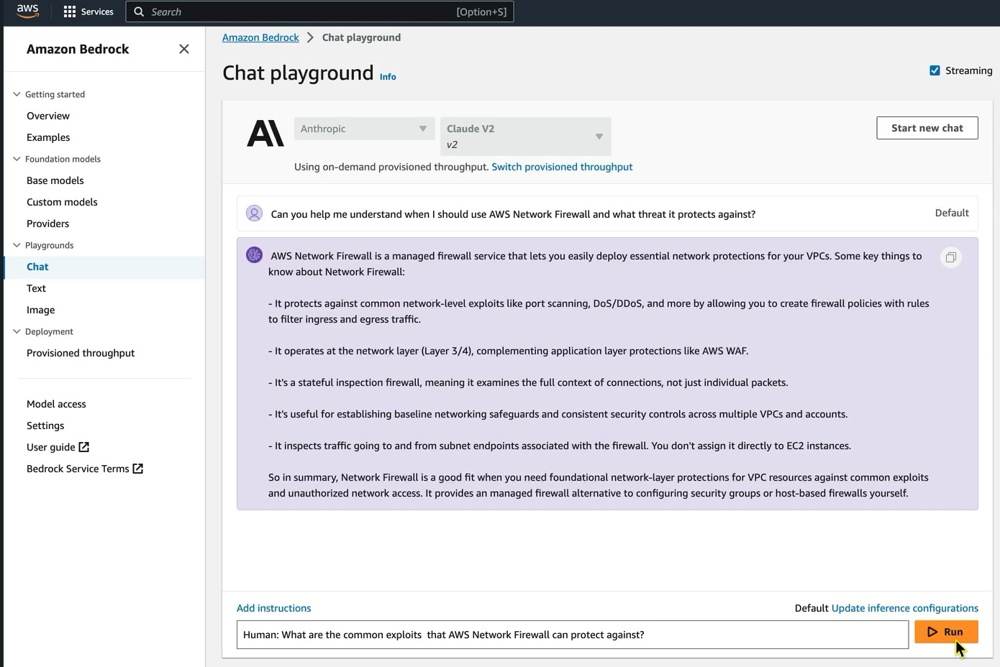
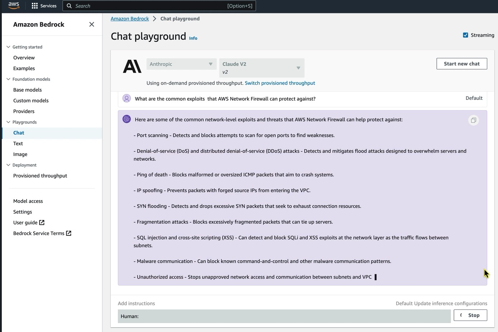
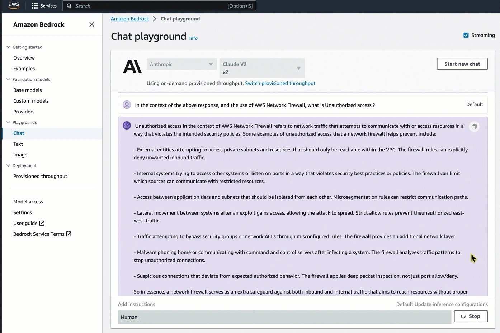
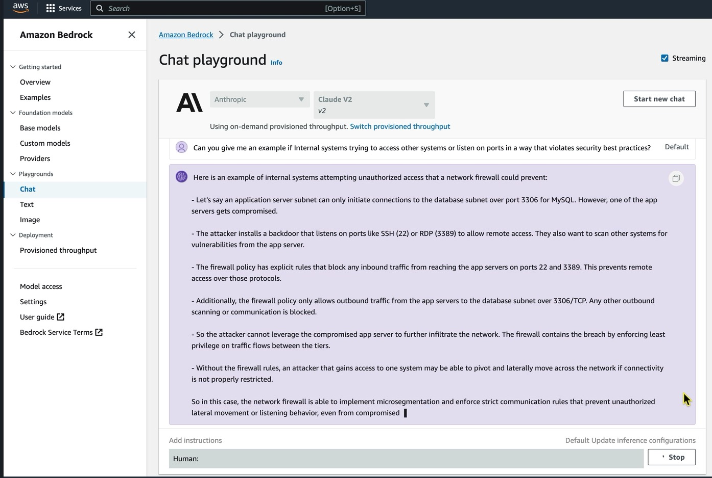

|ToC|
|---|

In the rapidly evolving world of cybersecurity, staying updated with the latest knowledge and techniques is paramount. There's so many avenues one can take to learn about cybersecurity, ranging from formal training such as Degree Programs and Certification Courses, to Online Courses and Tutorials, Books, Hands-on Labs and Simulations, and more.  While traditional training methods lay the foundation, Generative AI has the potential to augment this learning, offering personalized insights, real-time simulations, and adaptive content, and if you're not already exploring what's possible, you should be. But as with all emerging technologies, it's essential to tread with caution. In this article, we'll delve into the exciting possibilities of using Generative AI as a learning tool, while also highlighting the considerations to keep in mind before fully embracing this novel approach. Join us as we navigate the future of cybersecurity education.

## Understanding Generative AI

Generative AI, particularly large language models (LLM), represents a groundbreaking shift in the realm of technology and learning. These models are not search engines displaying internet results but are actually sophisticated systems trained on massive volumes of text data. These LLMs start from a blank slate, these models are fed with vast amounts of information, from sources like Wikipedia to various internet pages, enabling them to learn the intricacies of language and its construction. As they undergo continuous training, they not only grasp the basics of language but also begin to understand the world's workings, eventually exhibiting the ability to answer complex queries using math! This immense knowledge base, combined with their predictive capabilities, makes them powerful learning tools. By interacting with these models, a learner can pose questions and receive detailed explanations, making Generative AI a revolutionary tool in interactive learning, especially in fields like cybersecurity.

Generative AI offers several ways to enhance interactive learning.  For example, one way is through personalized learning.  Generative AI can tailor educational content to you based on your pace, preferences, and prior knowledge. In this way, you get a unique experience that's best suited to your needs. Another element that makes Generative AI beneficial for learning is the instant feedback. There's no need to wait for peer review, for someone to response on a forum, or for an instructor to provide guidance.  With Generative AI, you can receive immediate feedback on you work, helping you to quickly identify and rectify mistakes.  This interactive feedback is easily available through Interactive Chatbots.  

Another interesting aspect of Generative AI is that it can produce new content on the fly, such as questions, scenarios, or simulations. As a learner, this means you can be constantly challenged and engaged.  When you couple this with the fact that Generative AI models are always learning from new data. This means they can stay updated with the current information, research, or trends. In a nutshell, Generative AI has the potential to revolutionize the interactive learning landscape by making it more personalized, dynamic, and engaging.

## A Working Example of Learning with LLMs

In this example we'll use [Amazon Bedrock](https://aws.amazon.com/bedrock/?sc_channel=el&sc_campaign=genaiwave&sc_content=can-generative-ai-be-used-to-learn-about-cybersecurity&sc_geo=mult&sc_country=mult&sc_outcome=acq) to interact with the Claude V2 LLM from Anthropic.  Let see how it handles teaching us about AWS Network Firewall and some attacks that it can protect against.  Here we will have a mix of AWS-specific questions as well as more general cybersecurity concepts we want to learn about. All of this is being done in the AWS Console using the chat playground.

Let's begin by asking for some help understanding AWS Network Firewall:

As you can see, we got a response that explains what AWS Network Firewall can do.  Let's assume that we don't know what "common exploits" are.  Let's ask the LLM to explain.

Let's dig a little deeper and learn what unauthorized access is.

Now that we are learning about unauthorized access, let's see if we can get a real-world example of what this might look like.

As you can see, our LLM is providing us with some helpful information.  From this example we've learned how AWS Network Firewall can help protect against threats.  We've learned a little about unauthorized access, and it gave us an example of how this might happen and how the firewall can protect against it.  And while this is a very simple example, it illustrates how Generative AI can be used to learn about various topics that relate to cybersecurity.

## Limitations and Considerations

Because the world of cybersecurity is rapidly evolving, relying solely on Generative AI tools can be a double-edged sword. In my interview with Mike Chambers, he highlighted the potential of these tools in aiding learning, but he also emphasized the need for discernment. Generative AI models, despite their vast knowledge, are **trained** on data up to a certain point in time. This means they might not always possess the latest information, especially in fields like cybersecurity where new threats and solutions emerge frequently. As such, while these models can be a valuable supplementary resource, it's crucial to cross-reference their insights with up-to-date, authoritative sources.

## Learn More

If you're interested in learning more about Generative AI and Large Language Models, have a look at the [Generative AI space](/generative-ai) on Community.AWS as well as the [BuildOn YouTube Channel](https://www.youtube.com/@BuildOnAWS).  Here you'll find several articles and videos to introduce you to the workings of Generative AI as well as examples of how to use Amazon Bedrock in your organization.  For a more formal setting, have a look at the [comprehensive course on large language models](https://www.coursera.org/learn/generative-ai-with-llms) where Mike Chambers, Antje Barth and other experts dive deep into this new and exciting technology.  As you continue to use Generative AI as a learning tool you'll quickly realize that the capabilities far exceed that of a tool for learning.  We will cover other areas of how Generative AI can be useful for cybersecurity professionals in another post. Until then, keep exploring, keep learning, and happy labbing.
