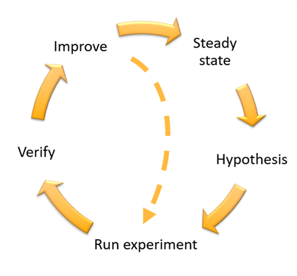

Read about Chaos Engineering or watch a short video. The choice is yours!

## Watch this video about Chaos Engineering in under 2 minutes

https://www.youtube.com/watch?v=S-cKd6rMMaE

## Read about Chaos Engineering in under 2 minutes

Chaos engineering is not about creating chaos, but it about acknowledging the chaos that already exists in systems running in production. Chaos engineering allows you to simulate faults and load under controlled condition.  Then you can better understand how you workload will respond, and how your design to mitigate these issues will work, when it encounters those conditions in production. 

For a given event (fault or load), you run a chaos experiment. To run an experiment, you follow these steps.

### Define ***steady state*** as some measurable output of a workload that indicates normal behavior.

When your workload is operating reliably and as-expected, it is exhibiting *steady state*. Steady state does not necessarily mean no impact to the workload when a fault occurs as a certain percentage in faults could be within acceptable limits.

### Form a ***hypothesis*** about how the workload will react to the fault

A good hypothesis is based on how the workload is expected to mitigate the fault to maintain the steady state. The hypothesis will state that given the fault of a specific type, the system or workload will continue steady state, because the workload was designed with specific mitigations. The specific type of fault and mitigations should be specified in the hypothesis.
 
For example:

  * If a single EC2 instance failure occurs, the AnyCompany front-end workload Elastic Load Balancer (ELB) health check will cause the ELB to only send requests to the remaining healthy instances while the EC2 Autoscaling replaces the failed instance, maintaining a less than 0.01% increase in server-side (5xx) errors (steady state).
  * If the primary RDS database instance fails, the AnyCompany data collection workload will failover and connect to the standby RDS database instance to maintain less than 1 minute of database read / write errors (steady state).

### ***Run the experiment*** by simulating the fault or load event

There are several options for simulating the faults including open source tools like [Chaos Toolkit](https://chaostoolkit.org/), as well as commercial products. For workloads on AWS, [AWS Fault Injection Simulator (AWS FIS)](https://docs.aws.amazon.com/fis/latest/userguide/what-is.html?sc_channel=el&sc_campaign=resiliencewave&sc_geo=mult&sc_country=mult&sc_outcome=acq&sc_content=chaos-engineering-2-minutes) provides many pre-made fault simulations called [actions](https://docs.aws.amazon.com/fis/latest/userguide/actions.html?sc_channel=el&sc_campaign=resiliencewave&sc_geo=mult&sc_country=mult&sc_outcome=acq&sc_content=chaos-engineering-2-minutes). You can also define custom actions that run in AWS FIS using [AWS Systems Manager documents](https://docs.aws.amazon.com/systems-manager/latest/userguide/sysman-ssm-docs.html?sc_channel=el&sc_campaign=resiliencewave&sc_geo=mult&sc_country=mult&sc_outcome=acq&sc_content=chaos-engineering-2-minutes). 

An effective framework or toolset which supports chaos engineering should track the current state of an experiment, emit logs, and provide rollback mechanisms, to support the safe execution of an experiment.

You must establish and monitor guardrails to ensure the experiment does not impact production traffic or other systems beyond acceptable limits. Establish *stop conditions* to stop an experiment if it reaches a threshold on a guardrail metric that you define. [Stop conditions for AWS FIS](https://docs.aws.amazon.com/fis/latest/userguide/stop-conditions.html?sc_channel=el&sc_campaign=resiliencewave&sc_geo=mult&sc_country=mult&sc_outcome=acq&sc_content=chaos-engineering-2-minutes) are supported as part of the experiment template.

### ***Verify*** the hypothesis

The [Principles of Chaos Engineering](https://principlesofchaos.org/) give this guidance on how to verify steady state of your workload: “Focus on the measurable output of a system, rather than internal attributes of the system. Measurements of that output over a short period of time constitute a proxy for the system’s steady state. The overall system’s throughput, error rates, latency percentiles, etc. could all be metrics of interest representing steady state behavior.”

In our two examples from the "form a hypothesis" step, we include the steady state metrics:

  * less than 0.01% increase in server-side (5xx) errors
  * less than 1 minute of database read/write errors

The 5xx errors are a good metric because they are a consequence of the failure mode that the client of the workload will experience directly. The database errors measurement is good as a direct consequence of the fault, but should also be supplemented with a client impact measurement such as failed customer requests or errors surfaced to the client. Additionally, include a synthetic monitor (also known as a user canary) on any APIs or URIs directly accessed by the client of your workload.

### ***Improve*** the workload design for resilience.

If steady state was not maintained, then investigate how the workload design can be improved to mitigate the fault, applying the best practices of the [AWS Well-Architected Reliability pillar](https://docs.aws.amazon.com/wellarchitected/latest/reliability-pillar/welcome.html?sc_channel=el&sc_campaign=resiliencewave&sc_geo=mult&sc_country=mult&sc_outcome=acq&sc_content=chaos-engineering-2-minutes). Additional guidance and resources can be found in the [AWS Builder’s Library](http://aws.amazon.com/builders-library?sc_channel=el&sc_campaign=resiliencewave&sc_geo=mult&sc_country=mult&sc_outcome=acq&sc_content=chaos-engineering-2-minutes), which hosts articles about how to [improve your health checks](http://aws.amazon.com/builders-library/implementing-health-checks?sc_channel=el&sc_campaign=resiliencewave&sc_geo=mult&sc_country=mult&sc_outcome=acq&sc_content=chaos-engineering-2-minutes) or [employ retries with backoff in your application code](http://aws.amazon.com/builders-library/timeouts-retries-and-backoff-with-jitter?sc_channel=el&sc_campaign=resiliencewave&sc_geo=mult&sc_country=mult&sc_outcome=acq&sc_content=chaos-engineering-2-minutes), among others.

After these changes have been implemented, run the experiment again (shown by the dotted line in the figure above) to determine their effectiveness. If the verify step indicates the hypothesis holds true, then the workload will be in steady state, and the cycle continues.

## To learn more

* [Principles of Chaos](https://principlesofchaos.org/)
* [Chaos Engineering in the cloud (Blog Post)](https://aws.amazon.com/blogs/architecture/chaos-engineering-in-the-cloud?sc_channel=el&sc_campaign=resiliencewave&sc_geo=mult&sc_country=mult&sc_outcome=acq&sc_content=chaos-engineering-2-minutes)
* [Verify the resilience of your workloads using Chaos Engineering (Blog Post)](https://aws.amazon.com/blogs/architecture/verify-the-resilience-of-your-workloads-using-chaos-engineering?sc_channel=el&sc_campaign=resiliencewave&sc_geo=mult&sc_country=mult&sc_outcome=acq&sc_content=chaos-engineering-2-minutes)
* [AWS re:Invent 2022 - Reliable scalability: How Amazon.com scales in the cloud (ARC206)](https://bit.ly/reliable2022) - Learn how Amazon search implemented Chaos Engineering
* [AWS re:Invent 2020: Testing resiliency using chaos engineering (ARC316)](https://www.youtube.com/watch?v=OlobVYPkxgg)
* [Public Chaos Engineering Stories / Implementations](https://github.com/ldomb/ChaosEngineeringPublicStories)
* [AWS Fault Injection Simulator (AWS FIS)](https://docs.aws.amazon.com/fis/latest/userguide/what-is.html?sc_channel=el&sc_campaign=resiliencewave&sc_geo=mult&sc_country=mult&sc_outcome=acq&sc_content=chaos-engineering-2-minutes)
